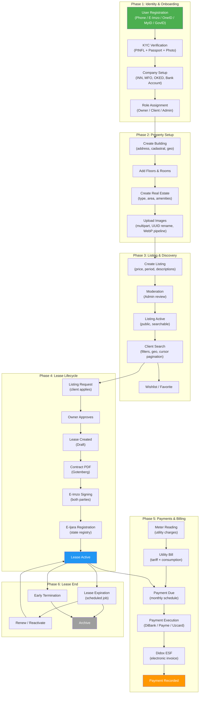
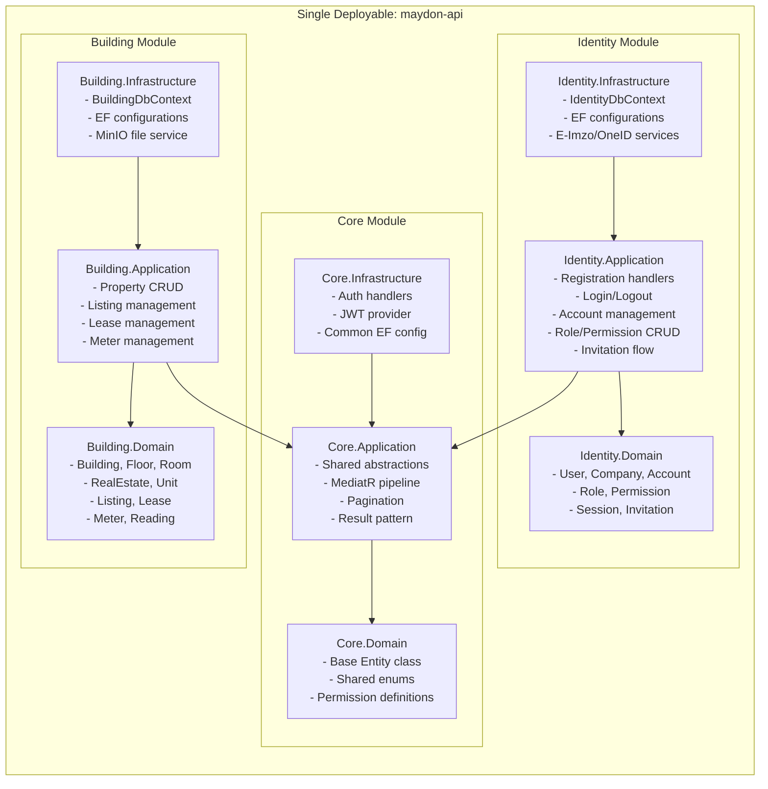
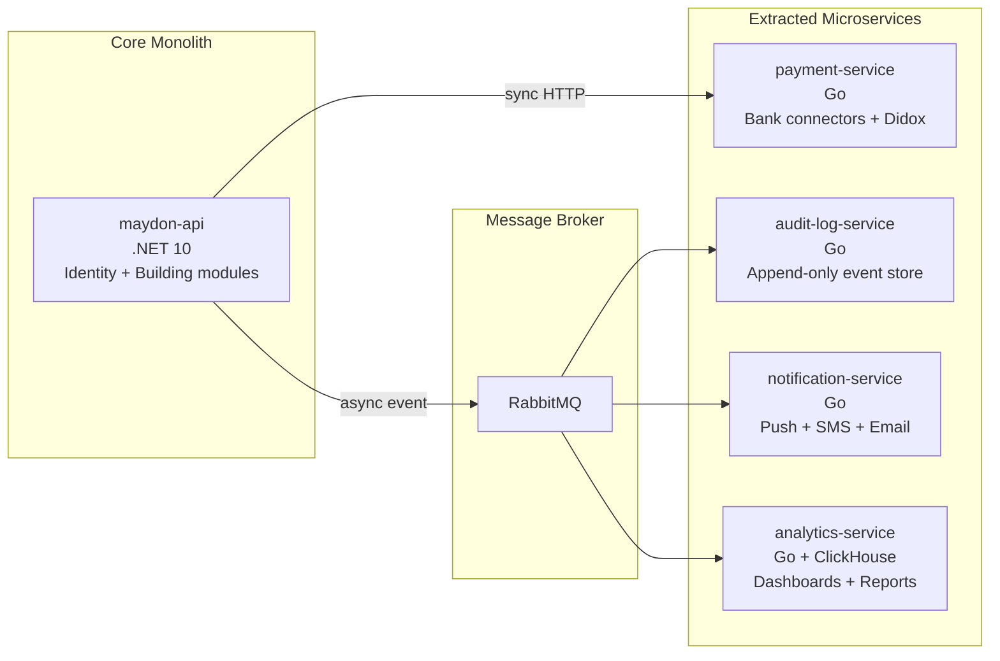
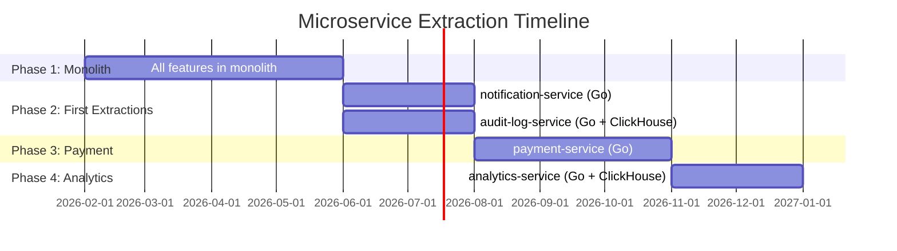
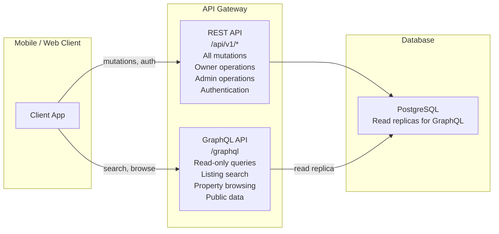
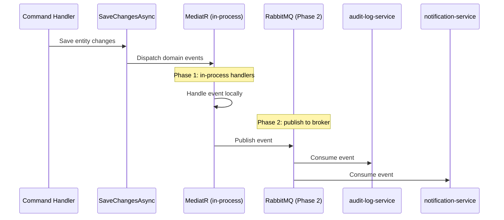

# Architecture Decisions

## System-Wide Business Logic Overview

The Maydon platform orchestrates a multi-tenant B2B rental marketplace. The following diagram shows the **complete business flow** from user onboarding to lease payment settlement.



### Key Business Invariants

| Rule | Enforcement | Module |
|------|-------------|--------|
| User must complete KYC before creating listings | `compliance_complete` flag checked | Identity |
| Company must have INN + MFO + Bank Account for B2B operations | FluentValidation on lease creation | Identity |
| Real estate must have ≥3 images before listing can go active | Completion percent check | Building |
| Listing must pass moderation before becoming public | Status state machine | Rental |
| Lease requires both party E-Imzo signatures before activation | `is_fully_signed` flag | Rental |
| Every payment generates a Didox ESF (electronic invoice) | Async pipeline after payment | Rental |
| Lease expiration runs daily at 00:00 UTC+5 | Hangfire scheduled job | Rental |
| Meter readings cannot be backdated more than 3 days | Validation rule | Metering |

---

## ADR-001: Modular Monolith as Core Architecture

### Decision

The core Maydon platform is a modular monolith. Individual modules (Identity, Building, Common) run in a single deployable unit with strict boundaries between them.

### Rationale

| Factor | Monolith | Microservices |
|--------|----------|---------------|
| Team size (3-8 devs) | Optimal | Overhead |
| Deployment complexity | Single CI/CD pipeline | Multiple pipelines, service mesh |
| Data consistency | Single database transaction | Distributed transactions (saga) |
| Development speed | Fast iteration | Slower due to inter-service contracts |
| Debugging | Single process, single log | Distributed tracing required |
| Uzbekistan hosting | Simple VPS/K8s | Requires mature K8s + service mesh |

At the current team size and market stage (Uzbekistan only), a modular monolith provides the fastest path to production while maintaining clean boundaries for future extraction.

### Module Boundaries



### Rules

1. Modules communicate only through the `Core` shared layer (abstractions, not implementations)
2. No direct reference between `Identity.Application` and `Building.Application`
3. Cross-module data access uses integration events or shared read models, never direct DbContext access
4. Each module has its own database schema (`identity`, `building`, `common`)
5. Each module registers its own services via a `DependencyInjection` extension method

---

## ADR-002: Microservice Extraction Strategy

### Decision

Extract specific concerns as independent microservices ONLY when they meet at least two of these criteria:

| Criterion | Description |
|-----------|-------------|
| Independent scaling | Needs to scale independently from the core API |
| Different data store | Benefits from a specialized database (ClickHouse, time-series) |
| Different runtime | Performance-critical or I/O-heavy, benefits from Go/Rust |
| Compliance boundary | Must be isolated for regulatory reasons (PCI DSS, audit) |
| Team ownership | Dedicated team or specialist maintains it |
| Failure isolation | Failure must not bring down the core platform |

### Services to Extract



---

### Service: payment-service

| Property | Value |
|----------|-------|
| Language | Go |
| Database | PostgreSQL (own schema, own instance) |
| Communication | Sync HTTP from monolith, async events to audit |
| Extraction criteria | Compliance boundary (PCI DSS), independent scaling, different runtime |

**Why extract:**
- Bank API connectors (DiBank, Uzcard SV-Gate, Payme) are I/O-heavy and benefit from Go's concurrency model
- Didox fiscal invoice generation is a regulatory requirement that must not fail silently
- PCI DSS compliance requires isolated handling of payment data
- Payment processing must continue even if the core API is under maintenance
- Different release cycle: bank APIs change independently of property management features

**Responsibilities:**
- Accept payment intent from monolith (HTTP)
- Route to correct bank connector based on tenant configuration
- Generate Didox fiscal invoice
- Return payment confirmation
- Emit payment events (success/failure) to RabbitMQ

**Data ownership:**
- Owns: `payment_transactions`, `payment_methods`, `bank_configurations`, `didox_invoices`
- Reads from monolith: tenant configuration, lease payment reference

---

### Service: audit-log-service

| Property | Value |
|----------|-------|
| Language | Go |
| Database | ClickHouse (append-only, columnar) |
| Communication | Async events from RabbitMQ only |
| Extraction criteria | Different data store, independent scaling, failure isolation |

**Why extract:**
- Audit logs are append-only, high-write, low-read — perfect for ClickHouse
- Writing audit logs must never slow down the main API response
- Audit data grows indefinitely — needs separate storage and retention policies
- Regulatory requirement: audit trail must be immutable and independently verifiable
- No business logic: receives events, stores them, serves read queries to admin panel

**Responsibilities:**
- Consume domain events from RabbitMQ
- Store structured audit records (who, what, when, from where)
- Serve audit log queries to admin panel (HTTP)
- Enforce data retention policies (configurable per tenant)

**Data ownership:**
- Owns: `audit_events`, `access_logs`
- No writes back to monolith

---

### Service: notification-service

| Property | Value |
|----------|-------|
| Language | Go |
| Database | PostgreSQL (notification templates, delivery log) |
| Communication | Async events from RabbitMQ |
| Extraction criteria | Failure isolation, independent scaling, different runtime |

**Why extract:**
- SMS gateway calls (Eskiz, PlayMobile) are unreliable and slow — must not block API responses
- Push notification delivery (FCM) is fire-and-forget with retry logic
- Notification templates and delivery rules change independently of business logic
- Must handle delivery failures gracefully with exponential backoff
- Future: in-app notification center, email campaigns

**Responsibilities:**
- Consume notification events from RabbitMQ
- Resolve template + recipient from event payload
- Deliver via appropriate channel (push, SMS, email)
- Log delivery status
- Retry failed deliveries with backoff

**Events consumed:**
- `listing_request.received` — notify owner
- `listing_request.accepted` — notify client
- `listing_request.rejected` — notify client
- `lease.payment_due` — remind tenant 3 days before
- `lease.payment_overdue` — notify owner and tenant
- `lease.expiring_soon` — notify both parties 30 days before
- `invitation.sent` — notify recipient
- `meter_reading.due` — remind tenant

**Data ownership:**
- Owns: `notification_templates`, `notification_deliveries`, `device_tokens`

---

### Service: analytics-service

| Property | Value |
|----------|-------|
| Language | Go |
| Database | ClickHouse (aggregated metrics) |
| Communication | Async events from RabbitMQ, HTTP queries from admin |
| Extraction criteria | Different data store, independent scaling |

**Why extract:**
- Dashboard queries (total revenue, occupancy rate, listing views) are expensive on the transactional database
- ClickHouse handles analytical queries orders of magnitude faster than PostgreSQL
- Analytics data can lag behind real-time (eventual consistency is acceptable)
- Future: ML-based pricing suggestions, market trend analysis

**Responsibilities:**
- Consume events from RabbitMQ (listing views, lease created, payment received)
- Aggregate into ClickHouse materialized views
- Serve dashboard queries to admin panel and owner dashboard (HTTP)

**Data ownership:**
- Owns: `listing_views`, `revenue_aggregates`, `occupancy_metrics`, `tenant_activity`

---

### Extraction Timeline

Do NOT extract on day one. The monolith handles everything initially.



**Phase 1 rule:** All microservice-destined logic starts as modules inside the monolith. The code is structured to be extractable, but runs in-process. Events are dispatched via MediatR (in-process). When extraction happens, MediatR dispatch is replaced with RabbitMQ publish — no business logic changes.

---

## ADR-003: REST vs GraphQL — When and Why

### Decision

The Maydon platform uses REST API as the primary interface. GraphQL is introduced as a secondary read-only layer specifically for client-facing listing search and property browsing.

### Why REST as Default

| Concern | REST | GraphQL |
|---------|------|---------|
| Authentication | Standard middleware, simple | Requires custom directives or context |
| Authorization (RBAC) | Per-endpoint permission check | Per-field/per-resolver permission — complex |
| Transaction boundaries | One endpoint = one transaction | Nested resolvers can span multiple DB calls unpredictably |
| Caching | HTTP caching (ETag, Cache-Control) | No HTTP caching without persisted queries |
| File upload | Native multipart/form-data | Requires separate upload endpoint or multipart spec |
| Error handling | HTTP status codes | Always 200, errors in response body |
| Audit trail | One endpoint = one audit entry | Single query can touch many entities |
| Team familiarity | Standard in Uzbekistan dev market | Requires specialized knowledge |
| Tooling | OpenAPI/Swagger auto-generated | Schema-first or code-first SDL |

**REST is the right default** for a B2B PropTech platform where:
- Every mutation needs audit logging
- Every mutation needs RBAC permission checks
- File uploads are frequent (property images, documents)
- Transactions must be explicit

### When to Introduce GraphQL

GraphQL is introduced when the **client-facing listing search** becomes complex enough that REST causes problems:

```
Trigger conditions (any two):
1. Mobile client makes 3+ REST calls to render a single listing detail screen
2. Mobile client receives >40% unnecessary fields from listing endpoints
3. Search filters exceed 10 query parameters on a single endpoint
4. Mobile and web clients need different data shapes for the same entity
```

### GraphQL Scope (Read-Only)



**GraphQL handles:**
- `listings` — search with filters (price, area, location, amenities, type)
- `listing(id)` — full detail with nested real estate, building, images, amenities, owner info
- `regions` / `districts` — reference data for filter dropdowns
- `realEstateTypes` / `amenities` — reference data

**GraphQL does NOT handle:**
- Any mutation (create, update, delete)
- Authentication or session management
- File uploads
- Admin panel operations
- Owner panel operations (building CRUD, lease management)
- Any operation that requires RBAC authorization

### GraphQL Schema (Preview)

```graphql
type Query {
  listings(filter: ListingFilter!, pagination: CursorPagination!): ListingConnection!
  listing(id: ID!): Listing
  regions: [Region!]!
  districts(regionId: ID!): [District!]!
  realEstateTypes: [RealEstateType!]!
  amenityCategories: [AmenityCategory!]!
}

type ListingConnection {
  edges: [ListingEdge!]!
  pageInfo: PageInfo!
  totalCount: Int!
}

type ListingEdge {
  cursor: String!
  node: Listing!
}

type Listing {
  id: ID!
  title: String
  description: String
  price: Long!
  currency: Currency!
  pricePeriod: PricePeriod!
  depositAmount: Long
  availableFrom: Date
  isNegotiable: Boolean!
  utilitiesIncluded: Boolean!
  publishedAt: DateTime
  realEstate: RealEstate!
  location: Location
  images: [Image!]!
}

type RealEstate {
  id: ID!
  type: RealEstateType!
  totalArea: Float
  livingArea: Float
  ceilingHeight: Float
  roomsCount: Int
  building: Building
  floor: Floor
  amenities: [Amenity!]!
}

type Building {
  id: ID!
  number: String
  isCommercial: Boolean!
  isResidential: Boolean!
  isRenovated: Boolean!
  floorsCount: Int
  address: String
  region: Region
  district: District
}

input ListingFilter {
  regionId: ID
  districtId: ID
  realEstateTypeId: ID
  priceMin: Long
  priceMax: Long
  currency: Currency
  areaMin: Float
  areaMax: Float
  roomsCountMin: Int
  roomsCountMax: Int
  amenityIds: [ID!]
  isCommercial: Boolean
  isResidential: Boolean
  latitude: Float
  longitude: Float
  radiusKm: Float
  sortBy: ListingSortField
  sortDirection: SortDirection
}
```

### Migration Path

```
Phase 1 (now):     REST only. All endpoints.
Phase 2 (trigger): Add GraphQL read layer alongside REST. Mobile app dual-uses.
Phase 3 (mature):  Mobile listing screens fully on GraphQL. REST for mutations.
                   Admin panel stays REST-only.
```

---

## ADR-004: Database Per Module vs Shared Database

### Decision

Single PostgreSQL instance, separate schemas per module.

```
PostgreSQL Instance
├── Schema: identity     (users, companies, accounts, roles, ...)
├── Schema: building     (buildings, real_estates, listings, leases, ...)
├── Schema: common       (regions, districts, banks, ...)
└── Schema: core         (audit_logs)
```

### Rationale

- Separate schemas provide logical isolation without operational overhead of multiple databases
- Cross-schema JOINs are possible when needed (e.g., listing search joins region translations)
- Single connection pool, single backup strategy, single monitoring
- Each module's `DbContext` only maps tables from its own schema
- If a module later needs its own database (e.g., building module gets too large), the migration is schema-to-database, which is straightforward

---

## ADR-005: Event-Driven Communication Pattern

### Decision

Domain events within the monolith use MediatR `INotification` (synchronous, in-process). When microservices are extracted, the same events are published to RabbitMQ.

### Event Flow



### Event Naming Convention

```
{module}.{entity}.{action}

Examples:
  identity.user.registered
  identity.invitation.accepted
  building.listing.published
  building.listing_request.accepted
  building.lease.activated
  building.lease.expired
  building.lease_payment.overdue
  building.meter_reading.submitted
```

---

## ADR-006: Multi-Tenancy Isolation Model

### Decision

Shared database, shared schema, row-level isolation via `tenant_id` column with EF Core global query filters. PostgreSQL Row-Level Security (RLS) as a defense-in-depth layer.

### Isolation Layers

```
Layer 1: JWT Claims      → tenant_id extracted from token
Layer 2: EF Query Filter → WHERE tenant_id = @current_tenant automatically applied
Layer 3: PostgreSQL RLS  → Database enforces isolation even if app layer has a bug
```

### Implementation

1. Every tenant-scoped entity has `tenant_id uuid NOT NULL REFERENCES companies(id)`
2. `IExecutionContextProvider` extracts `tenant_id` from the current JWT
3. `DbContext.OnModelCreating()` applies `HasQueryFilter(e => e.TenantId == currentTenantId)` to every tenant-scoped entity
4. PostgreSQL RLS policy: `CREATE POLICY tenant_isolation ON {table} USING (tenant_id = current_setting('app.tenant_id')::uuid)`
5. Connection middleware sets `SET app.tenant_id = '{tenant_id}'` on each request

### Cross-Tenant Access

Admin panel operations bypass tenant filter using `IgnoreQueryFilters()`. This is only available to endpoints protected by `HasPermission("admin:*")`.

---

## ADR-007: Authorization — ASP.NET Core Native Policy Authorization

### Decision

Use ASP.NET Core's built-in **policy-based authorization** with custom `IAuthorizationHandler` for RBAC. No external authorization package (Casbin, OpenFGA, Permify).

### Context

The platform requires role-based access control with granular permissions (`listings:write`, `leases:read`, `admin:listings:moderate`). Permissions are stored in the database (`roles` → `role_permissions` → `permissions`) and loaded into JWT claims at login.

### Alternatives Considered

| Package | Model | Verdict | Reason |
|---------|-------|---------|--------|
| **ASP.NET Core native** | Policy + Claims | ✅ **Selected** | Zero dependencies, idiomatic .NET, maps directly to existing DB schema |
| **Casbin.NET** | Policy-file RBAC/ABAC | ❌ Rejected | Designed for policy-file-driven systems; adds indirection over existing EF Core models; smaller .NET community |
| **OpenFGA** | Zanzibar ReBAC | ❌ Rejected | Requires separate service infrastructure; overkill for role→permission model |
| **Permify** | Zanzibar ReBAC | ❌ Rejected | Same as OpenFGA — infrastructure overhead for a simpler permission model |
| **Finbuckle.MultiTenant** | Tenant resolution | ⏳ Deferred | Tenant isolation already handled by RLS (ADR-006); may revisit if multi-tenant routing becomes complex |

### Implementation

#### Permission Resolution Flow

```
Login (E-Imzo / OneID / OTP)
  → Load user's account for the selected tenant
  → Load account's role(s) and merged permissions
  → Embed permissions[] in JWT access token claims
  → Token valid for 30 min (refresh via refresh_token)

Request arrives:
  → JWT middleware extracts claims
  → .RequireAuthorization("listings:write") triggers PermissionHandler
  → PermissionHandler checks if "listings:write" ∈ user claims
  → Allow or 403
```

#### Core Components

```csharp
// 1. Permission requirement
public record PermissionRequirement(string Permission) : IAuthorizationRequirement;

// 2. Handler — checks JWT claims
public class PermissionHandler : AuthorizationHandler<PermissionRequirement>
{
    protected override Task HandleRequirementAsync(
        AuthorizationHandlerContext context,
        PermissionRequirement requirement)
    {
        if (context.User.HasClaim("permissions", requirement.Permission))
            context.Succeed(requirement);
        
        return Task.CompletedTask;
    }
}

// 3. Registration — auto-generate policies from permission list
builder.Services.AddSingleton<IAuthorizationHandler, PermissionHandler>();
builder.Services.AddAuthorization(options =>
{
    foreach (var permission in PermissionRegistry.All)
    {
        options.AddPolicy(permission, policy =>
            policy.AddRequirements(new PermissionRequirement(permission)));
    }
});

// 4. Usage in Minimal API endpoints
app.MapPost("/listings", CreateListingHandler)
    .RequireAuthorization("listings:write");

app.MapPost("/admin/listings/{id}/approve", ApproveListingHandler)
    .RequireAuthorization("admin:listings:moderate");
```

#### Permission Naming Convention

```
{module}:{action}          → e.g., listings:read, listings:write, leases:read
admin:{module}:{action}    → e.g., admin:listings:moderate, admin:leases:manage
```

### Consequences

- **Zero external dependencies** — authorization is part of the framework
- **Fast** — permission check is an in-memory claim lookup (no DB query per request)
- **Auditable** — permissions are visible in the JWT payload
- **Limitation** — permission changes require re-login (or token refresh) to take effect; acceptable for this domain

---

## ADR-008: Real-Time Communication — SignalR

### Decision

Use **ASP.NET Core SignalR** for all real-time server→client communication. Introduce in **Phase 2** alongside notification-service.

### Context

Multiple features require pushing data to clients without polling: notification delivery, payment status after bank redirect, live dashboard metrics, and future chat. The platform serves both a React Native mobile app and a Next.js admin panel.

### Alternatives Considered

| Technology | Verdict | Reason |
|-----------|---------|--------|
| **SignalR** | ✅ **Selected** | Built into ASP.NET Core; auto-negotiates WebSocket/SSE/Long-Poll; Redis backplane for multi-pod; clients for React Native & Next.js |
| Raw WebSocket (`System.Net.WebSockets`) | ❌ Rejected | No groups, no reconnect, no auth integration, no scaling backplane |
| Socket.IO | ❌ Rejected | Node.js ecosystem; requires a sidecar or bridge; not idiomatic for .NET |
| Pusher / Ably | ❌ Rejected | Adds SaaS cost and external dependency for something the framework handles natively |
| Server-Sent Events (SSE) | ❌ Rejected | Unidirectional only; no grouping; limited mobile support |

### Use Cases

| Feature | Hub | Group Key | Event | Payload |
|---------|-----|-----------|-------|---------|
| Notifications | `NotificationHub` | `tenant:{tenant_id}` | `ReceiveNotification` | `{ title, body, type, entity_id }` |
| Payment status | `PaymentHub` | `user:{user_id}` | `PaymentStatusChanged` | `{ transaction_id, status, amount }` |
| Dashboard live stats | `DashboardHub` | `tenant:{tenant_id}:dashboard` | `MetricsUpdated` | `{ occupancy, revenue, overdue }` |
| Lease events | `NotificationHub` | `tenant:{tenant_id}` | `LeaseEvent` | `{ lease_id, action, actor }` |

### Architecture

```
Mobile App (React Native)          Admin Panel (Next.js)
    │ @microsoft/signalr               │ @microsoft/signalr
    │                                   │
    └──────── WebSocket ────────────────┘
                    │
              ┌─────┴─────┐
              │  SignalR   │
              │  Hub(s)    │  ← maydon-api pod 1
              └─────┬─────┘
                    │
              Redis Backplane  ← ensures messages reach clients on any pod
                    │
              ┌─────┴─────┐
              │  SignalR   │
              │  Hub(s)    │  ← maydon-api pod 2
              └────────────┘
```

### Implementation

```csharp
// Hub with tenant isolation
[Authorize]
public class NotificationHub : Hub
{
    public override async Task OnConnectedAsync()
    {
        var tenantId = Context.User!.FindFirst("tenant_id")!.Value;
        await Groups.AddToGroupAsync(Context.ConnectionId, $"tenant:{tenantId}");
    }
}

// Sending from a domain event handler
public class LeaseActivatedHandler(IHubContext<NotificationHub> hub)
    : INotificationHandler<LeaseActivatedEvent>
{
    public async Task Handle(LeaseActivatedEvent e, CancellationToken ct)
    {
        await hub.Clients.Group($"tenant:{e.TenantId}")
            .SendAsync("LeaseEvent", new { e.LeaseId, Action = "activated" }, ct);
    }
}

// Registration
builder.Services.AddSignalR()
    .AddStackExchangeRedis(builder.Configuration.GetConnectionString("Redis")!);

app.MapHub<NotificationHub>("/hubs/notifications");
app.MapHub<PaymentHub>("/hubs/payments");
app.MapHub<DashboardHub>("/hubs/dashboard");
```

### Client Integration

| Client | Package | Connection URL |
|--------|---------|---------------|
| React Native | `@microsoft/signalr` | `wss://api.maydon.uz/hubs/notifications` |
| Next.js admin | `@microsoft/signalr` | `wss://api.maydon.uz/hubs/dashboard` |

### Scaling

- **Redis backplane** required when running >1 API pod (already using Redis for caching/rate limiting)
- SignalR uses sticky sessions by default; Redis backplane removes this requirement
- Connection limit: ~10K concurrent WebSocket connections per pod (sufficient for Phase 2)

### Consequences

- **Native integration** — no external service, works with existing JWT auth
- **Multi-transport** — graceful fallback if WebSocket is blocked (SSE → Long Poll)
- **Tenant isolation** — groups ensure clients only receive their tenant's events
- **Trade-off** — adds stateful connections to an otherwise stateless API; Redis backplane mitigates pod affinity issues

---

## ADR-009: Inter-Service Communication — gRPC for Phase 3+

### Decision

Use **gRPC** for synchronous inter-service calls when microservices are extracted (Phase 3+). Current HTTP REST between monolith and payment-service is acceptable; migrate to gRPC when adding typed contracts or streaming becomes valuable.

### Context

The monolith currently communicates with the payment-service via HTTP REST (see [10-microservices.md](file:///Users/agreeing/Documents/GitHub/maydon-api/docs/10-microservices.md)). As more services are extracted, a typed contract system with better performance becomes valuable.

### Alternatives Considered

| Technology | Verdict | Reason |
|-----------|---------|--------|
| **gRPC** | ✅ **Selected** (Phase 3+) | Proto-first contracts, code generation for .NET and Go, bi-directional streaming, ~2x faster than REST for internal calls |
| REST (current) | ✅ Current | Simple, sufficient at current scale, no additional tooling |
| GraphQL (federation) | ❌ Rejected | Designed for client-facing APIs, not service-to-service; adds complexity with Apollo Gateway |
| RabbitMQ (for everything) | ❌ Rejected | Async-only; payment flow needs synchronous request-response |

### When to Use Which

| Pattern | Protocol | Use Case |
|---------|----------|----------|
| **Sync request-response** | gRPC (Phase 3+) / REST (now) | Create payment intent, verify E-Imzo signature, get user profile |
| **Async fire-and-forget** | RabbitMQ | Domain events (lease activated, payment completed, audit logging) |
| **Real-time to client** | SignalR (WebSocket) | Notifications, payment status, live dashboard |

### Proto-First Contract Design

```protobuf
// protos/payment/v1/payment.proto
syntax = "proto3";
package payment.v1;

service PaymentService {
  rpc CreateIntent(CreateIntentRequest) returns (CreateIntentResponse);
  rpc GetStatus(GetStatusRequest) returns (GetStatusResponse);
  rpc StreamStatuses(StreamStatusesRequest) returns (stream PaymentStatusEvent);
}

message CreateIntentRequest {
  string tenant_id = 1;
  string lease_payment_id = 2;
  int64 amount_som = 3;        // integer Som (UZS)
  string currency = 4;         // "UZS" or "USD"
  PaymentMethod method = 5;
  Payer payer = 6;
  string idempotency_key = 7;
}

enum PaymentMethod {
  PAYMENT_METHOD_UNSPECIFIED = 0;
  PAYMENT_METHOD_BANK_TRANSFER = 1;
  PAYMENT_METHOD_CARD = 2;
  PAYMENT_METHOD_CASH = 3;
}
```

### Implementation Stack

| Side | Package | Purpose |
|------|---------|---------|
| .NET (monolith) | `Grpc.Net.Client` | gRPC client to call Go services |
| .NET (monolith) | `Grpc.AspNetCore` | Host gRPC endpoints (if other services need to call it) |
| Go (microservices) | `google.golang.org/grpc` | gRPC server + client |
| Shared | `protos/` directory | Proto files as source of truth, versioned with the monorepo |

### Migration Path

```
Phase 1-2 (current):
  Monolith ──REST──→ payment-service     ← works fine at this scale

Phase 3 (extraction):
  Monolith ──gRPC──→ payment-service     ← typed contracts, streaming
  Monolith ──gRPC──→ identity-service    ← if extracted
  
All services:
  ──RabbitMQ──→ audit, notify, analytics  ← stays async (no change)
```

### NOT for Client-Facing

gRPC is **internal only**. Client-facing APIs remain:
- **REST** (Minimal APIs) — primary interface for mobile and admin
- **GraphQL** — read-only listing search layer (ADR-003)
- **SignalR** (WebSocket) — real-time events (ADR-008)

### Consequences

- **Type safety** — proto-generated clients/servers prevent contract drift between .NET and Go
- **Performance** — HTTP/2 multiplexing, binary serialization (~2x faster than JSON REST for internal calls)
- **Streaming** — enables `StreamStatuses` for real-time payment tracking without polling
- **Trade-off** — adds proto compilation step to CI/CD; team must learn protobuf; deferred until Phase 3 to avoid premature complexity

---

## ADR-010: Project Folder Structure

### Decision

The monolith follows Clean Architecture with vertical slicing by module. Each module is a self-contained unit with its own Domain, Application, and Infrastructure layers. No circular dependencies between modules.

### Backend (.NET) Structure

```
maydon-api/
├── src/
│   ├── Maydon.Core/
│   │   ├── Core.Domain/
│   │   │   ├── Entities/              # Base entity classes
│   │   │   ├── Enums/                 # Shared enums (Status, Currency)
│   │   │   ├── Interfaces/            # IEntity, IAuditableEntity
│   │   │   └── Permissions/           # Permission definitions
│   │   ├── Core.Application/
│   │   │   ├── Abstractions/          # IResult, IPagedList, ICacheService
│   │   │   ├── Behaviors/             # MediatR pipeline (validation, logging, caching)
│   │   │   └── Extensions/            # Query extensions, mapping helpers
│   │   └── Core.Infrastructure/
│   │       ├── Auth/                  # JWT handler, policy definitions
│   │       ├── Persistence/           # Base DbContext config, interceptors
│   │       ├── Caching/               # Redis cache service
│   │       └── DependencyInjection.cs
│   │
│   ├── Maydon.Identity/
│   │   ├── Identity.Domain/
│   │   │   ├── Entities/              # User, Company, Account, Role
│   │   │   ├── Events/                # UserCreatedEvent, RoleSyncedEvent
│   │   │   └── ValueObjects/          # Pinfl, PhoneNumber
│   │   ├── Identity.Application/
│   │   │   ├── Auth/                  # Register, Login, Refresh commands
│   │   │   │   ├── RegisterPhone/
│   │   │   │   │   ├── RegisterPhoneCommand.cs
│   │   │   │   │   ├── RegisterPhoneValidator.cs
│   │   │   │   │   └── RegisterPhoneHandler.cs
│   │   │   │   ├── RegisterEImzo/
│   │   │   │   ├── RegisterMyId/
│   │   │   │   └── LoginPhone/
│   │   │   ├── Users/                 # GetProfile, UpdateProfile queries/commands
│   │   │   ├── Companies/             # Company CRUD
│   │   │   ├── Roles/                 # Role management
│   │   │   └── Invitations/           # Team invitations
│   │   └── Identity.Infrastructure/
│   │       ├── Persistence/
│   │       │   ├── IdentityDbContext.cs
│   │       │   ├── Configurations/    # EF entity type configs
│   │       │   └── Migrations/
│   │       ├── Services/
│   │       │   ├── EImzoService.cs
│   │       │   ├── OneIdService.cs
│   │       │   ├── MyIdService.cs
│   │       │   └── GovIdService.cs
│   │       └── DependencyInjection.cs
│   │
│   ├── Maydon.Building/               # Same 3-layer structure
│   │   ├── Building.Domain/
│   │   ├── Building.Application/
│   │   │   ├── Buildings/
│   │   │   ├── RealEstates/
│   │   │   ├── Listings/
│   │   │   ├── Leases/
│   │   │   └── Payments/
│   │   └── Building.Infrastructure/
│   │
│   ├── Maydon.Common/                 # Same 3-layer structure
│   │   └── ... (regions, districts, reference data)
│   │
│   └── Maydon.API/
│       ├── Endpoints/
│       │   ├── Identity/              # Minimal API endpoint groups
│       │   ├── Building/
│       │   └── Common/
│       ├── Middleware/
│       │   ├── ExceptionHandlingMiddleware.cs
│       │   ├── TenantMiddleware.cs
│       │   └── CorrelationIdMiddleware.cs
│       ├── Filters/                   # Validation, idempotency
│       ├── appsettings.json
│       └── Program.cs
│
├── tests/
│   ├── Maydon.UnitTests/
│   │   ├── Identity/
│   │   ├── Building/
│   │   └── Shared/                    # Test helpers, builders
│   ├── Maydon.IntegrationTests/
│   │   ├── Identity/
│   │   └── Building/
│   └── Maydon.ArchTests/              # ArchUnit: enforce module boundaries
│       └── ModuleBoundaryTests.cs
│
├── docs/                              # This documentation suite
├── docker-compose.yml
└── Maydon.sln
```

### Key Rules

| Rule | Enforcement |
|------|-------------|
| **No cross-module entity references** | ArchUnit test (`ModuleBoundaryTests`) |
| **Module communication via MediatR events** | Domain events, not direct service calls |
| **One handler per file** | CQRS: `{Action}{Entity}Command.cs` + `{Action}{Entity}Handler.cs` |
| **Infrastructure references Application, not vice versa** | Clean Architecture dependency rule |
| **API layer references all modules** | Only for DI registration and endpoint mapping |
| **No shared DbContext** | Each module has its own `{Module}DbContext` |

### Frontend Structure — Mobile (React Native)

```
maydon-mobile/
├── src/
│   ├── app/                           # Navigation + root layout
│   │   ├── (auth)/                    # Auth stack (login, register)
│   │   ├── (tabs)/                    # Main tab navigator
│   │   │   ├── home/
│   │   │   ├── search/
│   │   │   ├── favorites/
│   │   │   └── profile/
│   │   └── _layout.tsx
│   │
│   ├── features/                      # Domain-scoped modules
│   │   ├── auth/
│   │   │   ├── api/                   # API functions + query keys
│   │   │   ├── hooks/                 # useLogin, useRegister, useAuthStore
│   │   │   ├── schemas/               # Zod schemas for forms
│   │   │   ├── components/            # LoginForm, OTPInput
│   │   │   └── index.ts               # Public barrel export
│   │   ├── listings/
│   │   │   ├── api/
│   │   │   ├── hooks/
│   │   │   ├── schemas/
│   │   │   ├── components/
│   │   │   └── index.ts
│   │   ├── leases/
│   │   ├── meters/
│   │   └── profile/
│   │
│   ├── shared/
│   │   ├── api/                       # Axios instance, interceptors, base URL
│   │   │   ├── client.ts
│   │   │   ├── interceptors.ts
│   │   │   └── query-config.ts        # Default staleTime, gcTime
│   │   ├── hooks/                     # useTheme, useI18n, useNetworkStatus
│   │   ├── ui/                        # Design system (Button, Card, Input, etc.)
│   │   │   ├── Button.tsx
│   │   │   ├── Card.tsx
│   │   │   └── index.ts
│   │   ├── lib/                       # Zod schemas (shared), utils, formatters
│   │   │   ├── schemas/               # API response envelope schema
│   │   │   ├── format-money.ts
│   │   │   └── format-date.ts
│   │   └── store/                     # Zustand stores
│   │       ├── auth.ts
│   │       ├── ui.ts
│   │       └── offline.ts
│   │
│   ├── i18n/
│   │   ├── uz.json
│   │   ├── ru.json
│   │   └── en.json
│   │
│   └── assets/
│       ├── fonts/
│       └── images/
│
├── android/
├── ios/
├── app.json
├── tsconfig.json
├── .eslintrc.json
└── .prettierrc
```

### Frontend Structure — Admin (Next.js)

```
maydon-admin/
├── src/
│   ├── app/                           # Next.js App Router
│   │   ├── (auth)/
│   │   │   ├── login/page.tsx
│   │   │   └── layout.tsx
│   │   ├── (dashboard)/
│   │   │   ├── buildings/page.tsx
│   │   │   ├── listings/page.tsx
│   │   │   ├── leases/page.tsx
│   │   │   ├── users/page.tsx
│   │   │   └── layout.tsx
│   │   ├── layout.tsx
│   │   └── page.tsx
│   │
│   ├── features/                      # Same pattern as mobile
│   │   ├── buildings/
│   │   │   ├── api/
│   │   │   ├── hooks/
│   │   │   ├── schemas/
│   │   │   ├── components/
│   │   │   │   ├── BuildingTable.tsx    # TanStack Table
│   │   │   │   ├── BuildingForm.tsx
│   │   │   │   └── BuildingDialog.tsx
│   │   │   └── index.ts
│   │   ├── listings/
│   │   ├── leases/
│   │   ├── users/
│   │   └── analytics/
│   │
│   ├── shared/
│   │   ├── api/
│   │   ├── ui/                        # shadcn/ui wrappers
│   │   ├── lib/                       # Zod schemas, utils
│   │   ├── hooks/
│   │   └── config/                    # Permissions, routes
│   │
│   └── middleware.ts                  # Auth + tenant check
│
├── public/
├── next.config.ts
├── tsconfig.json
├── .eslintrc.json
└── .prettierrc
```

### Rationale

- **Feature-based** (not layer-based): `features/listings/` contains API, hooks, components, and schemas together — locality of reference
- **Shared barrel exports**: Each feature exposes only its public API via `index.ts`
- **Same pattern on both platforms**: Mobile and Admin use identical directory conventions — reduced cognitive load when switching
- **Zod schemas co-located with features**: Form validation schemas live with the feature, API envelope schemas live in `shared/lib/schemas`
