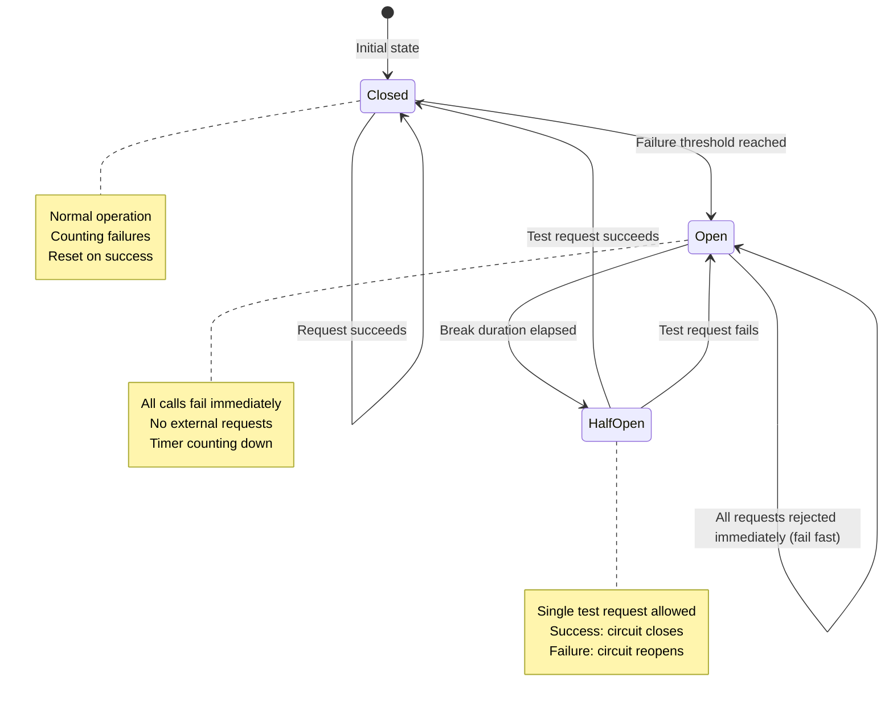
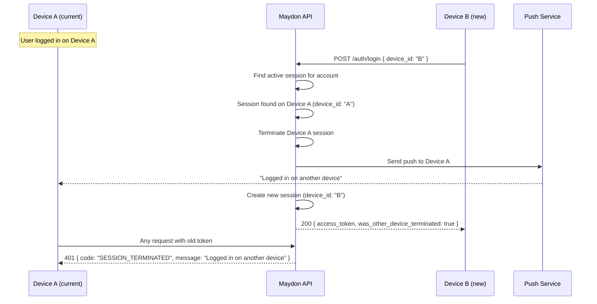
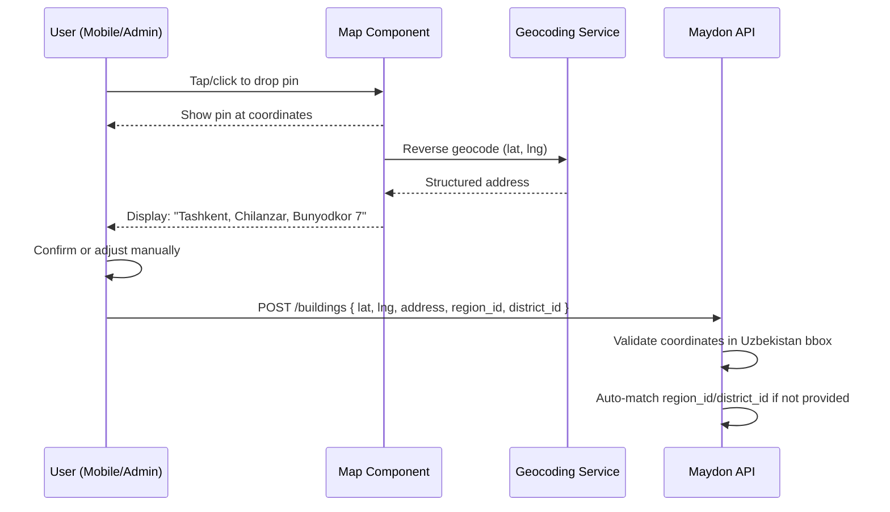

# API Standards

This document defines the conventions that every REST endpoint in the Maydon platform must follow. Developers must reference this document before implementing any new endpoint.

---

## Base URL

```
Production:  https://api.maydon.uz/api/v1
Staging:     https://staging-api.maydon.uz/api/v1
Local:       http://localhost:5000/api/v1
```

All endpoints are prefixed with `/api/v1`. When breaking changes are required, increment the version (`/api/v2`). Non-breaking additions (new fields, new endpoints) do not require a version bump.

---

## HTTP Methods

| Method | Usage | Idempotent | Body |
|--------|-------|------------|------|
| GET | Retrieve resource(s) | Yes | No |
| POST | Create resource | No | Yes |
| PUT | Full update of resource | Yes | Yes |
| PATCH | Partial update of resource | Yes | Yes |
| DELETE | Soft-delete resource | Yes | No |

---

## URL Conventions

```
GET    /api/v1/{module}/{resource}              List resources
GET    /api/v1/{module}/{resource}/{id}          Get single resource
POST   /api/v1/{module}/{resource}              Create resource
PUT    /api/v1/{module}/{resource}/{id}          Full update
PATCH  /api/v1/{module}/{resource}/{id}          Partial update
DELETE /api/v1/{module}/{resource}/{id}          Soft delete
POST   /api/v1/{module}/{resource}/{id}/{action} Custom action
```

### Naming Rules

- Resource names are plural, lowercase, kebab-case: `real-estates`, `listing-requests`, `meter-readings`
- Module prefix is lowercase: `identity`, `building`, `common`
- Nested resources: `GET /api/v1/building/buildings/{id}/floors`
- Custom actions use POST: `POST /api/v1/building/listings/{id}/submit-for-moderation`

### Examples

```
GET    /api/v1/identity/users/me
POST   /api/v1/identity/auth/register/phone
POST   /api/v1/identity/auth/login/eimzo
POST   /api/v1/identity/auth/refresh
POST   /api/v1/identity/auth/switch-account

GET    /api/v1/building/buildings
POST   /api/v1/building/buildings
GET    /api/v1/building/buildings/{id}
PUT    /api/v1/building/buildings/{id}
DELETE /api/v1/building/buildings/{id}
GET    /api/v1/building/buildings/{id}/floors

POST   /api/v1/building/listings
POST   /api/v1/building/listings/{id}/submit-for-moderation
POST   /api/v1/building/listing-requests
POST   /api/v1/building/listing-requests/{id}/accept
POST   /api/v1/building/listing-requests/{id}/reject
```

---

## Request Headers

| Header | Required | Value | Description |
|--------|----------|-------|-------------|
| `Authorization` | Yes (except public) | `Bearer {jwt_token}` | JWT access token |
| `Content-Type` | Yes (POST/PUT/PATCH) | `application/json` | Request body format |
| `Accept` | Recommended | `application/json` | Response format |
| `Accept-Language` | Recommended | `uz`, `ru`, `en` | Translation language. Default: `uz` |
| `X-Request-Id` | Optional | UUID | Client-generated correlation ID for tracing |
| `X-Tenant-Id` | Never | N/A | Tenant is extracted from JWT. Never sent by client. |

---

## Response Envelope

Every API response follows this exact structure.

### Success Response (single resource)

```json
{
  "success": true,
  "data": {
    "id": "7c9e6679-7425-40de-944b-e07fc1f90ae7",
    "name": "Building A",
    "status": "active",
    "created_at": "2026-02-09T12:00:00Z"
  },
  "error": null
}
```

### Success Response (list with pagination)

```json
{
  "success": true,
  "data": {
    "items": [
      { "id": "...", "name": "Building A" },
      { "id": "...", "name": "Building B" }
    ],
    "pagination": {
      "page": 1,
      "page_size": 20,
      "total_items": 85,
      "total_pages": 5,
      "has_next_page": true,
      "has_previous_page": false
    }
  },
  "error": null
}
```

### Success Response (no content)

HTTP 204 with empty body. Used for DELETE and some PATCH operations.

### Error Response

```json
{
  "success": false,
  "data": null,
  "error": {
    "code": "VALIDATION_ERROR",
    "message": "One or more validation errors occurred.",
    "details": [
      {
        "field": "price",
        "message": "Price must be greater than 0."
      },
      {
        "field": "real_estate_type_id",
        "message": "Real estate type not found."
      }
    ],
    "trace_id": "abc123-def456"
  }
}
```

---

## HTTP Status Codes

| Code | Name | When to Use |
|------|------|-------------|
| 200 | OK | GET success, PUT/PATCH success returning updated resource |
| 201 | Created | POST success. Response body contains created resource. `Location` header contains resource URL |
| 204 | No Content | DELETE success. PUT/PATCH success when not returning body |
| 400 | Bad Request | Malformed JSON, missing required fields, type mismatch |
| 401 | Unauthorized | Missing or expired JWT token |
| 403 | Forbidden | Valid token but insufficient permissions (RBAC) |
| 404 | Not Found | Resource not found or not visible to current tenant |
| 409 | Conflict | Duplicate resource (e.g., building number already exists in complex) |
| 422 | Unprocessable Entity | Valid JSON but business rule violation (e.g., listing already booked) |
| 429 | Too Many Requests | Rate limit exceeded |
| 500 | Internal Server Error | Unhandled exception. Log trace_id, return generic message |

### Status Code Decision Flow

```
Is the request body malformed?           → 400
Is the token missing or expired?         → 401
Is the user not permitted (RBAC)?        → 403
Does the resource not exist?             → 404
Is there a uniqueness conflict?          → 409
Is there a business rule violation?      → 422
Is rate limit exceeded?                  → 429
Is it an unexpected server error?        → 500
Otherwise:
  GET request succeeded?                 → 200
  POST created a resource?               → 201
  DELETE succeeded?                      → 204
  PUT/PATCH succeeded?                   → 200
```

---

## Error Codes

Standardized error codes used in the `error.code` field:

| Code | HTTP Status | Description |
|------|-------------|-------------|
| `VALIDATION_ERROR` | 400 | Request validation failed |
| `INVALID_JSON` | 400 | Request body is not valid JSON |
| `UNAUTHORIZED` | 401 | Authentication required |
| `TOKEN_EXPIRED` | 401 | JWT token has expired |
| `FORBIDDEN` | 403 | Insufficient permissions |
| `NOT_FOUND` | 404 | Resource does not exist |
| `ALREADY_EXISTS` | 409 | Duplicate resource |
| `BUSINESS_RULE_VIOLATION` | 422 | Business logic constraint |
| `LISTING_ALREADY_BOOKED` | 422 | Listing is already booked |
| `LEASE_NOT_ACTIVE` | 422 | Operation requires active lease |
| `INVITATION_EXPIRED` | 422 | Invitation has expired |
| `RATE_LIMITED` | 429 | Too many requests |
| `INTERNAL_ERROR` | 500 | Unexpected server error |

---

## Pagination

All list endpoints use offset-based pagination by default.

### Request Parameters

| Parameter | Type | Default | Max | Description |
|-----------|------|---------|-----|-------------|
| `page` | int | 1 | - | Page number (1-based) |
| `page_size` | int | 20 | 100 | Items per page |
| `sort_by` | string | `created_at` | - | Field to sort by |
| `sort_direction` | string | `desc` | - | `asc` or `desc` |

### Request Example

```
GET /api/v1/building/listings?page=2&page_size=20&sort_by=price&sort_direction=asc
```

### Response Pagination Object

```json
{
  "pagination": {
    "page": 2,
    "page_size": 20,
    "total_items": 85,
    "total_pages": 5,
    "has_next_page": true,
    "has_previous_page": true
  }
}
```

### Cursor-Based Pagination (GraphQL and high-volume endpoints)

For endpoints with large datasets or real-time updates, use cursor-based pagination:

```
GET /api/v1/building/listings?after=eyJpZCI6Ijk...&first=20
```

```json
{
  "data": {
    "items": [...],
    "page_info": {
      "has_next_page": true,
      "has_previous_page": false,
      "start_cursor": "eyJpZCI6IjE...",
      "end_cursor": "eyJpZCI6IjIw..."
    }
  }
}
```

---

## Filtering

Filters are passed as query parameters. Complex filters use a structured format.

### Simple Filters

```
GET /api/v1/building/listings?region_id=uuid&status=active&price_min=1000000
```

### Filter Parameters Convention

| Suffix | Meaning | Example |
|--------|---------|---------|
| (none) | Exact match | `status=active` |
| `_min` | Greater than or equal | `price_min=1000000` |
| `_max` | Less than or equal | `price_max=5000000` |
| `_ids` | IN list (comma-separated) | `amenity_ids=uuid1,uuid2,uuid3` |
| `_from` | Date from (inclusive) | `created_from=2026-01-01` |
| `_to` | Date to (inclusive) | `created_to=2026-12-31` |
| `_search` | Full-text search | `name_search=tashkent` |

---

## Authentication

### JWT Token Structure

Access token is a JWT (RS256) containing:

```json
{
  "sub": "account_id",
  "sid": "session_id",
  "tid": "tenant_id",
  "uid": "user_id",
  "rid": "role_id",
  "typ": "Owner",
  "own": true,
  "ind": false,
  "exp": 1707480000,
  "iss": "maydon-api",
  "aud": "maydon"
}
```

| Claim | Description |
|-------|-------------|
| `sub` | Account ID (primary identifier) |
| `sid` | Session ID (for session management) |
| `tid` | Tenant ID (always Company.Id) |
| `uid` | User ID (person) |
| `rid` | Role ID (current role in this tenant) |
| `typ` | Account type: `Client`, `Owner`, `Agent` |
| `own` | Is tenant owner (`true`/`false`) |
| `ind` | Is individual tenant (`true`/`false`) |

### Token Lifecycle

```
Access Token:   15 minutes
Refresh Token:  7 days (stored in DB, rotated on each use)
```

### Token Refresh

```
POST /api/v1/identity/auth/refresh
{
  "refresh_token": "string"
}

Response 200:
{
  "success": true,
  "data": {
    "access_token": "eyJ...",
    "refresh_token": "new_refresh_token",
    "expires_in": 900
  }
}
```

---

## File Upload & Background Auto-Upload

### Upload Strategy: Unified Multipart PUT

All entity mutations that include images use a **single multipart PUT** that carries both JSON metadata and image files atomically. This prevents orphaned images and partial state.

```
PUT /api/v1/building/real-estates/{id}
Content-Type: multipart/form-data

Parts:
  data: application/json (entity fields)
  photos[0]: file (new image)
  photos[1]: file (new image)
  existing_photo_ids: ["uuid-1", "uuid-3"]  ← retained photos (order = sort_order)
```

**Behavior:**
- Photos NOT in `existing_photo_ids` are deleted from MinIO
- New `photos[]` files are processed and appended
- Array order determines `sort_order`
- This is a **replace-all** operation — the final photo set is exactly `existing_photo_ids` + new uploads

### Background Auto-Upload (Image Pipeline)

Images are uploaded **immediately when the user selects them**, not when the form is submitted. This provides instant feedback and avoids large uploads at submit time.

#### Mobile Flow (React Native)

```
1. User taps "Add Photo" → opens image picker
2. Client-side:
   a. Compress to JPEG 80% quality (react-native-image-resizer)
   b. Cap at 2048px on longest edge
   c. Strip EXIF metadata (privacy)
   d. Generate local UUID filename

3. Background upload: POST /api/v1/uploads/images
   Content-Type: multipart/form-data
   Fields: image (file), entity_type ("real_estate"), context ("draft")
   
4. Server returns immediately:
   { "upload_id": "uuid", "status": "processing", "thumbnail_url": "..." }

5. Client shows thumbnail with spinner overlay
6. Server pipeline (async):
   a. Magic byte validation (JPEG/PNG/WebP only)
   b. File size check (≤ 10 MB)
   c. EXIF strip (if not done client-side)
   d. Generate resize variants (see below)
   e. UUID rename → upload to MinIO
   
7. Server notifies via SignalR or polling:
   { "upload_id": "uuid", "status": "ready", "object_key": "..." }

8. Client updates local state with object_key
9. On form submit: include object_keys in the entity mutation
```

#### Admin Flow (Next.js)

```
1. User drags images into dropzone or clicks to select
2. Each file immediately starts uploading via the same endpoint
3. Progress bar shown per image
4. On form submit: include all ready object_keys
```

### Upload Endpoint

```
POST /api/v1/uploads/images
Content-Type: multipart/form-data
```

**Auth:** `[authenticated]`

**Fields:**

| Field | Type | Required | Description |
|-------|------|----------|-------------|
| image | file | YES | Single image file |
| entity_type | string | YES | `building`, `real_estate`, `listing`, `avatar`, `logo`, `contract` |
| context | string | NO | `draft` (auto-cleanup after 24h if unused) |

**Response 201:**

```json
{
  "success": true,
  "data": {
    "upload_id": "uuid",
    "object_key": "maydon/{tenant_id}/uploads/{uuid}.webp",
    "thumbnail_url": "https://...",
    "variants": {
      "thumbnail": ".../{uuid}_thumb.webp",
      "medium": ".../{uuid}_md.webp",
      "original": ".../{uuid}.webp"
    },
    "width": 1920,
    "height": 1080,
    "size_bytes": 245000,
    "status": "ready"
  }
}
```

### Server-Side Image Resize Variants

| Variant | Max Dimension | Quality | Use Case |
|---------|--------------|---------|----------|
| `thumbnail` (_thumb) | 300×300 | 70% WebP | Listing cards, grid views |
| `medium` (_md) | 800×800 | 80% WebP | Detail pages, gallery |
| `original` | 2048×2048 | 85% WebP | Full-screen viewer, zoom |

All variants are generated server-side using **SkiaSharp** (cross-platform, no native dependency issues). Original full-resolution file is stored but never served directly.

### File Constraints

| Constraint | Value |
|-----------|-------|
| Max file size | 10 MB per file |
| Max files per request | 10 (for multipart PUT) |
| Allowed image types | `image/jpeg`, `image/png`, `image/webp` |
| Allowed document types | `application/pdf` |
| Image dimensions | Min 200×200, Max 5000×5000 |
| Auto-cleanup drafts | Unused uploads deleted after 24 hours |
| Output format | WebP (all variants) |

---

## Background Form Autosave

Multi-step and complex forms (building, real estate, listing creation) support **background autosave** to prevent data loss and enable resume-from-draft.

### Pattern: Debounced Draft Persistence

```
1. User starts creating entity (e.g., real estate)
2. POST /real-estates → creates entity with status=Draft, returns { id }
3. User fills fields → each change triggers a debounced PATCH (2s debounce)
4. PATCH /real-estates/{id} → partial update, only changed fields
5. Images uploaded in background (see above) → object_keys added to draft
6. User navigates away → draft persists in DB
7. User returns → GET /real-estates/{id} → form pre-filled with draft data
8. User submits → POST /real-estates/{id}/submit-for-moderation
```

### Autosave API Pattern

```
PATCH /api/v1/building/real-estates/{id}
Content-Type: application/json
```

**Request (partial update — only changed fields):**

```json
{
  "total_area": 85.5,
  "rooms_count": 3
}
```

**Response 200:**

```json
{
  "success": true,
  "data": {
    "id": "uuid",
    "updated_at": "2026-02-09T12:00:00Z",
    "status": "Draft",
    "completion_percent": 65
  }
}
```

### Completion Tracking

The API returns `completion_percent` to guide the user toward a submittable form:

| Entity | Required for Submission | Completion Weight |
|--------|------------------------|-------------------|
| Building | number, region, district, address | 25% each |
| Real Estate | type, building, area, rooms, images (≥3) | 20% each |
| Listing | real_estate, price, currency, period | 25% each |

### Client-Side Implementation

```typescript
// React Native / Next.js — useAutosave hook
const useAutosave = (entityId: string, endpoint: string) => {
  const [pendingChanges, setPendingChanges] = useState({});
  const [saveStatus, setSaveStatus] = useState<'saved' | 'saving' | 'error'>('saved');
  
  // Debounce: wait 2s after last change, then PATCH
  useEffect(() => {
    if (Object.keys(pendingChanges).length === 0) return;
    
    const timer = setTimeout(async () => {
      setSaveStatus('saving');
      try {
        await api.patch(`${endpoint}/${entityId}`, pendingChanges);
        setPendingChanges({});
        setSaveStatus('saved');
      } catch {
        setSaveStatus('error');
        // Retry in 5s
      }
    }, 2000);
    
    return () => clearTimeout(timer);
  }, [pendingChanges]);
  
  const updateField = (field: string, value: any) => {
    setPendingChanges(prev => ({ ...prev, [field]: value }));
  };
  
  return { updateField, saveStatus };
};
```

### Autosave Rules

| Rule | Behavior |
|------|----------|
| Debounce | 2 seconds after last keystroke |
| Retry | On network error, retry every 5 seconds (max 3 attempts) |
| Conflict | Uses ETag/`xmin` — if conflict, show "Someone else edited this" |
| Offline (mobile) | Queue changes locally, sync when reconnected |
| Draft cleanup | Drafts not submitted within 30 days are soft-deleted |
| Status guard | Autosave only works on `Draft` status entities |

---

## Rate Limiting

| Tier | Limit | Window | Scope |
|------|-------|--------|-------|
| Anonymous | 30 requests | 1 minute | Per IP |
| Authenticated | 120 requests | 1 minute | Per account |
| File Upload | 20 requests | 1 minute | Per account |
| Auth (login/register) | 5 requests | 1 minute | Per IP |

### Rate Limit Response Headers

```
X-RateLimit-Limit: 120
X-RateLimit-Remaining: 45
X-RateLimit-Reset: 1707480060
```

When exceeded:

```
HTTP 429 Too Many Requests
Retry-After: 30

{
  "success": false,
  "data": null,
  "error": {
    "code": "RATE_LIMITED",
    "message": "Rate limit exceeded. Retry after 30 seconds."
  }
}
```

---

## Date and Time Format

- All dates in ISO 8601 format: `2026-02-09T12:00:00Z`
- All timestamps are UTC
- Date-only fields use `YYYY-MM-DD`: `2026-02-09`
- Client is responsible for timezone conversion to display

---

## Money Format

- All monetary values are stored as **integer Som** (UZS) — tiyin are not in physical circulation in Uzbekistan
- Type: `long` (64-bit integer)
- No floating-point numbers for money
- Currency is always explicit as a separate field

```json
{
  "price": 15000000,
  "currency": "UZS"
}
```

Display: `15,000,000 UZS` (client formats with space-separated thousands)

### External API Conversions

| Provider | Unit | Conversion |
|----------|------|------------|
| Atto (parking/transit) | Tiyin | `amount * 100` before sending |
| DiBank | Som | Direct integer, no conversion |
| Payme | Provider-specific | Check provider docs |
| Uzcard SV-Gate | Provider-specific | Check provider docs |

---

## Localization

- `Accept-Language` header determines the language for translated fields
- Supported values: `uz` (default), `ru`, `en`
- If a translation does not exist for the requested language, the system returns `uz` (Uzbek)
- Error messages are also localized based on `Accept-Language`

---

## File Delivery Strategies

| Strategy | When | Example |
|----------|------|---------|
| **Presigned URL** (default) | Public/semi-public images | Property photos, avatars, thumbnails |
| **Authenticated stream** | Sensitive documents | Lease contract PDFs, fiscal receipts |
| **Buffered download** | BANNED | Never load entire file into memory |

### Presigned URL Response

```json
{
  "images": [
    {
      "id": "uuid",
      "url": "https://minio.maydon.uz/maydon-prod/tenant/.../image.webp?X-Amz-Signature=...",
      "thumbnail_url": "https://minio.maydon.uz/maydon-prod/tenant/.../thumb_200.webp?...",
      "sort_order": 0
    }
  ]
}
```

- URLs expire after 1 hour (configurable)
- Client fetches directly from MinIO — zero API server load
- Regenerated on each API response

### Authenticated Stream Response

```
GET /api/v1/building/leases/{id}/contract
Authorization: Bearer {token}

Response:
  Content-Type: application/pdf
  Content-Disposition: attachment; filename="lease-contract-{id}.pdf"
  Body: [binary stream]
```

---

## Idempotency

All non-idempotent mutations (POST) support the `X-Idempotency-Key` header to prevent duplicate processing.

### Request

```
POST /api/v1/building/lease-payments
X-Idempotency-Key: 550e8400-e29b-41d4-a716-446655440000
Content-Type: application/json

{ "lease_id": "...", "amount": 5000000 }
```

### Implementation

1. Client generates a UUID v4 and sends it as `X-Idempotency-Key`
2. Server checks Redis: `SETNX idempotency:{key} {request_hash}` with 24-hour TTL
3. If key exists and request hash matches → return cached response (200)
4. If key exists and request hash differs → return `409 Conflict`
5. If key is new → process request, cache response, return result

### Response Headers

```
X-Idempotency-Key: 550e8400-e29b-41d4-a716-446655440000
X-Idempotency-Replayed: true   // only if this is a cached replay
```

---

## Concurrency Control

### Optimistic Concurrency (ETag)

Used for all update operations to prevent lost updates.

**Request flow:**

```
1. GET /api/v1/building/listings/{id}
   Response headers: ETag: "v42"

2. PUT /api/v1/building/listings/{id}
   If-Match: "v42"
   Body: { ... }

   → 200 OK (if resource unchanged since read)
   → 409 Conflict (if resource was modified by another request)
     Response headers: ETag: "v43"   // current version for retry
```

**Implementation:** ETag value is derived from PostgreSQL `xmin` system column via `UseXminAsConcurrencyToken()`.

### Pessimistic Locking

Used **only** for critical financial operations where optimistic retry is unacceptable:

| Operation | Lock Type |
|-----------|-----------|
| Payment processing | `SELECT ... FOR UPDATE` on `lease_payments` row |
| Balance adjustment | `SELECT ... FOR UPDATE` on tenant balance |
| Concurrent lease activation | `SELECT ... FOR UPDATE` on real estate row |

All other operations use optimistic concurrency.

---

## Row-Level Security (Summary)

PostgreSQL RLS provides database-level tenant isolation as defense-in-depth. See `02-architecture-decisions.md` ADR-006 for the full design.

| Layer | Mechanism | Enforced By |
|-------|-----------|-------------|
| Layer 1 | JWT `tenant_id` claim | API middleware |
| Layer 2 | EF Core global query filter | Application |
| Layer 3 | PostgreSQL RLS policy | Database |

```sql
-- Applied to every tenant-scoped table
ALTER TABLE leases ENABLE ROW LEVEL SECURITY;

CREATE POLICY tenant_isolation ON leases
  USING (tenant_id = current_setting('app.tenant_id')::uuid);
```

Application connects as a **non-superuser role** (superusers bypass RLS).

---

## Pagination (Extended)

### Offset vs Cursor Tradeoffs

| Aspect | Offset | Cursor |
|--------|--------|--------|
| Use case | Admin tables, small datasets | Mobile infinite scroll, large datasets |
| Implementation | `OFFSET {n} LIMIT {m}` | `WHERE id > {last_id} ORDER BY id LIMIT {m}` |
| Total count | `COUNT(*)` available | Not available (or expensive) |
| Page jumping | Yes (`?page=5`) | No (sequential only) |
| Performance at depth | Degrades (scans skipped rows) | Constant (index seek) |
| Consistency | Duplicates/skips on concurrent inserts | Stable (cursor is immutable) |

**Rule:** Admin panel endpoints use offset. Mobile listing browse uses cursor.

### COUNT(*) Optimization

For large tables, `COUNT(*)` is expensive. Strategies:

1. **Exact count** — default for admin panel (< 100k rows typical)
2. **Estimated count** — `SELECT reltuples FROM pg_class WHERE relname = '{table}'` for info banners
3. **No count** — cursor pagination endpoints omit `total_items` entirely

---

## Column Selection (Sparse Fieldsets)

Clients can request only specific fields to reduce payload size:

```
GET /api/v1/building/listings?fields=id,title,price,currency
```

### Backend Implementation

```csharp
// Handler projects only requested fields
.Select(l => new ListingDto
{
    Id = l.Id,
    Title = l.Title,
    Price = l.Price,
    Currency = l.Currency
})
```

### Admin Table (TanStack Table)

```typescript
const [columnVisibility, setColumnVisibility] = useState<VisibilityState>({
  address: true,
  price: true,
  status: true,
  tenant: true,    // Super-Admin only
  created_at: false // hidden by default, togglable
});
```

- Column visibility state persisted in `localStorage`
- Super-Admin sees `tenant` column; tenant users do not

---

## Uzbekistan National Identifiers

All API endpoints that accept or return Uzbek identifiers must validate formats.

| Identifier | Field | Length | Regex | Used For |
|------------|-------|--------|-------|----------|
| PINFL (JSHSHIR) | `pinfl` | 14 digits | `^[1-6]\d{13}$` | E-Imzo, OneID, E-Ijara party ID |
| INN (STIR) | `inn` | 9 digits | `^\d{9}$` | Didox, E-Ijara, DiBank |
| MFO | `mfo` | 5 digits | `^\d{5}$` | DiBank payment orders |
| OKED | `oked` | 5 digits | `^\d{5}$` | E-Ijara, tenant onboarding |
| Cadastral number | `cadastral_number` | 14–18 digits | `^\d{14,18}$` | E-Ijara property ID |
| Bank account | `bank_account` | 20 digits | `^\d{20}$` | DiBank settlement |

### PINFL Structure

```
[G][D][D][M][M][Y][Y][R][R][R][S][S][S][C]
 │  └───────────┘  └──────┘  └──────┘  └── Check digit
 │   Date of birth  District   Serial
 │   (DDMMYY)       code       number
 └── Gender + century (1=M/19xx, 2=F/19xx, 3=M/19xx, 4=F/19xx, 5=M/20xx, 6=F/20xx)
```

Introduced July 1, 2021. Permanent, never changes. Printed on ID cards and passports.

---

## Complex Search: POST Body Instead of GET Query Params

### Problem

Some search filters are complex (many parameters), long (exceed URL limits), or contain **sensitive information** that must not appear in:
- Browser history
- Web server access logs (nginx, Kestrel)
- CDN/proxy logs (Cloudflare, NGINX Ingress)
- Referrer headers leaked to external resources
- Browser URL bar (shoulder surfing)

**Examples of sensitive filter data:**
- `pinfl` (personal ID number)
- `tin` / `inn` (taxpayer ID)
- `phone_number`
- `passport_number`
- Specific financial amounts (price ranges for targeted users)

### Rule: Use POST for Search When

| Condition | Use | Reason |
|-----------|-----|--------|
| ≤5 simple filters, no PII | `GET` + query params | Standard, cacheable |
| >5 filters or filter object is nested | `POST` + JSON body | URL length risk (2048 char limit), readability |
| Any filter contains PII or sensitive data | `POST` + JSON body | **Security** — query strings are logged everywhere |
| Saved/stored searches | `POST` + JSON body | Filters are persisted, not ephemeral |

### Convention: POST /search Endpoints

```
POST /api/v1/building/listings/search
Content-Type: application/json
```

```json
{
  "filters": {
    "region_id": "uuid",
    "district_id": "uuid",
    "real_estate_type_id": "uuid",
    "price_min": 3000000,
    "price_max": 10000000,
    "currency": 0,
    "area_min": 50,
    "rooms_count_min": 2,
    "is_furnished": true,
    "available_from": "2026-03-01"
  },
  "sort_by": "price_asc",
  "pagination": {
    "page": 1,
    "page_size": 20
  }
}
```

**Response:** Same paginated envelope as GET endpoints.

### When to Keep GET

Simple public listing search with non-sensitive filters stays `GET`:

```
GET /api/v1/building/listings?region_id=uuid&price_min=3000000&page=1
```

### Admin Search (Always POST)

Admin panel searches **always** use POST — they often include `phone_number`, `pinfl`, `inn`, or user-identifying filters:

```
POST /api/v1/admin/users/search
Content-Type: application/json

{
  "filters": {
    "pinfl": "31234567890123",
    "phone_number": "+998901234567"
  },
  "page": 1,
  "page_size": 50
}
```

> **Security rule:** Any endpoint that accepts PII as a filter **must** use POST with JSON body. GET with PII in query params is a security violation (logged in plaintext by all infrastructure layers).

---

## Redis Caching Strategy

### Redis Roles

| Role | Usage | Keys |
|------|-------|------|
| **Response Cache** | Frequently read, rarely changed data | `cache:{tenant}:{entity}:{id}` |
| **Rate Limiting** | Per-IP and per-tenant request limits | `rl:{scope}:{identifier}` |
| **Idempotency Store** | Prevent duplicate POST operations | `idem:{tenant}:{key}` |
| **Session/Auth** | Refresh token blocklist, active sessions | `auth:blocklist:{jti}` |
| **SignalR Backplane** | Multi-pod WebSocket message routing | Managed by `AddStackExchangeRedis()` |
| **Distributed Lock** | Pessimistic locking for financial ops | `lock:{entity}:{id}` |

### Key Naming Convention

```
{purpose}:{tenant_id}:{entity_type}:{entity_id}:{variant}
```

**Examples:**

| Key | TTL | Purpose |
|-----|-----|---------|
| `cache:t:550e8400:regions:all` | 24h | All regions (rarely changes) |
| `cache:t:550e8400:districts:by_region:uuid` | 24h | Districts for a region |
| `cache:t:550e8400:re_types:all` | 24h | Real estate types |
| `cache:t:550e8400:room_types:all` | 24h | Room types |
| `cache:t:550e8400:user:7c9e6679` | 5min | User profile |
| `cache:t:550e8400:listing:abc123` | 2min | Listing detail |
| `cache:global:exchange_rate:usd_uzs` | 1h | USD/UZS exchange rate |
| `rl:ip:192.168.1.1` | 1min | Rate limit counter |
| `rl:tenant:550e8400` | 1min | Tenant rate limit |
| `idem:550e8400:abc123-def456` | 24h | Idempotency key |
| `auth:blocklist:jti-uuid` | 30min | Revoked JWT |
| `lock:lease_payment:uuid` | 30s | Pessimistic lock |

### Cache TTL Tiers

| Tier | TTL | Use Case | Examples |
|------|-----|----------|----------|
| **Static** | 24 hours | Reference data that rarely changes | Regions, districts, real estate types, room types, renovation types |
| **Warm** | 1 hour | Aggregated/computed data | Dashboard metrics, exchange rates, listing counts |
| **Short** | 2–5 min | Entity data that changes occasionally | Listing details, user profiles, building info |
| **Volatile** | 30–60 sec | Data that changes frequently | Search results, payment status |
| **No cache** | – | Data that must be real-time | Lease payment status during checkout, E-Ijara registration status |

### Cache-Aside Pattern (Read-Through)

```csharp
public class CachedRegionService(
    IRegionRepository repo,
    IDistributedCache cache) : IRegionService
{
    public async Task<List<RegionDto>> GetAllAsync(CancellationToken ct)
    {
        var key = "cache:global:regions:all";
        
        var cached = await cache.GetStringAsync(key, ct);
        if (cached is not null)
            return JsonSerializer.Deserialize<List<RegionDto>>(cached)!;
        
        var regions = await repo.GetAllAsync(ct);
        var dto = regions.Select(r => r.ToDto()).ToList();
        
        await cache.SetStringAsync(key, 
            JsonSerializer.Serialize(dto),
            new DistributedCacheEntryOptions
            {
                AbsoluteExpirationRelativeToNow = TimeSpan.FromHours(24)
            }, ct);
        
        return dto;
    }
}
```

### Cache Invalidation

| Event | Invalidation Strategy |
|-------|-----------------------|
| Entity updated (PATCH/PUT) | Delete specific key: `cache:t:{tid}:{entity}:{id}` |
| Entity created/deleted | Delete collection key: `cache:t:{tid}:{entity}:*` (scan+delete) |
| Reference data updated (admin) | Delete by prefix: `cache:global:{type}:*` |
| Tenant settings changed | Delete entire tenant cache: `cache:t:{tid}:*` |
| Deploy/migration | Flush all: `FLUSHDB` (staging only) or version-prefix keys |

**Important:** Prefer **event-driven invalidation** via MediatR domain events:

```csharp
public class ListingUpdatedHandler(IDistributedCache cache)
    : INotificationHandler<ListingUpdatedEvent>
{
    public async Task Handle(ListingUpdatedEvent e, CancellationToken ct)
    {
        await cache.RemoveAsync($"cache:t:{e.TenantId}:listing:{e.ListingId}", ct);
    }
}
```

### What to Cache vs Not Cache

| ✅ Cache | ❌ Never Cache |
|----------|---------------|
| Regions, districts, types (reference data) | Payment transactions in progress |
| Listing detail (public, read-heavy) | E-Ijara registration status (must be real-time) |
| User profile (own) | Write operation results |
| Dashboard aggregate metrics | Data with PII (unless encrypted) |
| Exchange rates (UZS/USD) | Any data scoped to a different tenant |

### Distributed Locking (Pessimistic)

For critical financial operations (lease payment, E-Ijara registration):

```csharp
// Using RedLock pattern
await using var lockHandle = await distributedLock.AcquireAsync(
    resource: $"lock:lease_payment:{paymentId}",
    expiry: TimeSpan.FromSeconds(30));

if (lockHandle is null)
    return Results.Conflict("Payment is being processed by another request");

// ... critical section: mark as paid, generate ESF ...
```

### Redis Configuration

```csharp
builder.Services.AddStackExchangeRedisCache(options =>
{
    options.Configuration = builder.Configuration.GetConnectionString("Redis");
    options.InstanceName = "maydon:";  // key prefix for namespace isolation
});

// Connection multiplexer for direct operations (locks, pub/sub)
builder.Services.AddSingleton<IConnectionMultiplexer>(
    ConnectionMultiplexer.Connect(builder.Configuration.GetConnectionString("Redis")!));
```

### Memory Optimization

| Setting | Value | Rationale |
|---------|-------|-----------|
| `maxmemory-policy` | `allkeys-lru` | Evict least recently used keys when memory limit hit |
| `maxmemory` | 256 MB (dev), 1 GB (prod) | Sufficient for ~50K cached entities |
| Serialization | `System.Text.Json` (not MessagePack) | Debuggable, sufficient performance |
| Key expiry | Always set TTL | Never allow unbounded keys |
| Connection pool | `ConfigurationOptions.PoolSize = 20` | Avoid connection starvation under load |

---

## Query Performance & N+1 Prevention

> [!CAUTION]
> N+1 queries are the #1 cause of API latency at scale. A single listing page that loads 20 listings with their images, amenities, and owner data can generate **60+ queries** if not projected correctly. This section is mandatory reading for all backend developers.

### The Rule

**Every EF Core query must use explicit projection (`.Select()`) or explicit includes (`.Include()` / `.ThenInclude()`).** Lazy loading is disabled globally.

```csharp
// ❌ BANNED: Implicit navigation property access (N+1)
var listings = await _db.Listings.ToListAsync(ct);
foreach (var l in listings)
    Console.WriteLine(l.RealEstate.Building.Number); // N+1 per listing

// ✅ REQUIRED: Explicit projection (best)
var listings = await _db.Listings
    .Select(l => new ListingDto
    {
        Id = l.Id,
        Title = l.Title,
        BuildingNumber = l.RealEstate.Building.Number, // single JOIN
        Price = l.Price
    })
    .ToListAsync(ct);

// ✅ ACCEPTABLE: Explicit includes (when full entity needed)
var listing = await _db.Listings
    .Include(l => l.RealEstate)
        .ThenInclude(re => re.Building)
    .Include(l => l.Images.OrderBy(i => i.SortOrder))
    .AsSplitQuery() // mandatory for multiple collection includes
    .FirstOrDefaultAsync(l => l.Id == id, ct);
```

### Query Budget

| Endpoint Type | Max Queries | Max Duration | Action on Violation |
|---------------|-------------|--------------|---------------------|
| List endpoint (GET collection) | 3 | 200ms | Code review rejection |
| Detail endpoint (GET single) | 5 | 100ms | Code review rejection |
| Create/Update (POST/PUT/PATCH) | 8 | 500ms | Warning in logs |
| Complex report/export | 15 | 5s | Background job required |

### EF Core N+1 Prevention Checklist

| Rule | Enforcement |
|------|-------------|
| Lazy loading disabled | `optionsBuilder.UseLazyLoadingProxies()` is **never** called |
| Global split queries | `UseQuerySplittingBehavior(SplitQuery)` in DbContext config |
| No `IQueryable` returns | Handlers return `List<T>` or `T`, never `IQueryable` |
| `.Select()` for lists | All list endpoints use projection DTOs |
| `.AsSplitQuery()` | Required when `.Include()` has ≥2 collection navigations |
| `.AsNoTracking()` | Required for all read-only queries |
| `EXPLAIN ANALYZE` | Run for every new query during development |

### Slow Query Detection

```csharp
// Program.cs — log queries exceeding 200ms
builder.Services.AddDbContext<AppDbContext>(options =>
    options.UseNpgsql(conn)
           .LogTo(
               filter: (eventId, level) => eventId.Id == RelationalEventId.CommandExecuted.Id,
               logger: (eventData) =>
               {
                   if (eventData is CommandExecutedEventData cmd && cmd.Duration.TotalMilliseconds > 200)
                       Log.Warning("Slow query ({Duration}ms): {Sql}", cmd.Duration.TotalMilliseconds, cmd.Command.CommandText);
               })
           .EnableSensitiveDataLogging(builder.Environment.IsDevelopment()));
```

### Index Requirements

Every query pattern used in production must have a supporting index. The following are **mandatory**:

| Table | Index | Columns | Justification |
|-------|-------|---------|---------------|
| listings | `ix_listings_search` | `(status, moderation_status, tenant_id) INCLUDE (price, area, rooms_count)` | Main listing search query |
| listings | `ix_listings_geo` | GiST on `location` | Geospatial radius search |
| leases | `ix_leases_expiry` | `(status, end_date)` | Lease expiration scheduled job |
| lease_payments | `ix_payments_due` | `(status, due_date)` | Overdue payment detection |
| audit_logs | `ix_al_tenant_created` | `(tenant_id, created_at DESC)` | Admin audit search |
| users | `ix_users_pinfl` | UNIQUE on `pinfl` | E-Imzo/OneID/MyID login lookup |
| real_estates | `ix_re_building` | `(building_id, is_deleted)` | Building detail with units |

**Rule:** No migration can add a query pattern without a corresponding index. Index-less queries on tables >10K rows are rejected in code review.

---

## Scalability at Load

This section documents architecture decisions for supporting **10K+ concurrent users** and **100K+ listings**.

### Stateless API Pods

The API layer is fully stateless — all session/auth data lives in JWT + Redis. Scaling is horizontal:

```yaml
# K8s HPA
apiVersion: autoscaling/v2
kind: HorizontalPodAutoscaler
spec:
  scaleTargetRef:
    apiVersion: apps/v1
    kind: Deployment
    name: maydon-api
  minReplicas: 2
  maxReplicas: 10
  metrics:
    - type: Resource
      resource:
        name: cpu
        target:
          type: Utilization
          averageUtilization: 70
```

### PgBouncer — Connection Pooling

Direct PostgreSQL connections are expensive (~1.3MB RAM each). At 10 API pods × 20 connections = 200 connections. PgBouncer reduces this to ~30 actual connections.

| Setting | Value | Rationale |
|---------|-------|-----------|
| Pool mode | `transaction` | Connections shared between transactions |
| Default pool size | 30 | Sufficient for 10 pods |
| Max client connections | 200 | 10 pods × 20 per pod |
| Reserve pool | 5 | Burst headroom |
| Server idle timeout | 600s | Release idle connections |

```
# pgbouncer.ini
[databases]
maydon = host=postgres port=5432 dbname=maydon_db

[pgbouncer]
pool_mode = transaction
default_pool_size = 30
max_client_conn = 200
reserve_pool_size = 5
```

### Read Replicas (Phase 2)

Read-heavy endpoints (listing browse, search, GraphQL) can be routed to PostgreSQL streaming replicas:

| Endpoint Type | Database | Connection |
|---------------|----------|------------|
| Listing search (GET) | Read replica | `ReadOnlyDbContext` |
| GraphQL queries | Read replica | `ReadOnlyDbContext` |
| Dashboard metrics | Read replica | `ReadOnlyDbContext` |
| All mutations (POST/PUT/PATCH/DELETE) | Primary | `AppDbContext` |
| Admin search (POST /search) | Read replica | `ReadOnlyDbContext` |

```csharp
// Registration
builder.Services.AddDbContext<ReadOnlyDbContext>(options =>
    options.UseNpgsql(builder.Configuration.GetConnectionString("ReadReplica"))
           .UseQueryTrackingBehavior(QueryTrackingBehavior.NoTracking));
```

### Response Compression

All API responses are compressed:

```csharp
builder.Services.AddResponseCompression(options =>
{
    options.EnableForHttps = true;
    options.Providers.Add<BrotliCompressionProvider>();  // preferred
    options.Providers.Add<GzipCompressionProvider>();    // fallback
});

builder.Services.Configure<BrotliCompressionProviderOptions>(options =>
    options.Level = CompressionLevel.Fastest);
```

| Format | Savings | When Used |
|--------|---------|-----------|
| Brotli | ~70-80% reduction | Modern clients (`Accept-Encoding: br`) |
| Gzip | ~60-70% reduction | Legacy clients |
| None | 0% | Internal health checks, binary streams |

### Output Caching for Public Endpoints

Public, read-heavy endpoints use ASP.NET Output Cache backed by Redis:

```csharp
app.MapGet("/api/v1/building/listings", GetListingsHandler)
    .CacheOutput(p => p
        .Expire(TimeSpan.FromMinutes(2))
        .Tag("listings")
        .SetVaryByQuery("region_id", "district_id", "price_min", "price_max", "page"));
```

Invalidated via tag when any listing is created/updated:
```csharp
await outputCache.EvictByTagAsync("listings", ct);
```

### Connection & Concurrency Limits

| Resource | Limit | Enforcement |
|----------|-------|-------------|
| API pods | 2–10 | K8s HPA (CPU 70%) |
| DB connections per pod | 20 | `MaxPoolSize` in connection string |
| PgBouncer total | 30 server, 200 client | pgbouncer.ini |
| Redis connections per pod | 20 | `ConfigurationOptions.PoolSize` |
| SignalR connections per pod | 5,000 | Kestrel `MaxConcurrentConnections` |
| Request timeout | 30s (default), 60s (file upload) | Kestrel + middleware |
| Background job concurrency | 5 workers | Hangfire `WorkerCount` |
| MinIO concurrent uploads | 10 per pod | Semaphore in upload service |

### Query Timeout Policy

```csharp
// Global command timeout
npgsql.CommandTimeout(30); // 30 seconds default

// Per-query override for fast endpoints
await _db.Database.ExecuteSqlRawAsync(
    "SET LOCAL statement_timeout = '5s'", ct); // listing search: 5s max
```

### Pagination Depth Limits

| Pagination Type | Max Depth | Enforcement |
|-----------------|-----------|-------------|
| Offset (`?page=N`) | page ≤ 500 | Return 422 if exceeded, suggest cursor |
| Cursor (`?after=id`) | Unlimited | Constant performance (index seek) |
| `COUNT(*)` | Skip on tables >100K rows | Use estimated count from `pg_class` |

**Rule:** Mobile listing browse **must** use cursor pagination. Offset is permitted only for admin panel tables.

---

## Long Query Parameter Mitigation

### URL Length Limits

| Layer | Max URL Length | Consequence |
|-------|---------------|-------------|
| HTTP/1.1 spec | No formal limit | — |
| Most browsers | 2,048 chars | URL silently truncated |
| Nginx | 8,192 chars (default) | 414 URI Too Long |
| Cloudflare | 16,384 chars | 414 URI Too Long |
| Kestrel | 8,192 chars (default) | 414 response |

### Rules

| Rule | Enforcement |
|------|-------------|
| Max 5 simple filters on GET | Code review |
| `_ids` lists: max 20 items | Validation in FluentValidation |
| Nested/complex filters → POST `/search` | Convention (see Complex Search section) |
| All admin search → POST `/search` | Mandatory (PII in filters) |
| No base64 or JSON in query params | Code review rejection |

```csharp
// FluentValidation — enforce _ids list limit
public class ListingFilterValidator : AbstractValidator<ListingFilter>
{
    public ListingFilterValidator()
    {
        RuleFor(x => x.AmenityIds)
            .Must(ids => ids == null || ids.Count <= 20)
            .WithMessage("Maximum 20 amenity IDs per request. Use POST /search for larger sets.");
    }
}
```

### When to Switch from GET to POST

```
Is the filter list > 5 params?         → POST /search
Does any filter contain PII?           → POST /search (MANDATORY)
Is a filter value a list > 20 items?   → POST /search
Is the total URL > 500 chars?          → POST /search
Is it an admin endpoint?               → POST /search (always)
Otherwise                              → GET with query params
```

---

## Code Style — Backend (.NET / C#)

### Naming Conventions

| Element | Style | Example |
|---------|-------|---------|
| Class, Record, Interface | PascalCase | `LeaseService`, `ILeaseService` |
| Method | PascalCase | `GetActiveLeases` |
| Property | PascalCase | `StartDate`, `IsActive` |
| Local variable, parameter | camelCase | `leaseId`, `cancellationToken` |
| Private field | `_camelCase` | `_leaseRepository` |
| Constant | PascalCase | `MaxRetryCount` |
| Enum member | PascalCase | `LeaseStatus.Active` |
| Namespace | PascalCase, match folder | `Maydon.Building.Application` |

### File & Structure Rules

| Rule | Details |
|------|---------|
| **One class per file** | File name matches class name: `LeaseService.cs` |
| **File-scoped namespaces** | `namespace Maydon.Building;` (not `namespace Maydon.Building { ... }`) |
| **Primary constructors** | Use for DI injection in .NET 10: `class LeaseService(ILeaseRepository repo)` |
| **Records for DTOs** | `public record ListingDto(Guid Id, string Title, long Price);` |
| **No regions** | `#region` directives are banned — split file if too large |
| **Max file length** | 300 lines. Refactor if exceeded. |
| **Imports order** | System → Microsoft → Third-party → Project (auto-sorted by IDE) |

### Async & Concurrency Rules

| Rule | Rationale |
|------|-----------|
| `async` all the way — no `.Result`, `.Wait()`, `.GetAwaiter().GetResult()` | Avoid deadlocks and thread pool starvation |
| All async methods accept `CancellationToken ct` as last parameter | Graceful request cancellation |
| Suffix async methods with `Async` only for public APIs | `GetLeasesAsync()` not `GetLeases()` |
| Use `ValueTask<T>` for hot-path methods with cache hits | Avoid `Task` allocation |
| No `async void` — only `async Task` | Exception propagation |

### Business Logic Rules

| Rule | Details |
|------|---------|
| **Result pattern** for business logic | `Result<T>` / `Result.Failure()` — not exceptions |
| **Exceptions** only for unexpected failures | DB down, null ref, config missing |
| **MediatR handler ≤ 50 lines** | Extract complex logic to domain services |
| **No business logic in controllers/endpoints** | Handlers only: validate → execute → return |
| **Guard clauses** at top of methods | Fail fast with meaningful errors |
| **No magic numbers/strings** | Extract to constants or enums |

### EF Core & Data Access Rules

| Rule | Details |
|------|---------|
| **Repository per aggregate root** | `ILeaseRepository`, not `IGenericRepository<Lease>` |
| **No `IQueryable` leaks** | Repositories return `List<T>` or `T?`, never `IQueryable` |
| **Specifications for complex queries** | Use Specification pattern for reusable filters |
| **Projections for reads** | `_db.Listings.Select(l => new ListingDto {...})` |
| **One `SaveChangesAsync` per handler** | Unit of Work boundary = handler boundary |
| **Migrations reviewed** | Every migration reviewed for: index, constraint, data loss |

---

## Code Style — Frontend (TypeScript / React)

### TypeScript Rules

| Rule | Details |
|------|---------|
| **`"strict": true`** in all `tsconfig.json` | No opt-outs (`noImplicitAny`, `strictNullChecks`, etc.) |
| **No `any`** | Use `unknown` + type guards, or Zod `.parse()` |
| **Named exports only** | `export function LoginScreen()` — no `export default` |
| **No `enum`** | Use `as const` objects: `const Status = { Active: 1, Draft: 0 } as const` |
| **Type inference** | Let TypeScript infer when obvious: `const x = 5` not `const x: number = 5` |
| **Barrel files** per feature | `features/listings/index.ts` re-exports public API only |

### Zod — Schema-First Validation

All API response types and form inputs are defined as **Zod schemas first**, then inferred as TypeScript types. Never manually duplicate types.

```typescript
// shared/lib/schemas/listing.ts
import { z } from "zod";

export const ListingSchema = z.object({
  id: z.string().uuid(),
  title: z.string().min(1).max(200),
  price: z.number().int().positive(),
  currency: z.enum(["UZS", "USD"]),
  status: z.number().int().min(0).max(5),
  images: z.array(z.object({
    id: z.string().uuid(),
    url: z.string().url(),
    sort_order: z.number().int(),
  })),
  created_at: z.string().datetime(),
});

// Infer TypeScript type — single source of truth
export type Listing = z.infer<typeof ListingSchema>;

// API response envelope
export const ApiResponse = <T extends z.ZodType>(dataSchema: T) =>
  z.object({
    success: z.literal(true),
    data: dataSchema,
  });

export const ListingResponse = ApiResponse(ListingSchema);
```

#### Form Validation with Zod

```typescript
// features/listings/schemas/create-listing.ts
export const CreateListingForm = z.object({
  real_estate_id: z.string().uuid("Select a property"),
  price: z.number().int().min(100000, "Minimum price is 100,000 UZS"),
  currency: z.enum(["UZS", "USD"]),
  period: z.enum(["monthly", "daily"]),
  available_from: z.string().date("Invalid date format"),
  descriptions: z.array(z.object({
    language_code: z.enum(["uz", "ru", "en"]),
    title: z.string().min(5).max(200),
    text: z.string().min(20).max(5000),
  })).min(1, "At least one language required"),
});

export type CreateListingInput = z.infer<typeof CreateListingForm>;
```

### TanStack Query — Server State Conventions

#### Query Key Naming

All query keys follow a hierarchical array format:

```typescript
// Query key factory — features/listings/api/keys.ts
export const listingKeys = {
  all:     ["listings"] as const,
  lists:   () => [...listingKeys.all, "list"] as const,
  list:    (filters: ListingFilters) => [...listingKeys.lists(), filters] as const,
  details: () => [...listingKeys.all, "detail"] as const,
  detail:  (id: string) => [...listingKeys.details(), id] as const,
};
```

#### staleTime Tiers

| Tier | staleTime | gcTime | Use Case |
|------|-----------|--------|----------|
| Static | 24 hours | 48 hours | Regions, districts, types |
| Warm | 5 minutes | 30 minutes | Listing lists, dashboard metrics |
| Fresh | 30 seconds | 5 minutes | Detail pages, user profile |
| Real-time | 0 | 1 minute | Payment status, notification count |

```typescript
// shared/api/query-config.ts
export const staleTimes = {
  static:   24 * 60 * 60 * 1000,  // 24h
  warm:     5 * 60 * 1000,         // 5min
  fresh:    30 * 1000,             // 30s
  realtime: 0,                     // always refetch
} as const;
```

#### Custom Hook Pattern (Mandatory)

All data fetching is wrapped in custom hooks — no inline `useQuery` in components:

```typescript
// features/listings/hooks/useListings.ts
export function useListings(filters: ListingFilters) {
  return useQuery({
    queryKey: listingKeys.list(filters),
    queryFn: () => listingsApi.getAll(filters),
    staleTime: staleTimes.warm,
    select: (data) => data.data.items, // unwrap envelope
  });
}

// features/listings/hooks/useCreateListing.ts
export function useCreateListing() {
  const queryClient = useQueryClient();

  return useMutation({
    mutationFn: listingsApi.create,
    onSuccess: () => {
      queryClient.invalidateQueries({ queryKey: listingKeys.lists() });
    },
  });
}
```

#### Optimistic Updates (for UX-critical mutations)

```typescript
export function useToggleWishlist() {
  const queryClient = useQueryClient();

  return useMutation({
    mutationFn: wishlistApi.toggle,
    onMutate: async (listingId) => {
      await queryClient.cancelQueries({ queryKey: listingKeys.detail(listingId) });
      const previous = queryClient.getQueryData(listingKeys.detail(listingId));

      queryClient.setQueryData(listingKeys.detail(listingId), (old: Listing) => ({
        ...old,
        is_wishlisted: !old.is_wishlisted,
      }));

      return { previous };
    },
    onError: (_err, listingId, context) => {
      queryClient.setQueryData(listingKeys.detail(listingId), context?.previous);
    },
  });
}
```

### Zustand — Client State (Mobile)

Zustand is used **only** for client-side state that does not come from the server:

| Store | Data | Persistence |
|-------|------|-------------|
| `useAuthStore` | tokens, active account, tenant_id | `MMKV` (encrypted) |
| `useUIStore` | theme, language, sidebar collapsed | `AsyncStorage` |
| `useOfflineStore` | queued mutations, draft forms | `MMKV` |

```typescript
// shared/store/auth.ts
import { create } from "zustand";
import { persist, createJSONStorage } from "zustand/middleware";
import { mmkvStorage } from "./mmkv-storage";

interface AuthState {
  accessToken: string | null;
  refreshToken: string | null;
  account: Account | null;
  setTokens: (access: string, refresh: string) => void;
  setAccount: (account: Account) => void;
  logout: () => void;
}

export const useAuthStore = create<AuthState>()(
  persist(
    (set) => ({
      accessToken: null,
      refreshToken: null,
      account: null,
      setTokens: (access, refresh) => set({ accessToken: access, refreshToken: refresh }),
      setAccount: (account) => set({ account }),
      logout: () => set({ accessToken: null, refreshToken: null, account: null }),
    }),
    {
      name: "auth-storage",
      storage: createJSONStorage(() => mmkvStorage),
    }
  )
);
```

**Rule:** Never put server data in Zustand. If it comes from an API, it belongs in TanStack Query.

### React Component Rules

| Rule | Details |
|------|---------|
| **Max 150 lines per component** | Extract sub-components or hooks |
| **No inline styles** | Use StyleSheet (RN) or CSS modules (Next.js) |
| **Props with TypeScript interface** | `interface ListingCardProps { listing: Listing; onPress: () => void }` |
| **Memoize expensive renders** | `React.memo()` for list items, `useMemo` for computed values |
| **No prop drilling > 2 levels** | Use context or compose with hooks |
| **Error boundaries** on every route | Graceful fallback UI, error reporting |

### ESLint & Prettier

Shared config across Mobile and Admin:

```json
// .eslintrc.json (shared base)
{
  "extends": [
    "eslint:recommended",
    "plugin:@typescript-eslint/strict-type-checked",
    "plugin:react-hooks/recommended",
    "plugin:@tanstack/eslint-plugin-query/recommended",
    "prettier"
  ],
  "rules": {
    "@typescript-eslint/no-explicit-any": "error",
    "@typescript-eslint/no-unused-vars": ["error", { "argsIgnorePattern": "^_" }],
    "no-console": ["warn", { "allow": ["warn", "error"] }],
    "react/no-unstable-nested-components": "error",
    "import/no-default-export": "error"
  }
}
```

```json
// .prettierrc
{
  "semi": true,
  "singleQuote": false,
  "tabWidth": 2,
  "trailingComma": "all",
  "printWidth": 100,
  "bracketSpacing": true
}
```

---

## Database Limits & Data Optimization

### PostgreSQL Column Limits

| Constraint | Limit | Maydon Rule |
|-----------|-------|-------------|
| `varchar(N)` max length | 10,485,760 chars | **Always explicit `max:N`.** Never unbounded `text` |
| `jsonb` max size | 1 GB per value | **≤64 KB per cell.** Alert on >16 KB |
| Row max size | 1.6 TB (via TOAST) | Keep under 8 KB for hot-path rows |
| Columns per table | 1,600 | Keep ≤50 columns; split if >30 |
| Index key max size | 2,712 bytes (btree) | No compound indexes with large text columns |
| Identifier length | 63 chars | Index/FK names must be ≤63 chars |

### JSONB Usage Rules

> JSONB is powerful but easily abused. Misuse leads to unindexable queries, bloated row sizes, and broken contracts.

**When to use JSONB:**

| ✅ Allowed | ❌ Never |
|-----------|---------|
| Audit log `old_values` / `new_values` (write-once, read-rarely) | Entity core fields (name, status, price) |
| External API raw responses (debug / replay) | Foreign key references |
| User-defined dynamic metadata (custom fields) | Arrays that will be filtered/sorted in SQL |
| Localized text map `{"uz": "...", "ru": "..."}` (small, bounded) | Nested relational data (normalize instead) |
| Configuration blobs (tenant settings) | Fields needed in WHERE clauses without GIN index |

**JSONB enforcement rules:**

```
RULE-J1: Every JSONB column MUST have a CHECK constraint limiting size
         CHECK (pg_column_size(metadata) <= 65536)  -- 64 KB

RULE-J2: JSONB columns MUST NOT be selected in list queries
         Use .Select(x => new { ... }) to exclude JSONB from list endpoints

RULE-J3: If you need to filter by a JSONB field more than once per sprint,
         extract it to a proper column with an index

RULE-J4: JSONB arrays MUST be bounded
         CHECK (jsonb_array_length(tags) <= 20)

RULE-J5: JSONB columns MUST have a JSON Schema comment documenting structure
         COMMENT ON COLUMN table.col IS '{"type":"object","properties":{...}}'
```

### Data Size Limits per Table Pattern

| Table Pattern | Max Rows (est.) | Row Size Target | Index Strategy |
|---------------|-----------------|-----------------|----------------|
| Reference data (regions, districts) | <10K | <500 bytes | B-tree on name |
| Users / Companies | <1M | <2 KB | B-tree on PINFL, phone |
| Buildings / Real Estates | <100K per tenant | <4 KB | Composite (tenant_id, status) |
| Listings (active) | <50K per tenant | <8 KB (with descriptions) | B-tree + GIN (for search) |
| Meter Readings | <10M per tenant/year | <200 bytes | Composite (meter_id, reading_date) |
| Audit Logs | Unbounded (append-only) | <1 KB | BRIN on created_at (time-series) |
| Lease Payments | <1M per tenant/year | <500 bytes | Composite (lease_id, due_date) |

### PostgreSQL Optimization Checklist

```
□ Use BRIN indexes for time-series tables (audit_logs, meter_readings)
□ Use partial indexes: WHERE is_deleted = false (skip soft-deleted rows)
□ Use covering indexes (INCLUDE) to enable index-only scans
□ Use pg_stat_statements to find top-N slowest queries
□ Set statement_timeout = 5s per session (override for migrations)
□ Set idle_in_transaction_session_timeout = 30s
□ Vacuum: autovacuum_vacuum_scale_factor = 0.05 (5%, not default 20%)
□ Use ANALYZE after bulk data loads
□ Monitor table bloat: pg_stat_user_tables.n_dead_tup
□ Partition meter_readings by month when >100M rows
```

### TOAST Strategy

Large columns (JSONB, text) are automatically TOASTed by PostgreSQL. Rules:

| Strategy | When |
|----------|------|
| `EXTENDED` (default) | JSONB audit fields — let PG decide |
| `EXTERNAL` | Image metadata — stored uncompressed for faster access |
| `MAIN` | Never override to MAIN for JSONB (prevents compression) |

### Connection & Transaction Limits

| Parameter | Value | Rationale |
|-----------|-------|-----------|
| `max_connections` | 200 | PgBouncer handles pooling, PG only needs direct connections |
| `statement_timeout` | 5,000 ms | Kill runaway queries before they block |
| `lock_timeout` | 3,000 ms | Fail fast on lock contention |
| `idle_in_transaction_session_timeout` | 30,000 ms | Prevent abandoned transactions |
| `work_mem` | 64 MB | Per-sort memory (tune based on workload) |
| `maintenance_work_mem` | 512 MB | For VACUUM, CREATE INDEX |
| `effective_cache_size` | 75% of RAM | Query planner hint |

---

## Circuit Breaker Pattern

> All external service integrations MUST use a circuit breaker. External services (E-Imzo, Didox, Paynet, Kapitalbank, OneID, MyID, GovID, DiBank) are outside Maydon's control and will fail.

### Implementation — Polly (C#)

```csharp
// In DependencyInjection.cs for each external service
services.AddHttpClient<IDidoxService, DidoxService>()
    .AddPolicyHandler(GetCircuitBreakerPolicy())
    .AddPolicyHandler(GetRetryPolicy())
    .AddPolicyHandler(GetTimeoutPolicy());

static IAsyncPolicy<HttpResponseMessage> GetCircuitBreakerPolicy()
    => HttpPolicyExtensions
        .HandleTransientHttpError()
        .CircuitBreakerAsync(
            handledEventsAllowedBeforeBreaking: 5,
            durationOfBreak: TimeSpan.FromSeconds(30),
            onBreak: (outcome, breakDelay) =>
                Log.Warning("Circuit OPEN for {Delay}s: {Error}",
                    breakDelay.TotalSeconds, outcome.Exception?.Message),
            onReset: () => Log.Information("Circuit CLOSED"),
            onHalfOpen: () => Log.Information("Circuit HALF-OPEN"));

static IAsyncPolicy<HttpResponseMessage> GetRetryPolicy()
    => HttpPolicyExtensions
        .HandleTransientHttpError()
        .WaitAndRetryAsync(3,
            retryAttempt => TimeSpan.FromSeconds(Math.Pow(2, retryAttempt)));

static IAsyncPolicy<HttpResponseMessage> GetTimeoutPolicy()
    => Policy.TimeoutAsync<HttpResponseMessage>(TimeSpan.FromSeconds(10));
```

### Circuit Breaker Configuration per Service

| Service | Break After | Break Duration | Retry | Timeout | Fallback |
|---------|-------------|---------------|-------|---------|----------|
| **E-Imzo** | 3 failures | 60s | 2× (1s, 2s) | 15s | Return `signing_unavailable` status |
| **Didox ESF** | 5 failures | 30s | 3× (1s, 2s, 4s) | 10s | Queue ESF for retry (Hangfire) |
| **Paynet** | 5 failures | 30s | 3× (1s, 2s, 4s) | 10s | Show "Payment unavailable" |
| **Kapitalbank** | 5 failures | 30s | 3× (1s, 2s, 4s) | 10s | Suggest alternative provider |
| **DiBank** | 3 failures | 60s | 2× (2s, 4s) | 20s | Queue payment order |
| **OneID / MyID / GovID** | 3 failures | 60s | 2× (1s, 2s) | 10s | Show "Provider unavailable, try another" |
| **MinIO** | 5 failures | 15s | 3× (500ms, 1s, 2s) | 5s | Return cached presigned URL if exists |

### Circuit Breaker State Machine



### Fallback Strategies

| Strategy | When |
|----------|------|
| **Queue & retry** | Didox ESF, DiBank payment orders — eventual consistency acceptable |
| **Alternative provider** | Payments: if Paynet down, suggest Kapitalbank card payment |
| **Cached response** | MinIO presigned URLs, reference data |
| **Graceful degradation** | E-Imzo unavailable → show "signing temporarily unavailable, try again" |
| **Never silent fail** | Payment operations MUST return explicit error to client, never swallow |

---

## Device Locking (Single-Device Sessions)

> Like Telegram and WhatsApp, Maydon mobile app sessions are locked to a single device per account. Logging in on a new device terminates the previous session.

### How It Works

1. On login/register, the client sends `device_id` (a stable device fingerprint)
2. Backend checks if an active session exists for this account with a **different** `device_id`
3. If yes → **terminate the old session** and notify the old device via push notification
4. New session is created with the new `device_id`
5. The terminated device receives a push: "Your account was logged in on another device"

### Device ID Generation (Client)

| Platform | Source | Stability |
|----------|--------|-----------|
| iOS | `UIDevice.identifierForVendor` + Keychain persistence | Survives app reinstall (Keychain) |
| Android | `Settings.Secure.ANDROID_ID` + EncryptedSharedPrefs | Survives app reinstall (SharedPrefs backup) |
| Web (Admin) | No device lock — admin supports multi-session | N/A |

### API Changes

**Login / Register endpoints** now accept `device_id`:

```json
// POST /auth/register/phone  (and all login endpoints)
{
  "phone_number": "+998901234567",
  "otp_code": "123456",
  "device_id": "string, required (mobile), max:200",
  "device_name": "string, optional, max:200 (e.g. 'iPhone 15 Pro')"
}
```

**Session response** includes device:

```json
{
  "access_token": "...",
  "refresh_token": "...",
  "device_id": "a1b2c3d4-...",
  "was_other_device_terminated": true,
  "terminated_device_name": "Samsung Galaxy S24"
}
```

### Active Sessions Endpoint

```
GET /auth/sessions
```

**Response 200:**

```json
{
  "success": true,
  "data": {
    "items": [
      {
        "id": "uuid",
        "device_id": "a1b2c3d4-...",
        "device_name": "iPhone 15 Pro",
        "device_info": "iOS 19 / Maydon 2.1.0",
        "ip_address": "203.0.113.42",
        "is_current": true,
        "last_active_at": "2026-02-09T15:00:00Z",
        "created_at": "2026-02-01T10:00:00Z"
      }
    ]
  }
}
```

### Terminate Other Sessions

```
POST /auth/sessions/terminate-others
```

**Response 204** — Terminates all sessions except the current one.

### Device Lock Flow



### Business Rules

| Rule | Detail |
|------|--------|
| **Mobile: 1 device per account** | New login = old device kicked |
| **Admin panel: multi-session** | No device lock for web admin (browser sessions can coexist) |
| **Push on termination** | Old device receives FCM push with `type: "session_terminated"` |
| **Token invalidation** | Old refresh token is immediately revoked |
| **device_id required** | Mobile clients MUST send device_id; requests without it return 400 |
| **Refresh preserves device** | Token refresh keeps the same device_id (no re-verification) |
| **Account switch** | Switching accounts within the same device keeps the device locked |

---

## Map-Based Address Selection

> Property addresses in Maydon are set via an interactive map (pin drop), not manual text entry. The system reverse-geocodes the pin coordinates to generate a structured address.

### Flow



### Geocoding Integration

| Property | Value |
|----------|-------|
| Primary provider | Google Maps Geocoding API |
| Fallback provider | OpenStreetMap Nominatim (rate-limited) |
| Cache | Redis with key `geo:{lat_4dp}:{lng_4dp}`, TTL 30 days |
| Precision | 4 decimal places (~11m accuracy, sufficient for buildings) |
| Uzbekistan bounding box | Lat: 37.17–45.59, Lng: 55.99–73.13 |

### Address Fields (Building / Real Estate)

| Field | Source | Editable |
|-------|--------|----------|
| `latitude` | Map pin (user) | Yes |
| `longitude` | Map pin (user) | Yes |
| `address` | Reverse geocode → user confirms | Yes (user can override text) |
| `region_id` | Auto-matched from coordinates OR user dropdown | Yes |
| `district_id` | Auto-matched from coordinates OR user dropdown | Yes |
| `cadastral_number` | Manual entry (gov registry code) | Yes |

### Reverse Geocode Response Mapping

```json
// Google Maps API response → Maydon fields
{
  "formatted_address": "→ address (varchar 500)",
  "address_components": [
    { "types": ["administrative_area_level_1"] },  // → region_id (match by name)
    { "types": ["administrative_area_level_2"] },  // → district_id (match by name)
    { "types": ["route"] },                        // → street (if needed)
    { "types": ["street_number"] }                 // → building number hint
  ],
  "geometry": {
    "location": { "lat": 41.311, "lng": 69.240 }  // → latitude, longitude
  }
}
```

### Validation Rules

| Rule | Enforcement |
|------|-------------|
| Coordinates must be within Uzbekistan bbox | Server-side check on create/update |
| `address` max length 500 chars | varchar constraint |
| If lat/lng changed, suggest re-geocode | Client-side UX (button: "Update address from map") |
| Duplicate buildings at same coordinates (±50m) | Warning, not block (multi-building compounds exist) |
| Geocoding API circuit breaker | 3 failures → 60s break → fallback to Nominatim |

