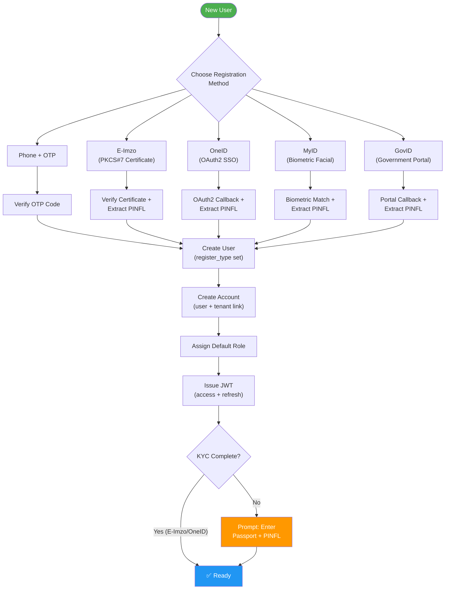
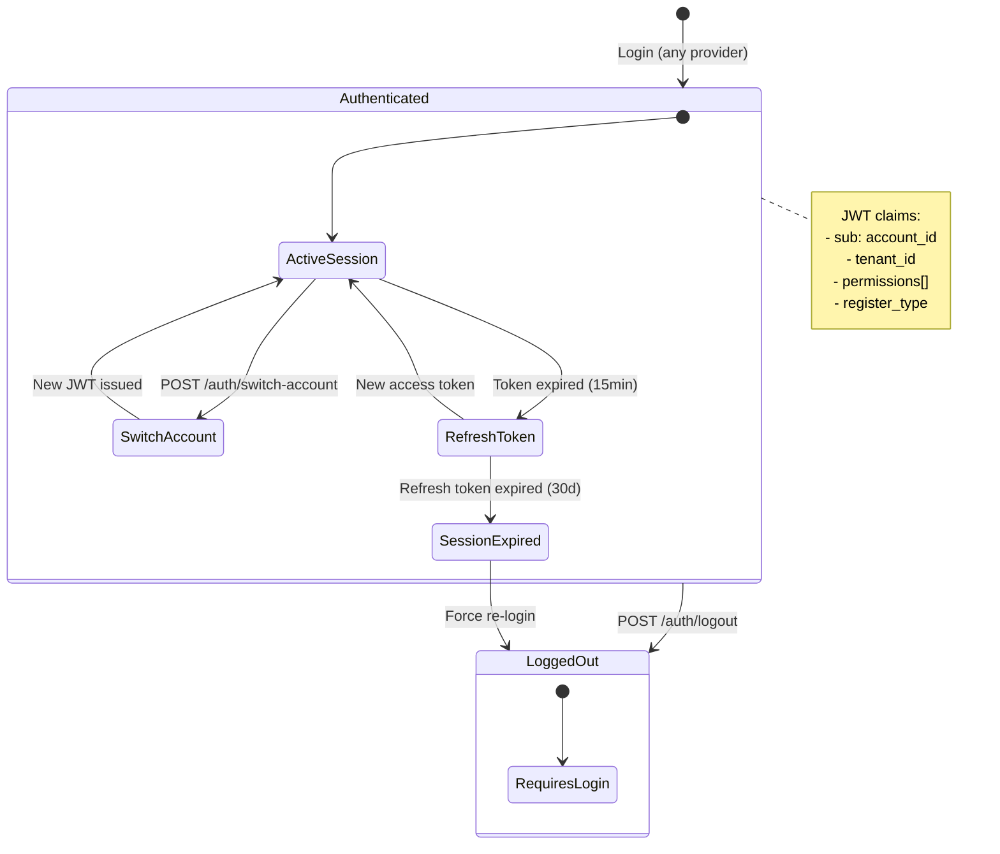
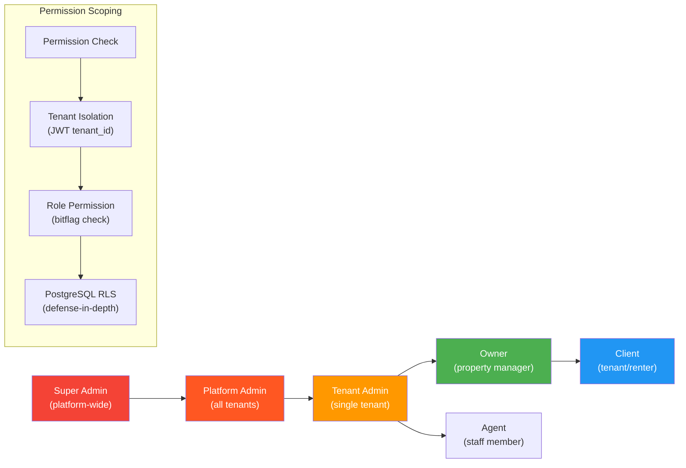

# Identity Module API

All endpoints in this module handle user identity, authentication, tenant management, RBAC, and team invitations.

**Base path:** `/api/v1/identity`  
**Auth note:** Unless marked `[public]`, all endpoints require `Authorization: Bearer {token}`.

---

## Business Logic Flows

### Registration & Authentication Flow



### Multi-Account & Session Model



### Role & Permission Hierarchy



---

## 1. Authentication

### 1.1 Register via Phone

```
POST /auth/register/phone
```

**Auth:** `[public]`

**Request:**

```json
{
  "phone_number": "string, required, max:20, format:+998XXXXXXXXX",
  "otp_code": "string, required, max:6, digits only"
}
```

**Response 201:**

```json
{
  "success": true,
  "data": {
    "access_token": "string",
    "refresh_token": "string",
    "expires_in": 900,
    "account": {
      "id": "uuid",
      "tenant_id": "uuid",
      "user_id": "uuid",
      "role_id": "uuid",
      "type": "Client",
      "is_owner": true,
      "is_individual": true
    }
  }
}
```

**Business rules:**
- If phone number already registered, return 409 `ALREADY_EXISTS`
- System auto-creates: User, personal Company, cloned Client Role, Account, Session
- `tenant_id` always points to the auto-created Company, never to User

**Status codes:** 201 Created, 400 Validation, 409 Already exists, 429 Rate limited

---

### 1.2 Register via E-Imzo

```
POST /auth/register/eimzo
```

**Auth:** `[public]`

**Request:**

```json
{
  "certificate": "string, required, base64 encoded X.509 certificate",
  "signature": "string, required, base64 encoded PKCS#7 signature",
  "challenge": "string, required, the server-issued challenge nonce",
  "is_individual": "boolean, required"
}
```

The backend verifies the signature against the certificate and extracts identity fields.

**Auto-extracted fields from certificate:**

| Field | Source | Required |
|-------|--------|----------|
| first_name | CN (Common Name) | Yes |
| last_name | CN (Common Name) | Yes |
| pinfl | serialNumber or UID | Yes |
| tin | INN attribute | Yes |
| serial_number | Certificate serial | Yes |
| org_name | O (Organization) | If company |
| org_tin | OrgINN attribute | If company |

**Response 201:** Same structure as phone registration.

**Business rules:**
- If `is_individual = true`: create personal Company from user name
- If `is_individual = false`: create business Company from org_name and org_tin
- Duplicate check: if `pinfl` already exists in users table, return 409
- If company and `org_tin` already registered, return 409

**Status codes:** 201, 400, 409, 422 (invalid certificate), 429

---

### 1.3 Register via OneID

```
POST /auth/register/oneid
```

**Auth:** `[public]`

**Request:**

```json
{
  "code": "string, required, OAuth2 authorization code",
  "redirect_uri": "string, required, must match configured redirect URI",
  "is_individual": "boolean, required"
}
```

Backend exchanges the code for user data from OneID API.

**Response 201:** Same structure as phone registration.  
**Status codes:** 201, 400, 409, 422 (OneID rejected), 429

---

### 1.3b Register via MyID

```
POST /auth/register/myid
```

**Auth:** `[public]`

**Request (Step 1: Create session):**

```json
{
  "is_individual": "boolean, required"
}
```

**Response 200 (redirect to MyID):**

```json
{
  "success": true,
  "data": {
    "session_id": "uuid",
    "redirect_url": "https://ekyc.myid.uz/Home?sessionId={uuid}",
    "expires_in": 600
  }
}
```

**Webhook callback (MyID → backend):** After biometric verification completes, MyID sends a webhook:

```json
{
  "recordId": "uuid",
  "sessionId": "uuid",
  "eventType": "KycApplicationUpdate",
  "status": "Completed | Rejected | Approved"
}
```

**Backend then:** Fetches `GET /kyc-applications/{recordId}/` from MyID → extracts PINFL, full name, photo, birth_date → creates user + company.

**Fields extracted from MyID:**

| MyID Field | Maps To |
|------------|--------|
| pinfl | `users.pinfl` |
| first_name | `users.first_name` |
| last_name | `users.last_name` |
| middle_name | `users.middle_name` |
| birth_date | `users.birth_date` |
| photo | `users.object_name` (avatar) |
| document_series | `users.passport_series` |
| document_number | `users.passport_number` |
| myid_id | `users.myid_id` |

**Business rules:**
- If `pinfl` already exists → 409 (user exists, link to login)
- User's `register_type` set to `MyID` (3)
- KYC session expires after 10 minutes

**Status codes:** 200, 400, 409, 422 (rejected by MyID), 429

---

### 1.3c Register via GovID

```
POST /auth/register/govid
```

**Auth:** `[public]`

**Request:**

```json
{
  "code": "string, required, OAuth2 authorization code",
  "redirect_uri": "string, required, must match configured redirect URI",
  "is_individual": "boolean, required"
}
```

Backend exchanges the code for user data from GovID API (id.egov.uz).

**Response 201:** Same structure as phone registration.  
**Status codes:** 201, 400, 409, 422 (GovID rejected), 429

---

### 1.4 Request OTP

```
POST /auth/otp/request
```

**Auth:** `[public]`

**Request:**

```json
{
  "phone_number": "string, required, max:20, format:+998XXXXXXXXX"
}
```

**Response 200:**

```json
{
  "success": true,
  "data": {
    "expires_in": 120,
    "retry_after": 60
  }
}
```

**Status codes:** 200, 400, 429 (max 5 requests per minute per IP)

---

### 1.5 Login (Phone)

```
POST /auth/login/phone
```

**Auth:** `[public]`

**Request:**

```json
{
  "phone_number": "string, required, max:20",
  "otp_code": "string, required, max:6"
}
```

**Response 200:**

```json
{
  "success": true,
  "data": {
    "access_token": "string",
    "refresh_token": "string",
    "expires_in": 900,
    "account": {
      "id": "uuid",
      "tenant_id": "uuid",
      "user_id": "uuid",
      "role_id": "uuid",
      "type": "Owner",
      "is_owner": true,
      "is_individual": false
    },
    "has_multiple_accounts": true
  }
}
```

**Business rules:**
- Returns the default account (`is_default = true`)
- `has_multiple_accounts` tells the client to offer account switching
- If user not found, return 404 with generic message (do not reveal existence)

**Status codes:** 200, 400, 401 (wrong OTP), 404, 429

---

### 1.6 Login (E-Imzo)

```
POST /auth/login/eimzo
```

**Auth:** `[public]`

**Request:**

```json
{
  "certificate": "string, required",
  "signature": "string, required",
  "challenge": "string, required"
}
```

**Response 200:** Same as phone login.  
**Status codes:** 200, 400, 401, 404, 422, 429

---

### 1.6b Login (OneID)

```
POST /auth/login/oneid
```

**Auth:** `[public]`

**Request:**

```json
{
  "code": "string, required, OAuth2 authorization code",
  "redirect_uri": "string, required, must match configured redirect URI"
}
```

Backend exchanges the code for user data from OneID API → finds user by `pinfl`.

**Response 200:** Same as phone login.  
**Status codes:** 200, 400, 401, 404, 422, 429

---

### 1.6c Login (MyID)

```
POST /auth/login/myid
```

**Auth:** `[public]`

**Request (Step 1: Create verification session):**

```json
{}
```

**Response 200:**

```json
{
  "success": true,
  "data": {
    "session_id": "uuid",
    "redirect_url": "https://ekyc.myid.uz/Home?sessionId={uuid}",
    "expires_in": 600
  }
}
```

After biometric verification, MyID webhook triggers user lookup by `pinfl` or `myid_id`.

**Response 200 (after webhook):** Same as phone login.  
**Status codes:** 200, 400, 401, 404, 422 (MyID rejected), 429

---

### 1.6d Login (GovID)

```
POST /auth/login/govid
```

**Auth:** `[public]`

**Request:**

```json
{
  "code": "string, required, OAuth2 authorization code",
  "redirect_uri": "string, required, must match configured redirect URI"
}
```

Backend exchanges the code for user data from GovID API → finds user by `pinfl`.

**Response 200:** Same as phone login.  
**Status codes:** 200, 400, 401, 404, 422, 429

---

### 1.7 Refresh Token

```
POST /auth/refresh
```

**Auth:** `[public]` (uses refresh token, not access token)

**Request:**

```json
{
  "refresh_token": "string, required, max:500"
}
```

**Response 200:**

```json
{
  "success": true,
  "data": {
    "access_token": "string",
    "refresh_token": "string",
    "expires_in": 900
  }
}
```

**Business rules:**
- Old refresh token is invalidated (rotation)
- If refresh token expired or not found, return 401
- Session record is updated with new refresh token

**Status codes:** 200, 401

---

### 1.8 Switch Account

```
POST /auth/switch-account
```

**Auth:** `[authenticated]`

**Request:**

```json
{
  "account_id": "uuid, required"
}
```

**Response 200:**

```json
{
  "success": true,
  "data": {
    "access_token": "string",
    "refresh_token": "string",
    "expires_in": 900,
    "account": {
      "id": "uuid",
      "tenant_id": "uuid",
      "user_id": "uuid",
      "role_id": "uuid",
      "type": "Owner",
      "is_owner": false,
      "is_individual": false
    }
  }
}
```

**Business rules:**
- Account must belong to the same user (verified via JWT `uid` claim)
- Account must be active
- Creates new session, invalidates old one
- `tenant_id` in new JWT changes to the switched account's company

**Status codes:** 200, 400, 403 (account belongs to different user), 404

---

### 1.9 Logout

```
POST /auth/logout
```

**Auth:** `[authenticated]`

**Request:** empty body

**Response 204:** no content

**Business rules:**
- Terminates current session (`is_terminated = true`)
- Refresh token is invalidated
- Access token remains valid until expiry (stateless JWT)

---

### 1.10 Get E-Imzo Challenge

```
GET /auth/eimzo/challenge
```

**Auth:** `[public]`

**Response 200:**

```json
{
  "success": true,
  "data": {
    "challenge": "string, random nonce",
    "expires_in": 300
  }
}
```

---

## 2. User Profile

### 2.1 Get My Profile

```
GET /users/me
```

**Auth:** `[authenticated]`

**Response 200:**

```json
{
  "success": true,
  "data": {
    "id": "uuid",
    "first_name": "string",
    "last_name": "string",
    "middle_name": "string | null",
    "phone_number": "string | null",
    "pinfl": "string | null",
    "tin": "string | null",
    "passport_series": "string | null",
    "passport_number": "string | null",
    "passport_issued_by": "string | null",
    "passport_issued_date": "date | null",
    "birth_date": "date | null",
    "register_type": "Phone | EImzo | OneId | MyID | GovID",
    "region": {
      "id": "uuid",
      "name": "string"
    },
    "district": {
      "id": "uuid",
      "name": "string"
    },
    "address": "string | null",
    "avatar_url": "string | null",
    "is_active": true,
    "compliance_complete": true,
    "created_at": "2026-02-09T12:00:00Z"
  }
}
```

> **Note:** `compliance_complete` is a computed field — `true` when `pinfl`, `passport_series`, `passport_number`, and `birth_date` are all filled. Used by the mobile app to display the "complete your profile" prompt.

---

### 2.2 Update My Profile

```
PATCH /users/me
```

**Auth:** `[authenticated]`

**Request:**

```json
{
  "first_name": "string, optional, max:100",
  "last_name": "string, optional, max:100",
  "middle_name": "string, optional, max:100",
  "phone_number": "string, optional, max:20",
  "passport_series": "string, optional, max:2, e.g. 'AA'",
  "passport_number": "string, optional, max:7, 7 digits",
  "passport_issued_by": "string, optional, max:200",
  "passport_issued_date": "date, optional, format:YYYY-MM-DD",
  "birth_date": "date, optional, format:YYYY-MM-DD",
  "region_id": "uuid, optional",
  "district_id": "uuid, optional",
  "address": "string, optional, max:500"
}
```

**Response 200:** Updated user profile (same as GET /users/me).

**Business rules:**
- Only the user themselves can update their profile
- `pinfl`, `tin`, `serial_number`, `register_type`, `myid_id` cannot be changed (auto-filled from identity providers)
- If `region_id` is sent, it must exist in regions table
- If `district_id` is sent, it must belong to the specified region

**Status codes:** 200, 400, 404

---

### 2.3 Upload Avatar

```
POST /users/me/avatar
Content-Type: multipart/form-data
```

**Auth:** `[authenticated]`

**Request fields:**
- `image`: file, required, max 5MB, types: image/jpeg, image/png, image/webp

**Response 200:**

```json
{
  "success": true,
  "data": {
    "avatar_url": "string"
  }
}
```

**Business rules:**
- Replaces existing avatar (old file deleted from MinIO)
- File renamed to UUID on upload

**Status codes:** 200, 400 (invalid file type/size)

---

## 3. Accounts

### 3.1 Get My Accounts

```
GET /accounts
```

**Auth:** `[authenticated]`

**Response 200:**

```json
{
  "success": true,
  "data": {
    "items": [
      {
        "id": "uuid",
        "tenant_id": "uuid",
        "tenant_name": "string",
        "role_name": "string",
        "type": "Owner",
        "is_owner": true,
        "is_default": true,
        "is_individual": false,
        "is_active": true
      },
      {
        "id": "uuid",
        "tenant_id": "uuid",
        "tenant_name": "string",
        "role_name": "string",
        "type": "Owner",
        "is_owner": false,
        "is_default": false,
        "is_individual": false,
        "is_active": true
      }
    ]
  }
}
```

**Business rules:**
- Returns all accounts for the current user (across all tenants)
- Filtered by `user_id` from JWT, not by `tenant_id`
- Includes inactive accounts (client may show "access revoked")

---

### 3.2 Set Default Account

```
PATCH /accounts/{id}/set-default
```

**Auth:** `[authenticated]`

**Request:** empty body

**Response 204:** no content

**Business rules:**
- Unsets previous default, sets this one as default
- Account must belong to the current user

---

## 4. Companies (Tenant Management)

### 4.1 Get My Company

```
GET /companies/me
```

**Auth:** `[authenticated]`

**Response 200:**

```json
{
  "success": true,
  "data": {
    "id": "uuid",
    "name": "string",
    "tin": "string | null",
    "serial_number": "string | null",
    "register_type": "Phone | EImzo | OneId | MyID | GovID",
    "mfo": "string | null",
    "oked": "string | null",
    "bank_account": "string | null",
    "bank_name": "string | null",
    "legal_address": "string | null",
    "region": {
      "id": "uuid",
      "name": "string"
    },
    "district": {
      "id": "uuid",
      "name": "string"
    },
    "address": "string | null",
    "phone_number": "string | null",
    "logo_url": "string | null",
    "is_verified": true,
    "is_active": true,
    "b2b_complete": true,
    "created_at": "2026-02-09T12:00:00Z",
    "owner": {
      "id": "uuid",
      "first_name": "string",
      "last_name": "string"
    }
  }
}
```

> **Note:** `b2b_complete` is a computed field — `true` when `tin`, `mfo`, `bank_account`, and `legal_address` are all filled. Required before contract generation and E-Ijara registration.

**Business rules:**
- Returns the company associated with the current `tenant_id` from JWT
- Non-owner employees see the same data

---

### 4.2 Update Company

```
PATCH /companies/me
```

**Auth:** `[authenticated]`, **Permission:** `company:write`

**Request:**

```json
{
  "name": "string, optional, max:200",
  "phone_number": "string, optional, max:20",
  "mfo": "string, optional, max:5, 5 digits (bank MFO code)",
  "oked": "string, optional, max:5, 5 digits (economic activity classifier)",
  "bank_account": "string, optional, max:20, 20 digits (settlement account)",
  "bank_name": "string, optional, max:200",
  "legal_address": "string, optional, max:500",
  "region_id": "uuid, optional",
  "district_id": "uuid, optional",
  "address": "string, optional, max:500"
}
```

**Response 200:** Updated company (same as GET /companies/me).

**Business rules:**
- `tin` and `serial_number` cannot be changed (from certificate)
- Only users with `company:write` permission can update

---

### 4.3 Upload Company Logo

```
POST /companies/me/logo
Content-Type: multipart/form-data
```

**Auth:** `[authenticated]`, **Permission:** `company:write`

**Request fields:**
- `image`: file, required, max 5MB, types: image/jpeg, image/png, image/webp

**Response 200:**

```json
{
  "success": true,
  "data": {
    "logo_url": "string"
  }
}
```

---

## 5. Team Management (Invitations)

### 5.1 Send Invitation

```
POST /invitations
```

**Auth:** `[authenticated]`, **Permission:** `team:manage`

**Request:**

```json
{
  "recipient_phone": "string, required if recipient_id is null, max:20",
  "recipient_id": "uuid, required if recipient_phone is null",
  "role_id": "uuid, required, must be a role in the current tenant",
  "content": "string, optional, max:1000",
  "expired_time": "datetime, required, ISO 8601, must be in the future"
}
```

**Response 201:**

```json
{
  "success": true,
  "data": {
    "id": "uuid",
    "recipient_phone": "string | null",
    "recipient_id": "uuid | null",
    "role_name": "string",
    "status": "Sent",
    "expired_time": "2026-03-09T12:00:00Z",
    "created_at": "2026-02-09T12:00:00Z"
  }
}
```

**Business rules:**
- Either `recipient_phone` or `recipient_id` must be provided, not both
- `role_id` must belong to the current tenant (not a system role)
- Cannot invite user who already has an active account in this tenant
- Generates a unique `key` for the invitation
- If `recipient_phone` is provided and the user does not exist yet, invitation status stays `Sent`. When the user registers later, pending invitations are matched by phone number

**Status codes:** 201, 400, 404 (role or user not found), 409 (already has account in tenant)

---

### 5.2 Get Sent Invitations

```
GET /invitations/sent
```

**Auth:** `[authenticated]`, **Permission:** `team:read`

**Query parameters:** page, page_size, status (optional filter)

**Response 200:** paginated list of invitations sent by the current tenant.

---

### 5.3 Get Received Invitations

```
GET /invitations/received
```

**Auth:** `[authenticated]`

**Response 200:**

```json
{
  "success": true,
  "data": {
    "items": [
      {
        "id": "uuid",
        "sender_company_name": "string",
        "role_name": "string",
        "content": "string | null",
        "status": "Sent",
        "expired_time": "2026-03-09T12:00:00Z",
        "created_at": "2026-02-09T12:00:00Z"
      }
    ]
  }
}
```

**Business rules:**
- Returns invitations where `recipient_id = current user` or `recipient_phone = current user phone`
- Not tenant-scoped (user sees invitations across all tenants)

---

### 5.4 Accept Invitation

```
POST /invitations/{id}/accept
```

**Auth:** `[authenticated]`

**Request:** empty body

**Response 200:**

```json
{
  "success": true,
  "data": {
    "account_id": "uuid",
    "tenant_id": "uuid",
    "tenant_name": "string",
    "role_name": "string"
  }
}
```

**Business rules:**
- Creates a new Account record linking the user to the inviting tenant
- Account.role_id = invitation.role_id
- Account.is_owner = false
- Invitation.status changes to Accepted
- User can now switch to this account

**Status codes:** 200, 404, 422 (expired or already accepted/rejected)

---

### 5.5 Reject Invitation

```
POST /invitations/{id}/reject
```

**Auth:** `[authenticated]`

**Request:**

```json
{
  "reason": "string, optional, max:500"
}
```

**Response 204:** no content

---

### 5.6 Cancel Invitation (by sender)

```
POST /invitations/{id}/cancel
```

**Auth:** `[authenticated]`, **Permission:** `team:manage`

**Request:** empty body  
**Response 204:** no content

**Business rules:**
- Only the sending tenant can cancel
- Status changes to Canceled

---

## 6. Roles

### 6.1 Get Roles

```
GET /roles
```

**Auth:** `[authenticated]`, **Permission:** `roles:read`

**Response 200:**

```json
{
  "success": true,
  "data": {
    "items": [
      {
        "id": "uuid",
        "name": "Property Manager",
        "type": "Owner",
        "is_system": false,
        "permissions_count": 8,
        "accounts_count": 3,
        "is_active": true,
        "created_at": "2026-02-09T12:00:00Z"
      }
    ]
  }
}
```

**Business rules:**
- Returns roles where `tenant_id = current tenant` and system roles
- System roles cannot be edited or deleted

---

### 6.2 Get Role with Permissions

```
GET /roles/{id}
```

**Auth:** `[authenticated]`, **Permission:** `roles:read`

**Response 200:**

```json
{
  "success": true,
  "data": {
    "id": "uuid",
    "name": "Property Manager",
    "type": "Owner",
    "is_system": false,
    "is_active": true,
    "created_at": "2026-02-09T12:00:00Z",
    "permissions": [
      {
        "id": "uuid",
        "module": "building",
        "name": "buildings:read",
        "description": "View buildings",
        "value": 1
      },
      {
        "id": "uuid",
        "module": "building",
        "name": "listings:write",
        "description": "Create and edit listings",
        "value": 2
      }
    ]
  }
}
```

---

### 6.3 Create Role

```
POST /roles
```

**Auth:** `[authenticated]`, **Permission:** `roles:write`

**Request:**

```json
{
  "name": "string, required, max:100",
  "type": "int, required, 1=Client or 2=Owner",
  "permissions": [
    {
      "permission_id": "uuid, required",
      "value": "int, required, 0=None 1=Read 2=Write 3=Full"
    }
  ]
}
```

**Response 201:** created role with permissions (same as GET /roles/{id}).

**Business rules:**
- `tenant_id` is auto-set from JWT
- Role name must be unique within the tenant
- Cannot assign permissions that the requesting user does not have

**Status codes:** 201, 400, 409 (name conflict)

---

### 6.4 Update Role

```
PUT /roles/{id}
```

**Auth:** `[authenticated]`, **Permission:** `roles:write`

**Request:** Same as create.  
**Response 200:** Updated role.

**Business rules:**
- Cannot update system roles (`tenant_id IS NULL`)
- Cannot update role if it belongs to a different tenant

---

### 6.5 Delete Role

```
DELETE /roles/{id}
```

**Auth:** `[authenticated]`, **Permission:** `roles:write`

**Response 204:** no content

**Business rules:**
- Cannot delete if any active accounts are assigned to this role
- Cannot delete system roles
- Soft delete only

**Status codes:** 204, 404, 422 (role in use)

---

## 7. Permissions

### 7.1 Get All Permissions

```
GET /permissions
```

**Auth:** `[authenticated]`, **Permission:** `roles:read`

**Response 200:**

```json
{
  "success": true,
  "data": {
    "items": [
      {
        "id": "uuid",
        "module": "identity",
        "name": "company:read",
        "description": "View company details"
      },
      {
        "id": "uuid",
        "module": "identity",
        "name": "company:write",
        "description": "Update company details"
      },
      {
        "id": "uuid",
        "module": "identity",
        "name": "team:read",
        "description": "View team members and invitations"
      },
      {
        "id": "uuid",
        "module": "identity",
        "name": "team:manage",
        "description": "Invite and manage team members"
      },
      {
        "id": "uuid",
        "module": "identity",
        "name": "roles:read",
        "description": "View roles and permissions"
      },
      {
        "id": "uuid",
        "module": "identity",
        "name": "roles:write",
        "description": "Create, edit, delete roles"
      },
      {
        "id": "uuid",
        "module": "building",
        "name": "buildings:read",
        "description": "View buildings"
      },
      {
        "id": "uuid",
        "module": "building",
        "name": "buildings:write",
        "description": "Create and edit buildings"
      },
      {
        "id": "uuid",
        "module": "building",
        "name": "real-estates:read",
        "description": "View real estates"
      },
      {
        "id": "uuid",
        "module": "building",
        "name": "real-estates:write",
        "description": "Create and edit real estates"
      },
      {
        "id": "uuid",
        "module": "building",
        "name": "listings:read",
        "description": "View listings"
      },
      {
        "id": "uuid",
        "module": "building",
        "name": "listings:write",
        "description": "Create, edit, publish listings"
      },
      {
        "id": "uuid",
        "module": "building",
        "name": "leases:read",
        "description": "View leases and payments"
      },
      {
        "id": "uuid",
        "module": "building",
        "name": "leases:write",
        "description": "Create and manage leases"
      },
      {
        "id": "uuid",
        "module": "building",
        "name": "meters:read",
        "description": "View meters and readings"
      },
      {
        "id": "uuid",
        "module": "building",
        "name": "meters:write",
        "description": "Manage meters and submit readings"
      }
    ]
  }
}
```

**Business rules:**
- Permissions are global (not tenant-scoped)
- This endpoint lists all available permissions for role assignment

---

## 8. Sessions

### 8.1 Get Active Sessions

```
GET /sessions
```

**Auth:** `[authenticated]`

**Response 200:**

```json
{
  "success": true,
  "data": {
    "items": [
      {
        "id": "uuid",
        "device_info": "iPhone 15 Pro / iOS 19",
        "ip_address": "192.168.1.1",
        "is_current": true,
        "created_at": "2026-02-09T12:00:00Z"
      },
      {
        "id": "uuid",
        "device_info": "Chrome / macOS",
        "ip_address": "10.0.0.5",
        "is_current": false,
        "created_at": "2026-02-08T10:00:00Z"
      }
    ]
  }
}
```

---

### 8.2 Terminate Session

```
DELETE /sessions/{id}
```

**Auth:** `[authenticated]`

**Response 204:** no content

**Business rules:**
- Can terminate any session belonging to the current user
- Cannot terminate the current session (use logout instead)

---

### 8.3 Terminate All Other Sessions

```
POST /sessions/terminate-all
```

**Auth:** `[authenticated]`

**Request:** empty body  
**Response 204:** no content

**Business rules:**
- Terminates all sessions except the current one
- Useful for security: "log out everywhere else"

---

## 9. Team Members

### 9.1 Get Team Members

```
GET /team
```

**Auth:** `[authenticated]`, **Permission:** `team:read`

**Response 200:**

```json
{
  "success": true,
  "data": {
    "items": [
      {
        "account_id": "uuid",
        "user": {
          "id": "uuid",
          "first_name": "string",
          "last_name": "string",
          "phone_number": "string | null",
          "avatar_url": "string | null"
        },
        "role": {
          "id": "uuid",
          "name": "Property Manager"
        },
        "type": "Owner",
        "is_owner": true,
        "is_active": true,
        "joined_at": "2026-02-09T12:00:00Z"
      }
    ],
    "pagination": {
      "page": 1,
      "page_size": 20,
      "total_items": 5,
      "total_pages": 1
    }
  }
}
```

**Business rules:**
- Returns all accounts in the current tenant
- Includes deactivated members (`is_active = false`)

---

### 9.2 Change Member Role

```
PATCH /team/{account_id}/role
```

**Auth:** `[authenticated]`, **Permission:** `team:manage`

**Request:**

```json
{
  "role_id": "uuid, required"
}
```

**Response 204:** no content

**Business rules:**
- Cannot change the role of the tenant owner (`is_owner = true`)
- Role must belong to the current tenant

---

### 9.3 Deactivate Member

```
PATCH /team/{account_id}/deactivate
```

**Auth:** `[authenticated]`, **Permission:** `team:manage`

**Request:** empty body  
**Response 204:** no content

**Business rules:**
- Sets `account.is_active = false`
- User loses access to this tenant on next token refresh
- Cannot deactivate the tenant owner
- Does not delete the user or any other accounts

---

### 9.4 Reactivate Member

```
PATCH /team/{account_id}/reactivate
```

**Auth:** `[authenticated]`, **Permission:** `team:manage`

**Request:** empty body  
**Response 204:** no content
