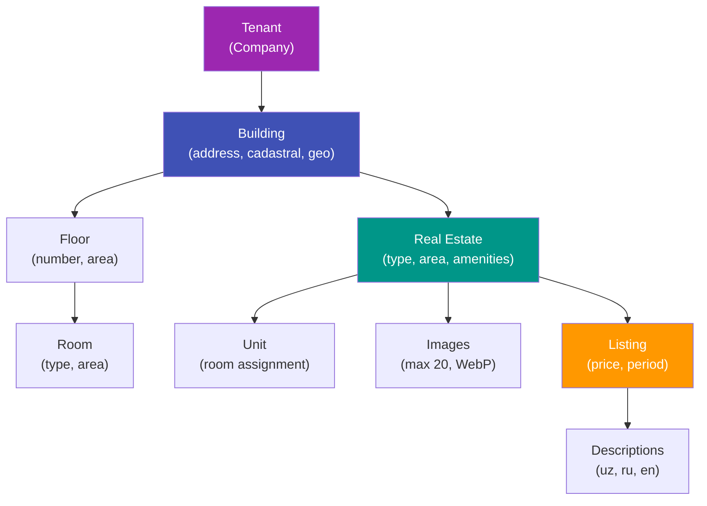
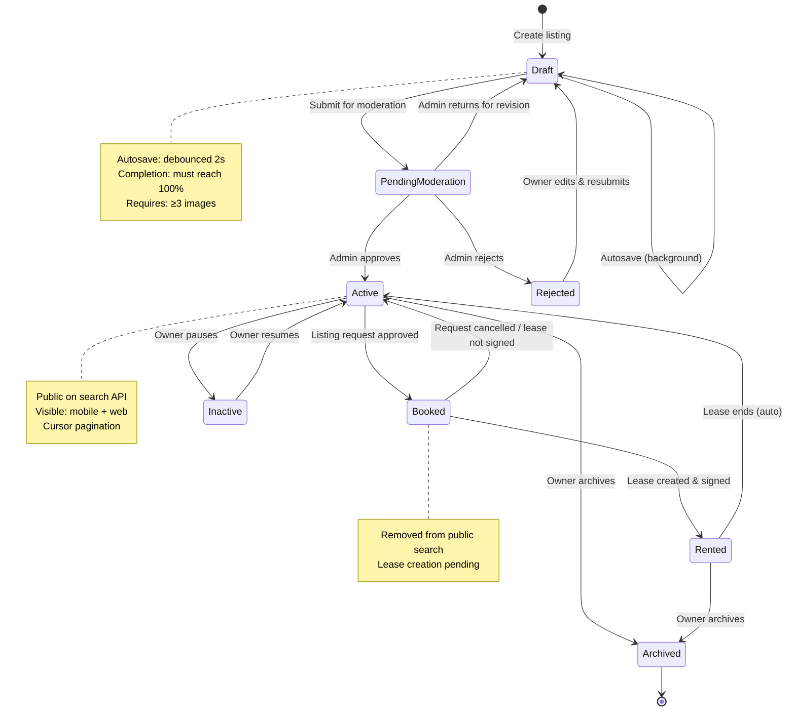
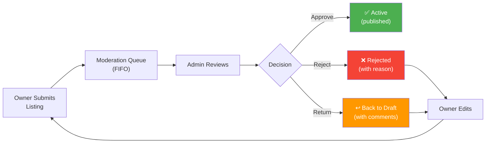
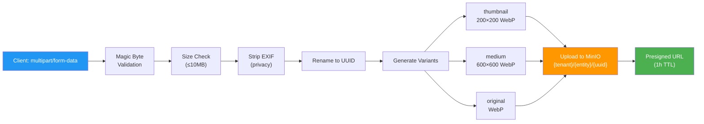

# Building Module API

All endpoints for property management: buildings, floors, rooms, real estates, units, images, and amenities.

**Base path:** `/api/v1/building`  
**Auth:** All endpoints require `Authorization: Bearer {token}` unless marked `[public]`.

---

## Business Logic Flows

### Property Hierarchy



### Listing Lifecycle State Machine



### Moderation Flow



### Image Upload Pipeline



---

## 1. Buildings

### 1.1 List Buildings

```
GET /buildings
```

**Permission:** `buildings:read`

**Query parameters:**

| Parameter | Type | Required | Max | Description |
|-----------|------|----------|-----|-------------|
| page | int | No | - | Default: 1 |
| page_size | int | No | 100 | Default: 20 |
| status | int | No | - | Filter by status enum |
| is_commercial | bool | No | - | |
| is_residential | bool | No | - | |
| region_id | uuid | No | - | |
| district_id | uuid | No | - | |
| name_search | string | No | 100 | Search in number/address |
| sort_by | string | No | - | `created_at`, `number`, `total_area` |
| sort_direction | string | No | - | `asc`, `desc` |

**Response 200:**

```json
{
  "success": true,
  "data": {
    "items": [
      {
        "id": "uuid",
        "number": "Building A-1",
        "is_commercial": true,
        "is_residential": false,
        "is_renovated": true,
        "total_area": 2500.00,
        "floors_count": 5,
        "address": "Tashkent, Chilanzar, 12",
        "status": 1,
        "status_name": "Active",
        "moderation_status": 2,
        "moderation_status_name": "Accepted",
        "region": { "id": "uuid", "name": "Tashkent" },
        "district": { "id": "uuid", "name": "Chilanzar" },
        "real_estates_count": 12,
        "created_at": "2026-02-09T12:00:00Z"
      }
    ],
    "pagination": {
      "page": 1,
      "page_size": 20,
      "total_items": 3,
      "total_pages": 1,
      "has_next_page": false,
      "has_previous_page": false
    }
  }
}
```

**Business rules:**
- Auto-filtered by `tenant_id` from JWT
- Soft-deleted buildings are excluded

---

### 1.2 Get Building

```
GET /buildings/{id}
```

**Permission:** `buildings:read`

**Response 200:**

```json
{
  "success": true,
  "data": {
    "id": "uuid",
    "number": "Building A-1",
    "is_commercial": true,
    "is_residential": false,
    "is_renovated": true,
    "total_area": 2500.00,
    "floors_count": 5,
    "location": {
      "latitude": 41.311081,
      "longitude": 69.240562
    },
    "address": "Tashkent, Chilanzar, 12",
    "descriptions": [
      { "language_code": "uz", "text": "..." },
      { "language_code": "ru", "text": "..." }
    ],
    "images": [
      { "id": "uuid", "url": "string", "sort_order": 0 }
    ],
    "status": 1,
    "status_name": "Active",
    "moderation_status": 2,
    "moderation_status_name": "Accepted",
    "moderation_note": null,
    "region": { "id": "uuid", "name": "Tashkent" },
    "district": { "id": "uuid", "name": "Chilanzar" },
    "floors": [
      {
        "id": "uuid",
        "number": 1,
        "area": 500.00,
        "rooms_count": 6
      }
    ],
    "real_estates_count": 12,
    "created_at": "2026-02-09T12:00:00Z",
    "updated_at": "2026-02-09T14:00:00Z"
  }
}
```

---

### 1.3 Create Building

```
POST /buildings
```

**Permission:** `buildings:write`

**Request:**

```json
{
  "number": "string, required, max:50",
  "is_commercial": "boolean, required",
  "is_residential": "boolean, required",
  "region_id": "uuid, optional",
  "district_id": "uuid, optional",
  "total_area": "number, optional, min:0.01",
  "floors_count": "int, optional, min:1, max:200",
  "latitude": "number, optional, range:-90 to 90",
  "longitude": "number, optional, range:-180 to 180",
  "address": "string, optional, max:500",
  "descriptions": [
    {
      "language_code": "string, required, enum:uz|ru|en, max:5",
      "text": "string, required, max:2000"
    }
  ]
}
```

**Response 201:** Created building (same format as GET).

**Business rules:**
- `tenant_id` auto-set from JWT
- `is_renovated` starts as `false`
- `status` starts as `Draft` (0)
- Either `is_commercial` or `is_residential` must be `true` (or both)
- If `district_id` is provided, it must belong to the specified `region_id`

**Status codes:** 201, 400, 409 (duplicate number within tenant)

---

### 1.4 Update Building

```
PUT /buildings/{id}
```

**Permission:** `buildings:write`

**Request:** Same as create.  
**Response 200:** Updated building.

**Business rules:**
- Cannot update buildings belonging to a different tenant
- Cannot change `tenant_id`

---

### 1.5 Delete Building

```
DELETE /buildings/{id}
```

**Permission:** `buildings:write`

**Response 204:** no content

**Business rules:**
- Soft delete: sets `is_deleted = true`
- Cannot delete if building has active real estates with active listings
- Cascades soft delete to floors and rooms

**Status codes:** 204, 404, 422 (has active dependencies)

---

## 1b. Building Images

> Same pattern as Real Estate Images (§4). Buildings can have exterior/location photos.

### 1b.1 Upload Building Image

```
POST /buildings/{id}/images
Content-Type: multipart/form-data
```

**Permission:** `buildings:write`

**Form fields:**

| Field | Type | Required | Validation |
|-------|------|----------|------------|
| image | file | Yes | max 10MB, types: image/jpeg, image/png, image/webp |
| sort_order | int | No | Default: append last |

**Response 201:**

```json
{
  "success": true,
  "data": {
    "id": "uuid",
    "url": "string",
    "sort_order": 0
  }
}
```

**Business rules:**
- Max 20 images per building
- Image processed through server resize pipeline (thumbnail, medium, original WebP)
- `sort_order` auto-assigned if not provided

---

### 1b.2 Reorder Building Images

```
PUT /buildings/{id}/images/order
```

**Permission:** `buildings:write`

**Request:**

```json
{
  "image_ids": ["uuid", "uuid", "uuid"]
}
```

**Response 204**

**Business rules:**
- All image IDs must belong to the building
- Order in array = new `sort_order`

---

### 1b.3 Delete Building Image

```
DELETE /buildings/{id}/images/{imageId}
```

**Permission:** `buildings:write`  
**Response 204**

**Business rules:**
- Deletes image from MinIO
- Soft delete from database

---

## 2. Building Renovation (Floors and Rooms)

### 2.1 Renovate Building (Add Floors)

```
POST /buildings/{id}/floors
```

**Permission:** `buildings:write`

**Request:**

```json
{
  "floors": [
    {
      "number": "int, required, min:-5, max:200",
      "area": "number, optional, min:0.01"
    }
  ]
}
```

**Response 201:**

```json
{
  "success": true,
  "data": {
    "items": [
      { "id": "uuid", "number": 1, "area": 500.00 },
      { "id": "uuid", "number": 2, "area": 500.00 }
    ]
  }
}
```

**Business rules:**
- First floor addition sets `building.is_renovated = true`
- Floor numbers must be unique within the building
- Negative numbers represent basement floors
- `tenant_id` auto-set from JWT

---

### 2.2 Update Floor

```
PUT /buildings/{buildingId}/floors/{id}
```

**Permission:** `buildings:write`

**Request:**

```json
{
  "number": "int, required",
  "area": "number, optional"
}
```

**Response 200:** Updated floor.

---

### 2.3 Delete Floor

```
DELETE /buildings/{buildingId}/floors/{id}
```

**Permission:** `buildings:write`

**Response 204:** no content

**Business rules:**
- Cascades to rooms on this floor
- Cannot delete if any room has an active real estate or meter

---

### 2.4 Add Rooms to Floor

```
POST /buildings/{buildingId}/floors/{floorId}/rooms
```

**Permission:** `buildings:write`

**Request:**

```json
{
  "rooms": [
    {
      "number": "string, required, max:20",
      "room_type_id": "uuid, optional",
      "area": "number, optional, min:0.01"
    }
  ]
}
```

**Response 201:** Created rooms array.

**Business rules:**
- Room numbers must be unique within the floor
- `room_type_id` must exist in `room_types` table

---

### 2.5 Update Room

```
PUT /buildings/{buildingId}/rooms/{id}
```

**Permission:** `buildings:write`

**Request:**

```json
{
  "number": "string, required, max:20",
  "room_type_id": "uuid, optional",
  "area": "number, optional"
}
```

---

### 2.6 Delete Room

```
DELETE /buildings/{buildingId}/rooms/{id}
```

**Permission:** `buildings:write`  
**Response 204**

---

## 3. Real Estates

### 3.1 List Real Estates

```
GET /real-estates
```

**Permission:** `real-estates:read`

**Query parameters:**

| Parameter | Type | Required | Description |
|-----------|------|----------|-------------|
| page | int | No | Default: 1 |
| page_size | int | No | Default: 20+, max 100 |
| real_estate_type_id | uuid | No | |
| building_id | uuid | No | |
| status | int | No | |
| rooms_count_min | int | No | |
| rooms_count_max | int | No | |
| area_min | number | No | |
| area_max | number | No | |
| region_id | uuid | No | |
| sort_by | string | No | `created_at`, `total_area`, `rooms_count` |
| sort_direction | string | No | `asc`, `desc` |

**Response 200:** Paginated list, each item includes:

```json
{
  "id": "uuid",
  "type": { "id": "uuid", "name": "Apartment" },
  "building": { "id": "uuid", "number": "Building A-1" },
  "cadastral_number": "string | null",
  "number": "42",
  "total_area": 85.5,
  "rooms_count": 3,
  "region": { "id": "uuid", "name": "Tashkent" },
  "address": "string | null",
  "status": 1,
  "status_name": "Active",
  "images_count": 5,
  "has_active_listing": true,
  "created_at": "2026-02-09T12:00:00Z"
}
```

---

### 3.2 Get Real Estate

```
GET /real-estates/{id}
```

**Permission:** `real-estates:read`

**Response 200:**

```json
{
  "success": true,
  "data": {
    "id": "uuid",
    "type": { "id": "uuid", "name": "Apartment" },
    "building": {
      "id": "uuid",
      "number": "Building A-1",
      "address": "Tashkent, Chilanzar"
    },
    "floor": { "id": "uuid", "number": 3 },
    "room": { "id": "uuid", "number": "304" },
    "renovation": { "id": "uuid", "name": "Euro" },
    "cadastral_number": "12:34:5678901:234",
    "building_number": "15",
    "floor_number": 3,
    "number": "42",
    "total_area": 85.5,
    "living_area": 62.0,
    "ceiling_height": 2.7,
    "total_floors": 5,
    "rooms_count": 3,
    "region": { "id": "uuid", "name": "Tashkent" },
    "district": { "id": "uuid", "name": "Chilanzar" },
    "location": {
      "latitude": 41.311081,
      "longitude": 69.240562
    },
    "address": "Tashkent, Chilanzar, 12",
    "owner": {
      "id": "uuid",
      "first_name": "Abdulla",
      "last_name": "Karimov"
    },
    "amenities": [
      { "id": "uuid", "name": "Parking", "category": "Infrastructure", "value": "2" },
      { "id": "uuid", "name": "Air Conditioning", "category": "Comfort", "value": null }
    ],
    "images": [
      { "id": "uuid", "url": "string", "sort_order": 0, "is_plan": false },
      { "id": "uuid", "url": "string", "sort_order": 1, "is_plan": true }
    ],
    "units": [
      { "id": "uuid", "number": "A", "area": 42.0, "status": 1 }
    ],
    "meters_count": 3,
    "status": 1,
    "status_name": "Active",
    "moderation_status": 2,
    "moderation_status_name": "Accepted",
    "moderation_note": null,
    "created_at": "2026-02-09T12:00:00Z",
    "updated_at": "2026-02-09T14:00:00Z"
  }
}
```

---

### 3.3 Create Real Estate

```
POST /real-estates
Content-Type: multipart/form-data
```

**Permission:** `real-estates:write`

**Form fields:**

| Field | Type | Required | Validation |
|-------|------|----------|------------|
| real_estate_type_id | uuid | Yes | Must exist |
| building_id | uuid | No | Must belong to tenant |
| floor_id | uuid | No | Must belong to building |
| room_id | uuid | No | Must belong to floor |
| renovation_id | uuid | No | Must exist in renovation_types |
| cadastral_number | string | No | max:50 |
| building_number | string | No | max:50 |
| floor_number | int | No | min:-5, max:200 |
| number | string | No | max:50 |
| total_area | number | No | min:0.01, max:100000 |
| living_area | number | No | min:0.01, must be <= total_area |
| ceiling_height | number | No | min:1.0, max:20.0 |
| total_floors | int | No | min:1, max:200 |
| rooms_count | int | No | min:0, max:100 |
| region_id | uuid | No | Must exist |
| district_id | uuid | No | Must belong to region |
| latitude | number | No | range:-90 to 90 |
| longitude | number | No | range:-180 to 180 |
| address | string | No | max:500 |
| amenity_ids | uuid[] | No | Comma-separated, each must exist |
| images[] | file | No | max 10 files, max 10MB each |
| plan | file | No | max 10MB, image or PDF |

**Response 201:** Created real estate (same format as GET).

**Business rules:**
- `tenant_id` auto-set from JWT
- `owner_id` auto-set from JWT `uid` (user ID)
- `status` starts as Draft (0)
- `moderation_status` starts as None (0)
- `cadastral_number` must be unique if provided
- Images are uploaded to MinIO, keys stored in `real_estate_images`

---

### 3.4 Update Real Estate

```
PUT /real-estates/{id}
Content-Type: multipart/form-data
```

**Permission:** `real-estates:write`

**Form parts:**

| Part | Type | Required | Description |
|------|------|----------|-------------|
| data | application/json | Yes | Entity fields (same as create request) |
| images[] | file | No | New images to add, max 10 files, max 10MB each |
| plan | file | No | New floor plan, max 10MB |
| existing_image_ids | JSON array | No | IDs of retained images (order = sort_order). Omitted images are deleted. |

```
PUT /api/v1/building/real-estates/{id}
Content-Type: multipart/form-data

Parts:
  data: application/json (entity fields)
  images[0]: file (new image)
  images[1]: file (new image)
  existing_image_ids: ["uuid-1", "uuid-3"]  ← retained images (order = sort_order)
```

**Response 200:** Updated real estate.

> **Note:** Follows the [Unified Multipart PUT](file:///Users/agreeing/Documents/GitHub/maydon-api/docs/03-api-standards.md) pattern. Atomic operation — JSON data and images are processed in a single transaction.

---

### 3.5 Delete Real Estate

```
DELETE /real-estates/{id}
```

**Permission:** `real-estates:write`  
**Response 204**

**Business rules:**
- Cannot delete if any listing is Active or Booked
- Cannot delete if any lease is Active
- Cascading soft delete to units, images

---

## 4. Real Estate Images

### 4.1 Upload Image

```
POST /real-estates/{id}/images
Content-Type: multipart/form-data
```

**Permission:** `real-estates:write`

**Form fields:**
- `image`: file, required, max 10MB, types: jpeg/png/webp
- `sort_order`: int, optional, default 0
- `is_plan`: boolean, optional, default false

**Response 201:**

```json
{
  "success": true,
  "data": {
    "id": "uuid",
    "url": "string",
    "sort_order": 0,
    "is_plan": false
  }
}
```

---

### 4.2 Reorder Images

```
PATCH /real-estates/{id}/images/reorder
```

**Permission:** `real-estates:write`

**Request:**

```json
{
  "image_ids": ["uuid", "uuid", "uuid"]
}
```

Sets `sort_order` based on array position (0, 1, 2...).

**Response 204**

---

### 4.3 Delete Image

```
DELETE /real-estates/{realEstateId}/images/{imageId}
```

**Permission:** `real-estates:write`  
**Response 204**

**Business rules:**
- Deletes from MinIO and database
- Reorders remaining images

---

## 5. Amenity Assignment

### 5.1 Set Amenities for Real Estate

```
PUT /real-estates/{id}/amenities
```

**Permission:** `real-estates:write`

**Request:**

```json
{
  "amenities": [
    {
      "amenity_id": "uuid, required",
      "value": "string, optional, max:50"
    }
  ]
}
```

**Response 200:**

```json
{
  "success": true,
  "data": {
    "items": [
      { "id": "uuid", "amenity_id": "uuid", "name": "Parking", "category": "Infrastructure", "value": "2" }
    ]
  }
}
```

**Business rules:**
- Replaces all existing amenity assignments
- Empty array removes all amenities
- Each `amenity_id` must exist in the `amenities` table

---

## 6. Units

### 6.1 List Units for Real Estate

```
GET /real-estates/{id}/units
```

**Permission:** `real-estates:read`

**Response 200:** array of units.

---

### 6.2 Create Unit

```
POST /real-estates/{id}/units
```

**Permission:** `real-estates:write`

**Request:**

```json
{
  "number": "string, required, max:50",
  "area": "number, optional, min:0.01"
}
```

**Response 201:** Created unit.

**Business rules:**
- `tenant_id` auto-set from JWT
- Unit number must be unique within the real estate

---

### 6.3 Update Unit

```
PUT /real-estates/{realEstateId}/units/{id}
```

**Permission:** `real-estates:write`

**Request:** Same as create.  
**Response 200**: Updated unit.

---

### 6.4 Delete Unit

```
DELETE /real-estates/{realEstateId}/units/{id}
```

**Permission:** `real-estates:write`  
**Response 204**

**Business rules:**
- Cannot delete if unit has an active listing or lease

---

## 7. Building Moderation (Admin)

### 7.1 Submit Building for Moderation

```
POST /buildings/{id}/submit-for-moderation
```

**Permission:** `buildings:write` (owner action)

**Request:** empty body  
**Response 204**

**Business rules:**
- Building must be in `Draft` or `Rejected` status
- Sets `moderation_status` to `InModeration` (1)

---

### 7.2 Approve Building (Admin)

```
POST /admin/buildings/{id}/approve
```

**Permission:** `admin:buildings:moderate`

**Request:** empty body  
**Response 204**

**Business rules:**
- Sets `moderation_status` to `Accepted` (2)
- Sets `status` to `Active` (1)
- Records `moderated_by` and `moderated_at`

---

### 7.3 Reject Building (Admin)

```
POST /admin/buildings/{id}/reject
```

**Permission:** `admin:buildings:moderate`

**Request:**

```json
{
  "note": "string, required, max:1000"
}
```

**Response 204**

**Business rules:**
- Sets `moderation_status` to `Rejected` (3)
- Sets `status` back to `Draft` (0)
- Stores `moderation_note`
- Records `moderated_by` and `moderated_at`

---

### 7.4 Block Building (Admin)

```
POST /admin/buildings/{id}/block
```

**Permission:** `admin:buildings:moderate`

**Request:**

```json
{
  "note": "string, required, max:1000"
}
```

**Response 204**

**Business rules:**
- Sets `moderation_status` to `Blocked` (4)
- Sets `status` to `Blocked` (3)
- All active listings under this building are paused

---

## 8. Real Estate Moderation (Admin)

**Same pattern as building moderation:**

```
POST /real-estates/{id}/submit-for-moderation           (owner)
POST /admin/real-estates/{id}/approve                    (admin)
POST /admin/real-estates/{id}/reject    { "note": "..." } (admin)
POST /admin/real-estates/{id}/block     { "note": "..." } (admin)
```

---

## 9. Reference Data (Admin + Public)

### 9.1 Real Estate Types

```
GET    /reference/real-estate-types              [public]
POST   /admin/reference/real-estate-types        [admin:reference:write]
PUT    /admin/reference/real-estate-types/{id}   [admin:reference:write]
DELETE /admin/reference/real-estate-types/{id}   [admin:reference:write]
```

**Create/Update request:**

```json
{
  "is_active": "boolean, required",
  "translations": [
    { "language_code": "uz", "name": "string, required, max:200" },
    { "language_code": "ru", "name": "string, required, max:200" }
  ]
}
```

### 9.2 Room Types

Same pattern: `GET /reference/room-types`, `POST/PUT/DELETE /admin/reference/room-types`

### 9.3 Renovation Types

Same pattern: `GET /reference/renovation-types`, `POST/PUT/DELETE /admin/reference/renovation-types`

### 9.4 Amenity Categories

Same pattern: `GET /reference/amenity-categories`, `POST/PUT/DELETE /admin/reference/amenity-categories`

### 9.5 Amenities

```
GET /reference/amenities                           [public]
GET /reference/amenities?category_id=uuid           [public, filtered]
POST /admin/reference/amenities                    [admin:reference:write]
PUT /admin/reference/amenities/{id}                [admin:reference:write]
DELETE /admin/reference/amenities/{id}             [admin:reference:write]
```

**Create/Update request:**

```json
{
  "amenity_category_id": "uuid, required",
  "is_active": "boolean, required",
  "translations": [
    { "language_code": "uz", "name": "string, required, max:200" },
    { "language_code": "ru", "name": "string, required, max:200" }
  ]
}
```

### 9.6 Regions and Districts

```
GET /reference/regions                             [public]
GET /reference/regions/{id}/districts              [public]
```

Admin CRUD follows the same pattern as other reference data.
