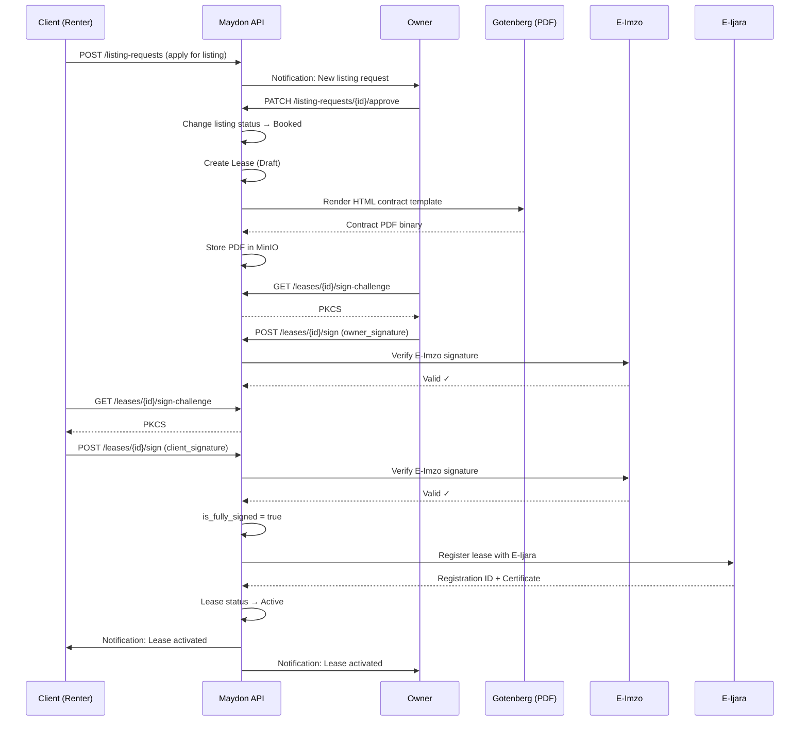
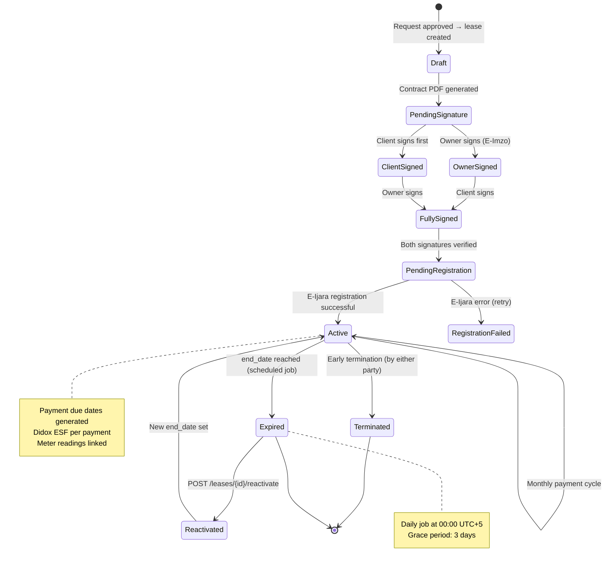
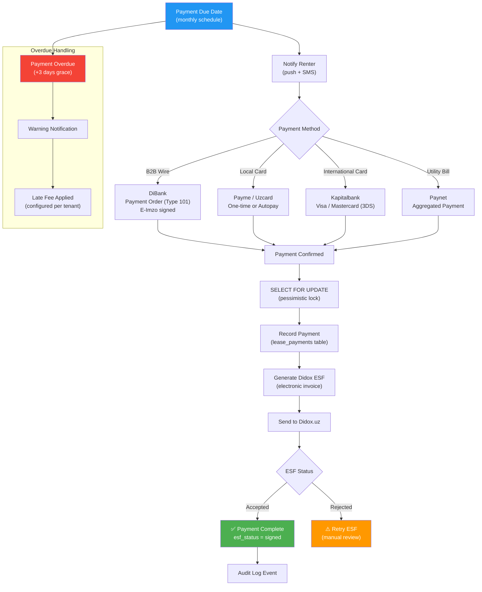
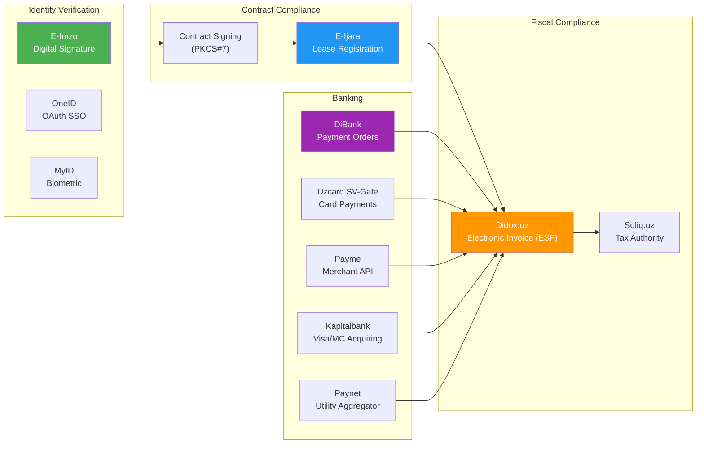
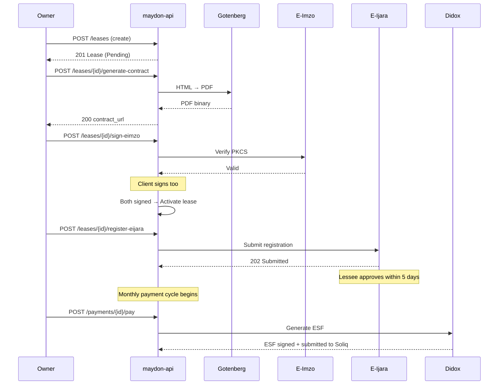

# Rental Module API

All endpoints for the rental workflow: listings, listing requests, leases, lease payments, and wishlists.

**Base path:** `/api/v1/building`  
**Auth:** All endpoints require `Authorization: Bearer {token}` unless marked `[public]`.

---

## Business Logic Flows

### Listing Request → Lease Creation



### Lease Lifecycle State Machine



### Payment + Didox ESF Pipeline



### Compliance Integration Map



---

## 1. Listings

### 1.1 List My Listings (Owner)

```
GET /listings
```

**Permission:** `listings:read`

**Query parameters:**

| Parameter | Type | Required | Description |
|-----------|------|----------|-------------|
| page | int | No | Default: 1 |
| page_size | int | No | Default: 20, max: 100 |
| status | int | No | 0=Draft, 1=Active, 2=Inactive, 3=Booked, 4=Rented, 5=Archived |
| moderation_status | int | No | |
| real_estate_id | uuid | No | |
| listing_type | int | No | 0=Rent |
| sort_by | string | No | `created_at`, `price`, `published_at` |
| sort_direction | string | No | `asc`, `desc` |

**Response 200:**

```json
{
  "success": true,
  "data": {
    "items": [
      {
        "id": "uuid",
        "title": "2-bedroom apartment in Chilanzar",
        "listing_type": 0,
        "listing_type_name": "Rent",
        "price": 500000000,
        "currency": 0,
        "currency_name": "UZS",
        "price_period": 0,
        "price_period_name": "Monthly",
        "real_estate": {
          "id": "uuid",
          "type_name": "Apartment",
          "total_area": 85.5,
          "rooms_count": 3,
          "address": "Tashkent, Chilanzar"
        },
        "images_count": 5,
        "requests_count": 3,
        "status": 1,
        "status_name": "Active",
        "moderation_status": 2,
        "moderation_status_name": "Accepted",
        "published_at": "2026-02-09T12:00:00Z",
        "created_at": "2026-02-08T10:00:00Z"
      }
    ],
    "pagination": { "page": 1, "page_size": 20, "total_items": 12, "total_pages": 1 }
  }
}
```

---

### 1.2 Browse Public Listings (Client)

```
GET /listings/public
```

**Auth:** `[public]` (no token required, but token is accepted for personalization)

**Query parameters:**

| Parameter | Type | Required | Description |
|-----------|------|----------|-------------|
| page | int | No | Default: 1 |
| page_size | int | No | Default: 20, max: 100 |
| region_id | uuid | No | |
| district_id | uuid | No | |
| real_estate_type_id | uuid | No | |
| price_min | long | No | In integer Som |
| price_max | long | No | In integer Som |
| currency | int | No | 0=UZS, 1=USD |
| area_min | number | No | Square meters |
| area_max | number | No | |
| rooms_count_min | int | No | |
| rooms_count_max | int | No | |
| amenity_ids | string | No | Comma-separated UUIDs |
| is_commercial | bool | No | |
| is_residential | bool | No | |
| latitude | number | No | Center lat for radius search |
| longitude | number | No | Center lng for radius search |
| radius_km | number | No | Radius in km (requires lat/lng) |
| sort_by | string | No | `price`, `published_at`, `area`, `distance` |
| sort_direction | string | No | `asc`, `desc` |

**Response 200:**

```json
{
  "success": true,
  "data": {
    "items": [
      {
        "id": "uuid",
        "title": "2-bedroom apartment in Chilanzar",
        "price": 500000000,
        "currency": 0,
        "currency_name": "UZS",
        "price_period": 0,
        "price_period_name": "Monthly",
        "deposit_amount": 500000000,
        "is_negotiable": true,
        "utilities_included": false,
        "real_estate": {
          "id": "uuid",
          "type": { "id": "uuid", "name": "Apartment" },
          "total_area": 85.5,
          "rooms_count": 3,
          "building": {
            "id": "uuid",
            "number": "Building A-1",
            "is_commercial": false,
            "is_residential": true
          },
          "amenities": [
            { "name": "Parking", "value": "2" },
            { "name": "Air Conditioning", "value": null }
          ]
        },
        "location": { "latitude": 41.311081, "longitude": 69.240562 },
        "address": "Tashkent, Chilanzar, 12",
        "region": { "id": "uuid", "name": "Tashkent" },
        "district": { "id": "uuid", "name": "Chilanzar" },
        "thumbnail_url": "string",
        "images_count": 5,
        "owner": {
          "company_name": "Maydon Real Estate LLC",
          "is_verified": true
        },
        "published_at": "2026-02-09T12:00:00Z",
        "is_wishlisted": false
      }
    ],
    "pagination": { "page": 1, "page_size": 20, "total_items": 85, "total_pages": 5 }
  }
}
```

**Business rules:**
- Only returns listings where `status = Active` AND `moderation_status = Accepted`
- `is_wishlisted` is populated only if the request includes a valid JWT
- `owner` shows company name, not personal details
- Distance sorting requires `latitude` and `longitude` parameters

> **Note (GET vs POST):** This endpoint uses GET because all filters are non-PII and the endpoint is public (cacheable). For complex filter combinations with >5 parameters, clients may also use `POST /listings/search` (see [03-api-standards](file:///Users/agreeing/Documents/GitHub/maydon-api/docs/03-api-standards.md)), but GET is preferred for public listing browse due to HTTP cacheability.

---

### 1.3 Get Listing Detail

```
GET /listings/{id}
```

**Auth:** `[public]`

**Response 200:**

```json
{
  "success": true,
  "data": {
    "id": "uuid",
    "title": "2-bedroom apartment in Chilanzar",
    "description": "Modern apartment with balcony...",
    "listing_type": 0,
    "listing_type_name": "Rent",
    "price": 500000000,
    "currency": 0,
    "currency_name": "UZS",
    "price_period": 0,
    "price_period_name": "Monthly",
    "deposit_amount": 500000000,
    "min_lease_months": 6,
    "max_lease_months": 24,
    "available_from": "2026-03-01",
    "is_negotiable": true,
    "utilities_included": false,
    "real_estate": {
      "id": "uuid",
      "type": { "id": "uuid", "name": "Apartment" },
      "total_area": 85.5,
      "living_area": 62.0,
      "ceiling_height": 2.7,
      "rooms_count": 3,
      "total_floors": 5,
      "floor_number": 3,
      "renovation": { "id": "uuid", "name": "Euro" },
      "building": {
        "id": "uuid",
        "number": "Building A-1",
        "is_commercial": false,
        "is_residential": true,
        "floors_count": 5
      },
      "amenities": [
        { "id": "uuid", "name": "Parking", "category": "Infrastructure", "value": "2" }
      ]
    },
    "location": { "latitude": 41.311081, "longitude": 69.240562 },
    "address": "Tashkent, Chilanzar, 12",
    "region": { "id": "uuid", "name": "Tashkent" },
    "district": { "id": "uuid", "name": "Chilanzar" },
    "images": [
      { "id": "uuid", "url": "string", "sort_order": 0, "is_plan": false }
    ],
    "owner": {
      "company_name": "Maydon Real Estate LLC",
      "is_verified": true,
      "phone_number": "+998901234567"
    },
    "status": 1,
    "status_name": "Active",
    "published_at": "2026-02-09T12:00:00Z",
    "is_wishlisted": false
  }
}
```

---

### 1.4 Create Listing

```
POST /listings
```

**Permission:** `listings:write`

**Request:**

```json
{
  "real_estate_id": "uuid, required",
  "unit_id": "uuid, optional",
  "listing_type": "int, required, 0=Rent",
  "title": "string, optional, max:200",
  "description": "string, optional, max:2000",
  "price": "long, required, min:1",
  "currency": "int, required, 0=UZS, 1=USD",
  "price_period": "int, required, 0=Monthly, 1=Daily, 2=Yearly",
  "deposit_amount": "long, optional, min:0",
  "min_lease_months": "int, optional, min:1, max:120",
  "max_lease_months": "int, optional, min:1, max:120, must be >= min_lease_months",
  "available_from": "date, optional, format:YYYY-MM-DD, must be today or future",
  "is_negotiable": "boolean, optional, default:false",
  "utilities_included": "boolean, optional, default:false"
}
```

**Response 201:** Created listing (same format as GET).

**Business rules:**
- `tenant_id` auto-set from JWT
- `status` starts as Draft (0)
- `moderation_status` starts as None (0)
- `real_estate_id` must belong to the current tenant
- Real estate must not already have an Active or Booked listing
- If `unit_id` is provided, it must belong to the specified `real_estate_id`
- Location is inherited from the real estate

**Status codes:** 201, 400, 404 (real estate not found), 409 (already has active listing), 422 (real estate not approved)

---

### 1.5 Update Listing

```
PUT /listings/{id}
```

**Permission:** `listings:write`

**Request:** Same fields as create.  
**Response 200:** Updated listing.

**Business rules:**
- Can only update if `status` is Draft or Inactive
- If Active, must pause first, then edit

---

### 1.6 Delete Listing

```
DELETE /listings/{id}
```

**Permission:** `listings:write`  
**Response 204**

**Business rules:**
- Soft delete
- Cannot delete if status is Booked or Rented (has active lease)

---

### 1.7 Submit Listing for Moderation

```
POST /listings/{id}/submit-for-moderation
```

**Permission:** `listings:write`

**Request:** empty body  
**Response 204**

**Business rules:**
- Listing must be in Draft status
- Sets `moderation_status` to InModeration (1)

---

### 1.8 Approve Listing (Admin)

```
POST /admin/listings/{id}/approve
```

**Permission:** `admin:listings:moderate`

**Request:** empty body  
**Response 204**

**Business rules:**
- Sets `moderation_status` to Accepted (2)
- Sets `status` to Active (1)
- Sets `published_at` to now
- Records `moderated_by` and `moderated_at`

---

### 1.9 Reject Listing (Admin)

```
POST /admin/listings/{id}/reject
```

**Permission:** `admin:listings:moderate`

**Request:**

```json
{
  "note": "string, required, max:1000"
}
```

**Response 204**

---

### 1.10 Pause Listing

```
POST /listings/{id}/pause
```

**Permission:** `listings:write`

**Request:** empty body  
**Response 204**

**Business rules:**
- Listing must be Active
- Sets `status` to Inactive (2)
- Listing disappears from public search but retains moderation approval

---

### 1.11 Reactivate Listing

```
POST /listings/{id}/reactivate
```

**Permission:** `listings:write`

**Request:** empty body  
**Response 204**

**Business rules:**
- Listing must be Inactive
- Sets `status` back to Active (1)
- Does not require new moderation (already approved)

---

### 1.12 Archive Listing

```
POST /listings/{id}/archive
```

**Permission:** `listings:write`

**Request:** empty body  
**Response 204**

**Business rules:**
- Sets `status` to Archived (5)
- Archived listings are hidden from all queries except admin

---

## 2. Listing Requests

### 2.1 Send Request (Client)

```
POST /listing-requests
```

**Auth:** `[authenticated]` (any role)

**Request:**

```json
{
  "listing_id": "uuid, required",
  "content": "string, required, max:1000, min:10"
}
```

**Response 201:**

```json
{
  "success": true,
  "data": {
    "id": "uuid",
    "listing_id": "uuid",
    "listing_title": "2-bedroom apartment",
    "status": 0,
    "status_name": "Sent",
    "content": "I am interested in renting...",
    "created_at": "2026-02-09T12:00:00Z"
  }
}
```

**Business rules:**
- `owner_tenant_id` set from listing's `tenant_id`
- `client_tenant_id` set from JWT `tenant_id`
- `client_user_id` set from JWT `user_id`
- Cannot send request to your own listing (owner_tenant_id must not equal client_tenant_id)
- Cannot send duplicate request to the same listing if a pending request already exists
- Listing must be Active

**Status codes:** 201, 400, 404, 409 (duplicate pending request), 422 (listing not active, or self-request)

---

### 2.2 Get My Sent Requests (Client)

```
GET /listing-requests/sent
```

**Auth:** `[authenticated]`

**Query parameters:** page, page_size, status

**Response 200:** Paginated list of requests sent by the current user/tenant. Each item includes listing summary, status, and timestamps.

---

### 2.3 Get Incoming Requests (Owner)

```
GET /listing-requests/received
```

**Permission:** `listings:read`

**Query parameters:** page, page_size, status, listing_id

**Response 200:**

```json
{
  "success": true,
  "data": {
    "items": [
      {
        "id": "uuid",
        "listing": {
          "id": "uuid",
          "title": "2-bedroom apartment"
        },
        "client": {
          "user_id": "uuid",
          "first_name": "Jasur",
          "last_name": "Toshmatov",
          "phone_number": "+998901234567",
          "company_name": "Personal"
        },
        "content": "I am interested in renting...",
        "status": 0,
        "status_name": "Sent",
        "created_at": "2026-02-09T12:00:00Z"
      }
    ],
    "pagination": { "page": 1, "page_size": 20, "total_items": 3, "total_pages": 1 }
  }
}
```

---

### 2.4 Accept Request (Owner)

```
POST /listing-requests/{id}/accept
```

**Permission:** `listings:write`

**Request:** empty body

**Response 200:**

```json
{
  "success": true,
  "data": {
    "request_id": "uuid",
    "status": "Accepted",
    "listing_status": "Booked"
  }
}
```

**Business rules:**
- Sets request status to Accepted (2)
- Sets listing status to Booked (3)
- All other pending requests for the same listing are auto-canceled
- Emits `building.listing_request.accepted` domain event (triggers notification)

---

### 2.5 Reject Request (Owner)

```
POST /listing-requests/{id}/reject
```

**Permission:** `listings:write`

**Request:**

```json
{
  "reason": "string, required, max:500"
}
```

**Response 204**

**Business rules:**
- Sets request status to Rejected (4)
- Listing status remains Active

---

### 2.6 Cancel Request (Client)

```
POST /listing-requests/{id}/cancel
```

**Auth:** `[authenticated]`

**Request:** empty body  
**Response 204**

**Business rules:**
- Only the sending client can cancel
- Cannot cancel if already accepted

---

## 3. Leases

### 3.1 Create Lease

```
POST /leases
```

**Permission:** `leases:write`

**Request:**

```json
{
  "listing_request_id": "uuid, required",
  "start_date": "date, required, format:YYYY-MM-DD, must be today or future",
  "end_date": "date, required, format:YYYY-MM-DD, must be after start_date",
  "monthly_rent": "long, required, min:1",
  "currency": "int, required, 0=UZS, 1=USD",
  "deposit_amount": "long, optional, min:0",
  "payment_day": "int, required, min:1, max:28",
  "contract_number": "string, optional, max:50",
  "notes": "string, optional, max:2000"
}
```

**Response 201:**

```json
{
  "success": true,
  "data": {
    "id": "uuid",
    "real_estate": { "id": "uuid", "address": "..." },
    "client_company": { "id": "uuid", "name": "Personal" },
    "start_date": "2026-03-01",
    "end_date": "2027-02-28",
    "monthly_rent": 500000000,
    "currency": 0,
    "currency_name": "UZS",
    "deposit_amount": 500000000,
    "payment_day": 5,
    "status": 0,
    "status_name": "Pending",
    "contract_number": "L-2026-001",
    "created_at": "2026-02-09T12:00:00Z"
  }
}
```

**Business rules:**
- `listing_request_id` must reference an Accepted request owned by the current tenant
- `tenant_id` auto-set from JWT (owner company)
- `client_tenant_id` auto-set from the listing request's `client_tenant_id`
- `real_estate_id`, `unit_id`, `listing_id` auto-set from the listing request
- `status` starts as Pending (0)
- `payment_day` max is 28 to avoid month-length issues
- Lease duration (`end_date - start_date`) must be within listing's min/max lease months if set
- `contract_number` must be unique if provided

**Status codes:** 201, 400, 404, 409 (contract number conflict), 422 (request not accepted, duration out of range)

---

### 3.2 Get Lease Detail

```
GET /leases/{id}
```

**Permission:** `leases:read`

**Response 200:**

```json
{
  "success": true,
  "data": {
    "id": "uuid",
    "real_estate": {
      "id": "uuid",
      "type_name": "Apartment",
      "address": "Tashkent, Chilanzar, 12",
      "total_area": 85.5,
      "rooms_count": 3
    },
    "unit": { "id": "uuid", "number": "A" },
    "listing": { "id": "uuid", "title": "2-bedroom apartment" },
    "owner_company": { "id": "uuid", "name": "Maydon Real Estate LLC" },
    "client_company": { "id": "uuid", "name": "Personal" },
    "client_user": {
      "id": "uuid",
      "first_name": "Jasur",
      "last_name": "Toshmatov",
      "phone_number": "+998901234567"
    },
    "start_date": "2026-03-01",
    "end_date": "2027-02-28",
    "monthly_rent": 500000000,
    "deposit_amount": 500000000,
    "currency": 0,
    "currency_name": "UZS",
    "payment_day": 5,
    "status": 1,
    "status_name": "Active",
    "contract_number": "L-2026-001",
    "contract_document_url": "string | null",
    "notes": "string | null",
    "signed_at": "2026-02-10T12:00:00Z",
    "owner_signed_at": "2026-02-10T12:00:00Z | null",
    "client_signed_at": "2026-02-10T14:00:00Z | null",
    "is_fully_signed": true,
    "eijara": {
      "registration_id": "string | null",
      "status": "registered | submitted | awaiting_lessee_approval | rejected | null",
      "registered_at": "2026-02-12T10:30:00Z | null",
      "certificate_url": "string | null"
    },
    "terminated_at": null,
    "termination_reason": null,
    "payments_summary": {
      "total_expected": 12,
      "total_paid": 3,
      "total_overdue": 0,
      "total_amount_due": 6000000000,
      "total_amount_paid": 1500000000
    },
    "created_at": "2026-02-09T12:00:00Z"
  }
}
```

---

### 3.3 List Leases (Owner)

```
GET /leases
```

**Permission:** `leases:read`

**Query parameters:** page, page_size, status, real_estate_id, client_tenant_id

**Response 200:** Paginated list of leases for the current tenant.

---

### 3.4 List My Leases (Client)

```
GET /leases/my
```

**Auth:** `[authenticated]`

**Response 200:** Paginated list of leases where `client_tenant_id = JWT.tenant_id`.

---

### 3.5 Sign Lease (Activate)

```
POST /leases/{id}/sign
```

**Permission:** `leases:write`

**Request:** empty body  
**Response 204**

**Business rules:**
- Lease must be in Pending status
- Sets `status` to Active (1)
- Sets `signed_at` to now
- Sets listing `status` to Rented (4)
- Triggers lease payment schedule generation (auto-creates LeasePayment records for the full duration)
- First payment record is the deposit (if deposit_amount is set)

---

### 3.6 Upload Contract Document

```
POST /leases/{id}/contract
Content-Type: multipart/form-data
```

**Permission:** `leases:write`

**Form fields:**
- `document`: file, required, max 10MB, types: application/pdf

**Response 200:**

```json
{
  "success": true,
  "data": {
    "contract_document_url": "string"
  }
}
```

---

### 3.7 Terminate Lease

```
POST /leases/{id}/terminate
```

**Permission:** `leases:write`

**Request:**

```json
{
  "reason": "string, required, max:500"
}
```

**Response 204**

**Business rules:**
- Lease must be Active
- Sets `status` to Inactive (2)
- Sets `terminated_at` to now
- Sets `termination_reason`
- Sets listing `status` back to Active (1)
- Remaining unpaid lease payments are canceled
- Emits `building.lease.terminated` event

---

### 3.8 Suspend Lease

```
POST /leases/{id}/suspend
```

**Permission:** `leases:write`

**Request:**

```json
{
  "reason": "string, required, max:500"
}
```

**Response 204**

**Business rules:**
- Lease must be Active
- Sets `status` to Suspended (3)
- Does not free the listing (still marked as Rented)

---

### 3.9 Revoke Lease (before signing)

```
POST /leases/{id}/revoke
```

**Permission:** `leases:write`

**Request:** empty body  
**Response 204**

**Business rules:**
- Lease must be Pending (not yet signed)
- Sets `status` to Revoked (4)
- Sets listing `status` back to Active (1)
- Listing request remains Accepted (owner can create a new lease)

---

### 3.10 Reactivate Lease

```
POST /leases/{id}/reactivate
```

**Permission:** `leases:write`

**Request:** empty body  
**Response 204**

**Business rules:**
- Lease must be Suspended (3)
- Sets `status` back to Active (1)

---

### 3.11 Expire Leases (Scheduled Job)

```
POST /admin/leases/expire
```

**Permission:** `admin:leases:manage`

**Request:** empty body (batch operation)  
**Response 200:**

```json
{
  "success": true,
  "data": {
    "expired_count": 5
  }
}
```

**Business rules:**
- Finds all Active leases where `end_date < today`
- Sets their status to Expired (5)
- Sets corresponding listing `status` back to Active (1)
- Remaining unpaid payments are canceled
- Emits `building.lease.expired` event for each (triggers notification)
- Intended to be called daily by a scheduled job (Hangfire/Quartz)

---

### 3.12 Admin: List All Leases

```
GET /admin/leases
```

**Permission:** `admin:leases:read`

**Query parameters:** page, page_size, status, tenant_id, client_tenant_id, real_estate_id, date_from, date_to

**Response 200:** Paginated list of all leases across all tenants.

---

### 3.13 Admin: Override Lease Status

```
POST /admin/leases/{id}/status
```

**Permission:** `admin:leases:manage`

**Request:**

```json
{
  "status": "int, required, 0-5",
  "reason": "string, required, max:500"
}
```

**Response 204**

**Business rules:**
- Admin override — bypasses normal transition rules
- Records audit trail (`admin_note`, `moderated_by`, `moderated_at`)
- Updates listing status if needed

---

## 4. Lease Payments

### 4.1 Get Payments for Lease

```
GET /leases/{leaseId}/payments
```

**Permission:** `leases:read`

**Response 200:**

```json
{
  "success": true,
  "data": {
    "items": [
      {
        "id": "uuid",
        "amount": 500000000,
        "currency": 0,
        "currency_name": "UZS",
        "due_date": "2026-03-05",
        "paid_date": "2026-03-04",
        "payment_method": 1,
        "payment_method_name": "Card",
        "status": 1,
        "status_name": "Paid",
        "didox_document_id": "string | null",
        "esf_number": "ESF-2026-0001234 | null",
        "esf_status": "signed | pending | failed | null",
        "esf_signed_at": "2026-03-04T12:30:00Z | null",
        "mxik_code": "06310.100 | null"
      },
      {
        "id": "uuid",
        "amount": 500000000,
        "currency": 0,
        "currency_name": "UZS",
        "due_date": "2026-04-05",
        "paid_date": null,
        "payment_method": null,
        "status": 0,
        "status_name": "Pending"
      }
    ]
  }
}
```

---

### 4.2 Mark Payment as Paid

```
POST /leases/{leaseId}/payments/{paymentId}/pay
```

**Permission:** `leases:write`

**Request:**

```json
{
  "paid_date": "date, required, format:YYYY-MM-DD",
  "payment_method": "int, required, 0=BankTransfer, 1=Card, 2=Cash",
  "external_id": "string, optional, max:200",
  "receipt_number": "string, optional, max:100",
  "notes": "string, optional, max:500"
}
```

**Response 204**

**Business rules:**
- Payment must be Pending or Overdue
- Sets `status` to Paid (1)
- Emits `building.lease_payment.paid` event

---

### 4.3 Mark Payment as Overdue (System/Admin)

```
POST /admin/lease-payments/mark-overdue
```

**Permission:** `admin:leases:manage`

**Request:** empty body (batch operation)  
**Response 200:**

```json
{
  "success": true,
  "data": {
    "updated_count": 15
  }
}
```

**Business rules:**
- Finds all Pending payments where `due_date < today`
- Sets their status to Overdue (2)
- Emits `building.lease_payment.overdue` event for each (triggers notification)
- Intended to be called by a scheduled job (Hangfire/Quartz)

---

## 5. Wishlists

### 5.1 Get My Wishlist

```
GET /wishlists
```

**Auth:** `[authenticated]`

**Query parameters:** page, page_size

**Response 200:** Paginated list of wishlisted listings with listing summary data.

---

### 5.2 Add to Wishlist

```
POST /wishlists
```

**Auth:** `[authenticated]`

**Request:**

```json
{
  "listing_id": "uuid, required"
}
```

**Response 201:**

```json
{
  "success": true,
  "data": {
    "id": "uuid",
    "listing_id": "uuid"
  }
}
```

**Business rules:**
- Cannot wishlist your own listing
- Listing must be Active
- Duplicate check: one per user per listing

**Status codes:** 201, 404, 409 (already wishlisted)

---

### 5.3 Remove from Wishlist

```
DELETE /wishlists/{id}
```

**Auth:** `[authenticated]`  
**Response 204**

---

### 5.4 Remove from Wishlist by Listing ID

```
DELETE /wishlists/by-listing/{listingId}
```

**Auth:** `[authenticated]`  
**Response 204**

Convenience endpoint for the mobile app where the client knows the `listing_id` but not the wishlist record `id`.

---

## 6. Contract PDF Generation (Gotenberg)

### 6.1 Generate Contract PDF

```
POST /leases/{id}/generate-contract
```

**Permission:** `leases:write`

**Request:** empty body

**Response 200:**

```json
{
  "success": true,
  "data": {
    "contract_document_url": "string",
    "contract_number": "L-2026-001",
    "generated_at": "2026-02-09T12:00:00Z"
  }
}
```

**Workflow:**

1. Backend loads lease + related entities (owner company, client company, real estate, building)
2. Renders an HTML lease contract template with all fields (parties, property, terms, payment schedule)
3. Sends HTML + CSS + fonts to Gotenberg via `POST /forms/chromium/convert/html`
4. Gotenberg returns PDF binary stream
5. PDF stored in MinIO: `{bucket}/{tenant_id}/contracts/{lease_id}/{uuid}.pdf`
6. `contract_document_id` updated on the lease record
7. Optional: convert to PDF/A-3b for long-term archival via `/forms/pdfengines/convert`

**Contract template data sources:**

| Field | Source |
|-------|--------|
| Lessor name, INN, MFO, bank_account, OKED, legal_address | `companies` (owner tenant) |
| Lessee name, INN, bank_account | `companies` (client tenant) |
| Lessor signatory PINFL, passport | `users` (owner) |
| Lessee signatory PINFL, passport | `users` (client) |
| Property address, cadastral_number, total_area | `buildings`, `real_estates` |
| Rent amount, deposit, payment day, duration | `leases` |

**Mandatory contract clauses (Uzbek Civil Code):**

1. Property identification (address, cadastral number, area)
2. Lease term (start date, end date)
3. Rent amount and payment schedule
4. Deposit terms and return conditions
5. Rights and obligations of parties
6. Maintenance and repairs responsibility
7. Termination conditions
8. Force majeure clause
9. Dispute resolution (Uzbekistan courts)
10. Signatures and dates

**Business rules:**
- Lease must be in Pending or Active status
- All required company fields (`tin`, `mfo`, `bank_account`, `legal_address`) must be filled for both parties
- If missing fields → return `422` with specific error listing missing fields
- Lease agreements for real estate >1 year require state registration (E-Ijara)

---

### 6.2 Download Contract PDF

```
GET /leases/{id}/contract
```

**Permission:** `leases:read`

**Response:** Binary PDF stream (authenticated, no presigned URL)

```
Content-Type: application/pdf
Content-Disposition: attachment; filename="lease-contract-{contract_number}.pdf"
```

**Business rules:**
- Streams directly from MinIO — never buffers the entire file in memory
- Returns `404` if `contract_document_id` is null (contract not yet generated)

---

## 7. Uzbekistan Compliance Integrations

### 7.1 E-Ijara — Lease Registration

E-Ijara (e-ijara.soliq.uz) is the mandatory electronic lease registration system in Uzbekistan. All lease agreements must be registered within **3 business days** of contract signing.

```
POST /leases/{id}/register-eijara
```

**Permission:** `leases:write`

**Request:** empty body (all data pulled from the lease record)

**Response 202:**

```json
{
  "success": true,
  "data": {
    "eijara_registration_id": "string",
    "status": "submitted",
    "submitted_at": "2026-02-09T12:00:00Z",
    "lessee_approval_deadline": "2026-02-14T23:59:59Z"
  }
}
```

**E-Ijara workflow:**

```
1. Lessor initiates registration → E-Ijara creates record (status: Submitted)
2. Lessee has 5 business days to approve via E-Ijara portal
3. After lessee approval → E-Ijara registers the lease (status: Registered)
4. QR-coded registration certificate is generated
5. Automatic notification to cadastral and tax authorities
```

**Data submitted to E-Ijara:**

| Field | Source | Required |
|-------|--------|----------|
| Lessor INN (STIR) | `companies.tin` | YES |
| Lessor PINFL | `users.pinfl` | YES |
| Lessee INN | `companies.tin` (client) | YES |
| Lessee PINFL | `users.pinfl` (client) | YES |
| Cadastral number | `buildings.cadastral_number` or `real_estates.cadastral_number` | YES |
| Property address | `real_estates.address` | YES |
| Lease start/end dates | `leases.start_date`, `leases.end_date` | YES |
| Monthly rent (Som) | `leases.monthly_rent` | YES |
| OKED | `companies.oked` | YES |

**Business rules:**
- Lease must be Active (signed)
- Both parties must have `pinfl` and `tin` filled
- Building/real estate must have `cadastral_number`
- Lessor company must have `oked`
- Returns `422` with specific missing fields if validation fails
- Registration is async — response is `202 Accepted`, status polled via callback

### 7.2 Check E-Ijara Status

```
GET /leases/{id}/eijara-status
```

**Permission:** `leases:read`

**Response 200:**

```json
{
  "success": true,
  "data": {
    "eijara_registration_id": "string",
    "status": "registered",
    "registered_at": "2026-02-12T10:30:00Z",
    "certificate_url": "string",
    "qr_code_url": "string"
  }
}
```

**Statuses:** `submitted`, `awaiting_lessee_approval`, `registered`, `rejected`, `expired`

---

### 7.3 Didox — ESF Invoice Generation

Didox (didox.uz) handles electronic fiscal invoices (ESF). When a lease payment is marked as paid, the system generates an ESF and submits it to Soliq (tax authority).

```
POST /leases/{leaseId}/payments/{paymentId}/generate-esf
```

**Permission:** `leases:write`

**Request:** empty body

**Response 201:**

```json
{
  "success": true,
  "data": {
    "didox_document_id": "string",
    "esf_number": "ESF-2026-0001234",
    "status": "signed",
    "mxik_code": "06310.100",
    "generated_at": "2026-02-09T12:00:00Z"
  }
}
```

**Didox integration flow:**

```
1. Payment marked as Paid → triggers ESF generation
2. System calls Didox API: POST /v1/documents/create
3. Lessor's E-Imzo EDS signs the ESF
4. Didox submits signed ESF to Soliq.uz
5. `didox_document_id` stored in `lease_payments.didox_document_id`
6. ESF number stored in `lease_payments.esf_number`
7. ESF status stored in `lease_payments.esf_status`
```

**MXIK code:** `06310.100` (Real estate rental services)

**ESF data fields:**

| Field | Source |
|-------|--------|
| Seller INN | `companies.tin` (lessor) |
| Buyer INN | `companies.tin` (lessee) |
| MXIK | `06310.100` (rental) |
| Amount | `lease_payments.amount` |
| Currency | UZS |
| Payment date | `lease_payments.paid_date` |

**Business rules:**
- Payment must be in Paid status
- ESF is mandatory for all B2B lease payments
- `external_id` must be null (no duplicate ESF)
- Both parties must have valid INN

### 7.4 Auto-ESF on Payment

When payment is marked paid (via 4.2 endpoint), the system automatically triggers ESF generation if:
- Both parties are legal entities (have INN)
- Payment method is BankTransfer (0) or Card (1) — Cash payments generate manual ESF

---

### 7.5 E-Imzo — Contract Digital Signing

After contract PDF generation, both parties can digitally sign the contract using E-Imzo (EDS).

#### 7.5a Get Signing Challenge

```
GET /leases/{id}/sign-challenge
```

**Permission:** `leases:read`

**Response 200:**

```json
{
  "success": true,
  "data": {
    "challenge": "string, server-issued nonce (UUID)",
    "document_hash": "string, SHA-256 hex hash of contract PDF",
    "expires_in": 300
  }
}
```

**Business rules:**
- Contract PDF must be generated first (`contract_document_id` must not be null)
- Challenge expires after 5 minutes
- New challenge invalidates the previous one

---

#### 7.5b Sign Contract with E-Imzo

```
POST /leases/{id}/sign-eimzo
```

**Permission:** `leases:write`

**Request:**

```json
{
  "certificate": "string, required, base64 X.509 certificate",
  "signature": "string, required, base64 PKCS#7 detached signature over contract PDF hash",
  "challenge": "string, required, server-issued nonce"
}
```

**Response 200:**

```json
{
  "success": true,
  "data": {
    "signer": "Toshmatov Jasur Karimovich",
    "signed_at": "2026-02-09T12:00:00Z",
    "is_fully_signed": false,
    "remaining_signers": ["Client"]
  }
}
```

**Signing workflow:**

```
1. Client requests signing challenge: GET /leases/{id}/sign-challenge
   → Server generates nonce + SHA-256 hash of contract PDF

2. Client's E-Imzo browser plugin (CAPIWS) signs the hash using PKCS#7
   → Returns base64 certificate + signature

3. Backend verifies signature:
   a. Validate certificate chain (GNC Uzbekistan trust center)
   b. Verify PKCS#7 signature against contract PDF hash
   c. Check certificate validity (not expired, not revoked — OCSP)
   d. Extract signer PINFL from certificate → match against user record

4. Store signature in MinIO alongside contract PDF

5. When both parties signed → is_fully_signed = true
   → Lease status transitions to Active
   → E-Ijara registration can proceed
```

**Business rules:**
- Contract PDF must be generated first (6.1)
- Signer's PINFL from certificate must match the signer's `users.pinfl`
- Each party signs once (owner's authorized signatory + client's signatory)
- Once both signed, contract is immutable — no further edits to lease terms

---

## 8. State Machine Reference

### Listing Status Transitions

```
Draft(0) → [submit-for-moderation] → Draft(0) + moderation_status=InModeration
  InModeration → [admin:approve] → Active(1) + moderation_status=Accepted
  InModeration → [admin:reject]  → Draft(0) + moderation_status=Rejected

Active(1)  → [pause]     → Inactive(2)
Active(1)  → [archive]   → Archived(5)
Active(1)  → [request accepted] → Booked(3)
Inactive(2) → [reactivate] → Active(1)
Booked(3)  → [lease signed]  → Rented(4)
Booked(3)  → [lease revoked] → Active(1)
Rented(4)  → [lease terminated/expired] → Active(1)
```

### Listing Request Status Transitions

```
Sent(0) → [owner views]   → Received(1)
Sent(0) → [client cancels] → Canceled(3)
Received(1) → [owner accepts] → Accepted(2)
Received(1) → [owner rejects] → Rejected(4)
Received(1) → [client cancels] → Canceled(3)
```

### Lease Status Transitions

```
Pending(0)   → [generate-contract] → Pending(0) + contract PDF generated
Pending(0)   → [sign-eimzo (both)] → Active(1) + E-Ijara registration triggered
Pending(0)   → [sign (manual)]     → Active(1)
Pending(0)   → [revoke]            → Revoked(4)
Active(1)    → [register-eijara]   → Active(1) + E-Ijara submitted
Active(1)    → [terminate]         → Inactive(2)
Active(1)    → [suspend]           → Suspended(3)
Active(1)    → [expire]            → Expired(5)
Suspended(3) → [reactivate]        → Active(1)
```

### Lease Payment Status Transitions

```
Pending(0) → [pay]       → Paid(1) + auto-ESF via Didox
Pending(0) → [overdue]   → Overdue(2)
Overdue(2) → [pay]       → Paid(1) + auto-ESF via Didox
Pending(0) → [cancel]    → Canceled(4) (when lease terminated)
```

### Compliance Integration Sequence


