# Metering Module API

All endpoints for utility meter management, meter readings, and tariff configuration.

**Base path:** `/api/v1/building`  
**Auth:** All endpoints require `Authorization: Bearer {token}`.

---

## Business Logic Flows

### Meter Reading & Billing Flow

```mermaid
sequenceDiagram
    participant O as Owner / Agent
    participant API as Maydon API
    participant DB as Database
    participant BILL as Billing Engine
    participant N as Notification Service

    O->>API: POST /meter-readings (current_value, photo)
    API->>API: Validate: current ≥ previous
    API->>API: Validate: not backdated >3 days
    API->>DB: Store meter reading

    API->>BILL: Calculate consumption
    BILL->>DB: Get previous reading
    BILL->>DB: Get active tariff
    BILL->>BILL: consumption = current - previous
    BILL->>BILL: amount = consumption × tariff_rate
    BILL->>DB: Create utility charge

    BILL->>N: Notify renter: utility bill generated
    N-->>O: Confirmation: reading accepted
```



### Utility Billing Pipeline

```mermaid
flowchart TD
    READ["Meter Reading<br/>(current value + photo)"] --> VALIDATE{"Validation"}
    VALIDATE -->|"current < previous"| REJECT["❌ Rejected<br/>anomaly flag"]
    VALIDATE -->|"valid"| CALC["Calculate Consumption<br/>(current - previous)"]

    CALC --> TARIFF["Lookup Active Tariff<br/>(per meter type + tenant)"]
    TARIFF --> CHARGE["Generate Charge<br/>(consumption × rate)"]

    CHARGE --> LINK{"Linked to Lease?"}
    LINK -->|"Yes"| ADD_PAY["Add to Next<br/>Lease Payment"]
    LINK -->|"No"| STANDALONE["Standalone<br/>Utility Invoice"]

    ADD_PAY --> PAYNET["Pay via Paynet<br/>(utility aggregator)"]
    STANDALONE --> PAYNET
    PAYNET --> NOTIFY["Notify Renter"]

    subgraph "Tariff Tiers"
        T1["Tier 1: 0-100 kWh<br/>base rate"]
        T2["Tier 2: 101-300 kWh<br/>1.5× rate"]
        T3["Tier 3: 300+ kWh<br/>2× rate"]
    end

    TARIFF --> T1
    TARIFF --> T2
    TARIFF --> T3

    style READ fill:#2196F3,color:#fff
    style CHARGE fill:#4CAF50,color:#fff
    style REJECT fill:#F44336,color:#fff
```



### Meter Scope Hierarchy

```mermaid
flowchart TD
    BLDG_METER["Building Meter<br/>(scope: 0)"] --> BLDG["Building<br/>(whole building consumption)"]

    RE_METER["Real Estate Meter<br/>(scope: 1)"] --> RE["Real Estate<br/>(apartment-level)"]

    ROOM_METER["Room Meter<br/>(scope: 2)"] --> ROOM["Room<br/>(individual room)"]

    UNIT_METER["Unit Meter<br/>(scope: 3)"] --> UNIT["Unit<br/>(sub-room unit)"]

    subgraph "Meter Types"
        ELEC["⚡ Electricity"]
        WATER["💧 Water (hot/cold)"]
        GAS["🔥 Gas"]
        HEAT["🌡️ Heating"]
    end

    style BLDG_METER fill:#3F51B5,color:#fff
    style RE_METER fill:#009688,color:#fff
    style ROOM_METER fill:#FF9800,color:#fff
    style UNIT_METER fill:#9C27B0,color:#fff
```



---

## 1. Meters

### 1.1 List Meters

```
GET /meters
```

**Permission:** `meters:read`

**Query parameters:**

| Parameter | Type | Required | Description |
|-----------|------|----------|-------------|
| page | int | No | Default: 1 |
| page_size | int | No | Default: 20, max: 100 |
| meter_type_id | uuid | No | Filter by meter type (electricity, water, gas, etc.) |
| scope | int | No | 0=Building, 1=RealEstate, 2=Room, 3=Unit |
| scope_id | uuid | No | Filter by specific building, room, or unit |
| is_active | bool | No | Default: true |

**Response 200:**

```json
{
  "success": true,
  "data": {
    "items": [
      {
        "id": "uuid",
        "meter_type": { "id": "uuid", "name": "Electricity" },
        "scope": 1,
        "scope_name": "RealEstate",
        "scope_entity": {
          "id": "uuid",
          "name": "Apartment 42, Building A-1"
        },
        "serial_number": "EL-2024-00142",
        "name": "Main electricity meter",
        "is_active": true,
        "last_reading": {
          "current_value": 12450.500,
          "reading_date": "2026-02-01"
        },
        "installation_date": "2024-06-15",
        "created_at": "2024-06-15T10:00:00Z"
      }
    ],
    "pagination": { "page": 1, "page_size": 20, "total_items": 8, "total_pages": 1 }
  }
}
```

---

### 1.2 Get Meter Detail

```
GET /meters/{id}
```

**Permission:** `meters:read`

**Response 200:**

```json
{
  "success": true,
  "data": {
    "id": "uuid",
    "meter_type": { "id": "uuid", "name": "Electricity" },
    "scope": 1,
    "scope_name": "RealEstate",
    "scope_entity": {
      "id": "uuid",
      "type": "RealEstate",
      "name": "Apartment 42",
      "building_name": "Building A-1",
      "address": "Tashkent, Chilanzar, 12"
    },
    "serial_number": "EL-2024-00142",
    "name": "Main electricity meter",
    "installation_date": "2024-06-15",
    "last_verified_date": "2026-01-15",
    "is_active": true,
    "current_tariff": {
      "id": "uuid",
      "rate_per_unit": 680.00,
      "currency": 0,
      "currency_name": "UZS",
      "effective_from": "2026-01-01",
      "effective_until": null
    },
    "readings_count": 24,
    "last_reading": {
      "id": "uuid",
      "current_value": 12450.500,
      "previous_value": 12100.000,
      "consumption": 350.500,
      "reading_date": "2026-02-01",
      "recorded_by": { "id": "uuid", "first_name": "Jasur", "last_name": "T." }
    },
    "created_at": "2024-06-15T10:00:00Z"
  }
}
```

---

### 1.3 Create Meter

```
POST /meters
```

**Permission:** `meters:write`

**Request:**

```json
{
  "meter_type_id": "uuid, required",
  "scope": "int, required, 0=Building, 1=RealEstate, 2=Room, 3=Unit",
  "scope_id": "uuid, required, ID of the building/real_estate/room/unit",
  "serial_number": "string, optional, max:100",
  "name": "string, optional, max:200",
  "installation_date": "date, optional, format:YYYY-MM-DD"
}
```

**Response 201:** Created meter (same format as GET).

**Business rules:**
- `tenant_id` auto-set from JWT
- `scope_id` must reference an entity that belongs to the current tenant
- Scope validation:
  - scope=0: `scope_id` must be a valid `buildings.id`
  - scope=1: `scope_id` must be a valid `real_estates.id`
  - scope=2: `scope_id` must be a valid `rooms.id`
  - scope=3: `scope_id` must be a valid `units.id`
- `meter_type_id` must exist in `meter_types` table

**Status codes:** 201, 400, 404 (scope entity or meter type not found)

---

### 1.4 Update Meter

```
PUT /meters/{id}
```

**Permission:** `meters:write`

**Request:**

```json
{
  "serial_number": "string, optional, max:100",
  "name": "string, optional, max:200",
  "installation_date": "date, optional",
  "last_verified_date": "date, optional"
}
```

**Response 200:** Updated meter.

**Business rules:**
- Cannot change `meter_type_id`, `scope`, or `scope_id` after creation (delete and recreate)
- Cannot update meters belonging to a different tenant

---

### 1.5 Deactivate Meter

```
POST /meters/{id}/deactivate
```

**Permission:** `meters:write`

**Request:** empty body  
**Response 204**

**Business rules:**
- Sets `is_active = false`
- Meter remains in database (historical readings preserved)
- Deactivated meters are excluded from reading submission forms

---

### 1.6 Reactivate Meter

```
POST /meters/{id}/reactivate
```

**Permission:** `meters:write`

**Request:** empty body  
**Response 204**

---

### 1.7 Delete Meter

```
DELETE /meters/{id}
```

**Permission:** `meters:write`  
**Response 204**

**Business rules:**
- Soft delete
- Cannot delete if meter has readings (deactivate instead)

**Status codes:** 204, 404, 422 (has readings)

---

## 1b. Meter Seals (Plomba) & Renovation

> In Uzbekistan, utility meters are certified by state inspection bodies. Each meter has a tamper-evident **seal (plomba)** applied during installation or verification. Breaking the seal without authorization is a violation. Renovations (meter replacement, calibration) require seal break → work → new seal.

### 1b.1 Get Meter Seal History

```
GET /meters/{id}/seals
```

**Permission:** `meters:read`

**Response 200:**

```json
{
  "success": true,
  "data": {
    "items": [
      {
        "id": "uuid",
        "seal_number": "PLM-2026-00142",
        "seal_type": "installation",
        "sealed_at": "2026-01-15T10:00:00Z",
        "sealed_by": { "id": "uuid", "first_name": "Jasur", "last_name": "T." },
        "expires_at": "2028-01-15",
        "is_active": true,
        "break_reason": null,
        "broken_at": null,
        "broken_by": null,
        "photo_url": "https://minio.maydon.uz/.../seal_plm2026.webp",
        "inspection_certificate_url": "https://minio.maydon.uz/.../cert.pdf"
      }
    ]
  }
}
```

**Seal types:**

| Value | Name | Description |
|-------|------|-------------|
| `installation` | First Installation | New meter installed, first seal applied |
| `verification` | Periodic Verification | State re-inspection (typically every 4-6 years) |
| `renovation` | Post-Renovation | New seal after meter replacement or repair |
| `recalibration` | Calibration | Seal applied after meter calibration |

---

### 1b.2 Apply Seal (After Installation or Renovation)

```
POST /meters/{id}/seals
Content-Type: multipart/form-data
```

**Permission:** `meters:write`

**Form fields:**

| Field | Type | Required | Validation |
|-------|------|----------|------------|
| seal_number | string | Yes | max:50, unique per tenant |
| seal_type | string | Yes | `installation`, `verification`, `renovation`, `recalibration` |
| sealed_at | datetime | Yes | Cannot be in the future |
| expires_at | date | No | Seal expiration (state sets this, typically 4-6 years) |
| photo | file | Yes | max 10MB, image (photo of physical seal on meter) |
| certificate | file | No | max 10MB, PDF (inspection/calibration certificate) |

**Response 201:** Created seal record.

**Business rules:**
- Only one active seal per meter at a time
- If a previous active seal exists, it is automatically marked as broken (`break_reason = "replaced"`)
- Seal photo is required for audit trail
- Certificate (inspection act / "dalolatnoma") is optional but recommended

---

### 1b.3 Break Seal (Before Renovation)

```
POST /meters/{id}/seals/{sealId}/break
```

**Permission:** `meters:write`

**Request:**

```json
{
  "break_reason": "string, required, max:500",
  "broken_at": "datetime, required",
  "notes": "string, optional, max:1000"
}
```

**Response 200:** Updated seal record with `is_active = false`.

**Break reasons (standard):**

| Reason | Description |
|--------|-------------|
| `renovation` | Meter being replaced or repaired |
| `recalibration` | Meter sent for calibration |
| `malfunction` | Meter malfunction detected |
| `tamper_detected` | Unauthorized tampering |
| `expired` | Seal validity period expired |
| `relocation` | Meter moved to different location |

**Business rules:**
- Breaking a seal creates an audit log event
- If reason is `tamper_detected`, an alert notification is sent to the tenant admin
- Meter readings are frozen (cannot submit new readings) until a new seal is applied
- All break events are visible in tenant audit log

---

### 1b.4 Renovate Meter (Replace + Reset Readings)

```
POST /meters/{id}/renovate
Content-Type: multipart/form-data
```

**Permission:** `meters:write`

**Form fields:**

| Field | Type | Required | Validation |
|-------|------|----------|------------|
| final_reading | decimal | Yes | Must be ≥ last recorded reading |
| new_serial_number | string | No | max:100 (if meter replaced, not repaired) |
| new_installation_date | date | Yes | Date of new meter installation |
| renovation_type | string | Yes | `replacement`, `repair`, `upgrade` |
| renovation_notes | string | No | max:1000 |
| seal_number | string | Yes | New seal number for renovated meter |
| seal_photo | file | Yes | Photo of new seal on meter |
| certificate | file | No | Renovation certificate PDF |
| act_of_completion | file | No | "Bajarilgan ishlar dalolatnomasi" (completion act) PDF |

**Response 200:**

```json
{
  "success": true,
  "data": {
    "meter": {
      "id": "uuid",
      "serial_number": "EL-2026-00200",
      "installation_date": "2026-02-09",
      "is_active": true,
      "last_reading": {
        "current_value": 0.000,
        "reading_date": "2026-02-09"
      }
    },
    "final_reading": {
      "type": "final",
      "value": 25000.500,
      "reading_date": "2026-02-09"
    },
    "old_seal": {
      "id": "uuid",
      "seal_number": "PLM-2024-00100",
      "is_active": false,
      "break_reason": "renovation"
    },
    "new_seal": {
      "id": "uuid",
      "seal_number": "PLM-2026-00200",
      "is_active": true
    }
  }
}
```

**Business rules:**
- Records a **final reading** on the old meter (closing reading before renovation)
- Breaks the existing seal with reason `renovation`
- If `new_serial_number` is provided, updates the meter's serial number
- Resets the reading baseline to `0` (new meter starts from zero)
- Creates a new seal record (`seal_type = "renovation"`)
- All renovation data (final reading, old seal, new seal) is atomically recorded in a single transaction
- Generates an audit log event with full before/after state

### Renovation Flow Diagram


---

## 2. Meter Readings

### 2.1 Get Readings for Meter

```
GET /meters/{meterId}/readings
```

**Permission:** `meters:read`

**Query parameters:**

| Parameter | Type | Required | Description |
|-----------|------|----------|-------------|
| page | int | No | Default: 1 |
| page_size | int | No | Default: 20 |
| date_from | date | No | Filter by reading_date |
| date_to | date | No | |
| sort_direction | string | No | Default: `desc` (latest first) |

**Response 200:**

```json
{
  "success": true,
  "data": {
    "items": [
      {
        "id": "uuid",
        "previous_value": 12100.000,
        "current_value": 12450.500,
        "consumption": 350.500,
        "reading_date": "2026-02-01",
        "recorded_by": {
          "id": "uuid",
          "first_name": "Jasur",
          "last_name": "Toshmatov"
        },
        "photo_url": "string | null",
        "created_at": "2026-02-01T09:30:00Z"
      }
    ],
    "pagination": { "page": 1, "page_size": 20, "total_items": 24, "total_pages": 2 }
  }
}
```

---

### 2.2 Submit Meter Reading

```
POST /meters/{meterId}/readings
Content-Type: multipart/form-data
```

**Permission:** `meters:write` (or `[authenticated]` if tenant allows client submission)

**Form fields:**

| Field | Type | Required | Validation |
|-------|------|----------|------------|
| current_value | number | Yes | min:0, max:999999999.999, precision:3 |
| reading_date | date | Yes | format:YYYY-MM-DD, must be today or past, must be after last reading date |
| photo | file | No | max 5MB, types: image/jpeg, image/png, image/webp |

**Response 201:**

```json
{
  "success": true,
  "data": {
    "id": "uuid",
    "previous_value": 12100.000,
    "current_value": 12450.500,
    "consumption": 350.500,
    "reading_date": "2026-02-01",
    "cost": {
      "consumption": 350.500,
      "rate_per_unit": 680.00,
      "total": 238340.00,
      "currency": 0,
      "currency_name": "UZS"
    },
    "photo_url": "string | null",
    "created_at": "2026-02-01T09:30:00Z"
  }
}
```

**Business rules:**
- `previous_value` is auto-populated from the last reading for this meter (0 if first reading)
- `consumption` is auto-calculated: `current_value - previous_value`
- `current_value` must be greater than or equal to `previous_value` (meter cannot go backward)
- If an active tariff exists, the response includes a `cost` calculation
- `recorded_by` is auto-set from JWT `user_id`
- Photo is uploaded to MinIO; key stored in `photo_object_name`
- Emits `building.meter_reading.submitted` event

**Status codes:** 201, 400, 404 (meter not found), 422 (value less than previous, future date)

---

### 2.3 Delete Reading (Admin or Owner)

```
DELETE /meters/{meterId}/readings/{id}
```

**Permission:** `meters:write`  
**Response 204**

**Business rules:**
- Only the most recent reading can be deleted (to maintain sequential integrity)
- Deletes photo from MinIO if present
- Soft delete

**Status codes:** 204, 404, 422 (not the most recent reading)

---

## 3. Meter Tariffs

### 3.1 List Tariffs for Meter

```
GET /meters/{meterId}/tariffs
```

**Permission:** `meters:read`

**Response 200:**

```json
{
  "success": true,
  "data": {
    "items": [
      {
        "id": "uuid",
        "rate_per_unit": 680.00,
        "currency": 0,
        "currency_name": "UZS",
        "effective_from": "2026-01-01",
        "effective_until": null,
        "is_active": true,
        "created_at": "2025-12-28T10:00:00Z"
      },
      {
        "id": "uuid",
        "rate_per_unit": 550.00,
        "currency": 0,
        "currency_name": "UZS",
        "effective_from": "2025-01-01",
        "effective_until": "2025-12-31",
        "is_active": false,
        "created_at": "2024-12-28T10:00:00Z"
      }
    ]
  }
}
```

---

### 3.2 Create Tariff

```
POST /meters/{meterId}/tariffs
```

**Permission:** `meters:write`

**Request:**

```json
{
  "rate_per_unit": "number, required, min:0.01, max:9999999.99, precision:2",
  "currency": "int, required, 0=UZS, 1=USD",
  "effective_from": "date, required, format:YYYY-MM-DD",
  "effective_until": "date, optional, format:YYYY-MM-DD, must be after effective_from"
}
```

**Response 201:** Created tariff.

**Business rules:**
- `tenant_id` auto-set from JWT
- If there is an existing active tariff with no `effective_until`, the system auto-sets its `effective_until` to `effective_from - 1 day`
- Date ranges must not overlap with existing tariffs for the same meter
- `is_active` is calculated: active if `effective_from <= today AND (effective_until IS NULL OR effective_until >= today)`

**Status codes:** 201, 400, 404, 409 (overlapping date range)

---

### 3.3 Update Tariff

```
PUT /meters/{meterId}/tariffs/{id}
```

**Permission:** `meters:write`

**Request:** Same as create.  
**Response 200:** Updated tariff.

**Business rules:**
- Cannot update if tariff period is in the past (already used for cost calculations)

---

### 3.4 Delete Tariff

```
DELETE /meters/{meterId}/tariffs/{id}
```

**Permission:** `meters:write`  
**Response 204**

**Business rules:**
- Cannot delete if any meter readings reference this tariff period for cost calculations
- If deleting the latest tariff, restore previous tariff's `effective_until` to null

---

## 4. Meter Types (Reference Data)

```
GET    /reference/meter-types                    [public]
POST   /admin/reference/meter-types              [admin:reference:write]
PUT    /admin/reference/meter-types/{id}         [admin:reference:write]
DELETE /admin/reference/meter-types/{id}         [admin:reference:write]
```

**Create/Update request:**

```json
{
  "unit": "string, required, max:20, e.g. 'kWh', 'm3', 'Gcal'",
  "is_active": "boolean, required",
  "translations": [
    { "language_code": "uz", "name": "string, required, max:200" },
    { "language_code": "ru", "name": "string, required, max:200" }
  ]
}
```

**GET response includes:**

```json
{
  "id": "uuid",
  "name": "Electricity",
  "unit": "kWh",
  "is_active": true
}
```

---

## 5. Cost Calculation Logic

When a meter reading is submitted, the cost is calculated if an active tariff exists:

```
1. Find the active tariff for the meter on the reading_date:
   SELECT * FROM meter_tariffs
   WHERE meter_id = {meterId}
     AND effective_from <= {reading_date}
     AND (effective_until IS NULL OR effective_until >= {reading_date})
     AND is_active = true
   LIMIT 1

2. Calculate:
   consumption = current_value - previous_value
   cost = consumption * tariff.rate_per_unit

3. Return in response (not stored; computed on read):
   {
     "consumption": 350.500,
     "rate_per_unit": 680.00,
     "total": 238340.00,
     "currency": "UZS"
   }
```

Cost is computed dynamically, not stored. If a tariff is updated retroactively, historical cost calculations reflect the new rate.
