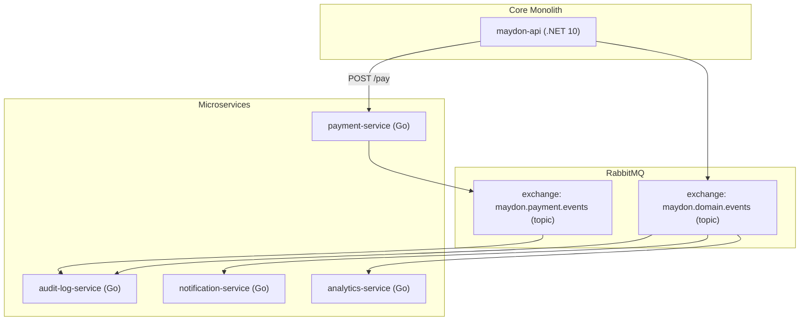
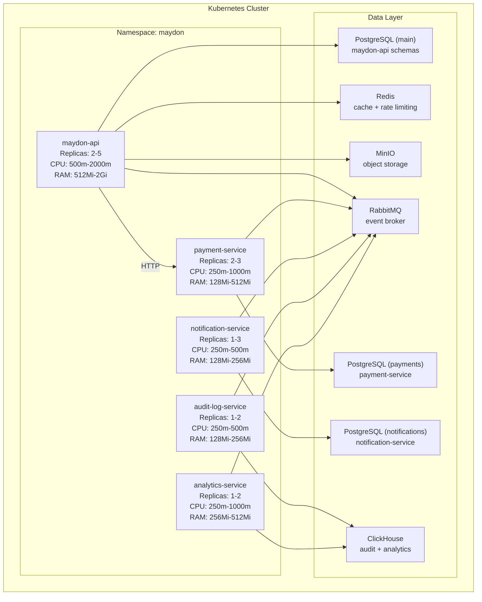

# Microservices

This document defines the microservices that will be extracted from the monolith, their responsibilities, APIs, data ownership, and communication patterns.

---

## 1. Overview

The Maydon platform starts as a modular monolith. The following services are extracted when they meet the criteria defined in [02-architecture-decisions.md](file:///Users/agreeing/Documents/GitHub/maydon-api/docs/02-architecture-decisions.md).

| Service | Language | Database | Communication | Phase |
|---------|----------|----------|---------------|-------|
| payment-service | Go | PostgreSQL (own) | Sync HTTP | Phase 3 |
| audit-log-service | Go | ClickHouse | Async (RabbitMQ) | Phase 2 |
| notification-service | Go | PostgreSQL (own) | Async (RabbitMQ) | Phase 2 |
| analytics-service | Go | ClickHouse | Async (RabbitMQ) | Phase 4 |



---

## 2. Event Schema

All events published to RabbitMQ follow this envelope:

```json
{
  "event_id": "uuid, unique per event",
  "event_type": "building.lease_payment.paid",
  "tenant_id": "uuid",
  "user_id": "uuid, actor who caused the event",
  "timestamp": "2026-02-09T12:00:00Z",
  "correlation_id": "uuid, from X-Request-Id header",
  "payload": {
    "...event-specific fields"
  }
}
```

### Event Routing

| Exchange | Type | Routing Key Pattern | Example |
|----------|------|-------------------|---------|
| maydon.domain.events | topic | `{module}.{entity}.{action}` | `building.lease.activated` |
| maydon.payment.events | topic | `payment.{action}` | `payment.completed` |

### Event Catalog

| Event Type | Publisher | Consumers | Payload |
|-----------|-----------|-----------|---------|
| `identity.user.registered` | monolith | audit, analytics | `{ user_id, register_type, is_individual }` |
| `identity.invitation.accepted` | monolith | audit, notify | `{ invitation_id, user_id, tenant_id }` |
| `building.listing.published` | monolith | audit, analytics | `{ listing_id, tenant_id, price, currency }` |
| `building.listing_request.received` | monolith | notify | `{ request_id, listing_id, owner_tenant_id, client_user_id }` |
| `building.listing_request.accepted` | monolith | audit, notify | `{ request_id, listing_id, client_user_id }` |
| `building.listing_request.rejected` | monolith | notify | `{ request_id, listing_id, client_user_id, reason }` |
| `building.lease.activated` | monolith | audit, notify, analytics | `{ lease_id, tenant_id, client_tenant_id, monthly_rent, currency }` |
| `building.lease.terminated` | monolith | audit, notify, analytics | `{ lease_id, reason }` |
| `building.lease.expired` | monolith | audit, notify, analytics | `{ lease_id }` |
| `building.lease_payment.due` | monolith (scheduler) | notify | `{ payment_id, lease_id, amount, due_date }` |
| `building.lease_payment.overdue` | monolith (scheduler) | notify, analytics | `{ payment_id, lease_id, amount, due_date }` |
| `building.lease_payment.paid` | monolith | audit, analytics | `{ payment_id, lease_id, amount, method }` |
| `building.meter_reading.submitted` | monolith | audit, analytics | `{ reading_id, meter_id, consumption }` |
| `building.meter_reading.due` | monolith (scheduler) | notify | `{ meter_id, tenant_id, last_reading_date }` |
| `payment.completed` | payment-service | audit, monolith | `{ transaction_id, lease_payment_id, amount, provider }` |
| `payment.failed` | payment-service | audit, notify, monolith | `{ transaction_id, error_code, error_message }` |

---

## 3. payment-service

### Purpose

Handles all financial transactions: bank connector routing, payment processing, and Didox fiscal invoice generation.

### Tech Stack

| Component | Technology |
|-----------|-----------|
| Language | Go 1.23+ |
| Framework | net/http stdlib + chi router |
| Database | PostgreSQL 16 (own instance) |
| Config | HashiCorp Vault |
| Logging | slog (structured) |
| Metrics | Prometheus client |

### API

#### 3.1 Create Payment Intent

```
POST /api/v1/payments/intent
```

**Called by:** monolith (server-to-server, internal network)  
**Auth:** `X-Internal-Key` header (shared secret from Vault)

**Request:**

```json
{
  "tenant_id": "uuid, required",
  "lease_payment_id": "uuid, required",
  "amount": "long, required, in integer Som (UZS)",
  "currency": "string, required, UZS or USD",
  "payment_method": "string, required, bank_transfer | card | cash",
  "bank_config_id": "uuid, optional, specific bank configuration",
  "payer": {
    "name": "string, required, max:200",
    "tin": "string, optional, max:20",
    "phone": "string, optional, max:20"
  },
  "description": "string, optional, max:500",
  "callback_url": "string, required, URL to notify on completion",
  "idempotency_key": "string, required, max:100, client-generated"
}
```

**Response 201:**

```json
{
  "transaction_id": "uuid",
  "status": "pending",
  "payment_url": "string, redirect URL for card payments",
  "expires_at": "2026-02-09T12:30:00Z",
  "created_at": "2026-02-09T12:00:00Z"
}
```

**Business rules:**
- Idempotency: duplicate `idempotency_key` returns the existing transaction
- Selects bank connector based on `tenant_id` configuration
- For card payments: returns a hosted payment page URL
- For bank transfers: initiates transfer via DiBank API
- For cash: records the payment immediately

---

#### 3.2 Get Payment Status

```
GET /api/v1/payments/{transactionId}
```

**Auth:** `X-Internal-Key`

**Response 200:**

```json
{
  "transaction_id": "uuid",
  "lease_payment_id": "uuid",
  "amount": 500000000,
  "currency": "UZS",
  "status": "completed",
  "payment_method": "card",
  "provider": "payme",
  "provider_transaction_id": "MC-2026-00123",
  "didox_invoice_id": "DX-2026-001234",
  "completed_at": "2026-02-09T12:05:00Z",
  "created_at": "2026-02-09T12:00:00Z"
}
```

Status enum: `pending`, `processing`, `completed`, `failed`, `refunded`, `expired`

---

#### 3.3 Payment Callback (Webhook from Bank)

```
POST /api/v1/payments/callback/{provider}
```

**Auth:** Provider-specific signature verification

This endpoint is called by bank payment gateways (Uzcard SV-Gate, Payme, Click) when a payment status changes.

**Business rules:**
- Verify request signature using provider-specific secret
- Update transaction status
- If completed: generate Didox fiscal invoice
- Publish `payment.completed` or `payment.failed` event to RabbitMQ
- Call `callback_url` on the monolith to update lease payment status

---

#### 3.4 Generate Fiscal Invoice

```
POST /api/v1/payments/{transactionId}/invoice
```

**Auth:** `X-Internal-Key`

**Response 201:**

```json
{
  "invoice_id": "DX-2026-001234",
  "status": "generated",
  "pdf_url": "string",
  "qr_code_url": "string"
}
```

**Business rules:**
- Calls Didox.uz API to register the fiscal invoice
- Stores invoice reference in local database
- Retries up to 3 times with exponential backoff on Didox API failure

---

#### 3.5 Refund Payment

```
POST /api/v1/payments/{transactionId}/refund
```

**Auth:** `X-Internal-Key`

**Request:**

```json
{
  "amount": "long, required, partial or full refund amount",
  "reason": "string, required, max:500",
  "idempotency_key": "string, required, max:100"
}
```

**Response 201:**

```json
{
  "refund_id": "uuid",
  "original_transaction_id": "uuid",
  "amount": 500000000,
  "status": "pending",
  "created_at": "2026-02-09T12:00:00Z"
}
```

**Business rules:**
- Original transaction must be in `completed` status
- Refund amount must not exceed original transaction amount minus previous refunds
- Idempotency: duplicate `idempotency_key` returns existing refund
- Initiates reverse transaction via bank provider
- If Didox invoice exists, generates storno (reversal) ESF
- Publishes `payment.refunded` event
- Sets original transaction status to `refunded` (if full) or keeps `completed` (if partial)

---

### Data Ownership

| Table | Columns |
|-------|---------|
| payment_transactions | id, tenant_id, lease_payment_id, amount, currency, status, payment_method, provider, provider_transaction_id, idempotency_key, callback_url, created_at, completed_at |
| bank_configurations | id, tenant_id, provider, merchant_id, api_key (encrypted), is_active |
| didox_invoices | id, transaction_id, didox_id, status, pdf_object_name, created_at |

---

## 4. audit-log-service

### Purpose

Immutable, append-only event store for all domain events. Serves audit trail queries to the admin panel.

### Tech Stack

| Component | Technology |
|-----------|-----------|
| Language | Go 1.23+ |
| Database | ClickHouse (append-only columnar) |
| Ingestion | RabbitMQ consumer |
| Query API | HTTP (read-only) |

### Event Ingestion

Consumes all events from `maydon.domain.events` and `maydon.payment.events` exchanges.

**ClickHouse table:**

```sql
CREATE TABLE audit_events (
    event_id UUID,
    event_type String,
    tenant_id UUID,
    user_id Nullable(UUID),
    entity_type String,
    entity_id UUID,
    action String,
    payload String,  -- JSON
    ip_address Nullable(String),
    user_agent Nullable(String),
    correlation_id UUID,
    timestamp DateTime64(3, 'UTC')
) ENGINE = MergeTree()
PARTITION BY toYYYYMM(timestamp)
ORDER BY (tenant_id, timestamp, event_type)
TTL timestamp + INTERVAL 2 YEAR;
```

### Query API

#### 4.1 Search Audit Events

```
POST /api/v1/audit/events/search
```

**Auth:** `X-Internal-Key` (called by admin panel via monolith proxy)

**Request:**

```json
{
  "tenant_id": "uuid, required",
  "event_type": "string, optional, exact match",
  "entity_type": "string, optional, e.g. 'Lease', 'Listing'",
  "entity_id": "uuid, optional",
  "user_id": "uuid, optional",
  "date_from": "datetime, optional",
  "date_to": "datetime, optional",
  "page": "int, optional, default: 1",
  "page_size": "int, optional, default: 50, max: 200"
}
```

> **Note:** Uses POST instead of GET per [03-api-standards](file:///Users/agreeing/Documents/GitHub/maydon-api/docs/03-api-standards.md) POST-body search convention — admin search endpoints with potentially sensitive identifiers (user_id, tenant_id) must avoid query parameter exposure.

**Response 200:**

```json
{
  "items": [
    {
      "event_id": "uuid",
      "event_type": "building.lease.activated",
      "tenant_id": "uuid",
      "user_id": "uuid",
      "entity_type": "Lease",
      "entity_id": "uuid",
      "action": "activated",
      "payload": { "monthly_rent": 500000000, "currency": "UZS" },
      "correlation_id": "uuid",
      "timestamp": "2026-02-09T12:00:00.000Z"
    }
  ],
  "total_count": 1423,
  "page": 1,
  "page_size": 50
}
```

---

## 5. notification-service

### Purpose

Delivers notifications to users via push (FCM), SMS (Eskiz/PlayMobile), and email.

### Tech Stack

| Component | Technology |
|-----------|-----------|
| Language | Go 1.23+ |
| Database | PostgreSQL (own instance) |
| Push | Firebase Cloud Messaging (FCM) |
| SMS | Eskiz.uz or PlayMobile |
| Email | SMTP (Phase 2) |
| Queue | RabbitMQ consumer |

### Event-to-Notification Mapping

| Event | Channel | Recipient | Template |
|-------|---------|-----------|----------|
| `building.listing_request.received` | Push | Owner | "New rental request for {listing_title}" |
| `building.listing_request.accepted` | Push, SMS | Client | "Your request for {listing_title} was accepted" |
| `building.listing_request.rejected` | Push | Client | "Your request for {listing_title} was declined" |
| `building.lease_payment.due` | Push | Client | "Payment of {amount} {currency} due on {due_date}" |
| `building.lease_payment.overdue` | Push, SMS | Client, Owner | "Payment overdue: {amount} {currency} was due {due_date}" |
| `building.lease.expired` | Push | Client, Owner | "Lease for {address} expired" |
| `identity.invitation.accepted` | Push | Sender | "{user_name} accepted your invitation" |
| `building.meter_reading.due` | Push | Client | "Submit meter reading for {meter_name}" |

### API

#### 5.1 Register Device Token

```
POST /api/v1/notifications/devices
```

**Auth:** `Authorization: Bearer {jwt}` (forwarded from monolith)

**Request:**

```json
{
  "token": "string, required, FCM device token, max:500",
  "platform": "string, required, ios | android",
  "device_id": "string, required, unique device identifier, max:200"
}
```

**Response 201:**

```json
{
  "id": "uuid",
  "platform": "ios"
}
```

**Business rules:**
- Same device_id updates the token (device token rotation)
- One user can have multiple devices

---

#### 5.2 Unregister Device

```
DELETE /api/v1/notifications/devices/{deviceId}
```

**Auth:** `Authorization: Bearer {jwt}`  
**Response 204**

---

#### 5.3 Get Notification History

```
GET /api/v1/notifications
```

**Auth:** `Authorization: Bearer {jwt}`

**Query parameters:** page, page_size, is_read

**Response 200:**

```json
{
  "items": [
    {
      "id": "uuid",
      "title": "New rental request",
      "body": "Jasur Toshmatov sent a request for Building A-1, Apt 42",
      "channel": "push",
      "is_read": false,
      "data": {
        "type": "listing_request",
        "listing_request_id": "uuid",
        "listing_id": "uuid"
      },
      "created_at": "2026-02-09T12:00:00Z"
    }
  ],
  "unread_count": 5,
  "pagination": { "page": 1, "page_size": 20, "total_items": 15 }
}
```

---

#### 5.4 Mark as Read

```
PATCH /api/v1/notifications/{id}/read
```

**Auth:** `Authorization: Bearer {jwt}`  
**Response 204**

---

#### 5.5 Mark All as Read

```
POST /api/v1/notifications/read-all
```

**Auth:** `Authorization: Bearer {jwt}`  
**Response 204**

---

### Data Ownership

| Table | Columns |
|-------|---------|
| device_tokens | id, user_id, token, platform, device_id, is_active, created_at, updated_at |
| notification_templates | id, event_type, channel, language_code, title_template, body_template, is_active |
| notification_deliveries | id, user_id, tenant_id, event_type, channel, title, body, data (jsonb), status, is_read, error_message, sent_at, read_at, created_at |

### Delivery Status

```
pending → sending → sent → delivered → read
                  → failed (retry up to 3 times with exponential backoff)
```

---

## 6. analytics-service

### Purpose

Aggregates domain events into analytical views for dashboards and reports. Provides pre-computed metrics for the owner and admin dashboards.

### Tech Stack

| Component | Technology |
|-----------|-----------|
| Language | Go 1.23+ |
| Database | ClickHouse |
| Ingestion | RabbitMQ consumer |
| Query API | HTTP |

### Materialized Views

```sql
-- Listing performance
CREATE MATERIALIZED VIEW listing_metrics
ENGINE = SummingMergeTree()
ORDER BY (tenant_id, listing_id, date)
AS SELECT
    tenant_id,
    listing_id,
    toDate(timestamp) AS date,
    countIf(event_type = 'building.listing.viewed') AS views,
    countIf(event_type = 'building.listing_request.received') AS requests,
    countIf(event_type = 'building.listing.wishlisted') AS wishlists
FROM domain_events
GROUP BY tenant_id, listing_id, date;

-- Revenue aggregation
CREATE MATERIALIZED VIEW revenue_metrics
ENGINE = SummingMergeTree()
ORDER BY (tenant_id, currency, month)
AS SELECT
    tenant_id,
    currency,
    toStartOfMonth(timestamp) AS month,
    sum(amount) AS total_revenue,
    count() AS payments_count
FROM domain_events
WHERE event_type = 'building.lease_payment.paid'
GROUP BY tenant_id, currency, month;

-- Occupancy tracking
CREATE MATERIALIZED VIEW occupancy_metrics
ENGINE = ReplacingMergeTree(timestamp)
ORDER BY (tenant_id, real_estate_id)
AS SELECT
    tenant_id,
    real_estate_id,
    argMax(status, timestamp) AS current_status,
    timestamp
FROM domain_events
WHERE event_type IN ('building.lease.activated', 'building.lease.terminated', 'building.lease.expired')
GROUP BY tenant_id, real_estate_id, timestamp;
```

### API

#### 6.1 Owner Dashboard Metrics

```
GET /api/v1/analytics/dashboard
```

**Auth:** `X-Internal-Key` + `X-Tenant-Id` header

**Query parameters:** period (7d, 30d, 90d, 1y)

**Response 200:**

```json
{
  "period": "30d",
  "properties": {
    "total": 15,
    "occupied": 12,
    "vacant": 3,
    "occupancy_rate": 80.0
  },
  "revenue": {
    "total": 12500000000,
    "currency": "UZS",
    "paid_count": 10,
    "overdue_count": 2,
    "overdue_amount": 1000000000,
    "trend_percent": 5.2
  },
  "listings": {
    "active": 3,
    "total_views": 450,
    "total_requests": 12,
    "conversion_rate": 2.67
  },
  "tenants": {
    "active_leases": 12,
    "expiring_soon": 2
  }
}
```

---

#### 6.2 Listing Performance

```
GET /api/v1/analytics/listings/{listingId}/performance
```

**Auth:** `X-Internal-Key` + `X-Tenant-Id`

**Response 200:**

```json
{
  "listing_id": "uuid",
  "total_views": 450,
  "total_requests": 12,
  "total_wishlists": 34,
  "daily": [
    { "date": "2026-02-08", "views": 25, "requests": 1, "wishlists": 3 },
    { "date": "2026-02-09", "views": 30, "requests": 2, "wishlists": 1 }
  ]
}
```

---

#### 6.3 Revenue Report

```
GET /api/v1/analytics/revenue
```

**Auth:** `X-Internal-Key` + `X-Tenant-Id`

**Query parameters:** date_from, date_to, currency, group_by (day, week, month)

**Response 200:**

```json
{
  "total": 75000000000,
  "currency": "UZS",
  "series": [
    { "period": "2026-01", "amount": 12500000000, "payments_count": 10 },
    { "period": "2026-02", "amount": 12500000000, "payments_count": 10 }
  ]
}
```

---

## 7. Inter-Service Communication Patterns

### Synchronous (HTTP)

Used only between the monolith and payment-service where the response is needed immediately.

```
Monolith                 payment-service
   |                           |
   |-- POST /payments/intent -->|
   |<-- 201 { transaction_id } -|
   |                           |
   |     (bank processes...)    |
   |                           |
   |<-- POST /callback --------|  (bank webhook)
   |                           |
   |-- GET /payments/{id} ----->|
   |<-- 200 { status } --------|
```

### Asynchronous (RabbitMQ)

Used for all other inter-service communication. Fire-and-forget from the publisher.

```
Monolith publishes event:
  exchange: maydon.domain.events
  routing_key: building.lease.activated
  
Consumers (each with own queue):
  queue: audit.domain.events   → audit-log-service
  queue: notify.domain.events  → notification-service
  queue: analytics.domain.events → analytics-service
```

### Failure Handling

| Scenario | Strategy |
|----------|----------|
| Consumer fails to process event | Retry with exponential backoff (1s, 5s, 30s) |
| Max retries exceeded | Move to dead-letter queue (DLQ) |
| Payment service unavailable | Monolith retries 3 times, then marks payment as failed |
| Notification delivery fails | Retry 3 times, then log as undelivered |
| ClickHouse ingestion lag | Acceptable (eventual consistency), alerts if lag > 5 minutes |

### Dead Letter Queue

Each service has a DLQ:

```
Queue: audit.domain.events.dlq
Queue: notify.domain.events.dlq
Queue: analytics.domain.events.dlq
```

DLQ messages are reviewed manually or reprocessed via admin tooling.

---

## 8. Deployment Topology



---

## 9. Service Health Checks

Each microservice exposes:

```
GET /health          → 200 if service is running
GET /health/ready    → 200 if all dependencies (DB, RabbitMQ) are reachable
GET /metrics         → Prometheus metrics endpoint
```

Kubernetes uses `/health` for liveness and `/health/ready` for readiness probes.
