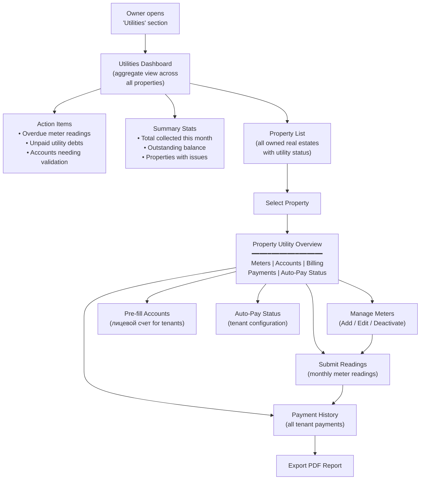
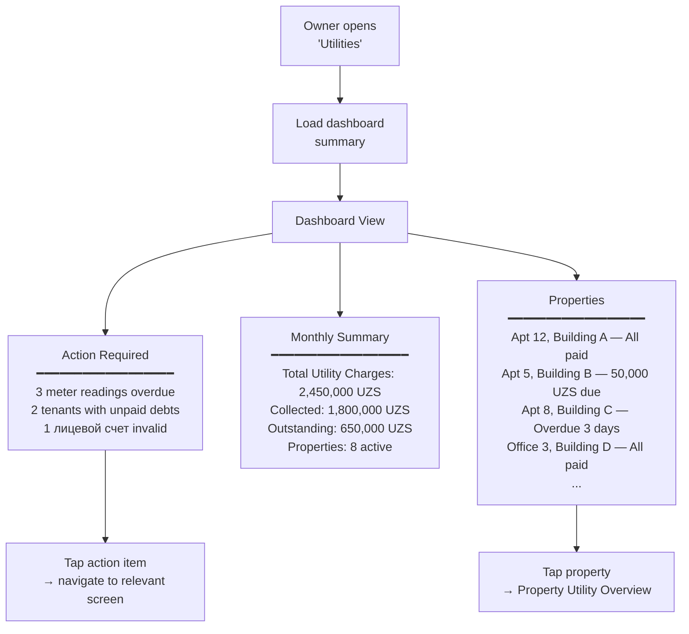
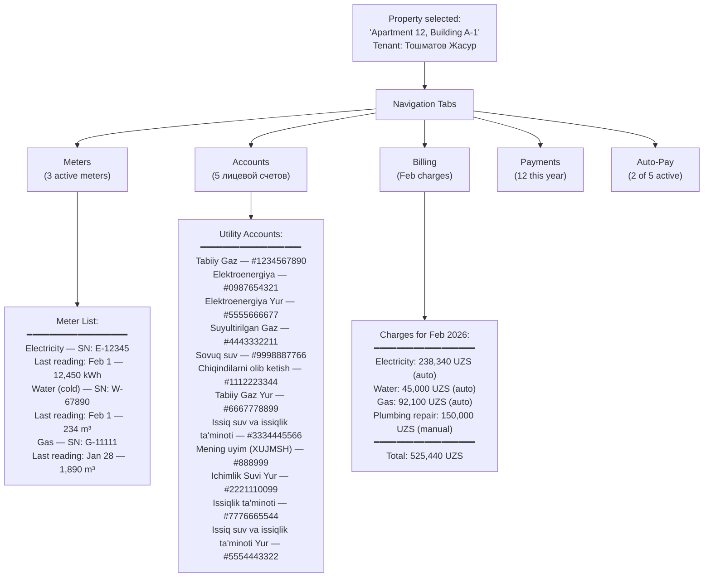
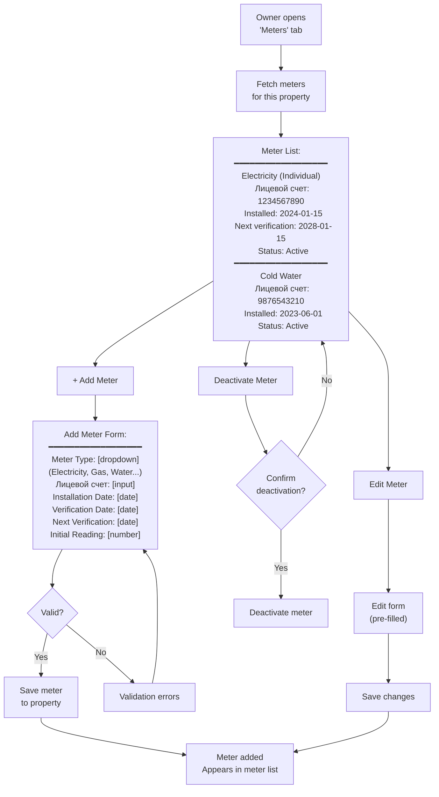
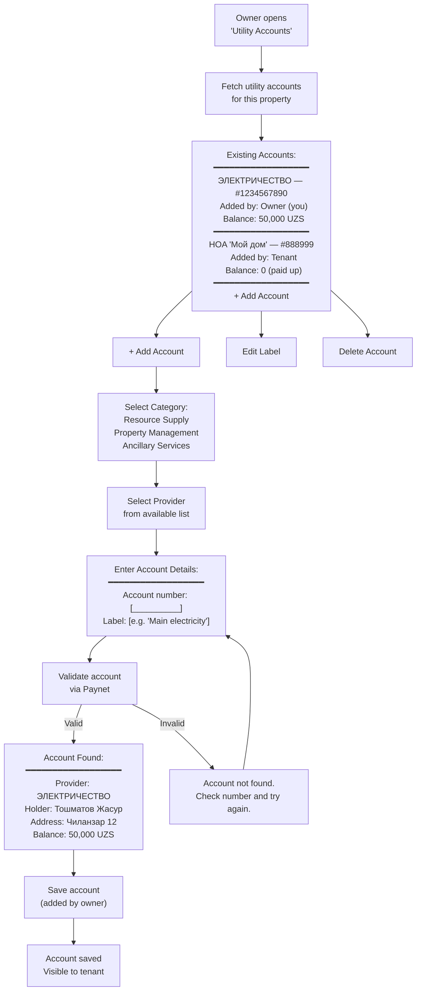
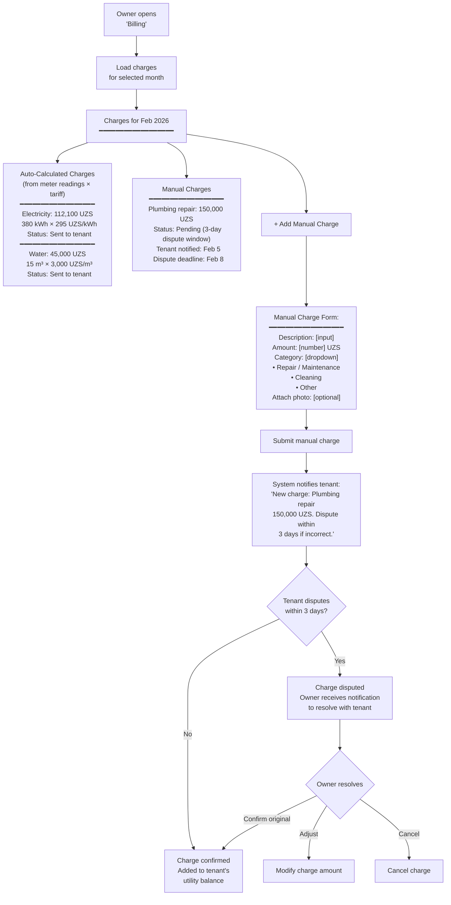
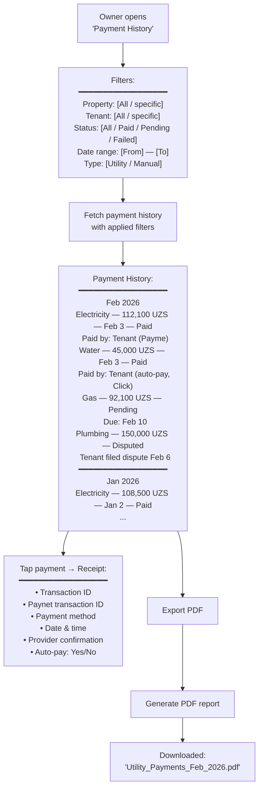
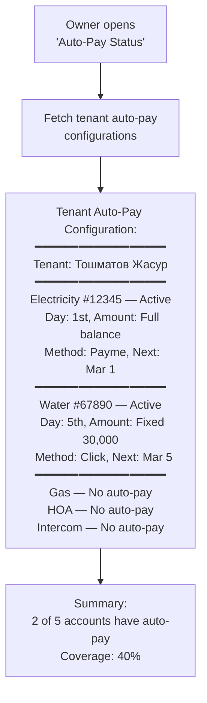

# Utilities — Owner (Business) User Flow & API Design

> **Module:** `utility` (new module, extends `building` module)  
> **Actor:** Owner / Agent (`typ: "Owner"` or `typ: "Agent"` in JWT)  
> **Existing Backend:** Meter, MeterType, MeterTariff, MeterReading domain models in `Building.Domain`  
> **Integration:** Paynet (utility aggregator), payment-service (Go microservice)  
> **Related:** [Tenant Utilities Flow](./utilities-payment-userflow.md)

---

## Design Decisions (Confirmed)

| # | Decision | Choice |
|---|----------|--------|
| 1 | Scope | All owner features: meter management, readings, лицевой счет pre-fill, billing, payment history, auto-pay visibility |
| 2 | Feature tiers | **v1:** Meter CRUD, readings, лицевой счет pre-fill, payment history, dashboard. **v1.1:** Tariff management (owner-level), billing engine |
| 3 | Meter readings actor | Owner submits; `submitted_by` field tracks who; system sends overdue reminders |
| 4 | Billing automation | Auto-calculated charges (reading × tariff) go directly to tenant. Only manual charges have dispute window |
| 5 | Payment visibility | Owner sees all statuses (Paid, Pending, Failed, Refunded) + aggregate dashboard + PDF export |
| 6 | Navigation | Dashboard is landing page → drill down to per-property views |
| 7 | Auto-pay oversight | Owner can see tenant auto-pay status; cannot require tenants to set up auto-pay |
| 8 | Architecture | New utility accounts/billing tables; reuses existing `meters`, `meter_readings`, `meter_tariffs`, `meter_types` tables |

---

## 1. High-Level Owner Flow Overview

---

## 2. Detailed User Flow — Step-by-Step

### Step 1: Utilities Dashboard (Landing Page)

---

### Step 2: Property Utility Overview (Drill-Down)

---

### Step 3: Manage Meters

**How it works:**
- Each meter belongs to a specific property and has a type (Electricity, Gas, Water, etc.), лицевой счет (billing account number), installation/verification dates, and active status
- Meter types include localized names, measurement units, and linked tariffs
- The owner can add new meters, edit existing ones, or deactivate meters that are no longer in use

---

### Step 4: Submit Meter Readings

**How it works:**
- The system tracks who submitted each reading (owner or tenant)
- Consumption is automatically calculated as the difference between the current and previous readings
- If a tariff is set for the meter type, the system auto-generates a charge and sends it directly to the tenant
- Readings can only be submitted for the current period (no older than 3 days)

---

### Step 5: Pre-Fill Лицевой Счет (Utility Accounts)

**How it works:**
- Accounts added by the owner are automatically visible to any tenant with an active lease on the property
- Accounts added by the tenant are visible to the owner in read-only mode
- The owner can only delete accounts they created, not ones added by tenants
- Each account number can only be linked once per provider per property (no duplicates)

---

### Step 6: Billing Management (v1.1)

**How it works:**
- **Auto charges** are generated automatically when a meter reading is submitted and a valid tariff exists — they go directly to the tenant with no approval needed (based on objective data: reading × tariff)
- **Manual charges** follow a different process: owner creates a charge → tenant is notified → tenant has 3 days to dispute → if no dispute, the charge is auto-confirmed
- All charges appear in the tenant's Utilities section as pending items

---

### Step 7: Tenant Utility Payment History (Owner View)

---

### Step 8: Auto-Pay Oversight (Read-Only)

**How it works:** This is a read-only view. The owner can see which utility accounts have auto-pay enabled by the tenant, but cannot modify or require auto-pay settings — that is entirely controlled by the tenant.

