# Utilities — Owner (Business) User Flow

> **Module:** `utility` (new module, extends `building` module)  
> **Actor:** Owner / Agent (`typ: "Owner"` or `typ: "Agent"` in JWT)  
> **Existing Backend:** Meter, MeterType, MeterTariff, MeterReading domain models in `Building.Domain`  
> **Integration:** Paynet (utility aggregator)  
> **Related:** [Tenant Utilities Flow](./utilities-payment-userflow.md)

---

## Design Decisions (Confirmed)

| # | Decision | Choice |
|---|----------|--------|
| 1 | Scope | All owner features: meter management, readings, account pre-fill, billing, payment history, auto-pay visibility |
| 2 | Feature tiers | Meters, readings, utility accounts, payment history, dashboard, tariff management, billing engine |
| 3 | Meter readings actor | Owner submits; `submitted_by` field tracks who; system sends overdue reminders |
| 4 | Billing automation | Auto-calculated charges (reading × tariff) go directly to the assigned payer (Tenant or Owner) |
| 5 | Payment visibility | Owner sees all statuses + aggregate dashboard. Owner can pay bills directly if responsibility is theirs |
| 6 | Navigation | Dashboard is landing page → drill down to per-property views |
| 7 | Auto-pay oversight | Owner can see tenant auto-pay status; cannot require tenants to set up auto-pay |
| 8 | Architecture | New utility accounts/billing tables; reuses existing `meters` domain |
| 9 | **Payment Responsibility** | **Per Utility Account.** Explicit toggle: "Tenant pays" (default) or "Owner pays" |

---

## 1. High-Level Owner Flow Overview

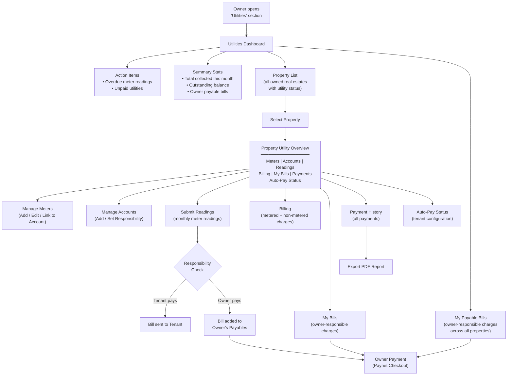

---

## 2. Detailed User Flow — Step-by-Step

### Step 1: Utilities Dashboard

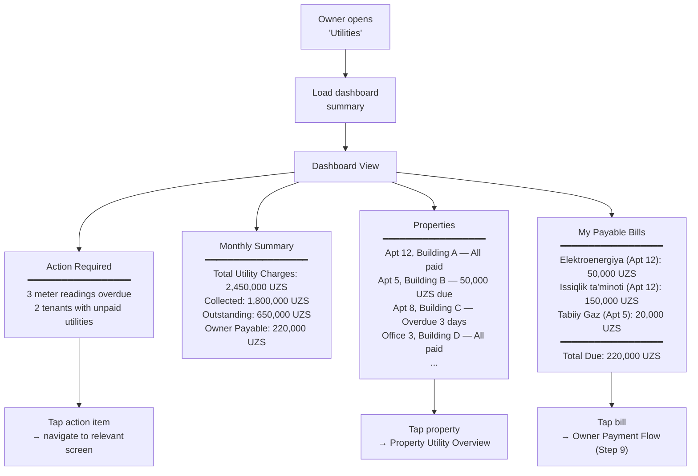

---

### Step 2: Property Utility Overview (Drill-Down)

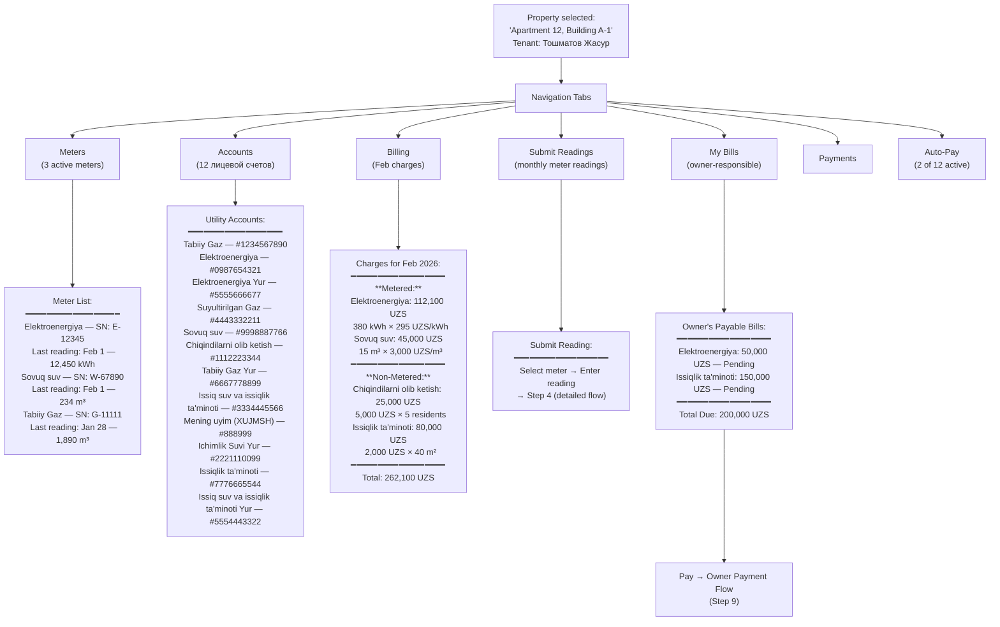

---

### Step 3: Manage Meters

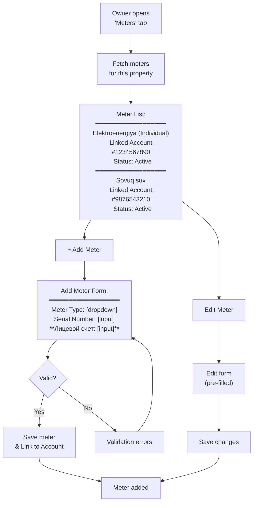

**How it works:**

- **Linkage is mandatory:** A meter must be linked to a specific Utility Account (Step 5). This link tells the system who to bill when a reading is submitted
- **1:1 relationship:** Typically, one meter links to one account
- If the account does not exist yet, the Owner must create it (Step 5) before or during the meter setup

---

### Step 4: Submit Meter Readings

#### 4.1 Main Flow

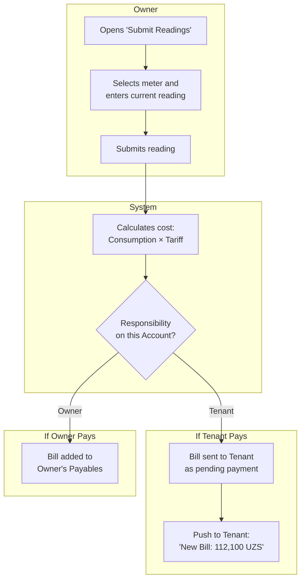

**Submit Meter Reading form fields:**

- **Meter** — dropdown, required (list of active meters for this property)
- **Previous Reading** — optional (for reference)
- **Current Reading** — input, required
- **Reading Date** — date picker (defaults to today)
- **Note** — optional textarea

**How it works:**
- After calculating cost (Consumption × Tariff), the system checks the **responsibility setting** on the linked Utility Account
- **If Tenant pays:** Bill is sent to the tenant's app as a pending payment. Owner sees "Awaiting Tenant Payment"
- **If Owner pays:** Bill is added to the Owner's Payables (Step 9). Tenant sees "Paid by Landlord" (read-only, no Pay button)
- Readings can only be submitted for the current period (no older than 3 days)

---

### Step 5: Manage Utility Accounts (Лицевой Счет)

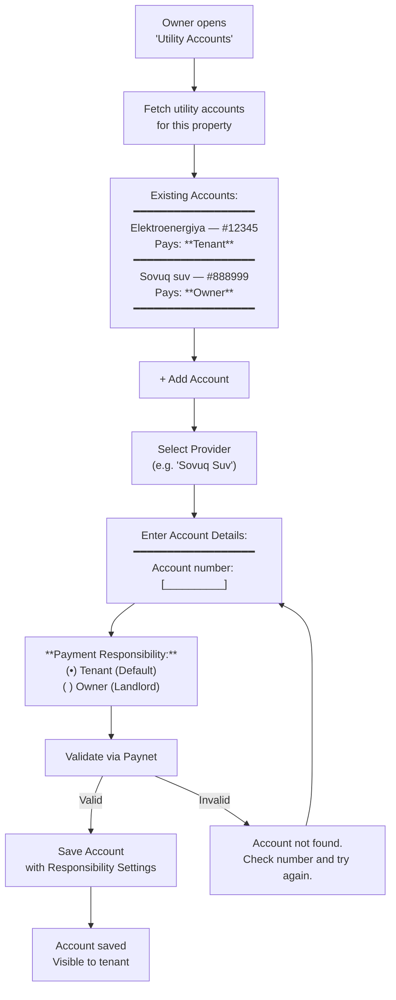

**How it works:**
- **Responsibility Toggle:** Defines who receives the bill. This is a required field when adding an account
  - **Tenant (default):** Bills go to the tenant's app as payable items
  - **Owner:** Bills stay in the owner's app for payment. Tenant sees them as "Paid by Landlord"
- This setting applies to **both** metered (Elektroenergiya, Tabiiy Gaz, Sovuq suv) and non-metered (Sovuq suv, Chiqindilarni olib ketish) accounts
- Each account number can only be linked once per provider per property (no duplicates)
- The owner can change responsibility at any time; existing debt transfers to the new payer's view

---

### Step 6: Billing Management (v1.1)

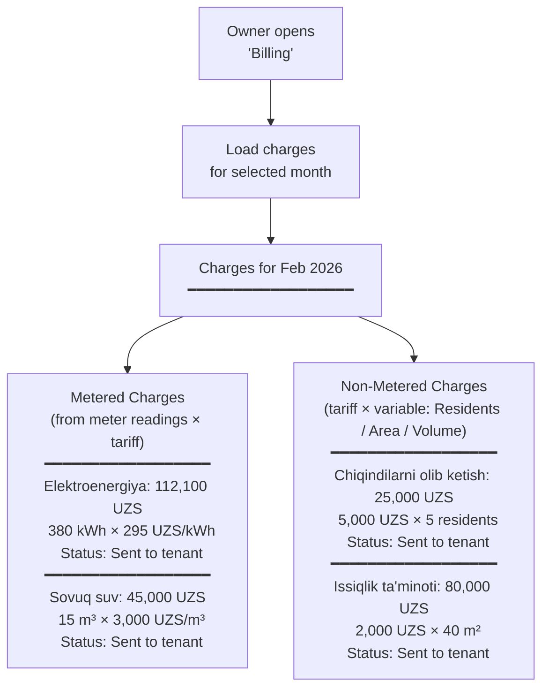

**How it works:**

- **Metered charges** are generated automatically when an owner submits a meter reading and a valid tariff exists: `consumption × tariff = cost`
- **Non-metered charges** are calculated by the billing engine based on service type: `tariff × variable` (e.g., number of residents or apartment area)
- Both charge types go directly to the assigned payer (Tenant or Owner) based on the **responsibility setting** on the linked Utility Account (Step 5)
- All charges appear in the payer's Utilities section as pending items

---

### Step 6.1: Non-Metered Settlement Flow

> **Context:** Non-metered utilities (Chiqindilarni olib ketish, Issiqlik ta'minoti, Mening uyim (XUJMSH), etc.) do not require meter readings. The billing engine automatically calculates charges based on the service type's calculation variable.

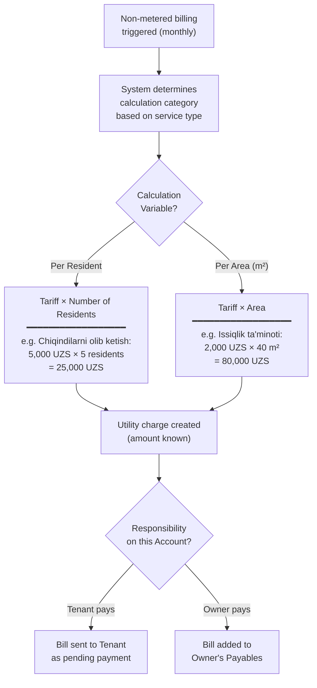

**How it works:**

- Non-metered charges are generated **automatically** on a monthly cycle — no owner action required
- The billing engine selects the correct calculation variable based on the service type:
  - **Per Resident:** Chiqindilarni olib ketish, Mening uyim (XUJMSH)
  - **Per Area (m²):** Issiqlik ta'minoti, Issiq suv va issiqlik ta'minoti, Elektroenergiya
- After calculation, the charge is routed based on the **responsibility setting** on the linked Utility Account (Step 5)
- Payment follows the same flow as metered charges (Step 9 for Owner, or Tenant payment flow)

---

### Step 7: Tenant Utility Payment History (Owner View)

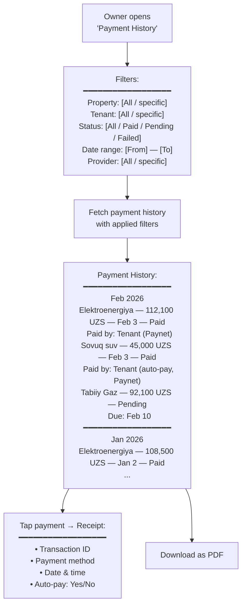

---

### Step 8: Auto-Pay Oversight (Read-Only)

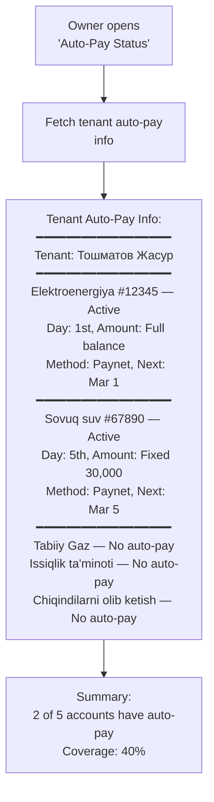

**How it works:** This is a read-only view. The owner can see which utility accounts have auto-pay enabled by the tenant, but cannot modify or require auto-pay settings — that is entirely controlled by the tenant.

---

### Step 9: Owner Payment Flow

> **Context:** When Responsibility = Owner, or when an owner voluntarily chooses to pay a tenant's overdue bill, they use this flow. It mirrors the Tenant's payment flow (using the same Paynet integration) but occurs within the Owner's interface.

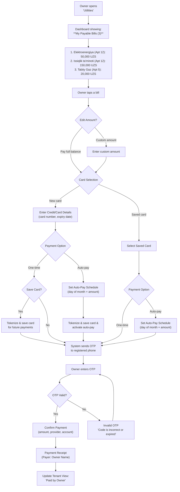

**How it works:**

- Owner sees all bills where `responsibility = Owner` in their Payables
- **Same Paynet integration** as the tenant flow — card, OTP, receipt. No separate payment engine
- Receipt shows the Owner's name as payer; accessible to both Owner and Tenant

---

### Step 10: Tenant Changes

> What happens to utility accounts when tenants move in or out.

#### 10.1 Move-Out

When a lease ends, the system does **NOT** auto-assign bills to the Owner.

- Lease status → **Terminated**
- Tenant-assigned accounts → **Unassigned**
- Owner gets an alert:

> ⚠️ **Vacant Property (Apt 12)** — 3 accounts are unassigned. Choose: **[Take Responsibility]** or **[Assign to New Tenant]**

#### 10.2 Move-In

When creating a new lease, the Owner assigns utility responsibility:

1. Owner selects property
2. System shows linked accounts — Owner sets who pays:
   - Elektroenergiya #123 (Metered) → Tenant / Owner
   - Issiqlik ta'minoti #456 (Non-metered) → Tenant / Owner
3. Owner can change responsibility during the lease if needed
