# Utilities — Owner (Business) User Flow & API Design

> **Module:** `utility` (new module, extends `building` module)  
> **Actor:** Owner / Agent (`typ: "Owner"` or `typ: "Agent"` in JWT)  
> **Existing Backend:** Meter, MeterType, MeterTariff, MeterReading domain models in `Building.Domain`  
> **Integration:** Paynet (utility aggregator), payment-service (Go microservice)  
> **Related:** [Tenant Utilities Flow](./utilities-payment-userflow.md)

---

## Design Decisions (Confirmed)

| # | Decision | Choice |
|---|----------|--------|
| 1 | Scope | All owner features: meter management, readings, лицевой счет pre-fill, billing, payment history, auto-pay visibility |
| 2 | Feature tiers | **v1:** Meter CRUD, readings, лицевой счет pre-fill, payment history, dashboard. **v1.1:** Tariff management (owner-level), billing engine |
| 3 | Meter readings actor | Owner submits; `submitted_by` field tracks who; system sends overdue reminders |
| 4 | Billing automation | Auto-calculated charges (reading × tariff) go directly to tenant. Only manual charges have dispute window |
| 5 | Payment visibility | Owner sees all statuses (Paid, Pending, Failed, Refunded) + aggregate dashboard + PDF export |
| 6 | Navigation | Dashboard is landing page → drill down to per-property views |
| 7 | Auto-pay oversight | Owner can see tenant auto-pay status; cannot require tenants to set up auto-pay |
| 8 | Architecture | New utility accounts/billing tables; reuses existing `meters`, `meter_readings`, `meter_tariffs`, `meter_types` tables |

---

## 1. High-Level Owner Flow Overview

```mermaid
flowchart TD
    START["Owner opens<br/>'Utilities' section"] --> DASHBOARD["Utilities Dashboard<br/>(aggregate view across<br/>all properties)"]

    DASHBOARD --> ALERTS["Action Items<br/>• Overdue meter readings<br/>• Unpaid utility debts<br/>• Accounts needing validation"]
    DASHBOARD --> STATS["Summary Stats<br/>• Total collected this month<br/>• Outstanding balance<br/>• Properties with issues"]
    DASHBOARD --> PROP_LIST["Property List<br/>(all owned real estates<br/>with utility status)"]

    PROP_LIST --> SELECT_PROP["Select Property"]

    SELECT_PROP --> PROP_VIEW["Property Utility Overview<br/>━━━━━━━━━━━━━━━━━━<br/>Meters | Accounts | Billing<br/>Payments | Auto-Pay Status"]

    PROP_VIEW --> METERS["Manage Meters<br/>(Add / Edit / Deactivate)"]
    PROP_VIEW --> READINGS["Submit Readings<br/>(monthly meter readings)"]
    PROP_VIEW --> ACCOUNTS["Pre-fill Accounts<br/>(лицевой счет for tenants)"]
    PROP_VIEW --> PAYMENTS["Payment History<br/>(all tenant payments)"]
    PROP_VIEW --> AUTOPAY["Auto-Pay Status<br/>(tenant configuration)"]

    METERS --> READINGS
    READINGS --> PAYMENTS

    PAYMENTS --> EXPORT["Export PDF Report"]
```



---

## 2. Detailed User Flow — Step-by-Step

### Step 1: Utilities Dashboard (Landing Page)

```mermaid
flowchart TD
    OPEN["Owner opens<br/>'Utilities'"] --> LOAD["Load dashboard<br/>summary"]

    LOAD --> DASH["Dashboard View"]

    DASH --> SECTION_A["Action Required<br/>━━━━━━━━━━━━━━━━━━<br/>3 meter readings overdue<br/>2 tenants with unpaid debts<br/>1 лицевой счет invalid"]

    DASH --> SECTION_B["Monthly Summary<br/>━━━━━━━━━━━━━━━━━━<br/>Total Utility Charges: 2,450,000 UZS<br/>Collected: 1,800,000 UZS<br/>Outstanding: 650,000 UZS<br/>Properties: 8 active"]

    DASH --> SECTION_C["Properties<br/>━━━━━━━━━━━━━━━━━━<br/>Apt 12, Building A — All paid<br/>Apt 5, Building B — 50,000 UZS due<br/>Apt 8, Building C — Overdue 3 days<br/>Office 3, Building D — All paid<br/>..."]

    SECTION_A --> TAP_ACTION["Tap action item<br/>→ navigate to relevant screen"]
    SECTION_C --> TAP_PROP["Tap property<br/>→ Property Utility Overview"]
```



---

### Step 2: Property Utility Overview (Drill-Down)

```mermaid
flowchart TD
    PROP["Property selected:<br/>'Apartment 12, Building A-1'<br/>Tenant: Тошматов Жасур"] --> TABS["Navigation Tabs"]

    TABS --> T_METERS["Meters<br/>(3 active meters)"]
    TABS --> T_ACCOUNTS["Accounts<br/>(5 лицевой счетов)"]
    TABS --> T_BILLING["Billing<br/>(Feb charges)"]
    TABS --> T_PAYMENTS["Payments<br/>(12 this year)"]
    TABS --> T_AUTOPAY["Auto-Pay<br/>(2 of 5 active)"]

    T_METERS --> METERS_VIEW["Meter List:<br/>━━━━━━━━━━━━━━━━━━<br/>Electricity — SN: E-12345<br/>  Last reading: Feb 1 — 12,450 kWh<br/>Water (cold) — SN: W-67890<br/>  Last reading: Feb 1 — 234 m³<br/>Gas — SN: G-11111<br/>  Last reading: Jan 28 — 1,890 m³"]

    T_ACCOUNTS --> ACC_VIEW["Utility Accounts:<br/>━━━━━━━━━━━━━━━━━━<br/>Tabiiy Gaz — #1234567890<br/>Elektroenergiya — #0987654321<br/>Elektroenergiya Yur — #5555666677<br/>Suyultirilgan Gaz — #4443332211<br/>Sovuq suv — #9998887766<br/>Chiqindilarni olib ketish — #1112223344<br/>Tabiiy Gaz Yur — #6667778899<br/>Issiq suv va issiqlik ta'minoti — #3334445566<br/>Mening uyim (XUJMSH) — #888999<br/>Ichimlik Suvi Yur — #2221110099<br/>Issiqlik ta'minoti — #7776665544<br/>Issiq suv va issiqlik ta'minoti Yur — #5554443322"]

    T_BILLING --> BILL_VIEW["Charges for Feb 2026:<br/>━━━━━━━━━━━━━━━━━━<br/>Electricity: 238,340 UZS (auto)<br/>Water: 45,000 UZS (auto)<br/>Gas: 92,100 UZS (auto)<br/>Plumbing repair: 150,000 UZS (manual)<br/>━━━━━━━━━━━━━━━━━━<br/>Total: 525,440 UZS"]
```



---

### Step 3: Manage Meters

```mermaid
flowchart TD
    METERS["Owner opens<br/>'Meters' tab"] --> LIST["Fetch meters<br/>for this property"]

    LIST --> VIEW["Meter List:<br/>━━━━━━━━━━━━━━━━━━<br/>Electricity (Individual)<br/>  SN: E-12345<br/>  Installed: 2024-01-15<br/>  Next verification: 2028-01-15<br/>  Status: Active<br/>━━━━━━━━━━━━━━━━━━<br/>Cold Water<br/>  SN: W-67890<br/>  Installed: 2023-06-01<br/>  Status: Active"]

    VIEW --> ADD_BTN["+ Add Meter"]
    VIEW --> EDIT_BTN["Edit Meter"]
    VIEW --> DEACTIVATE["Deactivate Meter"]

    ADD_BTN --> ADD_FORM["Add Meter Form:<br/>━━━━━━━━━━━━━━━━━━<br/>Meter Type: [dropdown]<br/>  (Electricity, Gas, Water...)<br/>Serial Number: [input]<br/>Installation Date: [date]<br/>Verification Date: [date]<br/>Next Verification: [date]<br/>Initial Reading: [number]"]

    ADD_FORM --> VALIDATE_FORM{"Valid?"}
    VALIDATE_FORM -->|"Yes"| SAVE["Save meter<br/>to property"]
    VALIDATE_FORM -->|"No"| ERROR["Validation errors"]
    ERROR --> ADD_FORM

    SAVE --> SUCCESS["Meter added<br/>Appears in meter list"]

    EDIT_BTN --> EDIT_FORM["Edit form<br/>(pre-filled)"]
    EDIT_FORM --> SAVE_EDIT["Save changes"]
    SAVE_EDIT --> SUCCESS

    DEACTIVATE --> CONFIRM_DEACT{"Confirm<br/>deactivation?"}
    CONFIRM_DEACT -->|"Yes"| DO_DEACT["Deactivate meter"]
    CONFIRM_DEACT -->|"No"| VIEW
```



**How it works:**
- Each meter belongs to a specific property and has a type (Electricity, Gas, Water, etc.), serial number, installation/verification dates, and active status
- Meter types include localized names, measurement units, and linked tariffs
- The owner can add new meters, edit existing ones, or deactivate meters that are no longer in use

---

### Step 4: Submit Meter Readings

```mermaid
flowchart TD
    READINGS["Owner opens<br/>'Submit Readings'"] --> LOAD["Fetch active meters<br/>for this property"]

    LOAD --> METER_LIST["Active Meters:<br/>Select meter to submit reading"]

    METER_LIST --> SELECT["Owner selects meter:<br/>'Electricity — E-12345'"]

    SELECT --> PREV["Show Previous Reading:<br/>━━━━━━━━━━━━━━━━━━<br/>Last reading: 12,450 kWh<br/>Date: Jan 28, 2026<br/>Consumption: 380 kWh"]

    PREV --> INPUT["Enter New Reading:<br/>━━━━━━━━━━━━━━━━━━<br/>Current reading: [_____]<br/>Reading date: [today]<br/>Note: [optional]"]

    INPUT --> CALC{"Reading ><br/>previous?"}

    CALC -->|"Yes"| PREVIEW["Preview:<br/>━━━━━━━━━━━━━━━━━━<br/>Previous: 12,450 kWh<br/>Current: 12,830 kWh<br/>Consumption: 380 kWh<br/>━━━━━━━━━━━━━━━━━━<br/>Tariff: 295 UZS/kWh<br/>Estimated cost: 112,100 UZS"]

    CALC -->|"No"| WARN["Reading is lower<br/>than previous value.<br/>Check and correct."]
    WARN --> INPUT

    PREVIEW --> SUBMIT["Submit reading"]

    SUBMIT --> SUCCESS["Reading submitted<br/>Charge auto-generated<br/>and sent to tenant"]

    SUBMIT --> REMINDER_FLOW

    subgraph REMINDER_FLOW ["Overdue Reminder System"]
        CRON["Scheduled Job<br/>(daily at 08:00 UTC+5)"] --> CHECK["Check meters with<br/>no reading this month"]
        CHECK --> DAY5{"Day 5 of<br/>month?"}
        DAY5 -->|"Yes"| NOTIFY["Push notification:<br/>'Submit meter readings<br/>for Apt 12, Building A'"]
        DAY5 -->|"No"| DAY10{"Day 10?"}
        DAY10 -->|"Yes"| URGENT["Urgent notification:<br/>'Meter reading overdue<br/>for 3 properties'"]
        DAY10 -->|"No"| SKIP["Skip check"]
    end
```



**How it works:**
- The system tracks who submitted each reading (owner or tenant)
- Consumption is automatically calculated as the difference between the current and previous readings
- If a tariff is set for the meter type, the system auto-generates a charge and sends it directly to the tenant
- Readings can only be submitted for the current period (no older than 3 days)

---

### Step 5: Pre-Fill Лицевой Счет (Utility Accounts)

```mermaid
flowchart TD
    ACCOUNTS["Owner opens<br/>'Utility Accounts'"] --> LOAD["Fetch utility accounts<br/>for this property"]

    LOAD --> LIST["Existing Accounts:<br/>━━━━━━━━━━━━━━━━━━<br/>ЭЛЕКТРИЧЕСТВО — #1234567890<br/>  Added by: Owner (you)<br/>  Balance: 50,000 UZS<br/>━━━━━━━━━━━━━━━━━━<br/>HOA 'Мой дом' — #888999<br/>  Added by: Tenant<br/>  Balance: 0 (paid up)<br/>━━━━━━━━━━━━━━━━━━<br/>+ Add Account"]

    LIST --> ADD["+ Add Account"]
    LIST --> EDIT_LABEL["Edit Label"]
    LIST --> DELETE_ACC["Delete Account"]

    ADD --> CATEGORY["Select Category:<br/>Resource Supply<br/>Property Management<br/>Ancillary Services"]

    CATEGORY --> PROVIDER["Select Provider<br/>from available list"]

    PROVIDER --> INPUT_ACC["Enter Account Details:<br/>━━━━━━━━━━━━━━━━━━<br/>Account number: [__________]<br/>Label: [e.g. 'Main electricity']"]

    INPUT_ACC --> VALIDATE_BVM["Validate account<br/>via Paynet"]

    VALIDATE_BVM -->|"Valid"| FOUND["Account Found:<br/>━━━━━━━━━━━━━━━━━━<br/>Provider: ЭЛЕКТРИЧЕСТВО<br/>Holder: Тошматов Жасур<br/>Address: Чиланзар 12<br/>Balance: 50,000 UZS"]
    VALIDATE_BVM -->|"Invalid"| NOT_FOUND["Account not found.<br/>Check number and try again."]
    NOT_FOUND --> INPUT_ACC

    FOUND --> SAVE["Save account<br/>(added by owner)"]

    SAVE --> SAVED["Account saved<br/>Visible to tenant"]
```



**How it works:**
- Accounts added by the owner are automatically visible to any tenant with an active lease on the property
- Accounts added by the tenant are visible to the owner in read-only mode
- The owner can only delete accounts they created, not ones added by tenants
- Each account number can only be linked once per provider per property (no duplicates)

---

### Step 6: Billing Management (v1.1)

```mermaid
flowchart TD
    BILLING["Owner opens<br/>'Billing'"] --> LOAD["Load charges<br/>for selected month"]

    LOAD --> VIEW["Charges for Feb 2026<br/>━━━━━━━━━━━━━━━━━━"]

    VIEW --> AUTO_SECTION["Auto-Calculated Charges<br/>(from meter readings × tariff)<br/>━━━━━━━━━━━━━━━━━━<br/>Electricity: 112,100 UZS<br/>  380 kWh × 295 UZS/kWh<br/>  Status: Sent to tenant<br/>━━━━━━━━━━━━━━━━━━<br/>Water: 45,000 UZS<br/>  15 m³ × 3,000 UZS/m³<br/>  Status: Sent to tenant"]

    VIEW --> MANUAL_SECTION["Manual Charges<br/>━━━━━━━━━━━━━━━━━━<br/>Plumbing repair: 150,000 UZS<br/>  Status: Pending (3-day dispute window)<br/>  Tenant notified: Feb 5<br/>  Dispute deadline: Feb 8"]

    VIEW --> ADD_CHARGE["+ Add Manual Charge"]

    ADD_CHARGE --> CHARGE_FORM["Manual Charge Form:<br/>━━━━━━━━━━━━━━━━━━<br/>Description: [input]<br/>Amount: [number] UZS<br/>Category: [dropdown]<br/>  • Repair / Maintenance<br/>  • Cleaning<br/>  • Other<br/>Attach photo: [optional]"]

    CHARGE_FORM --> SUBMIT_CHARGE["Submit manual charge"]

    SUBMIT_CHARGE --> NOTIFY_TENANT["System notifies tenant:<br/>'New charge: Plumbing repair<br/>150,000 UZS. Dispute within<br/>3 days if incorrect.'"]

    NOTIFY_TENANT --> DISPUTE_CHECK{"Tenant disputes<br/>within 3 days?"}

    DISPUTE_CHECK -->|"No"| CONFIRMED["Charge confirmed<br/>Added to tenant's<br/>utility balance"]
    DISPUTE_CHECK -->|"Yes"| DISPUTED["Charge disputed<br/>Owner receives notification<br/>to resolve with tenant"]
    DISPUTED --> RESOLVE{"Owner resolves"}
    RESOLVE -->|"Adjust"| ADJUST["Modify charge amount"]
    RESOLVE -->|"Cancel"| CANCEL["Cancel charge"]
    RESOLVE -->|"Confirm original"| CONFIRMED
```



**How it works:**
- **Auto charges** are generated automatically when a meter reading is submitted and a valid tariff exists — they go directly to the tenant with no approval needed (based on objective data: reading × tariff)
- **Manual charges** follow a different process: owner creates a charge → tenant is notified → tenant has 3 days to dispute → if no dispute, the charge is auto-confirmed
- All charges appear in the tenant's Utilities section as pending items

---

### Step 7: Tenant Utility Payment History (Owner View)

```mermaid
flowchart TD
    PAYMENTS["Owner opens<br/>'Payment History'"] --> FILTER["Filters:<br/>━━━━━━━━━━━━━━━━━━<br/>Property: [All / specific]<br/>Tenant: [All / specific]<br/>Status: [All / Paid / Pending / Failed]<br/>Date range: [From] — [To]<br/>Type: [Utility / Manual]"]

    FILTER --> LOAD["Fetch payment history<br/>with applied filters"]

    LOAD --> HISTORY["Payment History:<br/>━━━━━━━━━━━━━━━━━━<br/>Feb 2026<br/>Electricity — 112,100 UZS — Feb 3 — Paid<br/>  Paid by: Tenant (Payme)<br/>Water — 45,000 UZS — Feb 3 — Paid<br/>  Paid by: Tenant (auto-pay, Click)<br/>Gas — 92,100 UZS — Pending<br/>  Due: Feb 10<br/>Plumbing — 150,000 UZS — Disputed<br/>  Tenant filed dispute Feb 6<br/>━━━━━━━━━━━━━━━━━━<br/>Jan 2026<br/>Electricity — 108,500 UZS — Jan 2 — Paid<br/>..."]

    HISTORY --> DETAIL["Tap payment → Receipt:<br/>━━━━━━━━━━━━━━━━━━<br/>• Transaction ID<br/>• Paynet transaction ID<br/>• Payment method<br/>• Date & time<br/>• Provider confirmation<br/>• Auto-pay: Yes/No"]

    HISTORY --> EXPORT_BTN["Export PDF"]

    EXPORT_BTN --> EXPORT["Generate PDF report"]

    EXPORT --> PDF["Downloaded:<br/>'Utility_Payments_Feb_2026.pdf'"]
```



---

### Step 8: Auto-Pay Oversight (Read-Only)

```mermaid
flowchart TD
    AUTOPAY["Owner opens<br/>'Auto-Pay Status'"] --> LOAD["Fetch tenant auto-pay<br/>configurations"]

    LOAD --> VIEW["Tenant Auto-Pay Configuration:<br/>━━━━━━━━━━━━━━━━━━<br/>Tenant: Тошматов Жасур<br/>━━━━━━━━━━━━━━━━━━<br/>Electricity #12345 — Active<br/>  Day: 1st, Amount: Full balance<br/>  Method: Payme, Next: Mar 1<br/>━━━━━━━━━━━━━━━━━━<br/>Water #67890 — Active<br/>  Day: 5th, Amount: Fixed 30,000<br/>  Method: Click, Next: Mar 5<br/>━━━━━━━━━━━━━━━━━━<br/>Gas — No auto-pay<br/>HOA — No auto-pay<br/>Intercom — No auto-pay"]

    VIEW --> SUMMARY["Summary:<br/>2 of 5 accounts have auto-pay<br/>Coverage: 40%"]
```



**How it works:** This is a read-only view. The owner can see which utility accounts have auto-pay enabled by the tenant, but cannot modify or require auto-pay settings — that is entirely controlled by the tenant.

---

## 3. Billing Engine — Technical Flow


---

## 4. Entity Relationship — New & Modified Tables

```mermaid
erDiagram
    REAL_ESTATES ||--o{ METERS : "has"
    METERS ||--o{ METER_READINGS : "has"
    METER_TYPES ||--o{ METERS : "typed as"
    METER_TYPES ||--o{ METER_TARIFFS : "priced by"
    REAL_ESTATES ||--o{ UTILITY_ACCOUNTS : "has"
    LEASES ||--o{ UTILITY_ACCOUNTS : "scoped to"
    UTILITY_PROVIDERS ||--o{ UTILITY_ACCOUNTS : "belongs to"
    LEASES ||--o{ UTILITY_CHARGES : "billed to"
    METER_READINGS ||--o{ UTILITY_CHARGES : "generates"
    UTILITY_CHARGES ||--o{ UTILITY_PAYMENTS : "paid by"
    UTILITY_ACCOUNTS ||--o{ UTILITY_AUTO_PAYMENTS : "has"

    METERS {
        uuid id PK
        uuid real_estate_id FK
        uuid real_estate_unit_id FK "nullable"
        uuid meter_type_id FK
        string serial_number
        date installation_date
        date verification_date
        date next_verification_date
        short initial_reading
        boolean is_active
    }

    METER_READINGS {
        uuid id PK
        uuid meter_id FK
        uuid real_estate_id FK
        date reading_date
        short reading_value
        short previous_reading
        short consumption
        boolean is_manual
        string note "nullable"
        uuid submitted_by FK "NEW — tracks who entered"
    }

    METER_TYPES {
        uuid id PK
        string icon "nullable"
        boolean is_active
    }

    METER_TARIFFS {
        uuid id PK
        uuid meter_type_id FK
        date valid_from
        date valid_until "nullable"
        bigint price "per unit in UZS"
        bigint fixed_price "nullable, monthly fixed fee"
    }

    UTILITY_CHARGES {
        uuid id PK
        uuid lease_id FK
        uuid real_estate_id FK
        uuid tenant_id FK
        uuid meter_reading_id FK "nullable — NULL for manual"
        smallint charge_type "0=Auto 1=Manual"
        string description
        bigint amount
        smallint currency
        smallint status "0=PendingDispute 1=Confirmed 2=Disputed 3=Cancelled 4=Paid"
        string category "nullable — for manual: repair, cleaning, etc"
        string image_object_key "nullable — photo attachment"
        timestamp dispute_deadline "nullable — for manual charges"
        uuid created_by FK
    }

    UTILITY_ACCOUNTS {
        uuid id PK
        uuid tenant_id FK "nullable — NULL if owner pre-fill"
        uuid real_estate_id FK
        uuid lease_id FK "nullable"
        uuid provider_id FK
        varchar account_number
        varchar label
        enum source "owner | tenant"
        uuid created_by FK
        boolean is_active
    }
```



**New table:** `UTILITY_CHARGES` — bridges meter readings to payments  
**Modified table:** `METER_READINGS` — add `submitted_by` field  
**Existing tables** (no changes): `METERS`, `METER_TYPES`, `METER_TARIFFS`, `UTILITY_ACCOUNTS`

---

## 5. API Endpoints — Owner Utilities

**Base path:** `/api/v1`  
**Auth:** All endpoints require `Authorization: Bearer {token}` with `typ: "Owner"` or `typ: "Agent"`  
**Permission prefix:** `utility:`

---

### 5.1 Utilities Dashboard

#### Get Dashboard Summary

```
GET /api/v1/utility/dashboard
```

**Permission:** `utility:dashboard:read`

**Response 200:**

```json
{
  "success": true,
  "data": {
    "action_items": [
      {
        "type": "meter_reading_overdue",
        "count": 3,
        "properties": [
          { "real_estate_id": "uuid", "address": "Apt 12, Building A", "meters_overdue": 2 }
        ]
      },
      {
        "type": "unpaid_utility_debt",
        "count": 2,
        "total_amount": 650000,
        "currency": "UZS"
      },
      {
        "type": "invalid_account",
        "count": 1
      }
    ],
    "monthly_summary": {
      "month": "2026-02",
      "total_charges": 2450000,
      "total_collected": 1800000,
      "total_outstanding": 650000,
      "currency": "UZS",
      "active_properties": 8,
      "active_leases": 8
    },
    "properties": [
      {
        "real_estate_id": "uuid",
        "address": "Apt 12, Building A-1",
        "tenant_name": "Тошматов Жасур",
        "status": "all_paid",
        "outstanding_amount": 0,
        "meters_count": 3,
        "accounts_count": 5,
        "auto_pay_coverage": 0.4
      }
    ]
  }
}
```

---

### 5.2 Meters (CRUD)

#### List Meters by Real Estate

```
GET /api/v1/building/meters
```

**Permission:** `meters:read`

**Query parameters:**

| Parameter | Type | Required | Description |
|-----------|------|----------|-------------|
| real_estate_id | uuid | Yes | Filter by property |
| is_active | bool | No | Filter active/inactive |
| meter_type_id | uuid | No | Filter by meter type |

**Response 200:**

```json
{
  "success": true,
  "data": {
    "items": [
      {
        "id": "uuid",
        "meter_type": {
          "id": "uuid",
          "name": "Electricity (Individual)",
          "unit": "kWh",
          "icon": "electricity"
        },
        "serial_number": "E-12345",
        "installation_date": "2024-01-15",
        "verification_date": "2024-01-15",
        "next_verification_date": "2028-01-15",
        "initial_reading": 10000,
        "is_active": true,
        "last_reading": {
          "reading_value": 12450,
          "reading_date": "2026-02-01",
          "consumption": 380
        },
        "active_tariff": {
          "price": 295,
          "fixed_price": null,
          "valid_from": "2026-01-01"
        }
      }
    ]
  }
}
```

---

#### Create Meter

```
POST /api/v1/building/meters
```

**Permission:** `meters:write`

**Request:**

```json
{
  "real_estate_id": "uuid, required",
  "real_estate_unit_id": "uuid, optional",
  "meter_type_id": "uuid, required",
  "serial_number": "string, required, max:50",
  "installation_date": "date, optional",
  "verification_date": "date, optional",
  "next_verification_date": "date, optional",
  "initial_reading": "short, required, min:0"
}
```

**Response 201:**

```json
{
  "success": true,
  "data": {
    "id": "uuid",
    "meter_type": { "id": "uuid", "name": "Electricity", "unit": "kWh" },
    "serial_number": "E-12345",
    "installation_date": "2024-01-15",
    "is_active": true,
    "created_at": "2026-02-10T12:00:00Z"
  }
}
```

**Business rules:**
- `real_estate_id` must belong to the current owner's tenant
- Duplicate check: serial number must be unique per real estate
- `meter_type_id` must reference an active MeterType

**Status codes:** 201, 400, 404 (real_estate/meter_type not found), 409 (duplicate serial number)

---

#### Update Meter

```
PUT /api/v1/building/meters/{id}
```

**Permission:** `meters:write`

**Request:**

```json
{
  "serial_number": "string, required, max:50",
  "installation_date": "date, optional",
  "verification_date": "date, optional",
  "next_verification_date": "date, optional",
  "initial_reading": "short, required, min:0"
}
```

**Response 200:** Updated meter object.

---

#### Deactivate / Activate Meter

```
POST /api/v1/building/meters/{id}/deactivate
POST /api/v1/building/meters/{id}/activate
```

**Permission:** `meters:write`  
**Response 200:** Updated meter with new `is_active` status.

**Business rules:**
- Cannot deactivate if meter has pending (unsubmitted) charge obligations
- Deactivated meters don't appear in the "Submit Readings" flow

---

### 5.3 Meter Readings

#### Submit Meter Reading

```
POST /api/v1/utility/meter-readings
```

**Permission:** `utility:meter-readings:write`

**Request:**

```json
{
  "meter_id": "uuid, required",
  "reading_value": "short, required, min:0",
  "reading_date": "date, required",
  "note": "string, optional, max:500"
}
```

**Response 201:**

```json
{
  "success": true,
  "data": {
    "id": "uuid",
    "meter": { "id": "uuid", "serial_number": "E-12345", "type": "Electricity" },
    "reading_value": 12830,
    "previous_reading": 12450,
    "consumption": 380,
    "reading_date": "2026-02-01",
    "submitted_by": "uuid",
    "is_manual": true,
    "note": null,
    "auto_charge": {
      "id": "uuid",
      "amount": 112100,
      "currency": "UZS",
      "description": "Electricity: 380 kWh × 295 UZS/kWh",
      "status": "confirmed"
    },
    "created_at": "2026-02-01T10:00:00Z"
  }
}
```

**Business rules:**
- `previous_reading` auto-fetched from the latest reading for this meter
- `consumption = reading_value - previous_reading` (must be ≥ 0)
- `submitted_by` auto-set from JWT `user_id`
- `reading_date` cannot be more than 3 days in the past
- If active tariff exists → auto-generates `utility_charge` with `type=auto`, `status=confirmed`
- One reading per meter per day max

**Error Response (reading lower than previous):**

```json
{
  "success": false,
  "data": null,
  "error": {
    "code": "BUSINESS_RULE_VIOLATION",
    "message": "Reading value (12000) is lower than previous reading (12450). Please check and correct.",
    "details": [
      { "field": "reading_value", "message": "Must be greater than or equal to 12450" }
    ]
  }
}
```

**Status codes:** 201, 400, 404, 422

---

#### List Meter Readings

```
GET /api/v1/utility/meter-readings
```

**Permission:** `utility:meter-readings:read`

**Query parameters:**

| Parameter | Type | Required | Description |
|-----------|------|----------|-------------|
| meter_id | uuid | No | Filter by specific meter |
| real_estate_id | uuid | No | Filter by property |
| date_from | date | No | Readings from this date |
| date_to | date | No | Readings up to this date |
| page | int | No | Default: 1 |
| page_size | int | No | Default: 20 |

**Response 200:**

```json
{
  "success": true,
  "data": {
    "items": [
      {
        "id": "uuid",
        "meter": { "id": "uuid", "serial_number": "E-12345", "type": "Electricity", "unit": "kWh" },
        "reading_value": 12830,
        "previous_reading": 12450,
        "consumption": 380,
        "reading_date": "2026-02-01",
        "submitted_by": { "id": "uuid", "name": "Owner Name" },
        "is_manual": true,
        "note": null,
        "charge": { "id": "uuid", "amount": 112100, "status": "paid" },
        "created_at": "2026-02-01T10:00:00Z"
      }
    ],
    "pagination": { "page": 1, "page_size": 20, "total_items": 24, "total_pages": 2, "has_next_page": true, "has_previous_page": false }
  }
}
```

---

### 5.4 Utility Charges (Billing)

#### List Charges

```
GET /api/v1/utility/charges
```

**Permission:** `utility:charges:read`

**Query parameters:**

| Parameter | Type | Required | Description |
|-----------|------|----------|-------------|
| real_estate_id | uuid | No | Filter by property |
| lease_id | uuid | No | Filter by lease |
| month | string | No | Filter by month (YYYY-MM format) |
| charge_type | int | No | 0=Auto, 1=Manual |
| status | int | No | 0=PendingDispute, 1=Confirmed, 2=Disputed, 3=Cancelled, 4=Paid |
| page | int | No | Default: 1 |
| page_size | int | No | Default: 20 |

**Response 200:**

```json
{
  "success": true,
  "data": {
    "items": [
      {
        "id": "uuid",
        "lease_id": "uuid",
        "real_estate": { "id": "uuid", "address": "Apt 12, Building A" },
        "tenant": { "id": "uuid", "name": "Тошматов Жасур" },
        "charge_type": "auto",
        "description": "Electricity: 380 kWh × 295 UZS/kWh",
        "amount": 112100,
        "currency": "UZS",
        "status": "confirmed",
        "category": null,
        "meter_reading": {
          "id": "uuid",
          "meter_serial": "E-12345",
          "consumption": 380,
          "reading_date": "2026-02-01"
        },
        "dispute_deadline": null,
        "created_by": { "id": "uuid", "name": "Owner Name" },
        "created_at": "2026-02-01T10:00:00Z"
      },
      {
        "id": "uuid",
        "lease_id": "uuid",
        "real_estate": { "id": "uuid", "address": "Apt 12, Building A" },
        "tenant": { "id": "uuid", "name": "Тошматов Жасур" },
        "charge_type": "manual",
        "description": "Plumbing repair in bathroom",
        "amount": 150000,
        "currency": "UZS",
        "status": "pending_dispute",
        "category": "repair",
        "meter_reading": null,
        "dispute_deadline": "2026-02-08T00:00:00Z",
        "image_url": "https://...",
        "created_by": { "id": "uuid", "name": "Owner Name" },
        "created_at": "2026-02-05T14:00:00Z"
      }
    ],
    "summary": {
      "total_auto": 249200,
      "total_manual": 150000,
      "total_confirmed": 249200,
      "total_pending": 150000,
      "total_paid": 0,
      "currency": "UZS"
    },
    "pagination": { "page": 1, "page_size": 20, "total_items": 4, "total_pages": 1, "has_next_page": false, "has_previous_page": false }
  }
}
```

---

#### Create Manual Charge

```
POST /api/v1/utility/charges/manual
```

**Permission:** `utility:charges:write`

**Request:**

```json
{
  "lease_id": "uuid, required",
  "description": "string, required, max:500",
  "amount": "long, required, min:1",
  "category": "string, required, enum: repair|cleaning|maintenance|security|other",
  "image_object_key": "string, optional"
}
```

**Response 201:**

```json
{
  "success": true,
  "data": {
    "id": "uuid",
    "charge_type": "manual",
    "description": "Plumbing repair in bathroom",
    "amount": 150000,
    "currency": "UZS",
    "status": "pending_dispute",
    "category": "repair",
    "dispute_deadline": "2026-02-08T00:00:00Z",
    "created_at": "2026-02-05T14:00:00Z"
  }
}
```

**Business rules:**
- `lease_id` must reference an active lease where owner = current JWT tenant
- `dispute_deadline` = created_at + 3 days (72 hours)
- Tenant is notified immediately via push notification
- `image_object_key` references a previously uploaded image (see file upload API standards)
- `created_by` auto-set from JWT `user_id`

**Status codes:** 201, 400, 404 (lease not found), 422 (lease not active)

---

#### Update Manual Charge (Owner)

```
PUT /api/v1/utility/charges/{id}
```

**Permission:** `utility:charges:write`

**Request:**

```json
{
  "description": "string, optional, max:500",
  "amount": "long, optional, min:1",
  "category": "string, optional"
}
```

**Response 200:** Updated charge.

**Business rules:**
- Can only update charges with `status = pending_dispute` or `status = disputed`
- Cannot update auto-calculated charges
- If amount is changed on a disputed charge, dispute resets (new 3-day window)

---

#### Cancel Charge

```
DELETE /api/v1/utility/charges/{id}
```

**Permission:** `utility:charges:write`  
**Response 204**

**Business rules:**
- Soft delete — sets `status = cancelled`
- Can only cancel charges with `status ∈ {pending_dispute, disputed}`
- Cannot cancel confirmed or paid charges
- Cannot cancel auto-calculated charges

---

#### Confirm Disputed Charge

```
POST /api/v1/utility/charges/{id}/confirm
```

**Permission:** `utility:charges:write`  
**Response 200:** Charge with `status = confirmed`

**Business rules:**
- Only for charges with `status = disputed`
- Tenant is notified that the charge has been confirmed by the owner

---

### 5.5 Payment History (Owner View)

#### List Tenant Utility Payments

```
GET /api/v1/utility/payments/owner
```

**Permission:** `utility:payments:read`

**Query parameters:**

| Parameter | Type | Required | Description |
|-----------|------|----------|-------------|
| real_estate_id | uuid | No | Filter by property |
| lease_id | uuid | No | Filter by lease |
| status | int | No | 0=Pending, 1=Paid, 2=Failed, 3=Refunded |
| date_from | date | No | Payments from this date |
| date_to | date | No | Payments up to this date |
| payment_method | string | No | payme, click, uzcard |
| is_auto_payment | bool | No | Filter auto-pay vs manual |
| page | int | No | Default: 1 |
| page_size | int | No | Default: 20 |

**Response 200:**

```json
{
  "success": true,
  "data": {
    "items": [
      {
        "id": "uuid",
        "tenant": { "id": "uuid", "name": "Тошматов Жасур" },
        "real_estate": { "id": "uuid", "address": "Apt 12, Building A" },
        "utility_account": {
          "id": "uuid",
          "provider_name": "ЭЛЕКТРИЧЕСТВО",
          "account_number": "1234567890"
        },
        "amount": 112100,
        "currency": "UZS",
        "status": "paid",
        "payment_method": "payme",
        "is_auto_payment": false,
        "paynet_transaction_id": "PN-123456",
        "paid_at": "2026-02-03T10:30:00Z",
        "created_at": "2026-02-03T10:28:00Z"
      }
    ],
    "summary": {
      "total_paid": 1800000,
      "total_pending": 650000,
      "total_failed": 0,
      "currency": "UZS"
    },
    "pagination": { "page": 1, "page_size": 20, "total_items": 45, "total_pages": 3, "has_next_page": true, "has_previous_page": false }
  }
}
```

---

#### Export Payments as PDF

```
GET /api/v1/utility/payments/owner/export
```

**Permission:** `utility:payments:read`

**Query parameters:**

| Parameter | Type | Required | Description |
|-----------|------|----------|-------------|
| real_estate_id | uuid | No | Filter by property |
| date_from | date | Yes | Start date |
| date_to | date | Yes | End date |
| format | string | Yes | `pdf` |

**Response:**

```
Content-Type: application/pdf
Content-Disposition: attachment; filename="Utility_Payments_2026-02.pdf"
Body: [binary stream]
```

**Business rules:**
- Max date range: 12 months per export
- PDF generated via Gotenberg (existing infrastructure)
- Includes summary table + individual payment rows

---

### 5.6 Auto-Pay Oversight (Read-Only)

#### List Tenant Auto-Pay Schedules

```
GET /api/v1/utility/auto-payments/owner
```

**Permission:** `utility:auto-payments:read`

**Query parameters:**

| Parameter | Type | Required | Description |
|-----------|------|----------|-------------|
| real_estate_id | uuid | No | Filter by property |
| lease_id | uuid | No | Filter by lease |

**Response 200:**

```json
{
  "success": true,
  "data": {
    "items": [
      {
        "id": "uuid",
        "tenant": { "id": "uuid", "name": "Тошматов Жасур" },
        "real_estate": { "id": "uuid", "address": "Apt 12, Building A" },
        "utility_account": {
          "id": "uuid",
          "provider_name": "ЭЛЕКТРИЧЕСТВО",
          "account_number": "1234567890"
        },
        "execution_day": 1,
        "amount_type": "full_balance",
        "fixed_amount": null,
        "payment_method": "payme",
        "status": "active",
        "next_execution_date": "2026-03-01",
        "last_executed_at": "2026-02-01"
      }
    ],
    "summary": {
      "total_auto_pays": 2,
      "total_accounts": 5,
      "coverage_percent": 40
    }
  }
}
```

**Business rules:**
- Read-only for owners — no write operations
- Only shows auto-pays for properties owned by the current tenant
- Coverage percent = auto-pay accounts / total accounts × 100

---

### 5.7 Utility Accounts (Owner Pre-Fill)

> These endpoints are defined in the [Tenant Flow Document](./utilities-payment-userflow.md) — section 9.3.  
> The owner-specific endpoint is:

```
POST /api/v1/utility/accounts/owner
```

See tenant flow doc for full request/response spec. Key difference: `source = "owner"`, scoped by `real_estate_id` instead of `lease_id`.

#### List Owner's Utility Accounts

```
GET /api/v1/utility/accounts/owner
```

**Permission:** `utility:accounts:read`

**Query parameters:**

| Parameter | Type | Required | Description |
|-----------|------|----------|-------------|
| real_estate_id | uuid | Yes | Filter by property |
| provider_id | uuid | No | Filter by provider |
| include_balance | bool | No | Default: false. Fetch live balance from Paynet |

**Response 200:**

```json
{
  "success": true,
  "data": {
    "items": [
      {
        "id": "uuid",
        "provider": {
          "id": "uuid",
          "name": "ЭЛЕКТРИЧЕСТВО",
          "category": { "id": "uuid", "name": "Resource Supply" },
          "icon_url": "string"
        },
        "account_number": "1234567890",
        "label": "Main electricity meter",
        "source": "owner",
        "current_balance": 50000,
        "currency": "UZS",
        "created_by": { "id": "uuid", "name": "Owner Name" },
        "created_at": "2026-01-01T10:00:00Z"
      },
      {
        "id": "uuid",
        "provider": { "id": "uuid", "name": "HOA 'Мой дом'" },
        "account_number": "888999",
        "label": "Monthly HOA",
        "source": "tenant",
        "current_balance": 0,
        "currency": "UZS",
        "created_by": { "id": "uuid", "name": "Тошматов Жасур" },
        "created_at": "2026-01-15T10:00:00Z"
      }
    ]
  }
}
```

---

## 6. Permissions

| Permission | Description | Assigned To |
|-----------|-------------|-------------|
| `utility:dashboard:read` | View utilities dashboard | Owner, Agent |
| `meters:read` | List meters for owned properties | Owner, Agent |
| `meters:write` | Create, update, deactivate meters | Owner, Agent |
| `utility:meter-readings:read` | List meter readings | Owner, Agent |
| `utility:meter-readings:write` | Submit meter readings | Owner |
| `utility:accounts:read` | List utility accounts | Owner, Agent |
| `utility:accounts:write` | Pre-fill / delete utility accounts | Owner, Agent |
| `utility:charges:read` | List utility charges | Owner, Agent |
| `utility:charges:write` | Create / update / cancel manual charges | Owner |
| `utility:payments:read` | View tenant payment history + export | Owner, Agent |
| `utility:auto-payments:read` | View tenant auto-pay configurations | Owner, Agent |

---

## 7. Implementation Priority

### v1 — Core Owner Experience

| Feature | Backend Exists | Work Required |
|---------|---------------|---------------|
| Meter CRUD | ✅ Domain + Handlers | Register endpoints in `Maydon.Host` |
| Meter Readings | ✅ Domain model | Add `submitted_by` field, create handlers, register endpoints |
| Лицевой счет pre-fill | ✅ Defined in tenant flow | Register owner endpoint variant |
| Payment history (owner view) | 🔶 Partial (tenant flow) | Create owner-specific query + PDF export |
| Auto-pay oversight | 🔶 Partial (tenant flow) | Create read-only owner query |
| Dashboard | ❌ New | Aggregation query + API endpoint |

### v1.1 — Billing Engine

| Feature | Backend Exists | Work Required |
|---------|---------------|---------------|
| Tariff management (owner-level) | ✅ Admin handlers exist | Create owner-scoped endpoints |
| Auto-calculated charges | ❌ New | Billing engine + `utility_charges` table + charge generation on reading submit |
| Manual charges | ❌ New | Full CRUD + dispute flow + scheduled job for auto-confirm |
| Dispute resolution | ❌ New | Status machine + notification integration |
