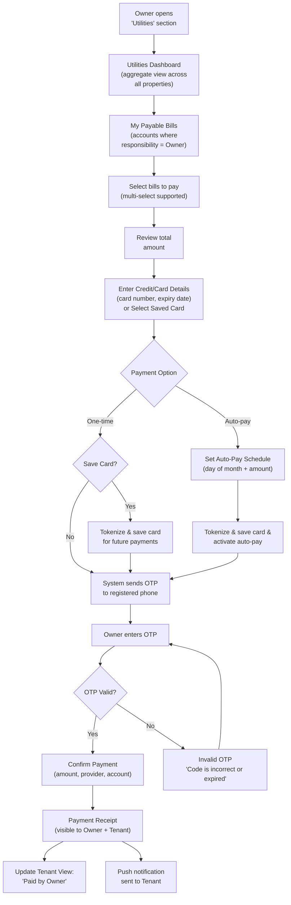
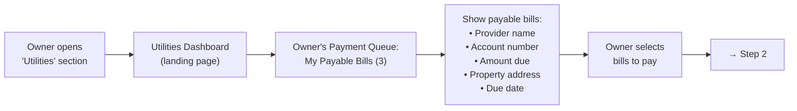
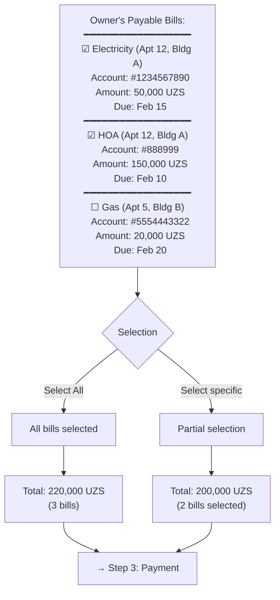
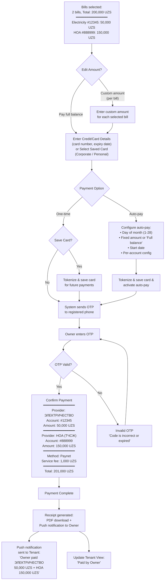
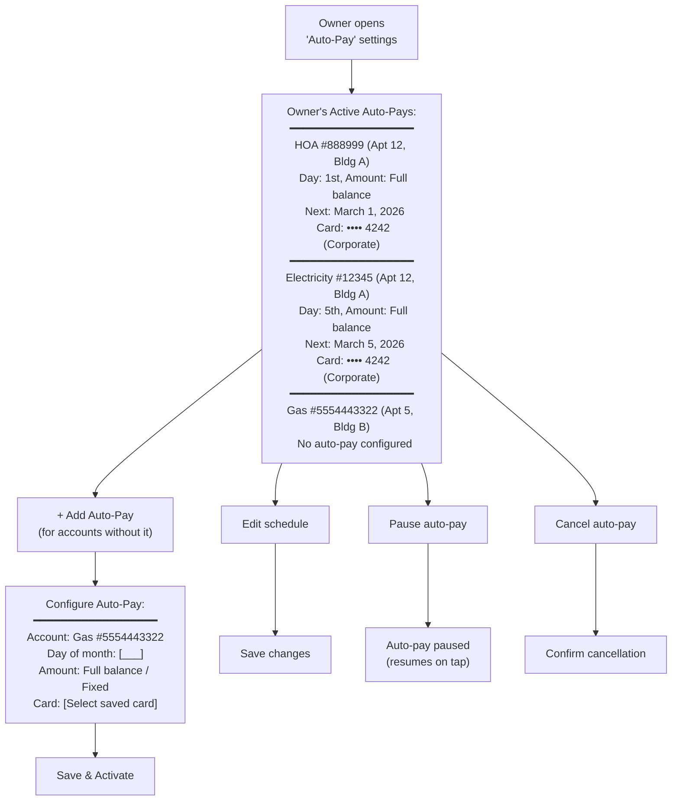
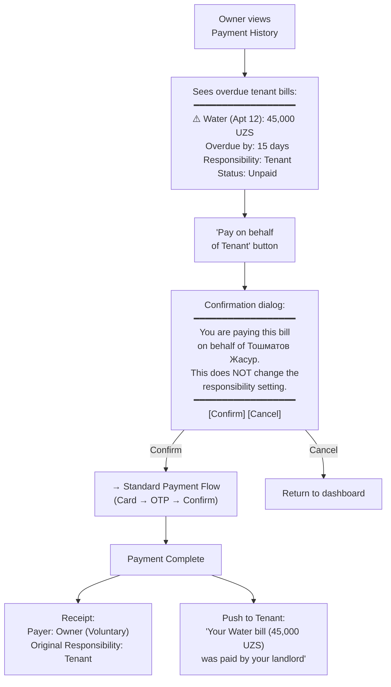
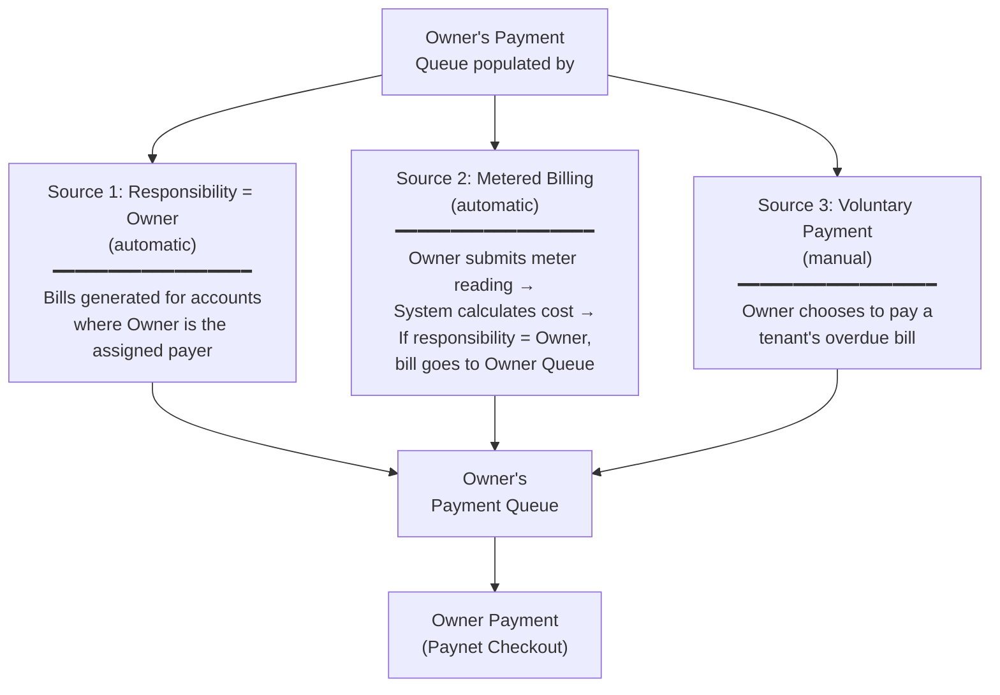
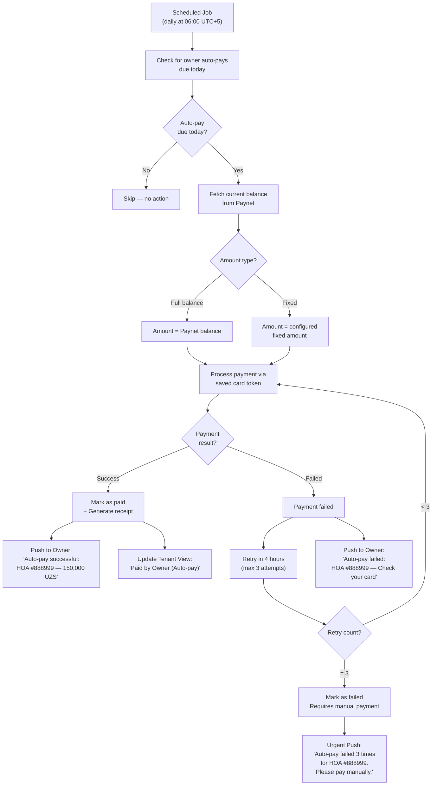
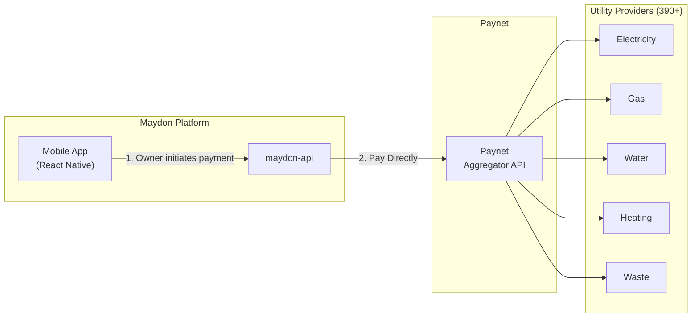

# Utilities Payment — Owner Payment User Flow & API Design

> **Module:** `utility` (extends `building` module)  
> **Actor:** Owner / Agent (`typ: "Owner"` or `typ: "Agent"` in JWT)  
> **Integration:** Paynet (utility aggregator, 390+ providers)  
> **Payment Method:** Paynet → Direct payment to provider via Paynet Aggregator  
> **Related:** [Tenant Utilities Flow](./utilities-payment-userflow.md) | [Owner Management Flow](./Utilities%20-%20Business%20Owner.md)

---

## Design Decisions (Confirmed)

| # | Decision | Choice |
|---|----------|--------|
| 1 | Scope | Owner pays for utility accounts where `responsibility = Owner`, or voluntarily pays tenant's overdue bills |
| 2 | Payment trigger | Bills appear in Owner's Payment Queue when responsibility is set to "Owner" or when Owner chooses to cover a tenant's debt |
| 3 | Payment routing | Direct to provider: Maydon sends payment request to Paynet, Paynet pays provider directly (same integration as Tenant flow) |
| 4 | Multi-select | Owner can select and pay multiple bills at once across different properties |
| 5 | Payment visibility | Both Tenant and Owner can see the payment receipt; Tenant sees "Paid by Owner" |
| 6 | Card saving | Owner can save card (corporate or personal) after entering details — available for both one-time and auto-pay |
| 7 | Payment method | Paynet (sole payment method), direct payment to provider via Paynet |
| 8 | Auto-payment | Included in v1 — scheduled recurring payments for Owner-responsible accounts |
| 9 | Debt context | When Owner takes responsibility for an account with pre-existing debt, the UI transparently shows the breakdown |

---

## 1. High-Level Owner Payment Flow Overview

---

## 2. Detailed User Flow — Step-by-Step

### Step 1: Open "Utilities" Section → Dashboard → Payment Queue

**Screen:** Utilities Dashboard with a prominent "My Payable Bills" section at the top. Shows a count badge (e.g., "3") indicating the number of outstanding owner-responsible bills.  
**Data source:** Fetches all utility accounts for the owner's properties where `responsibility_type = 'owner'` and there is an outstanding balance. Also includes any tenant bills the owner has chosen to pay voluntarily.  
**Display:** Each bill card shows: Provider icon + name, лицевой счет number, amount due, property address, due date, and a checkbox for multi-select.

---

### Step 2: Select Bills & Review Total

**Key UX considerations:**
- **Multi-select support.** Owner can check/uncheck individual bills or use "Select All"
- **Per-property grouping.** Bills are grouped by property for clarity (e.g., "Apt 12, Building A" has two bills underneath)
- **Sort/filter options.** Owner can sort by: Due date (nearest first), Amount (highest first), Property
- **Debt context banner.** If any account has pre-existing debt from before the owner took responsibility, a subtle warning appears:

> ⚠️ **Total Due: 150,000 UZS** — Includes approx. 100,000 UZS incurred before you took responsibility.

---

### Step 3: Payment

**Key UX considerations:**
- **Saved cards.** Owner can select from previously saved cards (labeled Corporate or Personal) or enter a new card
- **Custom amounts.** When choosing custom amounts, the owner sets the amount per-bill (not a single total). Each bill can be partially paid
- **Multi-bill payment.** Paynet processes each bill payment individually, but the UX presents it as a single checkout for convenience
- **Service fee.** Displayed clearly before confirmation — per-transaction fee from Paynet
- **Receipt.** Shows the Owner's name as payer. Both Owner and Tenant can view the receipt

---

### Step 4: Auto-Pay Management (Owner)

**How it works:**
- **Only for Owner-responsible accounts.** Auto-pay can only be configured for accounts where `responsibility = Owner`
- **Card selection.** Owner selects from saved cards or adds a new one. Cards can be labeled (e.g., "Corporate AmEx," "Personal Visa")
- **Schedule.** Configurable per account — each account can have its own schedule (day of month, amount type)
- **Notifications.** Owner receives a push notification before each auto-pay execution (1 day before) and after (success/failure)

---

### Step 5: Voluntary Tenant Bill Payment

> **Context:** Sometimes the Owner wants to pay a tenant's overdue bill as a gesture or to avoid provider penalties, even though responsibility is set to "Tenant."

**Key UX considerations:**
- **No responsibility change.** Paying on behalf does NOT flip the responsibility toggle. The tenant will still be responsible for future bills on this account
- **Receipt labeling.** The receipt clearly shows "Payer: Owner (Voluntary)" to distinguish from bills where the owner is the assigned payer
- **Tenant notification.** Tenant receives a push notification acknowledging the payment

---

## 3. Payment Queue Sources

---

## 4. Owner Payment vs Tenant Payment Comparison

| Aspect | Tenant Flow | Owner Flow |
|--------|------------|------------|
| **Entry point** | "Pay" section → "Utilities" | "Utilities" Dashboard → "My Payable Bills" |
| **Property selection** | Selects from active leases | Selects from owned properties (or pays from queue) |
| **Bill source** | Bills where `responsibility = Tenant` | Bills where `responsibility = Owner` + voluntary payments |
| **Multi-select** | No (pays one bill at a time) | Yes (can pay multiple bills at once) |
| **Provider selection** | Yes (flat list) | No (bills already linked to specific providers) |
| **Лицевой счет** | Pre-filled (read-only) or manual entry | Already configured by Owner in Account Management |
| **Amount editing** | Pay full balance or custom | Pay full balance or custom (per bill) |
| **Card types** | Personal cards | Corporate or Personal cards |
| **Auto-pay** | Per account, tenant-controlled | Per account, owner-controlled (only for owner-responsible accounts) |
| **Payment method** | Paynet | Paynet (same integration) |
| **OTP verification** | Yes | Yes |
| **Receipt** | "Paid by: Tenant" | "Paid by: Owner" or "Paid by: Owner (Voluntary)" |
| **Notification** | Push to Owner | Push to Tenant |
| **Debt context** | Not applicable | Shows pre-existing debt breakdown when responsibility was transferred |

---

## 5. Auto-Pay for Owner: Execution Flow

---

## 6. Integration Points Summary

