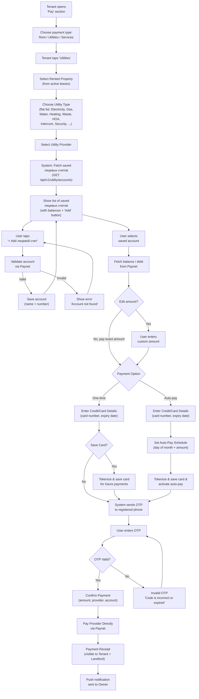
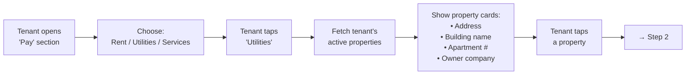
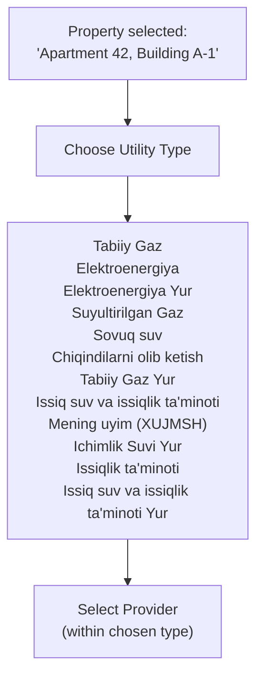
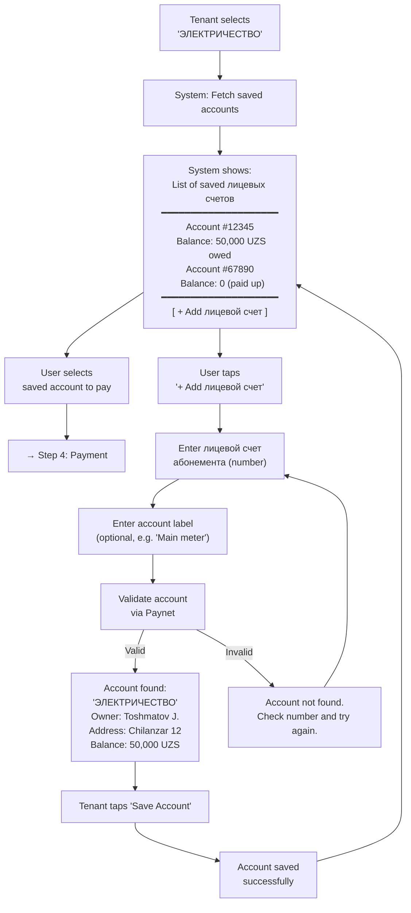
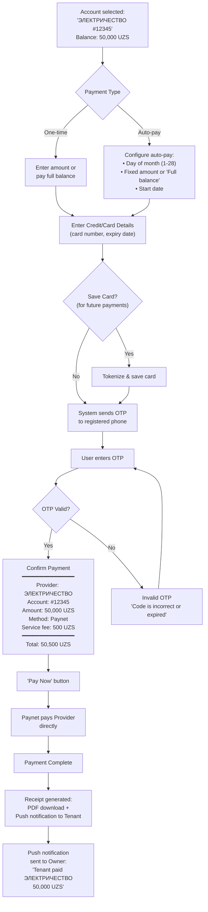
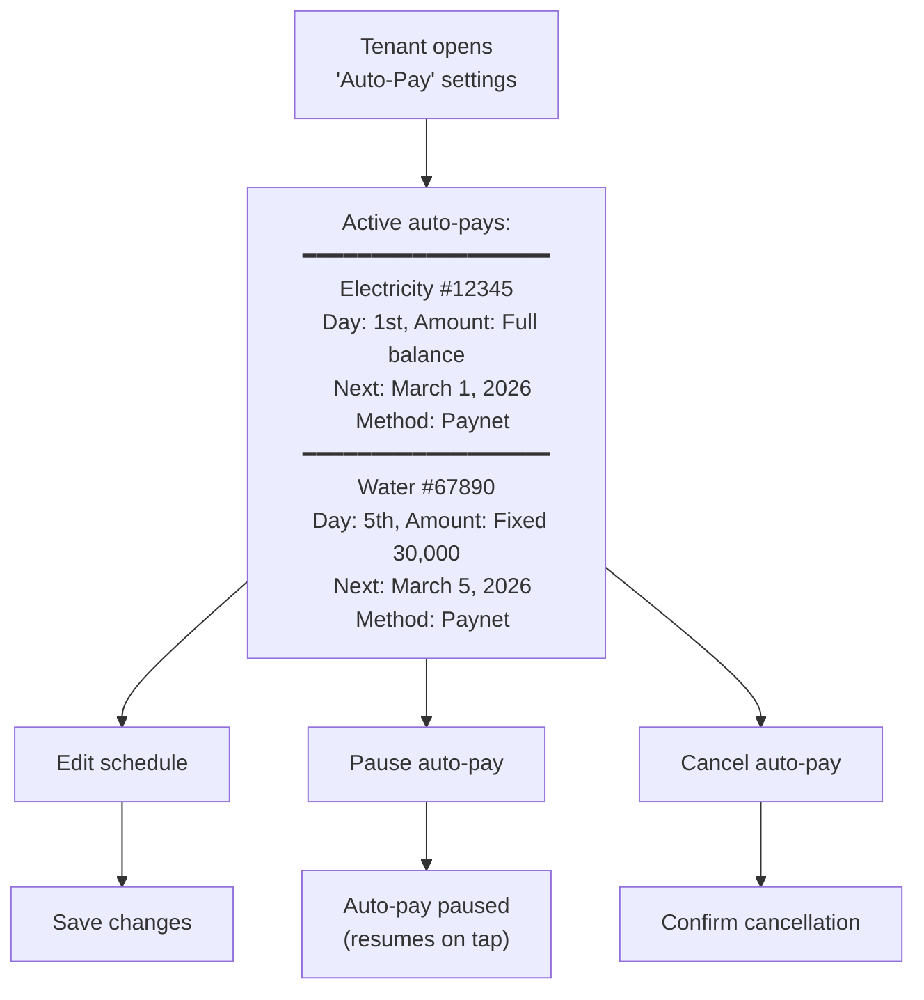
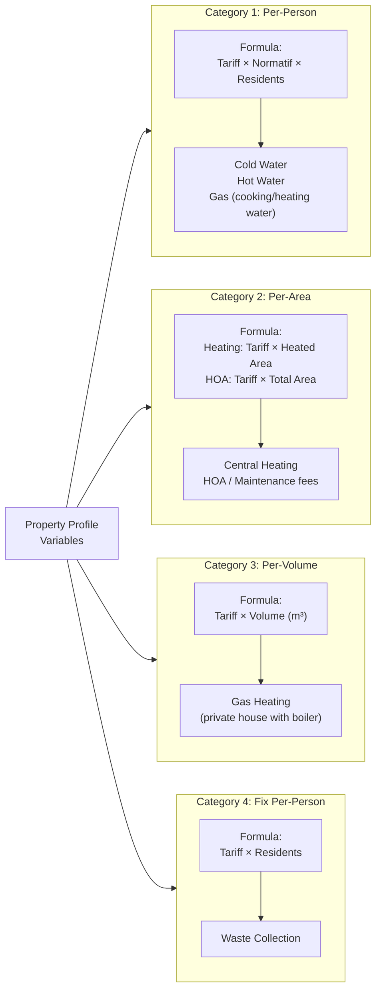
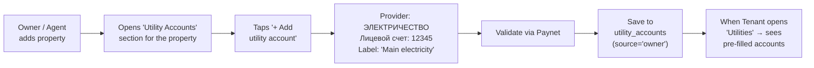
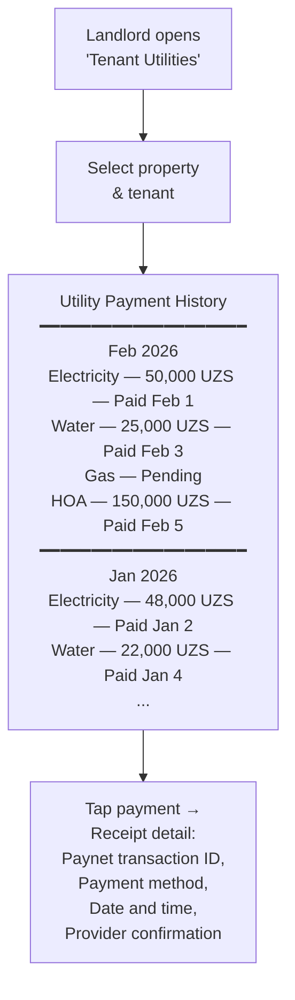
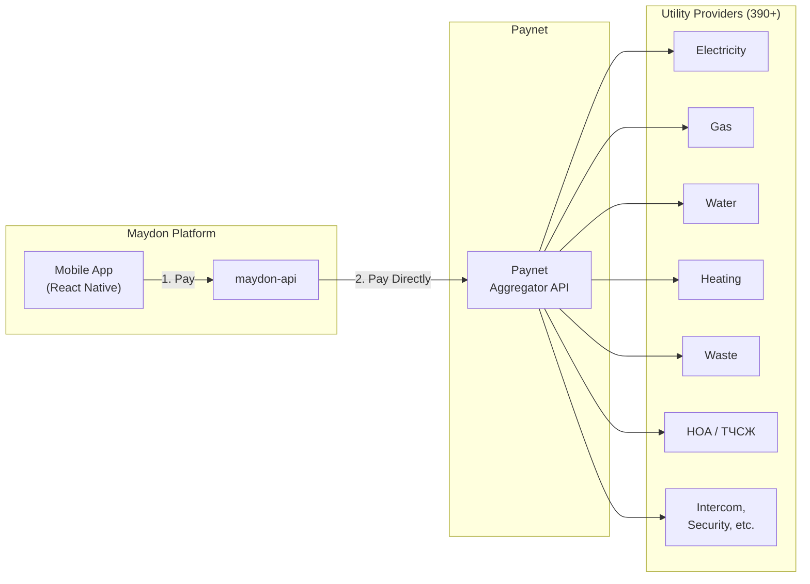

# Utilities Payment — Tenant User Flow & API Design

> **Module:** `utility` (new module)  
> **Actor:** Tenant (Client role, `typ: "Client"` in JWT)  
> **Integration:** Paynet (utility aggregator, 390+ providers)  
> **Payment Method:** Paynet → Direct payment to provider via Paynet Aggregator  

---

## Design Decisions (Confirmed)

| # | Decision | Choice |
|---|----------|--------|
| 1 | Scope | All utility types displayed as a flat list (Electricity, Gas, Water, Heating, Waste, HOA, Intercom, etc.) — no category grouping |
| 2 | Metering relationship | Hybrid: metered → readings + billing engine; non-metered → Paynet direct via лицевой счет |
| 3 | Лицевой счет ownership | Both: Owner pre-fills, Tenant can add/edit |
| 4 | Payment routing | Direct to provider: Maydon sends payment request to Paynet, Paynet pays provider directly |
| 5 | Payment visibility | Both Tenant and Landlord can see utility payment history |
| 6 | Account persistence | Tenant saves лицевой счет numbers, re-pays quickly each month |
| 7 | Payment method | Paynet (sole payment method), direct payment to provider via Paynet |
| 8 | Auto-payment | Included in v1 — scheduled recurring utility payments |
| 9 | Card saving | Tenant can save card after entering details — available for both one-time and auto-pay |

---

## 1. High-Level User Flow Overview



---

## 2. Detailed User Flow — Step-by-Step

### Step 1: Open "Pay" Section → Choose "Utilities" → Select Property



**Screen:** "Pay" section with three large tiles: Rent, Utilities, Services. After tapping "Utilities" — property selector carousel/list.  
**Data source:** Uses the tenant's active lease data to show all properties they're currently renting.  
**Display:** Property photo (from real estate images), address, building name, owner company name.

---

### Step 2: Choose Utility Type



**Screen:** Scrollable grid of utility types, each with icon + name. Search bar at top for filtering.  
**Data source:** Fetches the list of available utility providers, filterable by utility type (e.g. Gas, Electricity, Water).

---

### Step 3: Select Provider → Show List of Saved Лицевых Счетов → Add / Select



**Key UX considerations:**
- **System always shows the saved accounts list** — after the user selects a provider, the system fetches and displays all saved лицевых счетов for that provider/lease combination. This is a system-initiated action, not a user action.
- The list screen **always includes a "+ Add лицевой счет" button** at the bottom, so the user can add a new account at any time.
- If no saved accounts exist (first time), the list appears empty with an empty-state message and the "+ Add лицевой счет" button.
- Owner-prefilled accounts should appear automatically (marked as "Owner" source).
- Tenant-added accounts marked as "Tenant" source.
- Balance/debt displayed in real-time from Paynet (fetched with `include_balance=true`).
- After saving a new account, the user is returned to the list screen (now including the newly added account).
- For **metered utilities** (electricity, gas, water): if the property has meters in our system, show the meter readings data alongside the Paynet balance for cross-reference.

---

### Step 4: Payment



---

### Step 5: Auto-Pay Management



---

## 3. Non-Metered Billing Logic — Calculation Categories

> **Context:** When a property has no meter installed for a given utility, the billing amount is calculated using regulated tariffs and property/tenant variables. Each utility type falls into one of the calculation categories below. All variables must be stored **per-service** (not globally) to avoid cross-contamination between providers.

---

### 3.1 Calculation Categories Overview



---

### 3.2 Detailed Formulas Per Service

#### Category 1 — Per-Person with Normatif

| Service | Formula | Variables |
|---------|---------|-----------|
| Cold Water (no meter) | `Tariff × Normatif_CW × Residents` | Normatif = liters/person/month |
| Hot Water (no meter) | `Tariff × Normatif_HW × Residents` | Normatif = liters/person/month |
| Gas — cooking | `Tariff × Normatif_Gas × Residents` | Normatif = m³/person/month |

> [!IMPORTANT]
> **Residents count is per-service, not global.** If an inspector from one provider (e.g., Mahsustrans) files an act for 5 actual residents, this does NOT affect the resident count used by another provider (e.g., Suvsoz which still charges for 2 registered). Each utility account must store its own `residents_count` field.

#### Category 2 — Per-Area

| Service | Formula | Area Variable |
|---------|---------|---------------|
| Central Heating | `Tariff × Heated_Area` | `heated_area` — excludes balconies, loggias |
| HOA / Maintenance | `Tariff × Total_Area` | `total_area` — full area including balconies |

> [!WARNING]
> **Two independent area fields required in the property profile:**
> - `total_area` (m²) — used for HOA/maintenance calculations
> - `heated_area` (m²) — used for heating calculations
>
> These values differ for most apartments. Using a single area field will produce incorrect charges for one of the two calculations.

#### Category 3 — Per-Volume (Cubature)

| Service | Formula | Variables |
|---------|---------|-----------|
| Gas Heating (private house, no meter) | `Tariff × Volume` | `volume` = area × ceiling height (m³) |

> [!NOTE]
> This category applies only to private houses with a gas boiler and no gas meter. Volume (m³) depends on ceiling height, which means the property profile must store `ceiling_height` or `volume_m3` directly.

#### Category 4 — Fix Per-Person (no normatif)

| Service | Formula | Variables |
|---------|---------|-----------|
| Waste Collection | `Tariff × Residents` | No normatif — tariff already includes per-person rate |

> [!IMPORTANT]
> Waste collection does NOT use a normatif multiplier. The tariff is already set as a fix rate per person. Applying a normatif would double-count.

---

### 3.3 Sewage (Kanalizatsiya) — Special Logic

Sewage is always calculated as the **sum of cold water and hot water consumption**, regardless of whether those are metered or non-metered:

```
Sewage Volume = Cold_Water_Usage + Hot_Water_Usage
Sewage Amount = Sewage_Tariff × Sewage_Volume
```

| Scenario | Cold Water Source | Hot Water Source | Sewage Calculation |
|----------|-------------------|------------------|--------------------|
| Both metered | Meter reading CW | Meter reading HW | `Sewage = (CW_reading) + (HW_reading)` |
| Both non-metered | `Normatif_CW × Residents` | `Normatif_HW × Residents` | `Sewage = (Norm_CW × Res) + (Norm_HW × Res)` |
| Hybrid (CW metered, HW not) | Meter reading CW | `Normatif_HW × Residents` | `Sewage = (CW_reading) + (Norm_HW × Res)` |

> [!CAUTION]
> The sewage formula must always sum **both** water sources. An algorithm that references a single abstract "water" normatif will break in hybrid scenarios (e.g., cold water meter installed, hot water non-metered).

---

### 3.4 Metered vs Non-Metered Settlement Flow


---

## 4. Owner Pre-Fill Flow (Landlord Side)



---

## 5. Landlord View — Utility Payment History




---

## 6. Integration Points Summary


