# Utilities Payment — Tenant User Flow & API Design

> **Module:** `utility` (new module)  
> **Actor:** Tenant (Client role, `typ: "Client"` in JWT)  
> **Integration:** Paynet (utility aggregator, 390+ providers)  
> **Payment Method:** Paynet → Direct payment to provider via Paynet Aggregator  

---

## Design Decisions (Confirmed)

| # | Decision | Choice |
|---|----------|--------|
| 1 | Scope | All utility types displayed as a flat list (Electricity, Gas, Water, Heating, Waste, HOA, Intercom, etc.) — no category grouping |
| 2 | Metering relationship | Hybrid: metered → readings + billing engine; non-metered → Paynet direct via лицевой счет |
| 3 | Лицевой счет ownership | Both: Owner pre-fills, Tenant can add/edit |
| 4 | Payment routing | Direct to provider: Maydon sends payment request to Paynet, Paynet pays provider directly |
| 5 | Payment visibility | Both Tenant and Landlord can see utility payment history |
| 6 | Account persistence | Tenant saves лицевой счет numbers, re-pays quickly each month |
| 7 | Payment method | Paynet (sole payment method), direct payment to provider via Paynet |
| 8 | Auto-payment | Included in v1 — scheduled recurring utility payments |
| 9 | Card saving | Tenant can save card after entering details — available for both one-time and auto-pay |

---

## 1. High-Level User Flow Overview

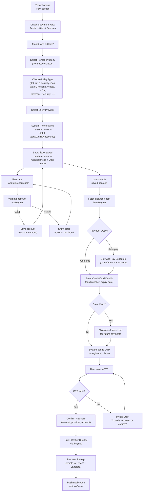

---

## 2. Detailed User Flow — Step-by-Step

### Step 1: Open "Pay" Section → Choose "Utilities" → Select Property

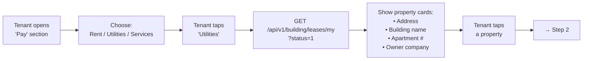

**Screen:** "Pay" section with three large tiles: Rent, Utilities, Services. After tapping "Utilities" — property selector carousel/list.  
**Data source:** Existing `GET /api/v1/building/leases/my` endpoint — returns active leases.  
**Display:** Property photo (from real estate images), address, building name, owner company name.

---

### Step 2: Choose Utility Type

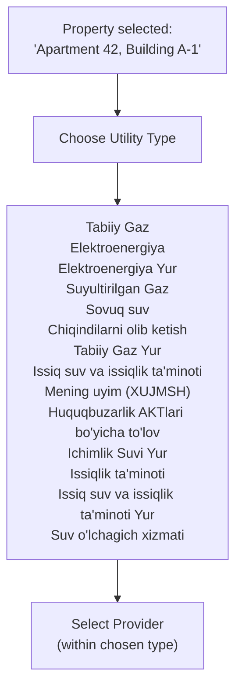

**Screen:** Scrollable grid of utility types, each with icon + name. Search bar at top for filtering.  
**Data source:** New `GET /api/v1/utility/providers` endpoint with `utility_type` filter.

---

### Step 3: Select Provider → Show Saved Лицевых Счетов → Add / Select

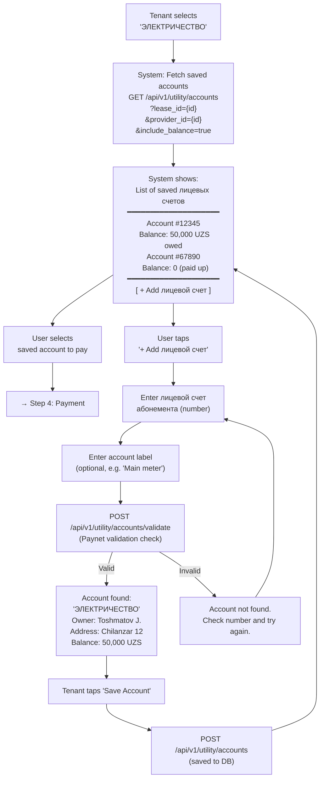

**Key UX considerations:**
- **System always shows the saved accounts list** — after the user selects a provider, the system fetches and displays all saved лицевых счетов for that provider/lease combination. This is a system-initiated action, not a user action.
- The list screen **always includes a "+ Add лицевой счет" button** at the bottom, so the user can add a new account at any time.
- If no saved accounts exist (first time), the list appears empty with an empty-state message and the "+ Add лицевой счет" button.
- Owner-prefilled accounts should appear automatically (marked as "Owner" source).
- Tenant-added accounts marked as "Tenant" source.
- Balance/debt displayed in real-time from Paynet (fetched with `include_balance=true`).
- After saving a new account, the user is returned to the list screen (now including the newly added account).
- For **metered utilities** (electricity, gas, water): if the property has meters in our system, show the meter readings data alongside the Paynet balance for cross-reference.

---

### Step 4: Payment

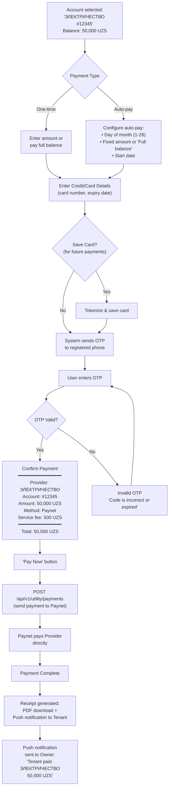

---

### Step 5: Auto-Pay Management

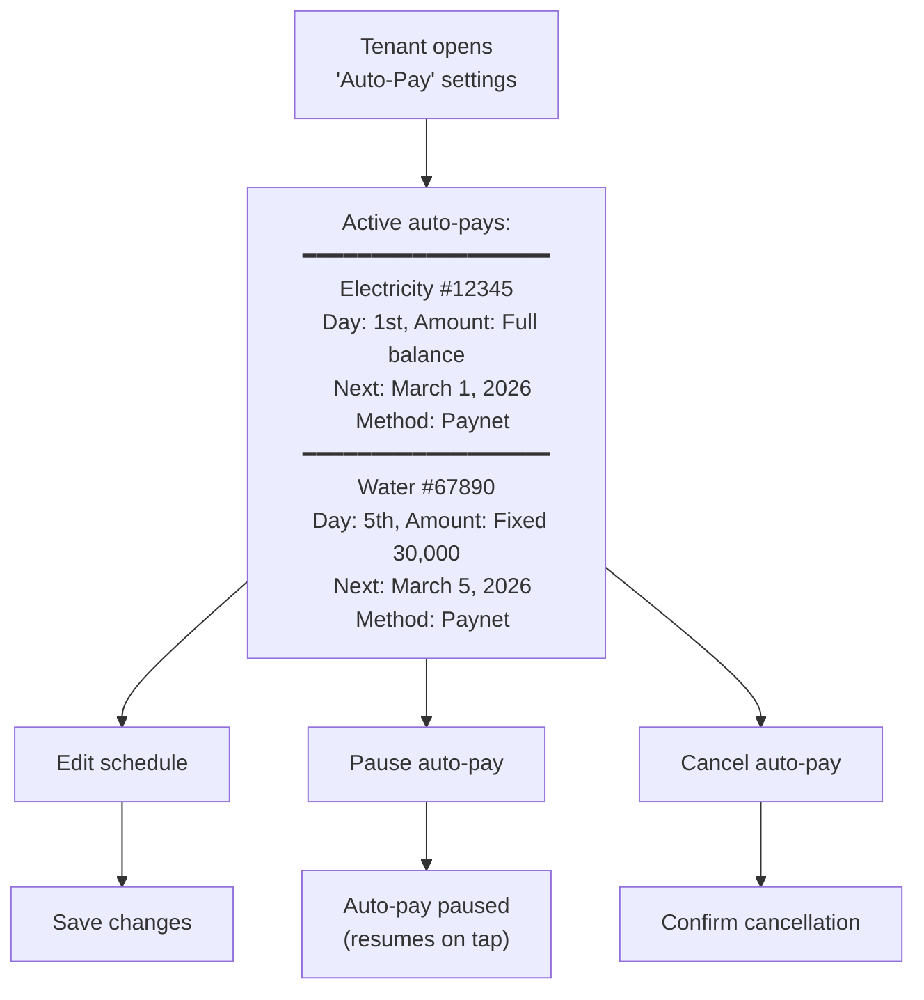

---

## 3. Non-Metered Billing Logic — Calculation Categories

> **Context:** When a property has no meter installed for a given utility, the billing amount is calculated using regulated tariffs and property/tenant variables. Each utility type falls into one of the calculation categories below. All variables must be stored **per-service** (not globally) to avoid cross-contamination between providers.

---

### 3.1 Calculation Categories Overview

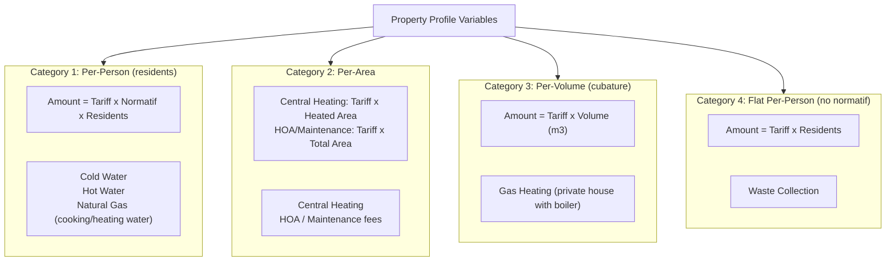

---

### 3.2 Detailed Formulas Per Service

#### Category 1 — Per-Person with Normatif

| Service | Formula | Variables |
|---------|---------|-----------|
| Cold Water (no meter) | `Tariff × Normatif_CW × Residents` | Normatif = liters/person/month |
| Hot Water (no meter) | `Tariff × Normatif_HW × Residents` | Normatif = liters/person/month |
| Natural Gas — cooking | `Tariff × Normatif_Gas × Residents` | Normatif = m³/person/month |

> [!IMPORTANT]
> **Residents count is per-service, not global.** If an inspector from one provider (e.g., Mahsustrans) files an act for 5 actual residents, this does NOT affect the resident count used by another provider (e.g., Suvsoz which still charges for 2 registered). Each utility account must store its own `residents_count` field.

#### Category 2 — Per-Area

| Service | Formula | Area Variable |
|---------|---------|---------------|
| Central Heating | `Tariff × Heated_Area` | `heated_area` — excludes balconies, loggias |
| HOA / Maintenance | `Tariff × Total_Area` | `total_area` — full area including balconies |

> [!WARNING]
> **Two independent area fields required in the property profile:**
> - `total_area` (m²) — used for HOA/maintenance calculations
> - `heated_area` (m²) — used for heating calculations
>
> These values differ for most apartments. Using a single area field will produce incorrect charges for one of the two calculations.

#### Category 3 — Per-Volume (Cubature)

| Service | Formula | Variables |
|---------|---------|-----------|
| Gas Heating (private house, no meter) | `Tariff × Volume` | `volume` = area × ceiling height (m³) |

> [!NOTE]
> This category applies only to private houses with a gas boiler and no gas meter. Volume (m³) depends on ceiling height, which means the property profile must store `ceiling_height` or `volume_m3` directly.

#### Category 4 — Flat Per-Person (no normatif)

| Service | Formula | Variables |
|---------|---------|-----------|
| Waste Collection | `Tariff × Residents` | No normatif — tariff already includes per-person rate |

> [!IMPORTANT]
> Waste collection does NOT use a normatif multiplier. The tariff is already set as a flat rate per person. Applying a normatif would double-count.

---

### 3.3 Sewage (Kanalizatsiya) — Special Logic

Sewage is always calculated as the **sum of cold water and hot water consumption**, regardless of whether those are metered or non-metered:

```
Sewage Volume = Cold_Water_Usage + Hot_Water_Usage
Sewage Amount = Sewage_Tariff × Sewage_Volume
```

| Scenario | Cold Water Source | Hot Water Source | Sewage Calculation |
|----------|-------------------|------------------|--------------------|
| Both metered | Meter reading CW | Meter reading HW | `Sewage = (CW_reading) + (HW_reading)` |
| Both non-metered | `Normatif_CW × Residents` | `Normatif_HW × Residents` | `Sewage = (Norm_CW × Res) + (Norm_HW × Res)` |
| Hybrid (CW metered, HW not) | Meter reading CW | `Normatif_HW × Residents` | `Sewage = (CW_reading) + (Norm_HW × Res)` |

> [!CAUTION]
> The sewage formula must always sum **both** water sources. An algorithm that references a single abstract "water" normatif will break in hybrid scenarios (e.g., cold water meter installed, hot water non-metered).

---

### 3.4 Electricity Penalty — Violation Act Formula

When an inspector issues a violation act (huquqbuzarlik akti), the penalty is calculated as:

```
Penalty = Appliance_Power (kW) × 24 hours × Days_in_Period × Tariff
```

| Variable | Description |
|----------|-------------|
| `appliance_power` | Total power of connected appliances (kW) |
| `24` | Hours per day (constant) |
| `days_in_period` | Number of days in the billing period or as specified in the act |
| `tariff` | Electricity tariff per kWh |

> [!WARNING]
> Without the `days_in_period` multiplier, the formula only calculates one day of usage, severely undercharging the penalty.

---

### 3.5 Required Property Profile Variables

| Variable | Type | Used By | Notes |
|----------|------|---------|-------|
| `total_area` | decimal (m²) | HOA, Maintenance | Full apartment area including balconies |
| `heated_area` | decimal (m²) | Central Heating | Excludes balconies, loggias |
| `volume_m3` | decimal (m³) | Gas Heating (private) | = area × ceiling height |
| `ceiling_height` | decimal (m) | Derived for volume | Optional if volume_m3 is set directly |

| Variable | Type | Scope | Used By | Notes |
|----------|------|-------|---------|-------|
| `residents_count` | int | **Per utility account** | Categories 1, 4, Sewage | Must be per-service, not global |
| `normatif` | decimal | Per utility type | Categories 1 | Set by regulator, varies by service |

---

### 3.6 Metered vs Non-Metered Settlement Flow

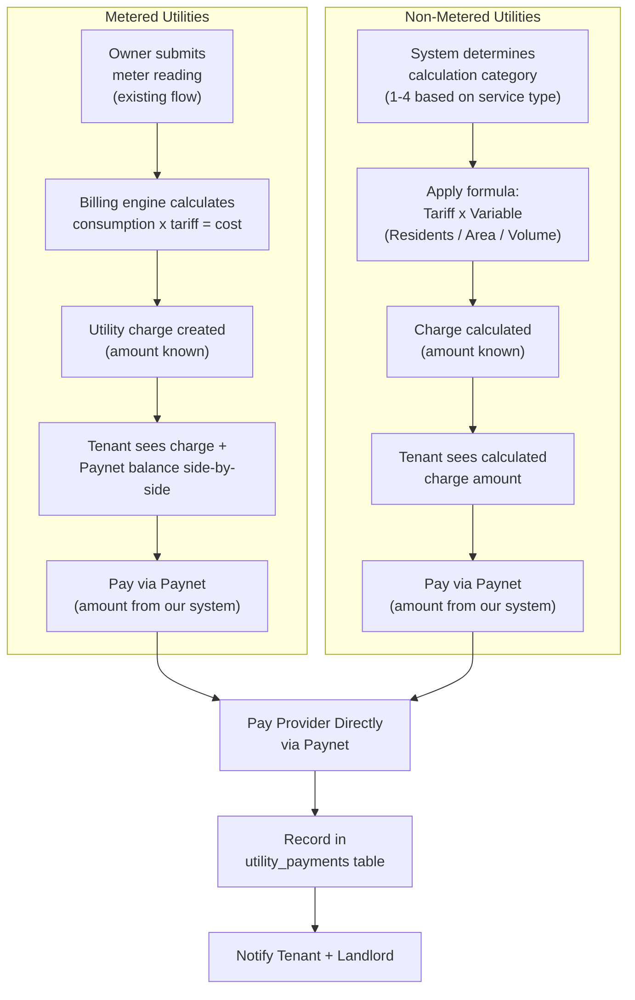

---

## 4. Owner Pre-Fill Flow (Landlord Side)

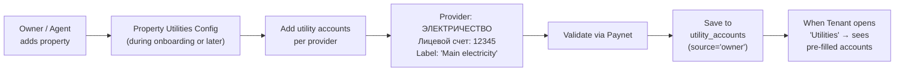

---

## 5. Payment Processing — Technical Sequence

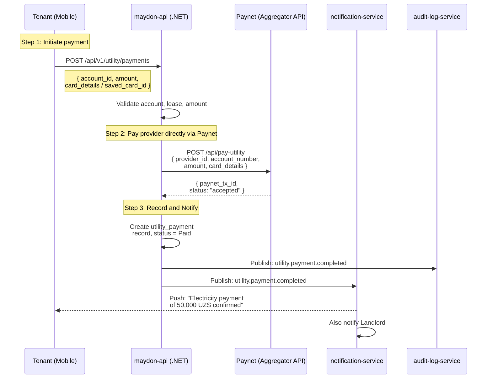

---

## 6. Auto-Pay Execution — Technical Sequence

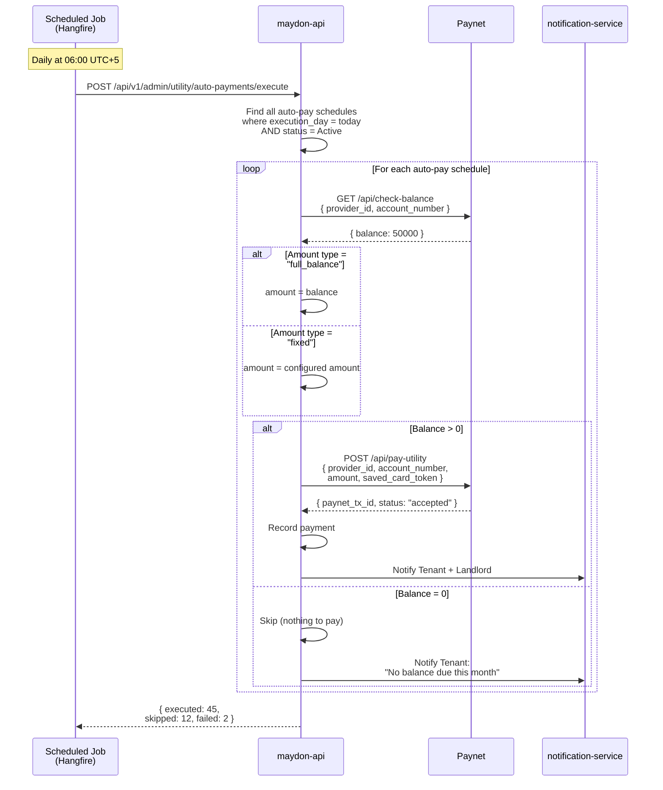

---

## 7. Landlord View — Utility Payment History

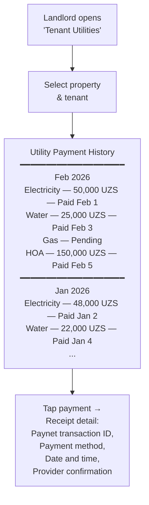

---

## 8. Entity Relationship — New Tables

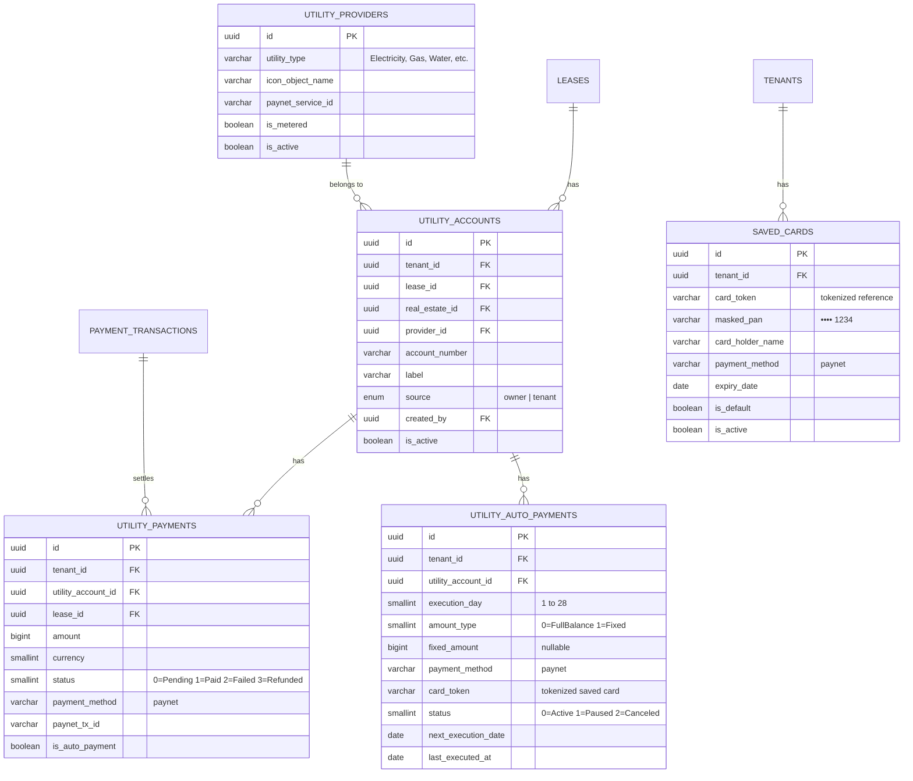

---

## 9. API Endpoints to Add

**Base path:** `/api/v1/utility`  
**Auth:** All endpoints require `Authorization: Bearer {token}`.

---

### 9.1 Utility Providers

#### List Providers

```
GET /api/v1/utility/providers
```

**Auth:** `[public]`

**Query parameters:**

| Parameter | Type | Required | Description |
|-----------|------|----------|-------------|
| utility_type | string | No | Filter by utility type (e.g. "Electricity", "Gas", "Water") |
| name_search | string | No | Search by provider name |
| is_metered | bool | No | Filter metered vs non-metered |
| page | int | No | Default: 1 |
| page_size | int | No | Default: 50 |

**Response 200:**

```json
{
  "success": true,
  "data": {
    "items": [
      {
        "id": "uuid",
        "name": "ЭЛЕКТРИЧЕСТВО",
        "utility_type": "Electricity",
        "user_type": "Individual",
        "location": "General",
        "icon_url": "string",
        "paynet_service_id": "string",
        "is_metered": true,
        "account_number_label": "Лицевой счет абонемента",
        "account_number_mask": "##########",
        "account_number_length": 10,
        "is_active": true
      }
    ],
    "pagination": { "page": 1, "page_size": 50, "total_items": 45, "total_pages": 1 }
  }
}
```

**Notes:**
- `utility_type` — flat type label (Electricity, Gas, Water, Heating, Waste, HOA, Intercom, Security, etc.)
- `account_number_label` — localized label for the input field (e.g., "Лицевой счет абонемента")
- `account_number_mask` — input mask for client-side validation
- `account_number_length` — expected digit count for validation
- `paynet_service_id` — Paynet's internal service identifier (used in validation and payment calls)

---

### 9.3 Utility Accounts (Лицевой Счёт)

#### Validate Account via Paynet BVM

```
POST /api/v1/utility/accounts/validate
```

**Auth:** `[authenticated]`

**Request:**

```json
{
  "provider_id": "uuid, required",
  "account_number": "string, required, max:50"
}
```

**Response 200:**

```json
{
  "success": true,
  "data": {
    "is_valid": true,
    "account_holder_name": "Тошматов Жасур Каримович",
    "address": "Ташкент, Чиланзар, 12",
    "current_balance": 50000,
    "currency": "UZS",
    "provider_name": "ЭЛЕКТРИЧЕСТВО",
    "paynet_account_id": "string"
  }
}
```

**Error Response (invalid account):**

```json
{
  "success": false,
  "data": null,
  "error": {
    "code": "ACCOUNT_NOT_FOUND",
    "message": "Лицевой счет не найден. Проверьте номер и попробуйте снова."
  }
}
```

**Business rules:**
- Calls Paynet BVM (Biller Validation Module) to verify the account
- Returns account holder info, address, and current balance/debt
- Does NOT save the account yet — only validates

---

#### Save Utility Account

```
POST /api/v1/utility/accounts
```

**Auth:** `[authenticated]`

**Request:**

```json
{
  "lease_id": "uuid, required",
  "provider_id": "uuid, required",
  "account_number": "string, required, max:50",
  "label": "string, optional, max:200, e.g. 'Main electricity meter'"
}
```

**Response 201:**

```json
{
  "success": true,
  "data": {
    "id": "uuid",
    "provider": { "id": "uuid", "name": "ЭЛЕКТРИЧЕСТВО", "icon_url": "string" },
    "account_number": "1234567890",
    "label": "Main electricity meter",
    "source": "tenant",
    "current_balance": 50000,
    "currency": "UZS",
    "created_at": "2026-02-09T12:00:00Z"
  }
}
```

**Business rules:**
- `tenant_id` auto-set from JWT
- `real_estate_id` auto-set from the lease's `real_estate_id`
- `source` = `"tenant"` if created by the tenant, `"owner"` if pre-filled by landlord
- `created_by` = JWT `user_id`
- Must validate via Paynet BVM before saving (re-validates automatically)
- Duplicate check: one account number per provider per lease
- `lease_id` must reference an active lease where `client_tenant_id` = JWT `tenant_id`

**Status codes:** 201, 400, 404 (lease/provider not found), 409 (duplicate account), 422 (account validation failed)

---

#### List My Utility Accounts

```
GET /api/v1/utility/accounts
```

**Auth:** `[authenticated]`

**Query parameters:**

| Parameter | Type | Required | Description |
|-----------|------|----------|-------------|
| lease_id | uuid | No | Filter by lease (property) |
| provider_id | uuid | No | Filter by provider |
| category_id | uuid | No | Filter by provider category |
| include_balance | bool | No | Default: false. If true, fetches live balance from Paynet |

**Response 200:**

```json
{
  "success": true,
  "data": {
    "items": [
      {
        "id": "uuid",
        "provider": {
          "id": "uuid",
          "name": "ЭЛЕКТРИЧЕСТВО",
          "category": { "id": "uuid", "name": "Resource Supply" },
          "icon_url": "string",
          "is_metered": true
        },
        "account_number": "1234567890",
        "label": "Main electricity meter",
        "source": "owner",
        "current_balance": 50000,
        "currency": "UZS",
        "last_payment": {
          "amount": 48000,
          "paid_at": "2026-01-15T10:00:00Z"
        },
        "auto_payment": {
          "id": "uuid",
          "execution_day": 1,
          "amount_type": "full_balance",
          "status": "active"
        },
        "meter_data": {
          "meter_id": "uuid",
          "last_reading": 12450.500,
          "last_reading_date": "2026-02-01",
          "calculated_cost": 238340,
          "currency": "UZS"
        },
        "lease": {
          "id": "uuid",
          "real_estate_address": "Tashkent, Chilanzar, 12"
        },
        "created_at": "2026-01-01T10:00:00Z"
      }
    ]
  }
}
```

**Business rules:**
- Returns accounts for the current tenant (JWT `tenant_id`)
- If `include_balance=true`, makes batch Paynet BVM calls (max 10 per request for performance)
- `meter_data` populated only for metered providers if the property has a matching meter in our system
- `auto_payment` summary included if an active auto-pay schedule exists

---

#### Owner: Pre-Fill Utility Account

```
POST /api/v1/utility/accounts/owner
```

**Permission:** `utility-accounts:write`

**Request:**

```json
{
  "real_estate_id": "uuid, required",
  "provider_id": "uuid, required",
  "account_number": "string, required, max:50",
  "label": "string, optional, max:200"
}
```

**Response 201:** Same format as tenant save.

**Business rules:**
- `source` = `"owner"`
- `real_estate_id` must belong to the current tenant
- Account is visible to any tenant who has an active lease for this real estate
- Validates via Paynet BVM before saving

---

#### Update Utility Account

```
PUT /api/v1/utility/accounts/{id}
```

**Auth:** `[authenticated]`

**Request:**

```json
{
  "label": "string, optional, max:200"
}
```

**Response 200:** Updated account.

**Business rules:**
- Can only update `label` (account number is immutable — delete and re-create if wrong)
- Owner-created accounts cant be edited by the tenant (only label can be adjusted)

---

#### Delete Utility Account

```
DELETE /api/v1/utility/accounts/{id}
```

**Auth:** `[authenticated]`  
**Response 204**

**Business rules:**
- Soft delete
- Cannot delete if active auto-pay schedule exists (cancel auto-pay first)
- Owner-created accounts can only be deleted by the owner tenant
- Tenant-created accounts can be deleted by the tenant

---

### 9.4 Utility Payments

#### Create Utility Payment (One-Time)

```
POST /api/v1/utility/payments
```

**Auth:** `[authenticated]`

**Request:**

```json
{
  "utility_account_id": "uuid, required",
  "amount": "long, required, min:1, in integer Som (UZS)",
  "card_details": "object, required if no saved_card_id",
  "saved_card_id": "uuid, optional (use saved card)",
  "idempotency_key": "string, required, max:100"
}
```

**Response 201:**

```json
{
  "success": true,
  "data": {
    "id": "uuid",
    "utility_account": {
      "id": "uuid",
      "provider_name": "ЭЛЕКТРИЧЕСТВО",
      "account_number": "1234567890"
    },
    "amount": 50000,
    "service_fee": 500,
    "total_amount": 50500,
    "currency": "UZS",
    "payment_method": "paynet",
    "status": "completed",
    "paynet_tx_id": "paynet-uuid-123",
    "created_at": "2026-02-09T12:00:00Z"
  }
}
```

**Business rules:**
- `tenant_id` auto-set from JWT
- `lease_id` auto-resolved from the utility account's lease
- Sends payment directly to Paynet (provider receives funds immediately)
- Returns `paynet_tx_id` — used for tracking and receipt
- `service_fee` calculated based on tenant configuration (can be 0 if no markup)
- Idempotency: duplicate `idempotency_key` returns the existing payment
- Emits `utility.payment.initiated` event

**Status codes:** 201, 400, 404, 422 (account inactive, lease inactive)

---

#### Get Utility Payment Status

```
GET /api/v1/utility/payments/{id}
```

**Auth:** `[authenticated]`

**Response 200:**

```json
{
  "success": true,
  "data": {
    "id": "uuid",
    "utility_account": {
      "id": "uuid",
      "provider_name": "ЭЛЕКТРИЧЕСТВО",
      "account_number": "1234567890"
    },
    "amount": 50000,
    "service_fee": 500,
    "total_amount": 50500,
    "currency": "UZS",
    "payment_method": "paynet",
    "status": "completed",
    "transaction_id": "uuid",
    "paynet_transaction_id": "PN-2026-001234",
    "is_auto_payment": false,
    "paid_at": "2026-02-09T12:05:00Z",
    "created_at": "2026-02-09T12:00:00Z"
  }
}
```

**Status enum:** `pending`, `processing`, `completed`, `failed`, `refunded`, `expired`

---

#### List Utility Payments (Tenant)

```
GET /api/v1/utility/payments
```

**Auth:** `[authenticated]`

**Query parameters:**

| Parameter | Type | Required | Description |
|-----------|------|----------|-------------|
| lease_id | uuid | No | Filter by property |
| utility_account_id | uuid | No | Filter by account |
| provider_id | uuid | No | Filter by provider |
| category_id | uuid | No | Filter by provider category |
| status | int | No | 0=Pending, 1=Completed, 2=Failed, 3=Refunded |
| date_from | date | No | Filter by payment date |
| date_to | date | No | |
| is_auto_payment | bool | No | Filter auto vs manual |
| page | int | No | Default: 1 |
| page_size | int | No | Default: 20, max: 100 |
| sort_by | string | No | `created_at`, `amount` |
| sort_direction | string | No | `asc`, `desc`. Default: `desc` |

**Response 200:** Paginated list of utility payments.

---

#### List Tenant Utility Payments (Landlord View)

```
GET /api/v1/utility/payments/by-property/{realEstateId}
```

**Permission:** `utility-payments:read`

**Query parameters:** Same as tenant list + `client_tenant_id` (optional filter).

**Response 200:** Paginated list of all utility payments made by any tenant for this property.

**Business rules:**
- `real_estate_id` must belong to the current tenant (landlord)
- Shows payments from all tenants who rented this property
- Does NOT show payment method details (privacy) — only provider, amount, status, date

---

### 9.5 Auto-Pay Schedules

#### Create Auto-Pay Schedule

```
POST /api/v1/utility/auto-payments
```

**Auth:** `[authenticated]`

**Request:**

```json
{
  "utility_account_id": "uuid, required",
  "execution_day": "int, required, min:1, max:28",
  "amount_type": "int, required, 0=FullBalance, 1=Fixed",
  "fixed_amount": "long, optional, required if amount_type=1, min:1",
  "saved_card_id": "uuid, required, saved card reference",
  "card_token": "string, required, tokenized saved card reference"
}
```

**Response 201:**

```json
{
  "success": true,
  "data": {
    "id": "uuid",
    "utility_account": {
      "id": "uuid",
      "provider_name": "ЭЛЕКТРИЧЕСТВО",
      "account_number": "1234567890"
    },
    "execution_day": 1,
    "amount_type": 0,
    "amount_type_name": "Full Balance",
    "fixed_amount": null,
    "payment_method": "paynet",
    "status": 0,
    "status_name": "Active",
    "next_execution_date": "2026-03-01",
    "created_at": "2026-02-09T12:00:00Z"
  }
}
```

**Business rules:**
- One auto-pay per utility account per tenant (duplicate check)
- `card_token` references a previously saved/tokenized card (from Payme/Click/Uzcard tokenization APIs)
- `next_execution_date` calculated as: nearest future date with `execution_day`
- Scheduled job (Hangfire) executes daily at 06:00 AM (Uzbekistan time)
- On execution: if payment fails, retry in 24h (max 3 attempts per cycle)
- After 3 failed attempts, set status to `Paused` and notify tenant

---

#### List Auto-Pay Schedules

```
GET /api/v1/utility/auto-payments
```

**Auth:** `[authenticated]`

**Query parameters:** `lease_id`, `utility_account_id`, `status`

**Response 200:** Paginated list of auto-pay schedules.

---

#### Update Auto-Pay Schedule

```
PUT /api/v1/utility/auto-payments/{id}
```

**Auth:** `[authenticated]`

**Request:**

```json
{
  "execution_day": "int, optional, min:1, max:28",
  "amount_type": "int, optional, 0=FullBalance, 1=Fixed",
  "fixed_amount": "long, optional",
  "card_token": "string, optional"
}
```

**Response 200:** Updated schedule.

---

#### Pause Auto-Pay

```
POST /api/v1/utility/auto-payments/{id}/pause
```

**Auth:** `[authenticated]`  
**Response 204**

---

#### Resume Auto-Pay

```
POST /api/v1/utility/auto-payments/{id}/resume
```

**Auth:** `[authenticated]`  
**Response 204**

**Business rules:**
- Recalculates `next_execution_date` from today

---

#### Cancel Auto-Pay

```
DELETE /api/v1/utility/auto-payments/{id}
```

**Auth:** `[authenticated]`  
**Response 204**

**Business rules:**
- Soft delete, sets `status` = Canceled

---

### 9.6 Admin: Execute Auto-Payments (Scheduled Job)

```
POST /api/v1/admin/utility/auto-payments/execute
```

**Permission:** `admin:utility:manage`

**Response 200:**

```json
{
  "success": true,
  "data": {
    "executed_count": 45,
    "skipped_count": 12,
    "failed_count": 2,
    "total_amount": 2500000,
    "currency": "UZS"
  }
}
```

---

### 9.7 Admin: Seed Utility Providers (Reference Data)

```
GET    /api/v1/admin/utility/providers                [admin:reference:read]
POST   /api/v1/admin/utility/providers                [admin:reference:write]
PUT    /api/v1/admin/utility/providers/{id}            [admin:reference:write]
DELETE /api/v1/admin/utility/providers/{id}            [admin:reference:write]
```

**Create/Update request:**

```json
{
  "utility_type": "string, required, max:100, e.g. 'Electricity', 'Gas', 'Water'",
  "paynet_service_id": "string, required, max:50",
  "user_type": "string, optional, max:50, 'Individual' | 'Legal Entity' | 'General'",
  "location": "string, optional, max:100",
  "is_metered": "boolean, required",
  "account_number_label": "string, optional, max:200",
  "account_number_mask": "string, optional, max:50",
  "account_number_length": "int, optional",
  "icon": "file, optional, provider icon image",
  "is_active": "boolean, required",
  "translations": [
    { "language_code": "uz", "name": "string, required, max:200" },
    { "language_code": "ru", "name": "string, required, max:200" }
  ]
}
```

---

## 10. New Database Tables

### Schema: utility

#### Table: utility_providers

| Column | Type | Nullable | Default | Max Length | FK | Index | Notes |
|--------|------|----------|---------|------------|-----|-------|-------|
| id | uuid | NO | gen_random_uuid() | - | - | PK | |
| utility_type | varchar | NO | - | 100 | - | ix_up_utility_type | e.g. "Electricity", "Gas", "Water", "HOA" |
| paynet_service_id | varchar | NO | - | 50 | - | uq_up_paynet_service | Paynet's internal service code |
| user_type | varchar | YES | NULL | 50 | - | - | "Individual", "Legal Entity", "General" |
| location | varchar | YES | NULL | 100 | - | - | "General", "Tashkent", etc. |
| is_metered | boolean | NO | false | - | - | - | Links to building.meters |
| icon_object_name | varchar | YES | NULL | 500 | - | - | MinIO key |
| account_number_label | varchar | YES | NULL | 200 | - | - | "Лицевой счет абонемента" |
| account_number_mask | varchar | YES | NULL | 50 | - | - | |
| account_number_length | smallint | YES | NULL | - | - | - | |
| sort_order | smallint | NO | 0 | - | - | - | |
| is_active | boolean | NO | true | - | - | - | |
| is_deleted | boolean | NO | false | - | - | - | |
| created_at | timestamptz | NO | now() | - | - | - | |

#### Table: utility_provider_translates

Same pattern: `id`, `provider_id (FK)`, `language_code`, `name`.

---

#### Table: utility_accounts

| Column | Type | Nullable | Default | Max Length | FK | Index | Notes |
|--------|------|----------|---------|------------|-----|-------|-------|
| id | uuid | NO | gen_random_uuid() | - | - | PK | |
| tenant_id | uuid | NO | - | - | companies(id) ON DELETE RESTRICT | ix_ua_tenant_id | |
| lease_id | uuid | YES | NULL | - | leases(id) ON DELETE SET NULL | ix_ua_lease_id | NULL for owner-created (linked via real_estate) |
| real_estate_id | uuid | NO | - | - | real_estates(id) ON DELETE RESTRICT | ix_ua_real_estate_id | |
| provider_id | uuid | NO | - | - | utility_providers(id) ON DELETE RESTRICT | ix_ua_provider_id | |
| account_number | varchar | NO | - | 50 | - | - | Лицевой счет |
| label | varchar | YES | NULL | 200 | - | - | User-defined label |
| source | smallint | NO | - | - | - | - | 0=Owner, 1=Tenant |
| created_by | uuid | NO | - | - | users(id) ON DELETE RESTRICT | - | |
| paynet_account_id | varchar | YES | NULL | 100 | - | - | Paynet's internal subscriber ID |
| is_active | boolean | NO | true | - | - | - | |
| is_deleted | boolean | NO | false | - | - | - | |
| created_at | timestamptz | NO | now() | - | - | ix_ua_created_at | |
| updated_at | timestamptz | YES | NULL | - | - | - | |

**Unique:** `uq_ua_provider_account_lease` (provider_id, account_number, lease_id) WHERE is_deleted = false  
**Global query filter:** `WHERE is_deleted = false AND tenant_id = current_tenant_id`

---

#### Table: utility_payments

| Column | Type | Nullable | Default | Max Length | FK | Index | Notes |
|--------|------|----------|---------|------------|-----|-------|-------|
| id | uuid | NO | gen_random_uuid() | - | - | PK | |
| tenant_id | uuid | NO | - | - | companies(id) ON DELETE RESTRICT | ix_upay_tenant_id | |
| utility_account_id | uuid | NO | - | - | utility_accounts(id) ON DELETE RESTRICT | ix_upay_account_id | |
| lease_id | uuid | YES | NULL | - | leases(id) ON DELETE SET NULL | ix_upay_lease_id | |
| real_estate_id | uuid | NO | - | - | real_estates(id) ON DELETE RESTRICT | ix_upay_real_estate_id | |
| amount | bigint | NO | - | - | - | - | In integer Som (UZS) |
| service_fee | bigint | NO | 0 | - | - | - | Maydon service fee |
| total_amount | bigint | NO | - | - | - | - | amount + service_fee |
| currency | smallint | NO | 0 | - | - | - | 0=UZS |
| payment_method | varchar | NO | - | 20 | - | - | "paynet" |
| status | smallint | NO | 0 | - | - | ix_upay_status | 0=Pending, 1=Completed, 2=Failed, 3=Refunded, 4=Expired |
| paynet_tx_id | varchar | YES | NULL | 100 | - | ix_upay_tx_id | Paynet transaction ID |
| paynet_transaction_id | varchar | YES | NULL | 100 | - | ix_upay_paynet_tx | Paynet disbursement ID |
| is_auto_payment | boolean | NO | false | - | - | - | |
| auto_payment_id | uuid | YES | NULL | - | utility_auto_payments(id) ON DELETE SET NULL | - | |
| idempotency_key | varchar | NO | - | 100 | - | uq_upay_idempotency | |
| paid_at | timestamptz | YES | NULL | - | - | - | |
| failed_at | timestamptz | YES | NULL | - | - | - | |
| error_message | varchar | YES | NULL | 500 | - | - | |
| is_deleted | boolean | NO | false | - | - | - | |
| created_at | timestamptz | NO | now() | - | - | ix_upay_created_at | |

**Check:** `ck_upay_amount CHECK (amount > 0)`  
**Global query filter:** `WHERE is_deleted = false AND tenant_id = current_tenant_id`

---

#### Table: utility_auto_payments

| Column | Type | Nullable | Default | Max Length | FK | Index | Notes |
|--------|------|----------|---------|------------|-----|-------|-------|
| id | uuid | NO | gen_random_uuid() | - | - | PK | |
| tenant_id | uuid | NO | - | - | companies(id) ON DELETE RESTRICT | ix_uap_tenant_id | |
| utility_account_id | uuid | NO | - | - | utility_accounts(id) ON DELETE RESTRICT | ix_uap_account_id | |
| execution_day | smallint | NO | - | - | - | - | 1–28 |
| amount_type | smallint | NO | - | - | - | - | 0=FullBalance, 1=Fixed |
| fixed_amount | bigint | YES | NULL | - | - | - | Required if amount_type=1 |
| payment_method | varchar | NO | "paynet" | 20 | - | - | Always "paynet" |
| card_token | varchar | NO | - | 500 | - | - | Tokenized card reference (encrypted) |
| status | smallint | NO | 0 | - | - | ix_uap_status | 0=Active, 1=Paused, 2=Canceled |
| next_execution_date | date | YES | NULL | - | - | ix_uap_next_exec | |
| last_executed_at | timestamptz | YES | NULL | - | - | - | |
| retry_count | smallint | NO | 0 | - | - | - | Resets each cycle |
| is_deleted | boolean | NO | false | - | - | - | |
| created_at | timestamptz | NO | now() | - | - | - | |
| updated_at | timestamptz | YES | NULL | - | - | - | |

**Check:** `ck_uap_execution_day CHECK (execution_day BETWEEN 1 AND 28)`  
**Unique:** `uq_uap_account` (utility_account_id) WHERE is_deleted = false AND status != 2  
**Global query filter:** `WHERE is_deleted = false AND tenant_id = current_tenant_id`

---

#### Table: saved_cards

| Column | Type | Nullable | Default | Max Length | FK | Index | Notes |
|--------|------|----------|---------|------------|-----|-------|-------|
| id | uuid | NO | gen_random_uuid() | - | - | PK | |
| tenant_id | uuid | NO | - | - | companies(id) ON DELETE RESTRICT | ix_sc_tenant_id | |
| card_token | varchar | NO | - | 500 | - | - | Tokenized reference (encrypted) |
| masked_pan | varchar | NO | - | 20 | - | - | e.g. "•••• 1234" |
| card_holder_name | varchar | YES | NULL | 200 | - | - | |
| payment_method | varchar | NO | "paynet" | 20 | - | - | Always "paynet" |
| expiry_month | smallint | NO | - | - | - | - | 1-12 |
| expiry_year | smallint | NO | - | - | - | - | e.g. 2028 |
| is_default | boolean | NO | false | - | - | - | |
| is_active | boolean | NO | true | - | - | - | |
| is_deleted | boolean | NO | false | - | - | - | |
| created_at | timestamptz | NO | now() | - | - | - | |

**Global query filter:** `WHERE is_deleted = false AND tenant_id = current_tenant_id`

---

## 11. Event Catalog (New Events)

| Event Type | Publisher | Consumers | Payload |
|-----------|-----------|-----------|---------|
| `utility.account.created` | monolith | audit | `{ account_id, provider_id, lease_id, source }` |
| `utility.account.deleted` | monolith | audit | `{ account_id }` |
| `utility.payment.initiated` | monolith | audit | `{ payment_id, account_id, amount, method }` |
| `utility.payment.completed` | monolith | audit, notify, analytics | `{ payment_id, account_id, amount, paynet_tx_id }` |
| `utility.payment.failed` | monolith | audit, notify | `{ payment_id, error_code, error_message }` |
| `utility.auto_payment.created` | monolith | audit | `{ auto_payment_id, account_id, execution_day }` |
| `utility.auto_payment.executed` | monolith | audit, analytics | `{ auto_payment_id, payment_id, amount }` |
| `utility.auto_payment.failed` | monolith | audit, notify | `{ auto_payment_id, error, retry_count }` |
| `utility.auto_payment.paused` | monolith | audit, notify | `{ auto_payment_id, reason }` |

---

## 12. New Permissions

| Permission | Module | Description |
|-----------|--------|-------------|
| `utility-accounts:read` | utility | View utility accounts for own properties |
| `utility-accounts:write` | utility | Create/edit/delete utility accounts |
| `utility-payments:read` | utility | View utility payment history |
| `utility-payments:write` | utility | Make utility payments |
| `utility-auto-payments:read` | utility | View auto-pay schedules |
| `utility-auto-payments:write` | utility | Create/edit/delete auto-pay schedules |
| `admin:utility:manage` | utility | Admin: execute auto-payments, manage providers |
| `admin:utility:reference:write` | utility | Admin: manage provider reference data |

---

## 13. Notification Templates (New)

| Event | Channel | Recipient | Template |
|-------|---------|-----------|----------|
| `utility.payment.completed` | Push | Tenant | "✅ Оплата {provider_name}: {amount} UZS — успешно" |
| `utility.payment.completed` | Push | Landlord | "Арендатор {tenant_name} оплатил {provider_name}: {amount} UZS" |
| `utility.payment.failed` | Push, SMS | Tenant | "❌ Оплата {provider_name} не прошла. Попробуйте снова." |
| `utility.auto_payment.executed` | Push | Tenant | "⏰ Автоплатёж {provider_name}: {amount} UZS — выполнен" |
| `utility.auto_payment.failed` | Push | Tenant | "⚠️ Автоплатёж {provider_name} не прошёл (попытка {retry}/3)" |
| `utility.auto_payment.paused` | Push, SMS | Tenant | "⏸ Автоплатёж {provider_name} приостановлен после 3 неудачных попыток" |

---

## 14. Utility Payment State Machine

```
Pending(0)   → [gateway callback: success]  → Completed(1) + Paynet disbursement
Pending(0)   → [gateway callback: failure]  → Failed(2)
Pending(0)   → [30 min timeout]             → Expired(4)
Completed(1) → [admin refund]               → Refunded(3) + Paynet reverse
Failed(2)    → [retry]                       → Pending(0)
```

---

## 15. Integration Points Summary

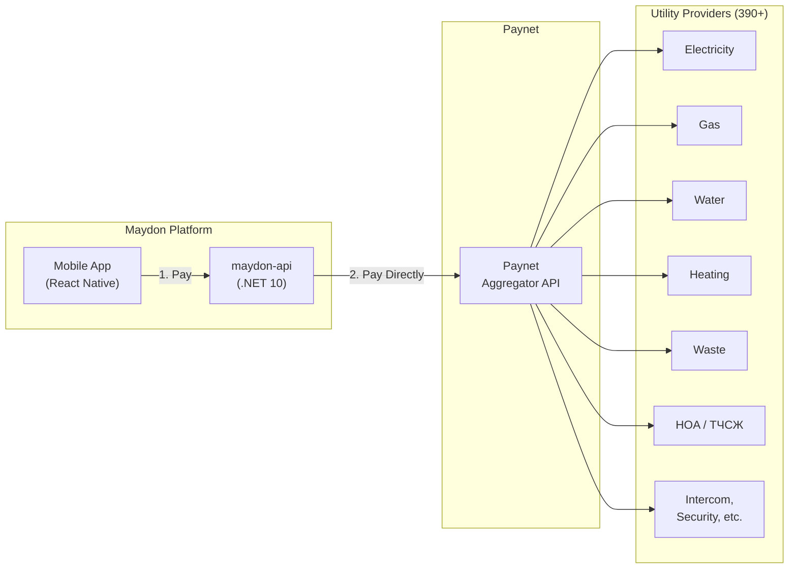
