# Utilities Payment — Tenant User Flow & API Design

> **Module:** `utility` (new module)  
> **Actor:** Tenant (Client role, `typ: "Client"` in JWT)  
> **Integration:** Paynet (utility aggregator, 390+ providers)  
> **Payment Method:** Any card method (Payme / Click / Uzcard) → Two-step settlement via Paynet  

---

## Design Decisions (Confirmed)

| # | Decision | Choice |
|---|----------|--------|
| 1 | Scope | All 3 categories: Resource Supply, Property Management, Ancillary — displayed separately |
| 2 | Metering relationship | Hybrid: metered → readings + billing engine; non-metered → Paynet direct via лицевой счет |
| 3 | Лицевой счет ownership | Both: Owner pre-fills, Tenant can add/edit |
| 4 | Payment routing | Pass-through proxy: Maydon = merchant of record, collects → disburses to Paynet |
| 5 | Payment visibility | Both Tenant and Landlord can see utility payment history |
| 6 | Account persistence | Tenant saves лицевой счет numbers, re-pays quickly each month |
| 7 | Payment method | Multi-provider funding (Payme/Click/Uzcard), settlement via Paynet aggregator |
| 8 | Auto-payment | Included in v1 — scheduled recurring utility payments |

---

## 1. High-Level User Flow Overview

```mermaid
flowchart TD
    START["🏠 Tenant opens<br/>'Utilities' section"] --> SELECT_PROP["Select Rented Property<br/>(from active leases)"]

    SELECT_PROP --> TABS["Choose Service Category"]

    TABS --> TAB1["⚡ Resource Supply<br/>(Electricity, Gas, Water,<br/>Heating, Waste)"]
    TABS --> TAB2["🏢 Property Management<br/>(HOA / ТЧСЖ,<br/>Management Companies)"]
    TABS --> TAB3["🔧 Ancillary Services<br/>(Intercom, Security,<br/>Cleaning, Maintenance)"]

    TAB1 --> PROVIDER["Select Utility Provider"]
    TAB2 --> PROVIDER
    TAB3 --> PROVIDER

    PROVIDER --> ACCOUNT{"Has saved<br/>лицевой счет?"}

    ACCOUNT -->|"Yes"| SAVED["Show saved accounts<br/>with balances"]
    ACCOUNT -->|"No"| ADD["Add лицевой счет<br/>(enter account number)"]

    ADD --> VALIDATE["Validate account<br/>via Paynet BVM"]
    VALIDATE -->|"Valid"| SAVE["Save account<br/>(name + number)"]
    VALIDATE -->|"Invalid"| ERROR["❌ Show error<br/>'Account not found'"]
    ERROR --> ADD

    SAVE --> SAVED
    SAVED --> AMOUNT["Fetch balance / debt<br/>from Paynet"]

    AMOUNT --> PAY_OPTS{"Payment Option"}
    PAY_OPTS -->|"One-time"| SELECT_METHOD["Select Payment Method<br/>(Payme / Click / Uzcard)"]
    PAY_OPTS -->|"Auto-pay"| SCHEDULE["Set Auto-Pay Schedule<br/>(day of month + amount)"]

    SCHEDULE --> SELECT_METHOD
    SELECT_METHOD --> CONFIRM["Confirm Payment<br/>(amount, provider, account)"]

    CONFIRM --> PROCESS["Process Payment<br/>(payment-service)"]
    PROCESS --> PAYNET["Disburse to Provider<br/>via Paynet Aggregator"]

    PAYNET --> RECEIPT["✅ Payment Receipt<br/>(visible to Tenant + Landlord)"]

    style START fill:#1565C0,color:#fff
    style RECEIPT fill:#2E7D32,color:#fff
    style ERROR fill:#C62828,color:#fff
    style TAB1 fill:#FF8F00,color:#fff
    style TAB2 fill:#6A1B9A,color:#fff
    style TAB3 fill:#00838F,color:#fff
```



---

## 2. Detailed User Flow — Step-by-Step

### Step 1: Select Rented Property

```mermaid
flowchart LR
    OPEN["Tenant opens<br/>'Utilities'"] --> API_LEASES["GET /api/v1/building/leases/my<br/>?status=1"]
    API_LEASES --> LIST["Show property cards:<br/>• Address<br/>• Building name<br/>• Apartment #<br/>• Owner company"]
    LIST --> SELECT["Tenant taps<br/>a property"]
    SELECT --> NEXT["→ Step 2"]

    style OPEN fill:#1565C0,color:#fff
    style NEXT fill:#2E7D32,color:#fff
```



**Screen:** Property selector carousel/list.  
**Data source:** Existing `GET /api/v1/building/leases/my` endpoint — returns active leases.  
**Display:** Property photo (from real estate images), address, building name, owner company name.

---

### Step 2: Choose Service Category (tabs/filter)

```mermaid
flowchart TD
    PROP["Property selected:<br/>'Apartment 42, Building A-1'"] --> FILTER["Three category tabs / filters"]

    FILTER --> RS["⚡ Resource Supply"]
    FILTER --> PM["🏢 Property Management"]
    FILTER --> AS["🔧 Ancillary Services"]

    RS --> RS_LIST["Electricity (Individual)<br/>Electricity (Legal Entity)<br/>Natural Gas<br/>Liquefied Gas<br/>Drinking Water<br/>Heating / Hot Water (Veolia)<br/>Waste Management"]

    PM --> PM_LIST["Mening Uyim (Digital HOA)<br/>ТЧСЖ Kommunal Talazi<br/>NRG Service<br/>The Tower Service<br/>Alfraganus Management<br/>BI Service<br/>..."]

    AS --> AS_LIST["Трой Мастер (Intercom)<br/>Cyfral (Intercom)<br/>Intellect Engineering (Security)<br/>Dream Clean (Cleaning)<br/>Gaz Nazorati (Gas Inspection)<br/>..."]

    style PROP fill:#37474F,color:#fff
    style RS fill:#FF8F00,color:#fff
    style PM fill:#6A1B9A,color:#fff
    style AS fill:#00838F,color:#fff
```



**Screen:** Horizontal tab bar at the top with 3 categories. Below — a scrollable grid of provider cards, each with icon + name. Search bar at the top for filtering providers by name.  
**Data source:** New `GET /api/v1/utility/providers` endpoint with `category` filter.

---

### Step 3: Select Provider → Add / Select Лицевой Счет

```mermaid
flowchart TD
    PROV["Tenant selects<br/>'ЭЛЕКТРИЧЕСТВО'"] --> CHECK["GET /api/v1/utility/accounts<br/>?lease_id={id}<br/>&provider_id={id}"]

    CHECK --> HAS{"Saved accounts<br/>exist?"}

    HAS -->|"Yes"| SHOW["Show saved accounts:<br/>• Account #12345<br/>  Balance: 50,000 UZS owed<br/>• Account #67890<br/>  Balance: 0 (paid up)"]

    HAS -->|"No (first time)"| EMPTY["Empty state:<br/>'Add your лицевой счет<br/>to pay for this service'"]

    EMPTY --> ADD_FLOW["+ Add Account"]
    SHOW --> ADD_FLOW
    SHOW --> SELECT_ACC["Tenant selects<br/>account to pay"]
    SELECT_ACC --> NEXT["→ Step 4: Payment"]

    ADD_FLOW --> INPUT["Enter лицевой счет<br/>абонемента (number)"]
    INPUT --> LABEL["Enter account label<br/>(optional, e.g. 'Main meter')"]
    LABEL --> BVM["POST /api/v1/utility/accounts/validate<br/>(Paynet BVM check)"]

    BVM -->|"Valid"| FOUND["✅ Account found:<br/>'ЭЛЕКТРИЧЕСТВО'<br/>Owner: Toshmatov J.<br/>Address: Chilanzar 12<br/>Balance: 50,000 UZS"]
    BVM -->|"Invalid"| NOTFOUND["❌ Account not found.<br/>Check number and try again."]
    NOTFOUND --> INPUT

    FOUND --> SAVE_BTN["Tenant taps 'Save Account'"]
    SAVE_BTN --> SAVED["POST /api/v1/utility/accounts<br/>(saved to DB)"]
    SAVED --> SELECT_ACC

    style PROV fill:#FF8F00,color:#fff
    style FOUND fill:#2E7D32,color:#fff
    style NOTFOUND fill:#C62828,color:#fff
```



**Key UX considerations:**
- Owner-prefilled accounts should appear automatically (marked with 🏠 icon).
- Tenant-added accounts marked with 👤 icon.
- Balance/debt displayed in real-time from Paynet.
- For **metered utilities** (electricity, gas, water): if the property has meters in our system, show the meter readings data alongside the Paynet balance for cross-reference.

---

### Step 4: Payment

```mermaid
flowchart TD
    ACC["Account selected:<br/>'ЭЛЕКТРИЧЕСТВО #12345'<br/>Balance: 50,000 UZS"] --> TYPE{"Payment Type"}

    TYPE -->|"One-time"| AMOUNT["Enter amount or<br/>pay full balance"]
    TYPE -->|"Auto-pay"| SCHED["Configure auto-pay:<br/>• Day of month (1-28)<br/>• Fixed amount or 'Full balance'<br/>• Start date"]

    AMOUNT --> METHOD
    SCHED --> METHOD

    METHOD["Select Payment Method"]
    METHOD --> PAYME["💳 Payme"]
    METHOD --> CLICK["💳 Click"]
    METHOD --> UZCARD["💳 Uzcard"]

    PAYME --> CONFIRM
    CLICK --> CONFIRM
    UZCARD --> CONFIRM

    CONFIRM["Confirm Payment<br/>━━━━━━━━━━━━━━━<br/>Provider: ЭЛЕКТРИЧЕСТВО<br/>Account: #12345<br/>Amount: 50,000 UZS<br/>Method: Payme<br/>Service fee: 500 UZS<br/>━━━━━━━━━━━━━━━<br/>Total: 50,500 UZS"]

    CONFIRM --> PAY["'Pay Now' button"]
    PAY --> INTENT["POST /api/v1/utility/payments<br/>(creates payment intent)"]
    INTENT --> REDIRECT["Redirect to payment<br/>gateway (Payme/Click/Uzcard)"]
    REDIRECT --> CALLBACK["Payment gateway callback<br/>→ payment-service"]
    CALLBACK --> DISBURSE["payment-service →<br/>Paynet Aggregator API<br/>(pay utility provider)"]
    DISBURSE --> DONE["✅ Payment Complete"]
    DONE --> RECEIPT["Receipt generated:<br/>• PDF download<br/>• Push notification<br/>• Visible to Landlord"]

    style ACC fill:#37474F,color:#fff
    style DONE fill:#2E7D32,color:#fff
    style CONFIRM fill:#1565C0,color:#fff
```



---

### Step 5: Auto-Pay Management

```mermaid
flowchart TD
    MANAGE["Tenant opens<br/>'Auto-Pay' settings"] --> LIST["Active auto-pays:<br/>━━━━━━━━━━━━━━━━━━<br/>⚡ Electricity #12345<br/>  Day: 1st, Amount: Full balance<br/>  Next: March 1, 2026<br/>  Method: Payme<br/>━━━━━━━━━━━━━━━━━━<br/>💧 Water #67890<br/>  Day: 5th, Amount: Fixed 30,000<br/>  Next: March 5, 2026<br/>  Method: Click"]

    LIST --> EDIT["Edit schedule"]
    LIST --> PAUSE["Pause auto-pay"]
    LIST --> DELETE["Cancel auto-pay"]

    EDIT --> SAVE["Save changes"]
    PAUSE --> PAUSED["⏸ Auto-pay paused<br/>(resumes on tap)"]
    DELETE --> CONFIRM["Confirm cancellation"]

    style MANAGE fill:#1565C0,color:#fff
    style PAUSED fill:#FF8F00,color:#fff
```



---

## 3. Metered vs Non-Metered Flow Comparison

```mermaid
flowchart TD
    subgraph METERED ["⚡ Metered Utilities (Electricity, Gas, Water)"]
        M_READ["Owner submits<br/>meter reading<br/>(existing flow)"] --> M_CALC["Billing engine calculates<br/>consumption × tariff = cost"]
        M_CALC --> M_CHARGE["Utility charge created<br/>(amount known)"]
        M_CHARGE --> M_PAY["Tenant sees charge +<br/>Paynet balance side-by-side"]
        M_PAY --> M_CONFIRM["Pay via Paynet<br/>(amount from our system)"]
    end

    subgraph NONMETERED ["🏢 Non-Metered (HOA, Waste, Heating, Ancillary)"]
        NM_ACC["Tenant enters<br/>лицевой счет"] --> NM_BALANCE["Paynet returns<br/>current balance/debt"]
        NM_BALANCE --> NM_PAY["Tenant enters amount<br/>or pays full balance"]
        NM_PAY --> NM_CONFIRM["Pay via Paynet<br/>(amount from Paynet)"]
    end

    M_CONFIRM --> SETTLEMENT["Two-Step Settlement:<br/>1. Collect from Tenant (Payme/Click/Uzcard)<br/>2. Disburse to Provider (Paynet)"]
    NM_CONFIRM --> SETTLEMENT

    SETTLEMENT --> RECORD["Record in<br/>utility_payments table"]
    RECORD --> NOTIFY["Notify Tenant + Landlord"]

    style METERED fill:#E3F2FD,color:#000
    style NONMETERED fill:#F3E5F5,color:#000
    style SETTLEMENT fill:#FFF3E0,color:#000
```



---

## 4. Owner Pre-Fill Flow (Landlord Side)

```mermaid
flowchart LR
    OWNER["Owner / Agent<br/>adds property"] --> CONFIG["Property Utilities Config<br/>(during onboarding or later)"]

    CONFIG --> ADD["Add utility accounts<br/>per provider"]
    ADD --> FILL["Provider: ЭЛЕКТРИЧЕСТВО<br/>Лицевой счет: 12345<br/>Label: 'Main electricity'"]
    FILL --> VALIDATE["Validate via Paynet BVM"]
    VALIDATE --> SAVE["Save to<br/>utility_accounts<br/>(source='owner')"]

    SAVE --> TENANT_VIEW["When Tenant opens<br/>'Utilities' → sees<br/>pre-filled accounts<br/>with 🏠 icon"]

    style OWNER fill:#6A1B9A,color:#fff
    style TENANT_VIEW fill:#2E7D32,color:#fff
```



---

## 5. Payment Processing — Technical Sequence


---

## 6. Auto-Pay Execution — Technical Sequence


---

## 7. Landlord View — Utility Payment History

```mermaid
flowchart TD
    OWNER["Landlord opens<br/>'Tenant Utilities'"] --> SELECT["Select property<br/>& tenant"]
    SELECT --> HISTORY["Utility Payment History<br/>━━━━━━━━━━━━━━━━━━━━<br/>Feb 2026<br/>✅ ⚡ Electricity — 50,000 UZS — Paid Feb 1<br/>✅ 💧 Water — 25,000 UZS — Paid Feb 3<br/>⏳ 🔥 Gas — Pending<br/>✅ 🏢 HOA — 150,000 UZS — Paid Feb 5<br/>━━━━━━━━━━━━━━━━━━━━<br/>Jan 2026<br/>✅ ⚡ Electricity — 48,000 UZS — Paid Jan 2<br/>✅ 💧 Water — 22,000 UZS — Paid Jan 4<br/>..."]

    HISTORY --> DETAIL["Tap payment →<br/>Receipt detail:<br/>• Paynet transaction ID<br/>• Payment method<br/>• Date & time<br/>• Provider confirmation"]

    style OWNER fill:#6A1B9A,color:#fff
```



---

## 8. Entity Relationship — New Tables


---

## 9. API Endpoints to Add

**Base path:** `/api/v1/utility`  
**Auth:** All endpoints require `Authorization: Bearer {token}`.

---

### 9.1 Utility Provider Categories

#### List Categories

```
GET /api/v1/utility/provider-categories
```

**Auth:** `[public]`

**Response 200:**

```json
{
  "success": true,
  "data": {
    "items": [
      {
        "id": "uuid",
        "name": "Resource Supply",
        "icon_url": "string",
        "providers_count": 15,
        "sort_order": 0
      },
      {
        "id": "uuid",
        "name": "Property Management",
        "icon_url": "string",
        "providers_count": 21,
        "sort_order": 1
      },
      {
        "id": "uuid",
        "name": "Ancillary Services",
        "icon_url": "string",
        "providers_count": 9,
        "sort_order": 2
      }
    ]
  }
}
```

---

### 9.2 Utility Providers

#### List Providers

```
GET /api/v1/utility/providers
```

**Auth:** `[public]`

**Query parameters:**

| Parameter | Type | Required | Description |
|-----------|------|----------|-------------|
| category_id | uuid | No | Filter by category |
| name_search | string | No | Search by provider name |
| is_metered | bool | No | Filter metered vs non-metered |
| page | int | No | Default: 1 |
| page_size | int | No | Default: 50 |

**Response 200:**

```json
{
  "success": true,
  "data": {
    "items": [
      {
        "id": "uuid",
        "name": "ЭЛЕКТРИЧЕСТВО",
        "category": { "id": "uuid", "name": "Resource Supply" },
        "service_type": "Electricity",
        "user_type": "Individual",
        "location": "General",
        "icon_url": "string",
        "paynet_service_id": "string",
        "is_metered": true,
        "account_number_label": "Лицевой счет абонемента",
        "account_number_mask": "##########",
        "account_number_length": 10,
        "is_active": true
      }
    ],
    "pagination": { "page": 1, "page_size": 50, "total_items": 45, "total_pages": 1 }
  }
}
```

**Notes:**
- `account_number_label` — localized label for the input field (e.g., "Лицевой счет абонемента")
- `account_number_mask` — input mask for client-side validation
- `account_number_length` — expected digit count for validation
- `paynet_service_id` — Paynet's internal service identifier (used in BVM and payment calls)

---

### 9.3 Utility Accounts (Лицевой Счёт)

#### Validate Account via Paynet BVM

```
POST /api/v1/utility/accounts/validate
```

**Auth:** `[authenticated]`

**Request:**

```json
{
  "provider_id": "uuid, required",
  "account_number": "string, required, max:50"
}
```

**Response 200:**

```json
{
  "success": true,
  "data": {
    "is_valid": true,
    "account_holder_name": "Тошматов Жасур Каримович",
    "address": "Ташкент, Чиланзар, 12",
    "current_balance": 50000,
    "currency": "UZS",
    "provider_name": "ЭЛЕКТРИЧЕСТВО",
    "paynet_account_id": "string"
  }
}
```

**Error Response (invalid account):**

```json
{
  "success": false,
  "data": null,
  "error": {
    "code": "ACCOUNT_NOT_FOUND",
    "message": "Лицевой счет не найден. Проверьте номер и попробуйте снова."
  }
}
```

**Business rules:**
- Calls Paynet BVM (Biller Validation Module) to verify the account
- Returns account holder info, address, and current balance/debt
- Does NOT save the account yet — only validates

---

#### Save Utility Account

```
POST /api/v1/utility/accounts
```

**Auth:** `[authenticated]`

**Request:**

```json
{
  "lease_id": "uuid, required",
  "provider_id": "uuid, required",
  "account_number": "string, required, max:50",
  "label": "string, optional, max:200, e.g. 'Main electricity meter'"
}
```

**Response 201:**

```json
{
  "success": true,
  "data": {
    "id": "uuid",
    "provider": { "id": "uuid", "name": "ЭЛЕКТРИЧЕСТВО", "icon_url": "string" },
    "account_number": "1234567890",
    "label": "Main electricity meter",
    "source": "tenant",
    "current_balance": 50000,
    "currency": "UZS",
    "created_at": "2026-02-09T12:00:00Z"
  }
}
```

**Business rules:**
- `tenant_id` auto-set from JWT
- `real_estate_id` auto-set from the lease's `real_estate_id`
- `source` = `"tenant"` if created by the tenant, `"owner"` if pre-filled by landlord
- `created_by` = JWT `user_id`
- Must validate via Paynet BVM before saving (re-validates automatically)
- Duplicate check: one account number per provider per lease
- `lease_id` must reference an active lease where `client_tenant_id` = JWT `tenant_id`

**Status codes:** 201, 400, 404 (lease/provider not found), 409 (duplicate account), 422 (account validation failed)

---

#### List My Utility Accounts

```
GET /api/v1/utility/accounts
```

**Auth:** `[authenticated]`

**Query parameters:**

| Parameter | Type | Required | Description |
|-----------|------|----------|-------------|
| lease_id | uuid | No | Filter by lease (property) |
| provider_id | uuid | No | Filter by provider |
| category_id | uuid | No | Filter by provider category |
| include_balance | bool | No | Default: false. If true, fetches live balance from Paynet |

**Response 200:**

```json
{
  "success": true,
  "data": {
    "items": [
      {
        "id": "uuid",
        "provider": {
          "id": "uuid",
          "name": "ЭЛЕКТРИЧЕСТВО",
          "category": { "id": "uuid", "name": "Resource Supply" },
          "icon_url": "string",
          "is_metered": true
        },
        "account_number": "1234567890",
        "label": "Main electricity meter",
        "source": "owner",
        "current_balance": 50000,
        "currency": "UZS",
        "last_payment": {
          "amount": 48000,
          "paid_at": "2026-01-15T10:00:00Z"
        },
        "auto_payment": {
          "id": "uuid",
          "execution_day": 1,
          "amount_type": "full_balance",
          "status": "active"
        },
        "meter_data": {
          "meter_id": "uuid",
          "last_reading": 12450.500,
          "last_reading_date": "2026-02-01",
          "calculated_cost": 238340,
          "currency": "UZS"
        },
        "lease": {
          "id": "uuid",
          "real_estate_address": "Tashkent, Chilanzar, 12"
        },
        "created_at": "2026-01-01T10:00:00Z"
      }
    ]
  }
}
```

**Business rules:**
- Returns accounts for the current tenant (JWT `tenant_id`)
- If `include_balance=true`, makes batch Paynet BVM calls (max 10 per request for performance)
- `meter_data` populated only for metered providers if the property has a matching meter in our system
- `auto_payment` summary included if an active auto-pay schedule exists

---

#### Owner: Pre-Fill Utility Account

```
POST /api/v1/utility/accounts/owner
```

**Permission:** `utility-accounts:write`

**Request:**

```json
{
  "real_estate_id": "uuid, required",
  "provider_id": "uuid, required",
  "account_number": "string, required, max:50",
  "label": "string, optional, max:200"
}
```

**Response 201:** Same format as tenant save.

**Business rules:**
- `source` = `"owner"`
- `real_estate_id` must belong to the current tenant
- Account is visible to any tenant who has an active lease for this real estate
- Validates via Paynet BVM before saving

---

#### Update Utility Account

```
PUT /api/v1/utility/accounts/{id}
```

**Auth:** `[authenticated]`

**Request:**

```json
{
  "label": "string, optional, max:200"
}
```

**Response 200:** Updated account.

**Business rules:**
- Can only update `label` (account number is immutable — delete and re-create if wrong)
- Owner-created accounts cant be edited by the tenant (only label can be adjusted)

---

#### Delete Utility Account

```
DELETE /api/v1/utility/accounts/{id}
```

**Auth:** `[authenticated]`  
**Response 204**

**Business rules:**
- Soft delete
- Cannot delete if active auto-pay schedule exists (cancel auto-pay first)
- Owner-created accounts can only be deleted by the owner tenant
- Tenant-created accounts can be deleted by the tenant

---

### 9.4 Utility Payments

#### Create Utility Payment (One-Time)

```
POST /api/v1/utility/payments
```

**Auth:** `[authenticated]`

**Request:**

```json
{
  "utility_account_id": "uuid, required",
  "amount": "long, required, min:1, in integer Som (UZS)",
  "payment_method": "string, required, 'payme' | 'click' | 'uzcard'",
  "idempotency_key": "string, required, max:100"
}
```

**Response 201:**

```json
{
  "success": true,
  "data": {
    "id": "uuid",
    "utility_account": {
      "id": "uuid",
      "provider_name": "ЭЛЕКТРИЧЕСТВО",
      "account_number": "1234567890"
    },
    "amount": 50000,
    "service_fee": 500,
    "total_amount": 50500,
    "currency": "UZS",
    "payment_method": "payme",
    "status": "pending",
    "payment_url": "https://checkout.paycom.uz/...",
    "transaction_id": "uuid",
    "expires_at": "2026-02-09T12:30:00Z",
    "created_at": "2026-02-09T12:00:00Z"
  }
}
```

**Business rules:**
- `tenant_id` auto-set from JWT
- `lease_id` auto-resolved from the utility account's lease
- Creates a payment intent in `payment-service` (internal HTTP call)
- Returns a `payment_url` — tenant opens this to complete payment on the gateway's hosted page
- `service_fee` calculated based on tenant configuration (can be 0 if no markup)
- Idempotency: duplicate `idempotency_key` returns the existing payment
- Emits `utility.payment.initiated` event

**Status codes:** 201, 400, 404, 422 (account inactive, lease inactive)

---

#### Get Utility Payment Status

```
GET /api/v1/utility/payments/{id}
```

**Auth:** `[authenticated]`

**Response 200:**

```json
{
  "success": true,
  "data": {
    "id": "uuid",
    "utility_account": {
      "id": "uuid",
      "provider_name": "ЭЛЕКТРИЧЕСТВО",
      "account_number": "1234567890"
    },
    "amount": 50000,
    "service_fee": 500,
    "total_amount": 50500,
    "currency": "UZS",
    "payment_method": "payme",
    "status": "completed",
    "transaction_id": "uuid",
    "paynet_transaction_id": "PN-2026-001234",
    "is_auto_payment": false,
    "paid_at": "2026-02-09T12:05:00Z",
    "created_at": "2026-02-09T12:00:00Z"
  }
}
```

**Status enum:** `pending`, `processing`, `completed`, `failed`, `refunded`, `expired`

---

#### List Utility Payments (Tenant)

```
GET /api/v1/utility/payments
```

**Auth:** `[authenticated]`

**Query parameters:**

| Parameter | Type | Required | Description |
|-----------|------|----------|-------------|
| lease_id | uuid | No | Filter by property |
| utility_account_id | uuid | No | Filter by account |
| provider_id | uuid | No | Filter by provider |
| category_id | uuid | No | Filter by provider category |
| status | int | No | 0=Pending, 1=Completed, 2=Failed, 3=Refunded |
| date_from | date | No | Filter by payment date |
| date_to | date | No | |
| is_auto_payment | bool | No | Filter auto vs manual |
| page | int | No | Default: 1 |
| page_size | int | No | Default: 20, max: 100 |
| sort_by | string | No | `created_at`, `amount` |
| sort_direction | string | No | `asc`, `desc`. Default: `desc` |

**Response 200:** Paginated list of utility payments.

---

#### List Tenant Utility Payments (Landlord View)

```
GET /api/v1/utility/payments/by-property/{realEstateId}
```

**Permission:** `utility-payments:read`

**Query parameters:** Same as tenant list + `client_tenant_id` (optional filter).

**Response 200:** Paginated list of all utility payments made by any tenant for this property.

**Business rules:**
- `real_estate_id` must belong to the current tenant (landlord)
- Shows payments from all tenants who rented this property
- Does NOT show payment method details (privacy) — only provider, amount, status, date

---

### 9.5 Auto-Pay Schedules

#### Create Auto-Pay Schedule

```
POST /api/v1/utility/auto-payments
```

**Auth:** `[authenticated]`

**Request:**

```json
{
  "utility_account_id": "uuid, required",
  "execution_day": "int, required, min:1, max:28",
  "amount_type": "int, required, 0=FullBalance, 1=Fixed",
  "fixed_amount": "long, optional, required if amount_type=1, min:1",
  "payment_method": "string, required, 'payme' | 'click' | 'uzcard'",
  "card_token": "string, required, tokenized saved card reference"
}
```

**Response 201:**

```json
{
  "success": true,
  "data": {
    "id": "uuid",
    "utility_account": {
      "id": "uuid",
      "provider_name": "ЭЛЕКТРИЧЕСТВО",
      "account_number": "1234567890"
    },
    "execution_day": 1,
    "amount_type": 0,
    "amount_type_name": "Full Balance",
    "fixed_amount": null,
    "payment_method": "payme",
    "status": 0,
    "status_name": "Active",
    "next_execution_date": "2026-03-01",
    "created_at": "2026-02-09T12:00:00Z"
  }
}
```

**Business rules:**
- One auto-pay per utility account per tenant (duplicate check)
- `card_token` references a previously saved/tokenized card (from Payme/Click/Uzcard tokenization APIs)
- `next_execution_date` calculated as: nearest future date with `execution_day`
- Scheduled job (Hangfire) executes daily at 06:00 AM (Uzbekistan time)
- On execution: if payment fails, retry in 24h (max 3 attempts per cycle)
- After 3 failed attempts, set status to `Paused` and notify tenant

---

#### List Auto-Pay Schedules

```
GET /api/v1/utility/auto-payments
```

**Auth:** `[authenticated]`

**Query parameters:** `lease_id`, `utility_account_id`, `status`

**Response 200:** Paginated list of auto-pay schedules.

---

#### Update Auto-Pay Schedule

```
PUT /api/v1/utility/auto-payments/{id}
```

**Auth:** `[authenticated]`

**Request:**

```json
{
  "execution_day": "int, optional, min:1, max:28",
  "amount_type": "int, optional, 0=FullBalance, 1=Fixed",
  "fixed_amount": "long, optional",
  "payment_method": "string, optional",
  "card_token": "string, optional"
}
```

**Response 200:** Updated schedule.

---

#### Pause Auto-Pay

```
POST /api/v1/utility/auto-payments/{id}/pause
```

**Auth:** `[authenticated]`  
**Response 204**

---

#### Resume Auto-Pay

```
POST /api/v1/utility/auto-payments/{id}/resume
```

**Auth:** `[authenticated]`  
**Response 204**

**Business rules:**
- Recalculates `next_execution_date` from today

---

#### Cancel Auto-Pay

```
DELETE /api/v1/utility/auto-payments/{id}
```

**Auth:** `[authenticated]`  
**Response 204**

**Business rules:**
- Soft delete, sets `status` = Canceled

---

### 9.6 Admin: Execute Auto-Payments (Scheduled Job)

```
POST /api/v1/admin/utility/auto-payments/execute
```

**Permission:** `admin:utility:manage`

**Response 200:**

```json
{
  "success": true,
  "data": {
    "executed_count": 45,
    "skipped_count": 12,
    "failed_count": 2,
    "total_amount": 2500000,
    "currency": "UZS"
  }
}
```

---

### 9.7 Admin: Seed Utility Providers (Reference Data)

```
GET    /api/v1/admin/utility/providers                [admin:reference:read]
POST   /api/v1/admin/utility/providers                [admin:reference:write]
PUT    /api/v1/admin/utility/providers/{id}            [admin:reference:write]
DELETE /api/v1/admin/utility/providers/{id}            [admin:reference:write]
```

**Create/Update request:**

```json
{
  "category_id": "uuid, required",
  "paynet_service_id": "string, required, max:50",
  "service_type": "string, required, max:100",
  "user_type": "string, optional, max:50, 'Individual' | 'Legal Entity' | 'General'",
  "location": "string, optional, max:100",
  "is_metered": "boolean, required",
  "account_number_label": "string, optional, max:200",
  "account_number_mask": "string, optional, max:50",
  "account_number_length": "int, optional",
  "icon": "file, optional, provider icon image",
  "is_active": "boolean, required",
  "translations": [
    { "language_code": "uz", "name": "string, required, max:200" },
    { "language_code": "ru", "name": "string, required, max:200" }
  ]
}
```

---

## 10. New Database Tables

### Schema: utility

#### Table: utility_provider_categories

| Column | Type | Nullable | Default | Max Length | FK | Index | Notes |
|--------|------|----------|---------|------------|-----|-------|-------|
| id | uuid | NO | gen_random_uuid() | - | - | PK | |
| sort_order | smallint | NO | 0 | - | - | - | |
| icon_object_name | varchar | YES | NULL | 500 | - | - | MinIO key |
| is_active | boolean | NO | true | - | - | - | |

#### Table: utility_provider_category_translates

| Column | Type | Nullable | Default | Max Length | FK | Index |
|--------|------|----------|---------|------------|-----|-------|
| id | uuid | NO | gen_random_uuid() | - | - | PK |
| category_id | uuid | NO | - | - | utility_provider_categories(id) ON DELETE CASCADE | ix |
| language_code | varchar | NO | - | 5 | - | - |
| name | varchar | NO | - | 200 | - | - |

**Unique:** `uq_upc_translates` (category_id, language_code)

---

#### Table: utility_providers

| Column | Type | Nullable | Default | Max Length | FK | Index | Notes |
|--------|------|----------|---------|------------|-----|-------|-------|
| id | uuid | NO | gen_random_uuid() | - | - | PK | |
| category_id | uuid | NO | - | - | utility_provider_categories(id) ON DELETE RESTRICT | ix_up_category_id | |
| paynet_service_id | varchar | NO | - | 50 | - | uq_up_paynet_service | Paynet's internal service code |
| service_type | varchar | NO | - | 100 | - | - | e.g. "Electricity", "Natural Gas" |
| user_type | varchar | YES | NULL | 50 | - | - | "Individual", "Legal Entity", "General" |
| location | varchar | YES | NULL | 100 | - | - | "General", "Tashkent", etc. |
| is_metered | boolean | NO | false | - | - | - | Links to building.meters |
| icon_object_name | varchar | YES | NULL | 500 | - | - | MinIO key |
| account_number_label | varchar | YES | NULL | 200 | - | - | "Лицевой счет абонемента" |
| account_number_mask | varchar | YES | NULL | 50 | - | - | |
| account_number_length | smallint | YES | NULL | - | - | - | |
| sort_order | smallint | NO | 0 | - | - | - | |
| is_active | boolean | NO | true | - | - | - | |
| is_deleted | boolean | NO | false | - | - | - | |
| created_at | timestamptz | NO | now() | - | - | - | |

#### Table: utility_provider_translates

Same pattern: `id`, `provider_id (FK)`, `language_code`, `name`.

---

#### Table: utility_accounts

| Column | Type | Nullable | Default | Max Length | FK | Index | Notes |
|--------|------|----------|---------|------------|-----|-------|-------|
| id | uuid | NO | gen_random_uuid() | - | - | PK | |
| tenant_id | uuid | NO | - | - | companies(id) ON DELETE RESTRICT | ix_ua_tenant_id | |
| lease_id | uuid | YES | NULL | - | leases(id) ON DELETE SET NULL | ix_ua_lease_id | NULL for owner-created (linked via real_estate) |
| real_estate_id | uuid | NO | - | - | real_estates(id) ON DELETE RESTRICT | ix_ua_real_estate_id | |
| provider_id | uuid | NO | - | - | utility_providers(id) ON DELETE RESTRICT | ix_ua_provider_id | |
| account_number | varchar | NO | - | 50 | - | - | Лицевой счет |
| label | varchar | YES | NULL | 200 | - | - | User-defined label |
| source | smallint | NO | - | - | - | - | 0=Owner, 1=Tenant |
| created_by | uuid | NO | - | - | users(id) ON DELETE RESTRICT | - | |
| paynet_account_id | varchar | YES | NULL | 100 | - | - | Paynet's internal subscriber ID |
| is_active | boolean | NO | true | - | - | - | |
| is_deleted | boolean | NO | false | - | - | - | |
| created_at | timestamptz | NO | now() | - | - | ix_ua_created_at | |
| updated_at | timestamptz | YES | NULL | - | - | - | |

**Unique:** `uq_ua_provider_account_lease` (provider_id, account_number, lease_id) WHERE is_deleted = false  
**Global query filter:** `WHERE is_deleted = false AND tenant_id = current_tenant_id`

---

#### Table: utility_payments

| Column | Type | Nullable | Default | Max Length | FK | Index | Notes |
|--------|------|----------|---------|------------|-----|-------|-------|
| id | uuid | NO | gen_random_uuid() | - | - | PK | |
| tenant_id | uuid | NO | - | - | companies(id) ON DELETE RESTRICT | ix_upay_tenant_id | |
| utility_account_id | uuid | NO | - | - | utility_accounts(id) ON DELETE RESTRICT | ix_upay_account_id | |
| lease_id | uuid | YES | NULL | - | leases(id) ON DELETE SET NULL | ix_upay_lease_id | |
| real_estate_id | uuid | NO | - | - | real_estates(id) ON DELETE RESTRICT | ix_upay_real_estate_id | |
| amount | bigint | NO | - | - | - | - | In integer Som (UZS) |
| service_fee | bigint | NO | 0 | - | - | - | Maydon service fee |
| total_amount | bigint | NO | - | - | - | - | amount + service_fee |
| currency | smallint | NO | 0 | - | - | - | 0=UZS |
| payment_method | varchar | NO | - | 20 | - | - | "payme", "click", "uzcard" |
| status | smallint | NO | 0 | - | - | ix_upay_status | 0=Pending, 1=Completed, 2=Failed, 3=Refunded, 4=Expired |
| payment_transaction_id | uuid | YES | NULL | - | - | ix_upay_tx_id | payment-service transaction ID |
| paynet_transaction_id | varchar | YES | NULL | 100 | - | ix_upay_paynet_tx | Paynet disbursement ID |
| is_auto_payment | boolean | NO | false | - | - | - | |
| auto_payment_id | uuid | YES | NULL | - | utility_auto_payments(id) ON DELETE SET NULL | - | |
| idempotency_key | varchar | NO | - | 100 | - | uq_upay_idempotency | |
| paid_at | timestamptz | YES | NULL | - | - | - | |
| failed_at | timestamptz | YES | NULL | - | - | - | |
| error_message | varchar | YES | NULL | 500 | - | - | |
| is_deleted | boolean | NO | false | - | - | - | |
| created_at | timestamptz | NO | now() | - | - | ix_upay_created_at | |

**Check:** `ck_upay_amount CHECK (amount > 0)`  
**Global query filter:** `WHERE is_deleted = false AND tenant_id = current_tenant_id`

---

#### Table: utility_auto_payments

| Column | Type | Nullable | Default | Max Length | FK | Index | Notes |
|--------|------|----------|---------|------------|-----|-------|-------|
| id | uuid | NO | gen_random_uuid() | - | - | PK | |
| tenant_id | uuid | NO | - | - | companies(id) ON DELETE RESTRICT | ix_uap_tenant_id | |
| utility_account_id | uuid | NO | - | - | utility_accounts(id) ON DELETE RESTRICT | ix_uap_account_id | |
| execution_day | smallint | NO | - | - | - | - | 1–28 |
| amount_type | smallint | NO | - | - | - | - | 0=FullBalance, 1=Fixed |
| fixed_amount | bigint | YES | NULL | - | - | - | Required if amount_type=1 |
| payment_method | varchar | NO | - | 20 | - | - | |
| card_token | varchar | NO | - | 500 | - | - | Tokenized card reference (encrypted) |
| status | smallint | NO | 0 | - | - | ix_uap_status | 0=Active, 1=Paused, 2=Canceled |
| next_execution_date | date | YES | NULL | - | - | ix_uap_next_exec | |
| last_executed_at | timestamptz | YES | NULL | - | - | - | |
| retry_count | smallint | NO | 0 | - | - | - | Resets each cycle |
| is_deleted | boolean | NO | false | - | - | - | |
| created_at | timestamptz | NO | now() | - | - | - | |
| updated_at | timestamptz | YES | NULL | - | - | - | |

**Check:** `ck_uap_execution_day CHECK (execution_day BETWEEN 1 AND 28)`  
**Unique:** `uq_uap_account` (utility_account_id) WHERE is_deleted = false AND status != 2  
**Global query filter:** `WHERE is_deleted = false AND tenant_id = current_tenant_id`

---

## 11. Event Catalog (New Events)

| Event Type | Publisher | Consumers | Payload |
|-----------|-----------|-----------|---------|
| `utility.account.created` | monolith | audit | `{ account_id, provider_id, lease_id, source }` |
| `utility.account.deleted` | monolith | audit | `{ account_id }` |
| `utility.payment.initiated` | monolith | audit | `{ payment_id, account_id, amount, method }` |
| `utility.payment.completed` | monolith | audit, notify, analytics | `{ payment_id, account_id, amount, paynet_tx_id }` |
| `utility.payment.failed` | monolith | audit, notify | `{ payment_id, error_code, error_message }` |
| `utility.auto_payment.created` | monolith | audit | `{ auto_payment_id, account_id, execution_day }` |
| `utility.auto_payment.executed` | monolith | audit, analytics | `{ auto_payment_id, payment_id, amount }` |
| `utility.auto_payment.failed` | monolith | audit, notify | `{ auto_payment_id, error, retry_count }` |
| `utility.auto_payment.paused` | monolith | audit, notify | `{ auto_payment_id, reason }` |

---

## 12. New Permissions

| Permission | Module | Description |
|-----------|--------|-------------|
| `utility-accounts:read` | utility | View utility accounts for own properties |
| `utility-accounts:write` | utility | Create/edit/delete utility accounts |
| `utility-payments:read` | utility | View utility payment history |
| `utility-payments:write` | utility | Make utility payments |
| `utility-auto-payments:read` | utility | View auto-pay schedules |
| `utility-auto-payments:write` | utility | Create/edit/delete auto-pay schedules |
| `admin:utility:manage` | utility | Admin: execute auto-payments, manage providers |
| `admin:utility:reference:write` | utility | Admin: manage provider reference data |

---

## 13. Notification Templates (New)

| Event | Channel | Recipient | Template |
|-------|---------|-----------|----------|
| `utility.payment.completed` | Push | Tenant | "✅ Оплата {provider_name}: {amount} UZS — успешно" |
| `utility.payment.completed` | Push | Landlord | "Арендатор {tenant_name} оплатил {provider_name}: {amount} UZS" |
| `utility.payment.failed` | Push, SMS | Tenant | "❌ Оплата {provider_name} не прошла. Попробуйте снова." |
| `utility.auto_payment.executed` | Push | Tenant | "⏰ Автоплатёж {provider_name}: {amount} UZS — выполнен" |
| `utility.auto_payment.failed` | Push | Tenant | "⚠️ Автоплатёж {provider_name} не прошёл (попытка {retry}/3)" |
| `utility.auto_payment.paused` | Push, SMS | Tenant | "⏸ Автоплатёж {provider_name} приостановлен после 3 неудачных попыток" |

---

## 14. Utility Payment State Machine

```
Pending(0)   → [gateway callback: success]  → Completed(1) + Paynet disbursement
Pending(0)   → [gateway callback: failure]  → Failed(2)
Pending(0)   → [30 min timeout]             → Expired(4)
Completed(1) → [admin refund]               → Refunded(3) + Paynet reverse
Failed(2)    → [retry]                       → Pending(0)
```

---

## 15. Integration Points Summary

```mermaid
flowchart LR
    subgraph "Maydon Platform"
        MOBILE["📱 Mobile App<br/>(React Native)"]
        API["maydon-api<br/>(.NET 10)"]
        PAY_SVC["payment-service<br/>(Go)"]
    end

    subgraph "Payment Gateways"
        PAYME["Payme"]
        CLICK_GW["Click"]
        UZCARD["Uzcard<br/>SV-Gate"]
    end

    subgraph "Utility Settlement"
        PAYNET["Paynet<br/>Aggregator API"]
    end

    subgraph "Utility Providers (390+)"
        ELEC["⚡ Electricity"]
        GAS["🔥 Gas"]
        WATER["💧 Water"]
        HEAT["🌡️ Heating"]
        WASTE["🗑️ Waste"]
        HOA["🏢 HOA / ТЧСЖ"]
        ANCIL["🔧 Intercom,<br/>Security, etc."]
    end

    MOBILE -->|"1. Pay"| API
    API -->|"2. Intent"| PAY_SVC
    PAY_SVC -->|"3. Charge"| PAYME
    PAY_SVC -->|"3. Charge"| CLICK_GW
    PAY_SVC -->|"3. Charge"| UZCARD

    PAYME -->|"4. Callback"| PAY_SVC
    CLICK_GW -->|"4. Callback"| PAY_SVC
    UZCARD -->|"4. Callback"| PAY_SVC

    PAY_SVC -->|"5. Disburse"| PAYNET

    PAYNET --> ELEC
    PAYNET --> GAS
    PAYNET --> WATER
    PAYNET --> HEAT
    PAYNET --> WASTE
    PAYNET --> HOA
    PAYNET --> ANCIL

    style MOBILE fill:#1565C0,color:#fff
    style PAY_SVC fill:#00695C,color:#fff
    style PAYNET fill:#E65100,color:#fff
```


