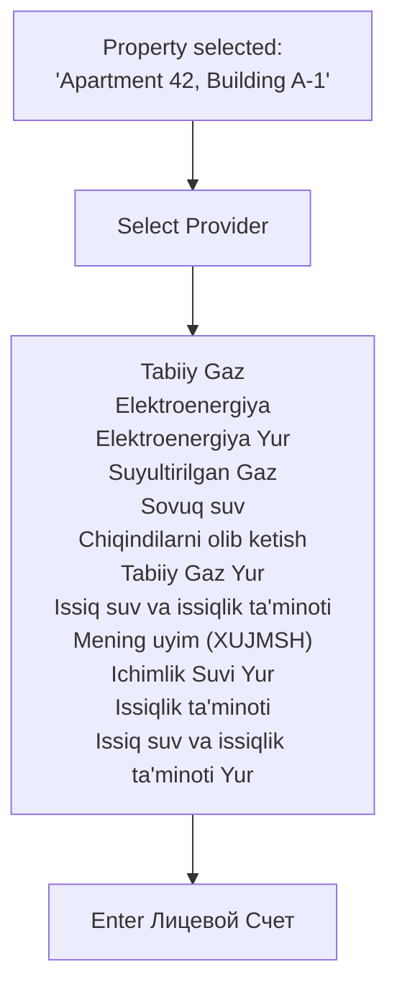
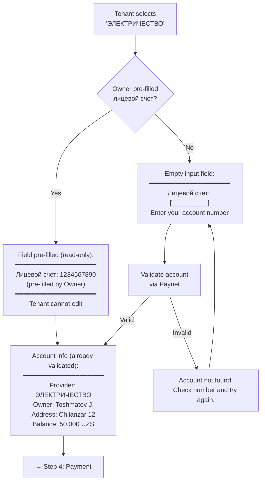
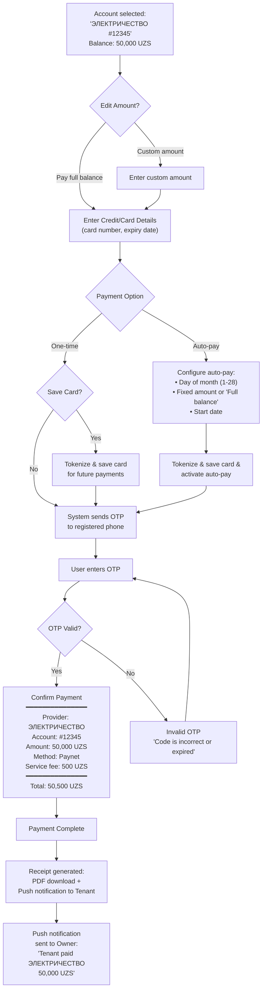
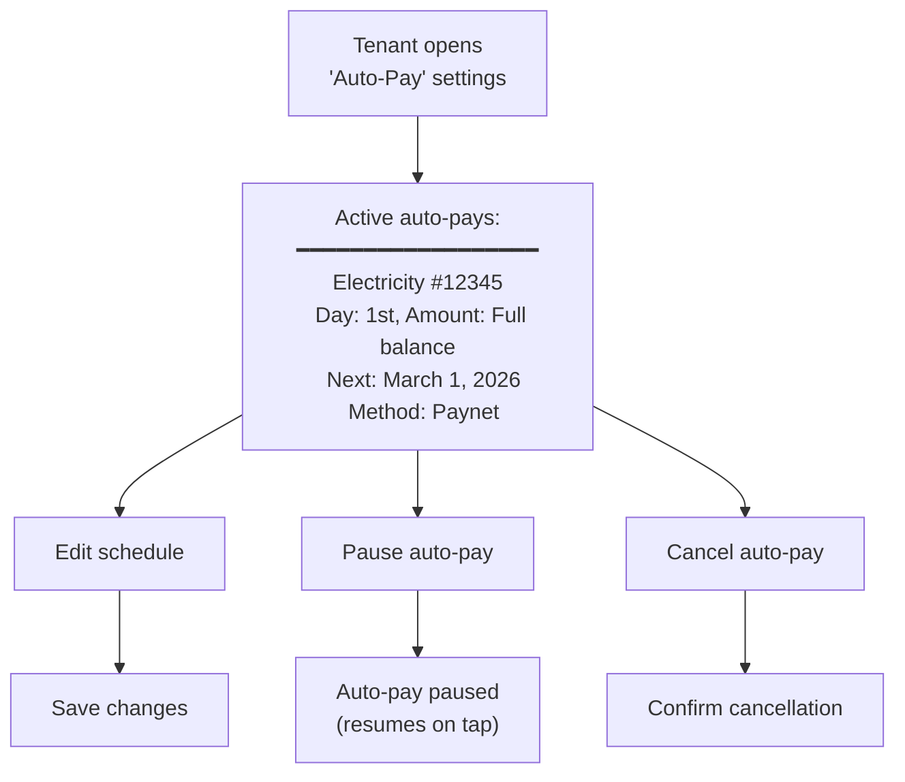
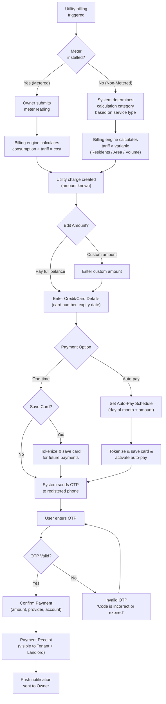

# Utilities Payment — Tenant User Flow & API Design

> **Module:** `utility` (new module)  
> **Actor:** Tenant (Client role, `typ: "Client"` in JWT)  
> **Integration:** Paynet (utility aggregator, 390+ providers)  
> **Payment Method:** Paynet → Direct payment to provider via Paynet Aggregator  

---

## Design Decisions (Confirmed)

| # | Decision | Choice |
|---|----------|--------|
| 1 | Scope | All utility types displayed as a flat list (Electricity, Gas, Water, Heating, Waste, HOA, Intercom, etc.) — no category grouping |
| 2 | Metering relationship | Hybrid: metered → readings + billing engine; non-metered → Paynet direct via лицевой счет |
| 3 | Лицевой счет ownership | Owner pre-fills (read-only for Tenant); if not pre-filled, Tenant can add |
| 4 | Payment routing | Direct to provider: Maydon sends payment request to Paynet, Paynet pays provider directly |
| 5 | Payment visibility | Both Tenant and Landlord can see utility payment history |
| 6 | Account persistence | Tenant saves лицевой счет numbers, re-pays quickly each month |
| 7 | Payment method | Paynet (sole payment method), direct payment to provider via Paynet |
| 8 | Auto-payment | Included in v1 — scheduled recurring utility payments |
| 9 | Card saving | Tenant can save card after entering details — available for both one-time and auto-pay |

---

## 1. High-Level User Flow Overview

```mermaid
flowchart TD
    START["Tenant opens<br/>'Pay' section"] --> PAY_MENU["Choose payment type:<br/>Rent / Utilities / Services"]

    PAY_MENU --> UTILITIES["Tenant taps 'Utilities'"]

    UTILITIES --> SELECT_PROP["Select Rented Property<br/>(from active leases)"]

    SELECT_PROP --> UTIL_TYPE["Select Provider<br/>(flat list: Electricity, Gas,<br/>Water, Heating, Waste, HOA,<br/>Intercom, Security, ...)"]

    UTIL_TYPE --> PROVIDER["Enter Лицевой Счет"]

    PROVIDER --> CHECK_PREFILL{"Owner pre-filled<br/>лицевой счет?"}

    CHECK_PREFILL -->|"Yes"| PREFILLED["Show лицевой счет<br/>(pre-filled by Owner,<br/>read-only for Tenant)"]
    CHECK_PREFILL -->|"No"| EMPTY_INPUT["Show empty field:<br/>Tenant enters лицевой счет"]

    PREFILLED --> AMOUNT["Fetch balance / debt<br/>from Paynet"]
    EMPTY_INPUT --> VALIDATE["Validate account<br/>via Paynet"]
    VALIDATE -->|"Valid"| AMOUNT
    VALIDATE -->|"Invalid"| ERROR["Show error<br/>'Account not found'"]
    ERROR --> EMPTY_INPUT

    AMOUNT --> EDIT_AMT{"Edit Amount?"}
    EDIT_AMT -->|"Pay full balance"| CARD_DETAILS["Enter Credit/Card Details<br/>(card number, expiry date)"]
    EDIT_AMT -->|"Custom amount"| CUSTOM_AMT["Enter custom amount"] --> CARD_DETAILS

    CARD_DETAILS --> PAY_OPTS{"Payment Option"}

    PAY_OPTS -->|"One-time"| SAVE_CARD{"Save Card?"}
    SAVE_CARD -->|"Yes"| TOKENIZE["Tokenize & save card<br/>for future payments"]
    SAVE_CARD -->|"No"| SEND_OTP
    TOKENIZE --> SEND_OTP

    PAY_OPTS -->|"Auto-pay"| SCHEDULE["Set Auto-Pay Schedule<br/>(day of month + amount)"]
    SCHEDULE --> AUTO_SAVE["Tokenize & save card &<br/>activate auto-pay"]
    AUTO_SAVE --> SEND_OTP

    SEND_OTP["System sends OTP<br/>to registered phone"]
    SEND_OTP --> ENTER_OTP["User enters OTP"]
    ENTER_OTP --> OTP_CHECK{"OTP Valid?"}

    OTP_CHECK -->|"Yes"| CONFIRM["Confirm Payment<br/>(amount, provider, account)"]
    OTP_CHECK -->|"No"| OTP_ERROR["Invalid OTP<br/>'Code is incorrect or expired'"]
    OTP_ERROR --> ENTER_OTP

    CONFIRM --> RECEIPT["Payment Receipt<br/>(visible to Tenant + Landlord)"]
    RECEIPT --> NOTIFY_OWNER["Push notification<br/>sent to Owner"]

```

---

## 2. Detailed User Flow — Step-by-Step

### Step 1: Open "Pay" Section → Choose "Utilities" → Select Property

**Screen:** "Pay" section with three large tiles: Rent, Utilities, Services. After tapping "Utilities" — property selector carousel/list.  
**Data source:** Uses the tenant's active lease data to show all properties they're currently renting.  
**Display:** Property photo (from real estate images), address, building name, owner company name.

---

### Step 2: Select Provider

**Screen:** Scrollable grid of utility types, each with icon + name. Search bar at top for filtering.  
**Data source:** Fetches the list of available utility providers, filterable by utility type (e.g. Gas, Electricity, Water).

---

### Step 3: Enter Лицевой Счет

**Key UX considerations:**

- **No saved accounts list.** The tenant sees a single лицевой счет input field — either pre-filled or empty
- If the **Owner pre-filled** the лицевой счет (via the Owner's "Manage Utility Accounts" flow), it appears in the field automatically. **The field is read-only (locked) — the tenant cannot edit it.** This prevents tenants from accidentally or intentionally changing a verified account number set by the property owner
- **No re-validation needed for pre-filled accounts.** The owner already validated the account via Paynet when adding it (see Owner flow, Step 5). The tenant skips validation and goes straight to viewing the balance/debt
- If the Owner **did not pre-fill**, the field is empty and the tenant types the лицевой счет number manually — this requires Paynet validation before proceeding
- Balance/debt is fetched from Paynet after the account is confirmed (either pre-validated by Owner or validated by Tenant)
- For **metered utilities** (electricity, gas, water): if the property has meters in our system, show the meter readings data alongside the Paynet balance for cross-reference

---

### Step 4: Payment

---

### Step 5: Auto-Pay Management

---

## 3. Metered vs Non-Metered Settlement Flow

---

## 4. Owner Pre-Fill Flow (Landlord Side)

---

## 5. Landlord View — Utility Payment History

---

## 6. Integration Points Summary

