# How the Paynet API Works — Complete Deep Dive

## What is Paynet?

**Paynet** is Uzbekistan's largest payment aggregator platform. It connects your application to **thousands of utility/service providers** (electricity, gas, water, internet, mobile top-up, government services, etc.) so your users can pay their bills through your app.

> [!IMPORTANT]
> Your Paynet API project is a **standalone microservice** — a separate .NET app that acts as a **middleman** between your Maydon app and the real Paynet gateway at `http://gw2-test.paynet.uz:8588`.

---

## Architecture Overview

```mermaid
graph LR
    A["📱 Mobile App / Frontend"] -->|REST API| B["🏠 Maydon API"]
    B -->|HTTP REST calls| C["💳 Paynet API Microservice"]
    C -->|JSON-RPC 2.0| D["🏦 Paynet Gateway<br/>gw2-test.paynet.uz"]
    D -->|Routes payment| E["⚡ Utility Providers<br/>(Electricity, Gas, Water, etc.)"]
```



### How the two projects work together

| Project | Role | Port/URL |
|---------|------|----------|
| **Maydon API** | Your main app — users, properties, leases, listings | Your existing API |
| **Paynet API** | Payment microservice — handles all bill payments | Separate service |

The Maydon API would call the Paynet API's REST endpoints (like calling any external API), and the Paynet API handles all the complexity of talking to the Paynet gateway.

---

## The Communication Protocol: JSON-RPC 2.0

> [!NOTE]
> Paynet does **NOT** use normal REST. It uses **JSON-RPC 2.0** — a protocol where every request is a POST with a method name in the body.

Every request to Paynet looks like this:

```json
{
  "jsonrpc": "2.0",
  "method": "getCategoriesList",
  "id": 1,
  "params": { "token": "abc123..." }
}
```

Every response comes back as:

```json
{
  "jsonrpc": "2.0",
  "id": 1,
  "result": { ... },
  "error": null
}
```

The [PaynetGateway.cs](file:///c:/Users/user/Maydon/maydon-api/paynetapi/src/Infrastructure/Services/PaynetGateway.cs) class handles all this JSON-RPC wrapping automatically.

---

## Project Structure (Clean Architecture)

```
paynetapi/src/
├── Domain/           ← Entities (what gets stored in YOUR database)
├── Application/      ← Business logic, handlers, gateway interface
├── Infrastructure/   ← Paynet HTTP client, database, auth
└── Web.Api/          ← REST endpoints that YOUR frontend calls
```

---

## The Data Hierarchy: How Paynet Organizes Services

Paynet organizes all payable services in a **3-level tree**:

```mermaid
graph TD
    A["📂 Category<br/>(e.g. 'Utilities', 'Mobile', 'Internet')"] --> B["🏢 Provider<br/>(e.g. 'Toshkent Elektr', 'UzMobile')"]
    B --> C["⚙️ Service<br/>(e.g. 'Pay electricity bill', 'Top up balance')"]
```



| Level | Entity | Example | What it stores |
|-------|--------|---------|----------------|
| **Category** | Top-level grouping | "Коммунальные услуги" (Utilities) | Title (UZ/RU/EN), order |
| **Provider** | Company/organization | "Тошкент Электр" | Title, category ID, OKED code, legal type |
| **Service** | Specific payable action | "Оплата за электричество" | Title, provider ID, MCC code |

---

## Authentication Flow

Before making any API calls to Paynet, the system must authenticate:


**Credentials** (from [appsettings.Development.json](file:///c:/Users/user/Maydon/maydon-api/paynetapi/src/Web.Api/appsettings.Development.json)):
- **URI**: `http://gw2-test.paynet.uz:8588` (test environment)
- **UserName**: `username_17627_56530`
- **Password**: `password_17627_56530`
- **TerminalId**: `4027096`

> [!TIP]
> The gateway automatically handles token expiration. If any call returns an `UnauthorizedCode` error, it re-authenticates and retries the request. See the `CheckTokenAsync` method in `PaynetGateway.cs`.

---

## The 4 API Endpoint Groups

### 1. 📂 Categories — Browse what's available

| Endpoint | Method | What it does |
|----------|--------|-------------|
| `GET /categories/` | Query | Lists all payment categories (Utilities, Mobile, etc.) |

**Flow**: Frontend → Paynet API → Paynet Gateway (`getCategoriesList`) → returns list of categories

---

### 2. 🏢 Providers — Companies within a category

| Endpoint | Method | What it does |
|----------|--------|-------------|
| `GET /providers/{categoryId}` | Query | Lists providers for a category |
| `GET /providers/status/{providerId}` | Query | Check if a provider is online/active |

**Flow**: User picks a category → loads providers → can check if provider is accepting payments

---

### 3. ⚙️ Services — Specific things you can pay for

| Endpoint | Method | What it does |
|----------|--------|-------------|
| `GET /services/{providerId}` | Query | Lists services for a provider |
| `GET /services/service-info/{serviceId}` | Query | Gets payment form fields for a service |

The `getServiceInfo` call is **crucial** — it tells you **what fields the user needs to fill in** to make a payment (e.g., account number, meter reading, period).

---

### 4. 💳 Cards — Register cards and pay bills

This is the **most important** part — the actual payment flow:

| Endpoint | Method | What it does |
|----------|--------|-------------|
| `POST /cards/` | Query | Lists saved cards for current user |
| `POST /cards/get-card-otp` | Command | Step 1: Submit card details, receive OTP via SMS |
| `POST /cards/get-card-token` | Command | Step 2: Verify OTP, get permanent card token |
| `POST /cards/perform-transaction-by-token` | Command | Step 3: Pay a bill using the saved card token |

---

## 💳 The Complete Payment Flow (Step by Step)

This is the **core flow** that makes everything work:

```mermaid
sequenceDiagram
    participant User as 📱 User
    participant May as 🏠 Maydon API
    participant Pay as 💳 Paynet API
    participant GW as 🏦 Paynet Gateway

    Note over User,GW: ── STEP 0: Browse Services ──
    User->>May: "I want to pay my electricity"
    May->>Pay: GET /categories → GET /providers/{id} → GET /services/{id}
    Pay->>GW: JSON-RPC calls
    GW-->>Pay: Categories → Providers → Services
    Pay-->>May: Service list with IDs
    May-->>User: Shows available services

    Note over User,GW: ── STEP 1: Register Card (One-time) ──
    User->>Pay: POST /cards/get-card-otp {name, cardNumber, expiryDate}
    Pay->>GW: JSON-RPC "getCardOtp" {pan, expired_card_date, phoneNumber}
    GW-->>Pay: {cardId: "abc123"}
    Note over Pay: Saves ClientCard to DB (without token yet)
    Pay-->>User: Returns cardId, SMS sent with OTP code

    Note over User,GW: ── STEP 2: Verify Card with OTP ──
    User->>Pay: POST /cards/get-card-token {otp: "12345", cardId: "abc123"}
    Pay->>GW: JSON-RPC "getCardToken" {otp, card_id}
    GW-->>Pay: {cardToken: "permanent_token_xyz"}
    Note over Pay: Updates ClientCard.Token in DB
    Pay-->>User: Success ✅ Card is now saved

    Note over User,GW: ── STEP 3: Make Payment ──
    User->>Pay: POST /cards/perform-transaction-by-token {cardId, serviceId, fields: {account: "...", amount: 50000}}
    Note over Pay: Looks up card token from DB
    Pay->>GW: JSON-RPC "performTransactionByCardToken" {transactionId, serviceId, token, fields}
    GW-->>Pay: {status: "success", statusText: "Payment completed"}
    Note over Pay: Saves Transaction record to DB
    Pay-->>User: "Payment completed" ✅
```



### Step-by-step explanation:

**Step 1 — `GetCardOtp`** ([handler](file:///c:/Users/user/Maydon/maydon-api/paynetapi/src/Application/Cards/GetCardOtp/GetCardOtpCommandHandler.cs)):
- User submits: card name, number (`pan`), expiry date
- Paynet sends an SMS with OTP to the cardholder's phone
- The system saves a `ClientCard` record **without a token** (token comes in Step 2)
- Returns a `cardId` that identifies this card registration attempt

**Step 2 — `GetCardToken`** ([handler](file:///c:/Users/user/Maydon/maydon-api/paynetapi/src/Application/Cards/GetCardToken/GetCardTokenCommandHandler.cs)):
- User submits the OTP they received + the `cardId`
- Paynet verifies the OTP and returns a **permanent token** for this card
- The system updates the `ClientCard` record with this token
- From now on, this token can be used for payments **without re-entering card details**

**Step 3 — `PerformTransactionByToken`** ([handler](file:///c:/Users/user/Maydon/maydon-api/paynetapi/src/Application/Cards/PerformTransactionByToken/PerformTransactionByTokenCommandHandler.cs)):
- User picks a service and fills in the required fields (from `getServiceInfo`)
- System looks up the saved card's token from the database
- Generates a unique `transactionId` (UUID v7)
- Sends the payment to Paynet with the token, service ID, and form fields
- Saves a `Transaction` record with the full request/response for auditing
- Returns the status to the user

---

## Database Schema

The Paynet API has its own **separate database** (`paynet` on port `5435`):


---

## How Maydon API Would Integrate

There are **two main approaches** for connecting Maydon API with this Paynet API:

### Option A: HTTP Client (Recommended) — Microservice Architecture

Maydon API calls Paynet API's REST endpoints as an external service:


```csharp
// In Maydon API — you'd create a typed HttpClient
public interface IPaynetService
{
    Task<List<Category>> GetCategoriesAsync();
    Task<List<Provider>> GetProvidersAsync(long categoryId);
    Task<CardOtpResponse> RegisterCardAsync(string name, string pan, string expiry);
    Task<string> PayBillAsync(long cardId, long serviceId, object fields);
}
```

### Option B: Shared Library — Extract as NuGet Package

Extract the `Application` and `Infrastructure` layers into a shared NuGet package that Maydon API references directly (no separate service).

> [!TIP]
> **Option A is better** for production — each service can scale independently, and if the payment service goes down, your main app still works.

---

## What's Currently Active vs Commented Out

| Feature | Status | Notes |
|---------|--------|-------|
| Categories, Providers, Services browsing | ✅ Active | Fully working |
| Provider logos | ✅ Active | Returns images in various sizes |
| Card registration (OTP + Token) | ✅ Active | Full 3-step flow works |
| Pay by card token | ✅ Active | Core payment works |
| Direct transaction (without token) | ❌ Commented | `PerformTransaction`, `CheckTransaction`, etc. |
| Wallet integration | ❌ Commented | `InitAttachWallet` |
| Transaction reports | ❌ Commented | Summary/detailed reports by date/ID |

The commented-out features exist in the codebase but are disabled. They can be enabled when needed.

---

## Key Paynet Gateway Endpoints

| Gateway Path | Purpose | Methods |
|-------------|---------|---------|
| `/gw/v2/user` | Authentication | `login`, `logout`, `getDepositInfo` |
| `/gw/v2/service` | Service catalog | `getCategoriesList`, `getProvidersList`, `getProvidersStatus`, `getServicesList`, `getServiceInfo` |
| `/gw/v2/card` | Card operations | `getCardOtp`, `getCardToken`, `performTransactionByCardToken` |
| `/gw/v2/getLogo` | Provider logos | GET with `providerId` and `size` params |

---

## Summary

The Paynet API microservice is essentially a **payment gateway wrapper** that:

1. **Authenticates** with Paynet using your merchant credentials (JSON-RPC `login`)
2. **Browses** available bill payment categories/providers/services
3. **Registers** user bank cards securely via OTP verification
4. **Processes** bill payments using saved card tokens
5. **Records** all transactions in its own database for auditing

To use it from Maydon, you would deploy it as a **separate service** and have Maydon API call its REST endpoints via HTTP when a user wants to pay a bill.
